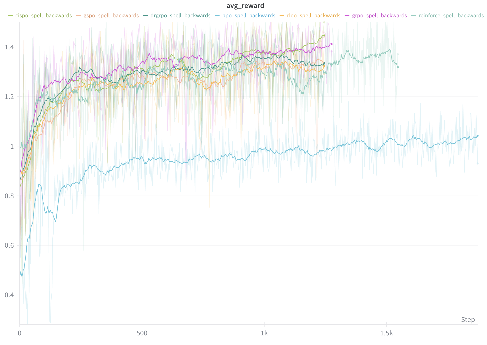

# RLHF Book - Code Examples

Educational code examples accompanying [RLHF Book](https://rlhfbook.com) by Nathan Lambert.

## Attribution

This code is built on the excellent work of community contributors:

### Policy Gradients

**Original Repository**: [zafstojano/policy-gradients](https://github.com/zafstojano/policy-gradients)
**Author**: Zafir Stojanovski ([@zafstojano](https://github.com/zafstojano))
**License**: Apache 2.0

A clean, educational implementation of policy gradient methods for reinforcement learning.
Implements REINFORCE, RLOO, PPO, GRPO, Dr. GRPO, GSPO, and CISPO with mathematical formulations
matching the book's Chapter 11 (Policy Gradient Methods).

### Reward Models (ORM/PRM)

**Original Repository**: [myhott163com/RLHF_ORM_PRM](https://github.com/myhott163com/RLHF_ORM_PRM)
**Author**: [@myhott163com](https://github.com/myhott163com)
**License**: MIT

Minimal implementations of Outcome Reward Models (ORM) and Process Reward Models (PRM),
demonstrating the concepts from Chapter 7 (Reward Models).

---

## Installation

**Requires Python 3.12+**

```bash
cd code/
uv sync
```

### Platform-specific notes

**Standard x86_64 systems** (recommended): Flash Attention is installed by default for
significant speedups during training.

**DGX Spark / aarch64**: Flash Attention is not available on ARM64/Blackwell. The code
automatically falls back to PyTorch SDPA, which is actually faster on these systems due
to native cuDNN optimizations.

```bash
# On DGX Spark, just run:
uv sync
# Flash-attn will be skipped automatically on aarch64
```

## Policy Gradient Training

Train various policy gradient algorithms on procedural reasoning tasks:

```bash
# GRPO (Chapter 11)
uv run python -m policy_gradients.train --config policy_gradients/configs/grpo.yaml

# PPO with value function
uv run python -m policy_gradients.train --config policy_gradients/configs/ppo.yaml

# REINFORCE baseline
uv run python -m policy_gradients.train --config policy_gradients/configs/reinforce.yaml

# RLOO (Leave-One-Out)
uv run python -m policy_gradients.train --config policy_gradients/configs/rloo.yaml
```

### Training Results



### Available algorithms

| Algorithm | Config | Description | Example Run |
|-----------|--------|-------------|-------------|
| REINFORCE | `reinforce.yaml` | Williams (1992) - vanilla policy gradient | [wandb](https://wandb.ai/natolambert/rlhf-book/runs/0uqbq4oz) |
| RLOO | `rloo.yaml` | REINFORCE Leave-One-Out (Ahmadian et al., 2024) | [wandb](https://wandb.ai/natolambert/rlhf-book/runs/07xeasn8) |
| PPO | `ppo.yaml` | Proximal Policy Optimization (Schulman et al., 2017) | [wandb](https://wandb.ai/natolambert/rlhf-book/runs/yv21y1qm) |
| GRPO | `grpo.yaml` | Group Relative Policy Optimization (Shao et al., 2024) | [wandb](https://wandb.ai/natolambert/rlhf-book/runs/vjp7lgdi) |
| Dr. GRPO | `drgrpo.yaml` | Dr. GRPO (Liu et al., 2025) | [wandb](https://wandb.ai/natolambert/rlhf-book/runs/a1swuynq) |
| GSPO | `gspo.yaml` | Group-Sequence Policy Optimization (Zheng et al., 2025) | [wandb](https://wandb.ai/natolambert/rlhf-book/runs/10sxytli) |
| CISPO | `cispo.yaml` | Clipped Importance Sampling PO (MiniMax, 2025) | [wandb](https://wandb.ai/natolambert/rlhf-book/runs/6dg0m06n) |

## Reward Model Training

> **Note: Experimental** - Reward model training needs tuning of hyperparameters, datasets, and models for cleaner training curves. Contributions welcome!

Train reward models on various datasets:

```bash
# Standard Preference RM (Chapter 7) - Bradley-Terry on UltraFeedback
uv run python -m reward_models.train_preference_rm

# Outcome Reward Model (Chapter 7) - trains on GSM8K
uv run python -m reward_models.train_orm

# Process Reward Model (Chapter 7) - trains on PRM800K
uv run python -m reward_models.train_prm
```

### Preference RM (Bradley-Terry)

Standard preference-based reward model using the Bradley-Terry loss:
`-log(sigmoid(r_chosen - r_rejected))`. This is the approach used in InstructGPT,
Llama 2, and most production RLHF systems. Trains on UltraFeedback preference data.

### ORM (Outcome Reward Model)

Binary classification on solution correctness. Fine-tunes Qwen3-0.6B on GSM8K,
learning to distinguish correct from incorrect math solutions.

### PRM (Process Reward Model)

Step-level classification on reasoning quality. Fine-tunes Qwen3-0.6B on PRM800K,
learning to rate individual reasoning steps as {-1, 0, 1} (bad, neutral, good).

### Example Runs

| Model | Description | Example Run |
|-------|-------------|-------------|
| Preference RM | Bradley-Terry on UltraFeedback | [wandb](https://wandb.ai/natolambert/rlhf-book/runs/6sninll5) |
| ORM | Outcome RM on GSM8K | [wandb](https://wandb.ai/natolambert/rlhf-book/runs/xm8mlcpl) |
| PRM | Process RM on PRM800K | [wandb](https://wandb.ai/natolambert/rlhf-book/runs/abhkbn4q) |

## Direct Alignment Training

Train direct alignment algorithms (DPO and variants) on preference data:

```bash
# DPO (Chapter 12)
uv run python -m direct_alignment.train --config direct_alignment/configs/dpo.yaml

# IPO - more robust to noisy labels
uv run python -m direct_alignment.train --config direct_alignment/configs/ipo.yaml

# SimPO - no reference model needed
uv run python -m direct_alignment.train --config direct_alignment/configs/simpo.yaml

# Quick test run (1k samples)
uv run python -m direct_alignment.train --loss dpo --max_samples 1000
```

### Available algorithms

| Algorithm | Config | Description |
|-----------|--------|-------------|
| DPO | `dpo.yaml` | Direct Preference Optimization (Rafailov et al., 2023) |
| cDPO | N/A (use `--loss cdpo`) | Conservative DPO with label smoothing |
| IPO | `ipo.yaml` | Identity Preference Optimization (Azar et al., 2023) |
| SimPO | `simpo.yaml` | Simple PO - length-normalized, no ref model (Meng et al., 2024) |
| ORPO | `orpo.yaml` | Odds Ratio PO - combines SFT + preference (Hong et al., 2024) |
| KTO | `kto.yaml` | Kahneman-Tversky Optimization (Ethayarajh et al., 2024) |

See Chapter 12 of RLHF Book for mathematical derivations.

## Configuration

### Weights & Biases Logging

Training runs are logged to Weights & Biases. Configure via environment variables:

```bash
# Required: Your wandb API key
export WANDB_API_KEY="your-key"

# Optional: Override project name (default: from config file)
export WANDB_PROJECT="rlhf-book"

# Optional: Override run name
export WANDB_RUN_NAME="grpo_experiment_1"
```

The official runs for this repo are logged to: **[wandb.ai/natolambert/rlhf-book](https://wandb.ai/natolambert/rlhf-book)**

To disable wandb logging entirely, set `wandb_project: null` in your config or:
```bash
export WANDB_MODE="disabled"
```

### Other environment variables

```bash
# HuggingFace access (for gated models)
export HF_TOKEN="your-token"
```

### Memory requirements

| Training | Model | GPU Memory |
|----------|-------|------------|
| Policy gradients | Qwen3-1.7B | ~16GB (single GPU) |
| Reward models | Qwen3-0.6B | ~8-16GB |
| Reward models | Qwen3-1.7B | ~16-20GB |

## Book Chapters

These examples correspond to:

- **Chapter 7**: Reward Models (ORM, PRM, Preference RM)
- **Chapter 11**: Policy Gradient Methods (REINFORCE, PPO, GRPO, etc.)
- **Chapter 12**: Direct Alignment (DPO, IPO, SimPO, KTO, etc.)

See [rlhfbook.com](https://rlhfbook.com) for the full text.

## License

- Policy gradients code: Apache 2.0 (from zafstojano/policy-gradients)
- Reward models code: MIT (from myhott163com/RLHF_ORM_PRM)
- Adaptations and documentation: Apache 2.0
