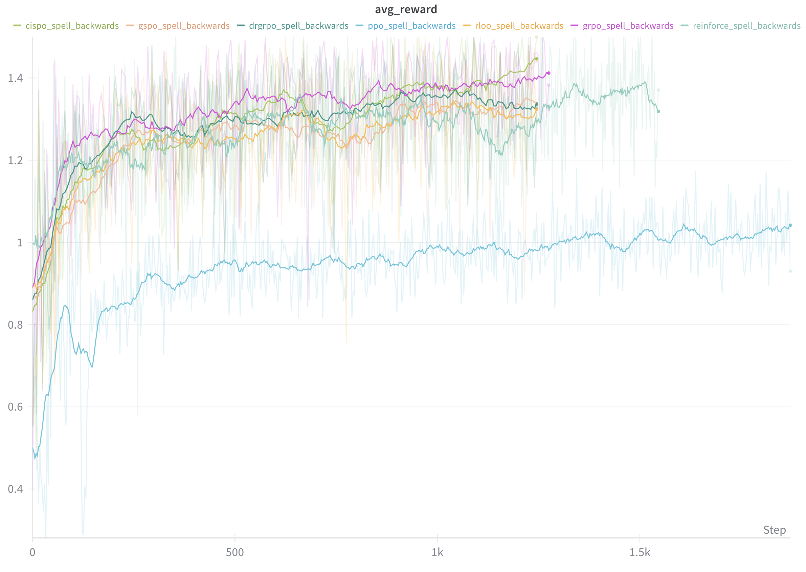
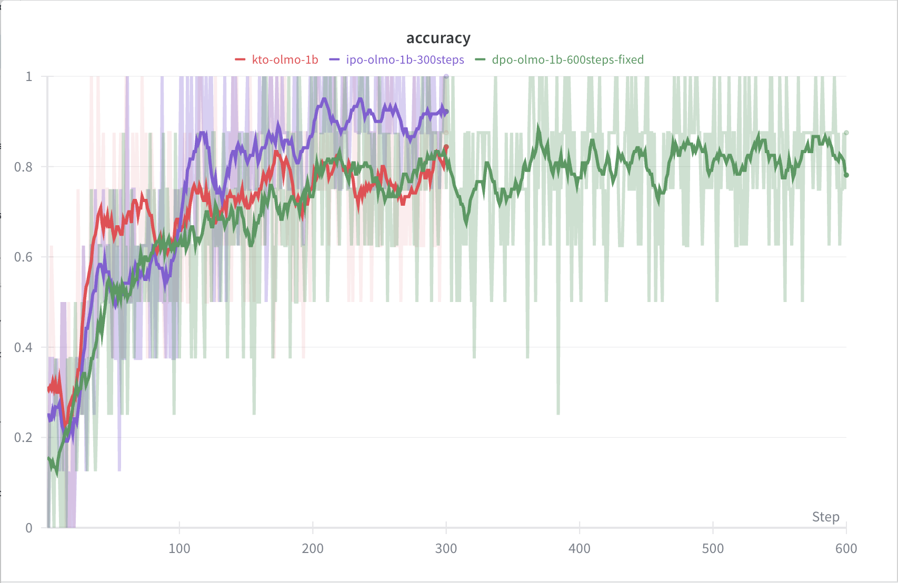
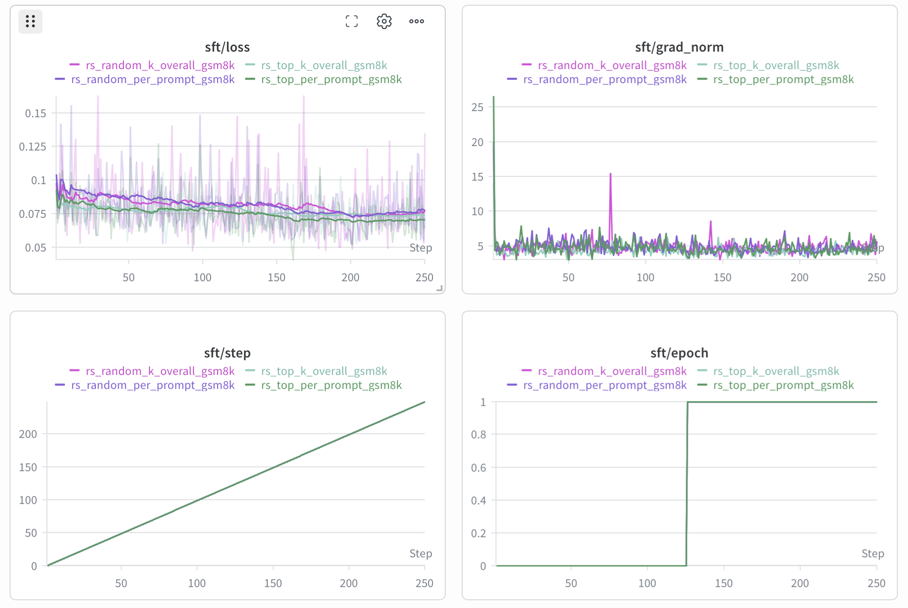

# RLHF Book - Code Examples

Educational code examples accompanying [RLHF Book](https://rlhfbook.com) by Nathan Lambert.

Join the [Discord Community](https://discord.gg/yz5AwK4gBR) to ask questions, share runs, and compare notes on these examples.

I primarily run experiments on a [DGX Spark](https://www.nvidia.com/en-us/products/workstations/dgx-spark/). For setup advice, see my [dgx-spark-setup](https://github.com/natolambert/dgx-spark-setup) guide.

*Note: There's an open PR [here](https://github.com/natolambert/rlhf-book/pull/328) exploring the idea of adding speedrun functionality to this repository — comment if you're interested in pushing this further or seeing it merged into main.*

## Reader Experiment Path

All commands below assume:

```bash
cd code/
uv sync
```

Start with one short run, confirm that the learning signal is visible, then sweep one variable at a time.
If you do not want W&B logging, set `WANDB_MODE=disabled` or use the module-specific no-W&B option when available.
If you are running these with a coding assistant, launch long training/eval commands in the background and monitor them; foreground runs can time out before they produce useful metrics.

| Chapter | Starting experiment | Command | What to inspect |
|---------|---------------------|---------|-----------------|
| Chapter 4: Instruction Tuning | SFT OLMo-2-1B base on No Robots | `uv run python -m instruction_tuning.train --config instruction_tuning/configs/sft_olmo2_1b.yaml` | Loss curve and the in-loop sample panels — the base model rambles at step 0; after a few hundred steps it answers and stops. **TODO(@natolambert):** link reference wandb run. |
| Chapter 5: Reward Models | Bradley-Terry RM on UltraFeedback | `uv run python -m reward_models.train_preference_rm --samples 2000 --epochs 1` | Chosen/rejected reward margin, training loss, demo scoring |
| Chapter 5: Reward Models | ORM on GSM8K | `uv run python -m reward_models.train_orm --samples 400 --epochs 2` | Whether correct final answers score above perturbed answers |
| Chapter 6: Policy Gradients | GRPO on `spell_backward` | `uv run python -m policy_gradients.train --config policy_gradients/configs/grpo.yaml` | `avg_correctness`, `avg_format`, `avg_binary`, and whether groups contain contrast |
| Chapter 8: Direct Alignment | DPO on UltraFeedback | `uv run python -m direct_alignment.train --loss dpo --max_samples 1000` | `accuracy`, `margins`, `chosen_rewards`, `rejected_rewards`, sample generations |
| Chapter 9: Rejection Sampling | GSM8K reward selection versus random controls | `uv run python -m rejection_sampling.train --config rejection_sampling/configs/top_per_prompt.yaml` | Final exact-match accuracy against the matched random baseline |

Good first sweeps:

- **Instruction tuning**: keep `sft_olmo2_1b.yaml` fixed and vary `lr` (5e-6 vs 1e-5), `num_epochs`, or `max_samples` to see how quickly the base→assistant transition emerges.
- **Policy gradients**: copy `policy_gradients/configs/grpo.yaml` and vary `num_rollouts`, `temperature`, `format_weight`, and `data.size`.
- **Direct alignment**: hold the dataset fixed and compare `dpo.yaml`, `ipo.yaml`, and `dpo_norm.yaml`; read IPO through margins/accuracy, not raw loss scale.
- **Reward models**: vary `--samples`, `--lr`, and `--model-id` before changing the model architecture.
- **Rejection sampling**: keep generation/scoring settings identical while comparing `top_*` configs to their `random_*` controls.

The book chapters now include suggested exercises at the end of Chapters 4, 5, 6, 8, and 9.

## Attribution

This code is built on the excellent work of community contributors:

### Policy Gradients

**Original Repository**: [zafstojano/policy-gradients](https://github.com/zafstojano/policy-gradients)
**Author**: Zafir Stojanovski ([@zafstojano](https://github.com/zafstojano))
**License**: Apache 2.0

A clean, educational implementation of policy gradient methods for reinforcement learning.
Implements REINFORCE, RLOO, PPO, GRPO, Dr. GRPO, GSPO, CISPO, SAPO, and DAPO with mathematical formulations
matching the book's Chapter 6 (Policy Gradient Methods). Other details:

- SAPO algorithm based on [casinca/llm-quest](https://github.com/casinca/llm-quest) by [@casinca](https://github.com/casinca), Apache 2.0

### Reward Models (ORM/PRM)

**Original Repository**: [myhott163com/RLHF_ORM_PRM](https://github.com/myhott163com/RLHF_ORM_PRM)
**Author**: [@myhott163com](https://github.com/myhott163com)
**License**: MIT

Minimal implementations of Outcome Reward Models (ORM) and Process Reward Models (PRM),
demonstrating the concepts from Chapter 5 (Reward Models).

---

## Installation

**Requires Python 3.12+** and an up-to-date [uv](https://docs.astral.sh/uv/getting-started/installation/) (`uv self update`). See [#366](https://github.com/natolambert/rlhf-book/issues/366) for troubleshooting uv compatibility.

**Ubuntu/Debian users**: install build tools first (needed to compile native dependencies):

```bash
sudo apt install -y build-essential python3-dev
```

Then install:

```bash
cd code/
uv sync
```

By default, [Flash Attention](https://github.com/Dao-AILab/flash-attention) is turned off
to support a broad range of hardware, but for speedups you should consider installing it:

```bash
uv sync --extra flash
```

> **Note:** If a pre-built wheel matches your CUDA version this installs in seconds.
> If not (e.g. CUDA 13), it falls back to a source build which needs a CUDA toolkit
> and can take several minutes. If the build fails, just use the base install — the
> code automatically falls back to PyTorch SDPA and all examples will work without it.

### Platform notes

- **Standard x86_64 systems**: Flash Attention provides a ~10-20% training speedup on
  Ampere/Ada GPUs (e.g. 3090, 4090). Pre-built wheels are available for CUDA 12.x
  ([releases](https://github.com/Dao-AILab/flash-attention/releases/latest));
  as of 11 Apr. 2026 CUDA 13 requires a source build (which tends to be a pain),
  so nothing is gated on it.
- **DGX Spark / aarch64**: Flash Attention is not available on ARM64/Blackwell. The code
  automatically falls back to PyTorch SDPA, which is actually faster on these systems due
  to native cuDNN optimizations.

## Policy Gradient Training

Train various policy gradient algorithms on procedural reasoning tasks:

```bash
# GRPO (Chapter 6)
uv run python -m policy_gradients.train --config policy_gradients/configs/grpo.yaml

# PPO with value function
uv run python -m policy_gradients.train --config policy_gradients/configs/ppo.yaml

# REINFORCE baseline
uv run python -m policy_gradients.train --config policy_gradients/configs/reinforce.yaml

# RLOO (Leave-One-Out)
uv run python -m policy_gradients.train --config policy_gradients/configs/rloo.yaml
```

### Training Results



### Available algorithms

| Algorithm | Config | Description | Example Run |
|-----------|--------|-------------|-------------|
| REINFORCE | `reinforce.yaml` | Williams (1992) - vanilla policy gradient | [wandb](https://wandb.ai/natolambert/rlhf-book/runs/0uqbq4oz) |
| RLOO | `rloo.yaml` | REINFORCE Leave-One-Out (Ahmadian et al., 2024) | [wandb](https://wandb.ai/natolambert/rlhf-book/runs/07xeasn8) |
| PPO | `ppo.yaml` | Proximal Policy Optimization (Schulman et al., 2017) | [wandb](https://wandb.ai/natolambert/rlhf-book/runs/ku3r3g9j) |
| GRPO | `grpo.yaml` | Group Relative Policy Optimization (Shao et al., 2024) | [wandb](https://wandb.ai/natolambert/rlhf-book/runs/vjp7lgdi) |
| Dr. GRPO | `drgrpo.yaml` | Dr. GRPO (Liu et al., 2025) | [wandb](https://wandb.ai/natolambert/rlhf-book/runs/a1swuynq) |
| GSPO | `gspo.yaml` | Group-Sequence Policy Optimization (Zheng et al., 2025) | [wandb](https://wandb.ai/natolambert/rlhf-book/runs/10sxytli) |
| CISPO | `cispo.yaml` | Clipped Importance Sampling PO (MiniMax, 2025) | [wandb](https://wandb.ai/natolambert/rlhf-book/runs/6dg0m06n) |
| SAPO | `sapo.yaml` | Soft Adaptive Policy Optimization (Qwen Team, 2025) | [wandb](https://wandb.ai/natolambert/rlhf-book/runs/79608nwk) |
| DAPO | `dapo.yaml` | Decoupled Clip and Dynamic sAmpling Policy Optimization (ByteDance, 2025) | [wandb](https://wandb.ai/natolambert/rlhf-book/runs/db1pipip) |
| MaxRL | `maxrl.yaml` | Maximum Likelihood Reinforcement Learning (Tajwar et al., 2026) | [wandb](https://wandb.ai/natolambert/rlhf-book/runs/fdowf1se) |

## Reward Model Training

> **Note: Experimental** - Reward model training needs tuning of hyperparameters, datasets, and models for cleaner training curves. Contributions welcome!

Train reward models on various datasets:

```bash
# Standard Preference RM (Chapter 5) - Bradley-Terry on UltraFeedback
uv run python -m reward_models.train_preference_rm

# Outcome Reward Model (Chapter 5) - trains on GSM8K
uv run python -m reward_models.train_orm

# Process Reward Model (Chapter 5) - trains on PRM800K
uv run python -m reward_models.train_prm
```

### Preference RM (Bradley-Terry)

Standard preference-based reward model using the Bradley-Terry loss:
`-log(sigmoid(r_chosen - r_rejected))`. This is the approach used in InstructGPT,
Llama 2, and most production RLHF systems. Trains on UltraFeedback preference data.

### ORM (Outcome Reward Model)

Binary classification on solution correctness. Fine-tunes Qwen3-0.6B on GSM8K,
learning to distinguish correct from incorrect math solutions.

### PRM (Process Reward Model)

Step-level classification on reasoning quality. Fine-tunes Qwen3-0.6B on PRM800K,
learning to rate individual reasoning steps as {-1, 0, 1} (bad, neutral, good).

### Example Runs

| Model | Description | Example Run |
|-------|-------------|-------------|
| Preference RM | Bradley-Terry on UltraFeedback | [wandb](https://wandb.ai/natolambert/rlhf-book/runs/1g3y9bcc) |
| ORM | Outcome RM on GSM8K | [wandb](https://wandb.ai/natolambert/rlhf-book/runs/3gkoqb7f) |
| PRM | Process RM on PRM800K | [wandb](https://wandb.ai/natolambert/rlhf-book/runs/iv4d966d) |

## Direct Alignment Training

Train direct alignment algorithms (DPO and variants) on preference data:

```bash
# DPO (Chapter 8)
uv run python -m direct_alignment.train --config direct_alignment/configs/dpo.yaml

# IPO - more robust to noisy labels
uv run python -m direct_alignment.train --config direct_alignment/configs/ipo.yaml

# SimPO - no reference model needed
uv run python -m direct_alignment.train --config direct_alignment/configs/simpo.yaml

# Quick test run (1k samples)
uv run python -m direct_alignment.train --loss dpo --max_samples 1000
```

### Available algorithms

| Algorithm | Config | Description |
|-----------|--------|-------------|
| DPO | `dpo.yaml` | Direct Preference Optimization (Rafailov et al., 2023) |
| cDPO | N/A (use `--loss cdpo`) | Conservative DPO with label smoothing |
| IPO | `ipo.yaml` | Identity Preference Optimization (Azar et al., 2023) |
| SimPO | `simpo.yaml` | Simple PO - length-normalized, no ref model (Meng et al., 2024) |
| ORPO | `orpo.yaml` | Odds Ratio PO - combines SFT + preference (Hong et al., 2024) |
| KTO | `kto.yaml` | Kahneman-Tversky Optimization (Ethayarajh et al., 2024) |
| APO-Zero | `apo_zero.yaml` | Anchored PO, chosen-up / rejected-down (D'Oosterlinck et al., 2024) |
| APO-Down | `apo_down.yaml` | Anchored PO, both-down with larger rejected drop (D'Oosterlinck et al., 2024) |

### Training Results



See Chapter 8 of RLHF Book for mathematical derivations.

## Rejection Sampling

Train the rejection sampling pipeline from Chapter 9: generate multiple
completions per prompt, score them with a reward model, select a subset, then
SFT on the selected pairs.

```bash
# Preprocess once (generate + score rollouts)
uv run python -m rejection_sampling.preprocess \
    --config rejection_sampling/configs/top_per_prompt.yaml

# Train each selection config on the cached rollouts
uv run python -m rejection_sampling.train \
    --config rejection_sampling/configs/top_per_prompt.yaml
uv run python -m rejection_sampling.train \
    --config rejection_sampling/configs/random_per_prompt.yaml
uv run python -m rejection_sampling.train \
    --config rejection_sampling/configs/top_k_overall.yaml
uv run python -m rejection_sampling.train \
    --config rejection_sampling/configs/random_k_overall.yaml
```

### Training Results



### Example Runs

| Strategy | Description | Example Run |
|----------|-------------|-------------|
| `top_per_prompt` | Best-of-N completion per prompt | [wandb](https://wandb.ai/natolambert/rlhf-book/runs/ohm3xnga) |
| `random_per_prompt` | Random per-prompt control | [wandb](https://wandb.ai/natolambert/rlhf-book/runs/y3pbcla7) |
| `top_k_overall` | Best K completions across the full pool | [wandb](https://wandb.ai/natolambert/rlhf-book/runs/w75hklzs) |
| `random_k_overall` | Random flat-pool control | [wandb](https://wandb.ai/natolambert/rlhf-book/runs/egeyr1q3) |

On the reference 1k-train / 200-test GSM8K slice, `top_k_overall` beat its
matched random baseline, while `top_per_prompt` and `random_per_prompt` were
effectively tied.

## Configuration

### Weights & Biases Logging

Training runs are logged to Weights & Biases. Configure via environment variables:

```bash
# Required: Your wandb API key
export WANDB_API_KEY="your-key"

# Optional: Override project name (default: from config file)
export WANDB_PROJECT="rlhf-book"

# Optional: Override run name
export WANDB_RUN_NAME="grpo_experiment_1"
```

The official runs for this repo are logged to: **[wandb.ai/natolambert/rlhf-book](https://wandb.ai/natolambert/rlhf-book)**

All runs are **public** - no login required to view training curves, configs, and metrics.

To disable wandb logging entirely, set `wandb_project: null` in your config or:
```bash
export WANDB_MODE="disabled"
```

### Other environment variables

```bash
# HuggingFace access (for gated models)
export HF_TOKEN="your-token"
```

### Memory requirements

| Training | Model | GPU Memory |
|----------|-------|------------|
| Policy gradients | Qwen3-1.7B | ~16GB (single GPU) |
| Reward models | Qwen3-0.6B | ~8-16GB |
| Reward models | Qwen3-1.7B | ~16-20GB |

## Linting

This project uses [Ruff](https://docs.astral.sh/ruff/) for linting and formatting. A CI check runs on every PR that touches `code/`.

```bash
# Check for lint errors
uvx ruff check .

# Check formatting
uvx ruff format --check .

# Auto-fix lint errors and formatting
uvx ruff check --fix .
uvx ruff format .
```

Configuration is in `pyproject.toml` (line length 100, Python 3.12 target).

## Testing

The test suite intentionally starts with lightweight smoke coverage for imports and CLI entrypoints. It should not download datasets, load models, or require GPUs.

```bash
uv run --extra dev pytest
```

## Book Chapters

These examples correspond to:

- **Chapter 5**: Reward Models (ORM, PRM, Preference RM)
- **Chapter 6**: Policy Gradient Methods (REINFORCE, PPO, GRPO, etc.)
- **Chapter 8**: Direct Alignment (DPO, IPO, SimPO, KTO, etc.)
- **Chapter 9**: Rejection Sampling

See [rlhfbook.com](https://rlhfbook.com) for the full text.

## Citation

To cite this book, please use the following format:

```bibtex
@book{rlhf2025,
  author       = {Nathan Lambert},
  title        = {Reinforcement Learning from Human Feedback},
  year         = {2025},
  publisher    = {Online},
  url          = {https://rlhfbook.com},
}
```

## License

- Policy gradients code (`policy_gradients/`): Apache 2.0 (from zafstojano/policy-gradients)
- Reward models code (`reward_models/`): MIT (from myhott163com/RLHF_ORM_PRM)
- Direct alignment code and other adaptations: MIT
