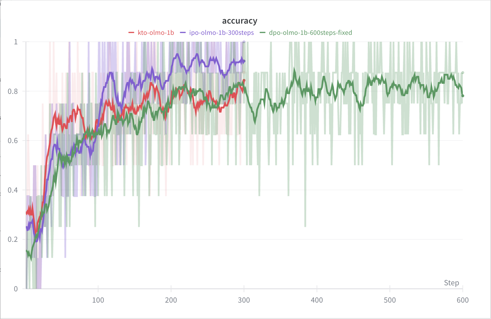

# Direct Alignment Algorithms

Educational implementations of direct alignment methods for [RLHF Book](https://rlhfbook.com).
See **Chapter 8: Direct Alignment** for mathematical derivations and intuitions.

> **Status**: DPO implementation validated. Other algorithms (IPO, SimPO, ORPO, KTO) implemented but configs not yet tuned.

## Reference Runs

| Algorithm | wandb | Status |
|-----------|-------|--------|
| **DPO** | [dpo-olmo-1b](https://wandb.ai/natolambert/rlhf-book/runs/fzy8k8go) | ✅ Validated |
| **IPO** | [ipo-olmo-1b](https://wandb.ai/natolambert/rlhf-book/runs/5s29syo6) | ✅ Validated |
| **SimPO** | [simpo-olmo-1b](https://wandb.ai/natolambert/rlhf-book/runs/ftv5rs3x) | ⚠️ Noisy - needs debugging |
| **ORPO** | [orpo-olmo-1b](https://wandb.ai/natolambert/rlhf-book/runs/o38ffli5) | ⚠️ Noisy - needs debugging |
| **KTO** | [kto-olmo-1b](https://wandb.ai/natolambert/rlhf-book/runs/hgqrkfi6) | ✅ Validated |



## Algorithms

| Algorithm | Paper | Key Idea |
|-----------|-------|----------|
| **DPO** | [Rafailov et al., 2023](https://arxiv.org/abs/2305.18290) | Core direct alignment method - implicit reward via log-ratios |
| **cDPO** | Same as DPO | DPO with label smoothing for noisy preferences |
| **IPO** | [Azar et al., 2023](https://arxiv.org/abs/2310.12036) | Regression objective instead of classification - more robust |
| **SimPO** | [Meng et al., 2024](https://arxiv.org/abs/2405.14734) | Length-normalized, no reference model needed |
| **ORPO** | [Hong et al., 2024](https://arxiv.org/abs/2403.07691) | Combines SFT + preference, no reference model |
| **KTO** | [Ethayarajh et al., 2024](https://arxiv.org/abs/2402.01306) | Prospect theory inspired, works with binary good/bad labels |

## Quick Start

```bash
cd /home/natolambert/dev/rlhf-book/code
uv sync

# Train DPO on 1k samples (quick test)
uv run python -m direct_alignment.train --loss dpo --max_samples 1000

# Train with config file
uv run python -m direct_alignment.train --config direct_alignment/configs/dpo.yaml

# Train with wandb logging
WANDB_PROJECT=rlhf-book uv run python -m direct_alignment.train --loss dpo
```

## Loss Functions

### DPO Loss

The core DPO loss maximizes the margin between chosen and rejected:

```python
# From Chapter 8
pi_logratios = policy_chosen_logps - policy_rejected_logps
ref_logratios = reference_chosen_logps - reference_rejected_logps
logits = pi_logratios - ref_logratios
loss = -F.logsigmoid(beta * logits)
```

### SimPO Loss

SimPO removes the reference model and uses length normalization:

```python
# Average log probs instead of sum
avg_logp_chosen = sum(log_probs) / num_tokens
logits = avg_logp_chosen - avg_logp_rejected
loss = -F.logsigmoid(beta * logits - gamma)
```

### IPO Loss

IPO uses squared error to a target margin:

```python
target_margin = 1.0 / (2.0 * beta)
loss = (logits - target_margin) ** 2
```

### KTO Loss

KTO uses prospect theory with a unified reference point:

```python
# KL reference point (from separate samples in full implementation)
KL = mean(all_logratios).clamp(min=0)
# Desirable: want chosen better than reference
loss_chosen = 1 - sigmoid(beta * (chosen_logratio - KL))
# Undesirable: want rejected worse than reference
loss_rejected = 1 - sigmoid(beta * (KL - rejected_logratio))
```

## Datasets

The default dataset is `argilla/ultrafeedback-binarized-preferences-cleaned`, a cleaned
version of UltraFeedback with ~60k preference pairs.

Other compatible datasets:
- `Anthropic/hh-rlhf` - Anthropic's helpfulness/harmlessness data
- Any dataset with `prompt`, `chosen`, `rejected` columns

## Key Hyperparameters

| Parameter | DPO | IPO | SimPO |
|-----------|-----|-----|-------|
| `beta` | 0.1-0.5 | 0.1 | 2.0-2.5 |
| `learning_rate` | 5e-6 | 5e-6 | 1e-6 |
| Reference model | Yes | Yes | No |

**Important**: DPO requires very low learning rates (1e-7 to 5e-6). Higher rates cause divergence.

**Note on IPO loss scale**: IPO uses squared error to a target margin of `1/(2*beta)`. With beta=0.1, this target is 5.0, so early loss values (~10-25) are much higher than DPO (~0.5-0.7). This is expected — IPO loss and gradient norms are not directly comparable to DPO.

**Note on SimPO learning rate**: SimPO requires lower learning rates than DPO (3e-7 to 1e-6). Per the [official SimPO repo](https://github.com/princeton-nlp/SimPO): "A large learning rate (e.g., 1e-5) can significantly degrade performance, causing the model to produce incoherent sentences or completely repetitive responses."

### Sequence Length Controls

TRL-style options for controlling prompt/completion lengths:

| Parameter | Default | Description |
|-----------|---------|-------------|
| `max_length` | 512 | Max total sequence length (prompt + completion) |
| `max_prompt_length` | None | Max prompt tokens (truncated from left if exceeded) |
| `max_completion_length` | None | Max completion tokens (truncated from right) |
| `truncation_mode` | `keep_end` | `keep_end` preserves response, `keep_start` preserves prompt |

When total length exceeds `max_length`, we truncate from the **left** (prompt side) by default to preserve as much of the response as possible, since the response is what we compute loss on.

## Memory Requirements

Memory profiling results for OLMo-2-0425-1B-SFT on DGX Spark (119.7 GB unified memory):

| Batch Size | max_length=512 | max_length=1024 | max_length=2048 | max_length=4096 |
|------------|----------------|-----------------|-----------------|-----------------|
| 1 | 20% | 21% | 21% | 24% |
| 2 | 21% | 21% | 24% | 28% |
| 4 | 21% | 24% | 28% | 35% |
| 8 | 24% | 28% | 35% | 53% |
| 16 | 28% | 35% | 53% | ~85%+ |

**Recommended**: batch_size=8 with max_length=2048 (35% memory) combined with gradient_accumulation_steps=8 for effective batch size of 64.

For smaller GPUs with gradient checkpointing:
- 1B model: ~8-10GB
- 3B model: ~15-20GB

## Reference Implementations

Links pinned to specific commits for reproducibility (January 2026).

### DPO

**Paper:** [Direct Preference Optimization: Your Language Model is Secretly a Reward Model](https://arxiv.org/abs/2305.18290)

| Source | Link |
|--------|------|
| Original (Eric Mitchell) | [trainers.py @ f8b8c0f](https://github.com/eric-mitchell/direct-preference-optimization/blob/f8b8c0f49dc92a430bae41585f9d467d3618fe2f/trainers.py) |
| TRL | [dpo_trainer.py @ 035c3ff](https://github.com/huggingface/trl/blob/035c3ffa70065339a18e98def65d90ca45e64a5c/trl/trainer/dpo_trainer.py) |
| Open-Instruct | [dpo_tune_cache.py @ d64832d](https://github.com/allenai/open-instruct/blob/d64832d0b3bca46f4c3e5d1af24f62c23cfa7e63/open_instruct/dpo_tune_cache.py) |
| Open-Instruct | [dpo_utils.py @ d64832d](https://github.com/allenai/open-instruct/blob/d64832d0b3bca46f4c3e5d1af24f62c23cfa7e63/open_instruct/dpo_utils.py) |

### KTO

**Paper:** [KTO: Model Alignment as Prospect Theoretic Optimization](https://arxiv.org/abs/2402.01306)

| Source | Link |
|--------|------|
| Official (HALOs) | [trainers.py @ 4831988](https://github.com/ContextualAI/HALOs/blob/48319882d57af6ebf19e0d39c41fa9aa3cf9dc1e/train/trainers.py) |
| TRL | [kto_trainer.py @ 035c3ff](https://github.com/huggingface/trl/blob/035c3ffa70065339a18e98def65d90ca45e64a5c/trl/experimental/kto/kto_trainer.py) |

**Note:** Full KTO uses separate samples for KL estimation. Our simplified version estimates KL from the batch.

### IPO

**Paper:** [A General Theoretical Paradigm to Understand Learning from Human Preferences](https://arxiv.org/abs/2310.12036)

| Source | Link |
|--------|------|
| TRL | [dpo_trainer.py @ 035c3ff](https://github.com/huggingface/trl/blob/035c3ffa70065339a18e98def65d90ca45e64a5c/trl/trainer/dpo_trainer.py) (loss_type="ipo") |
| OpenRLHF | [dpo_trainer.py](https://github.com/OpenRLHF/OpenRLHF) (groups DPO/IPO/cDPO) |

### SimPO

**Paper:** [SimPO: Simple Preference Optimization with a Reference-Free Reward](https://arxiv.org/abs/2405.14734)

| Source | Link |
|--------|------|
| Official | [simpo_trainer.py @ 1b3e8f3](https://github.com/princeton-nlp/SimPO/blob/1b3e8f31a33cd70b3ce52c6065782ab0fae9bf7c/scripts/simpo_trainer.py) |
| Open-Instruct | [dpo_utils.py @ d64832d](https://github.com/allenai/open-instruct/blob/d64832d0b3bca46f4c3e5d1af24f62c23cfa7e63/open_instruct/dpo_utils.py) (simpo_loss) |

### ORPO

**Paper:** [ORPO: Monolithic Preference Optimization without Reference Model](https://arxiv.org/abs/2403.07691)

| Source | Link |
|--------|------|
| TRL | [orpo_trainer.py @ 035c3ff](https://github.com/huggingface/trl/blob/035c3ffa70065339a18e98def65d90ca45e64a5c/trl/trainer/orpo_trainer.py) |

### Not Yet Implemented

#### ODPO (DPO with Offset)

**Paper:** [Provably Robust DPO: Aligning Language Models with Noisy Feedback](https://arxiv.org/abs/2403.00409)

| Source | Link |
|--------|------|
| Official | [trainers.py @ 6152f67](https://github.com/rycolab/odpo/blob/6152f6723ebca6c2e74ab360dd3e7c0d8047a5f0/trainers.py) |

#### BCO

**Paper:** [BCO: A Unified Binary Classifier for Alignment](https://arxiv.org/abs/2404.04656)

| Source | Link |
|--------|------|
| TRL | [bco_trainer.py @ 035c3ff](https://github.com/huggingface/trl/blob/035c3ffa70065339a18e98def65d90ca45e64a5c/trl/trainer/bco_trainer.py) |

#### Online DPO

**Paper:** [Direct Language Model Alignment from Online AI Feedback](https://arxiv.org/abs/2402.04792)

| Source | Link |
|--------|------|
| TRL | [online_dpo_trainer.py @ 035c3ff](https://github.com/huggingface/trl/blob/035c3ffa70065339a18e98def65d90ca45e64a5c/trl/trainer/online_dpo_trainer.py) |

## File Structure

```
direct_alignment/
├── README.md          # This file
├── config.py          # Configuration dataclass
├── data.py            # Preference data loading with response masking
├── loss.py            # Loss function implementations
├── train.py           # Training loop with sample generation
└── configs/           # YAML config files
    ├── dpo.yaml
    ├── ipo.yaml
    ├── simpo.yaml
    ├── orpo.yaml
    └── kto.yaml
```

## Implementation Notes

### KTO Data Format

The KTO loss function supports the paper's formulation (separate KL samples from unrelated outputs),
but **the data loader currently only supports paired preference data** (prompt/chosen/rejected format).
KTO is trained by treating `chosen` as desirable and `rejected` as undesirable responses.

For truly unpaired KTO data (prompt/response/label format), see the TODOs below.

### Truncation Strategy

Long sequences are truncated from the **left side** (prompt tokens) to preserve as much of the
response as possible. This is important because we only compute loss on response tokens.

### Chat Template Requirement

Models must have a chat template configured. Base models without chat templates are not currently
supported (see TODOs).

## TODOs for Community Contributions

These would be great contributions to make the implementations more complete:

- [ ] **Unpaired KTO data loader**: Add support for datasets with `prompt/response/label` format
  (single response with binary good/bad label) instead of requiring paired data
- [ ] **Reference logprob caching**: Cache reference model log-probs to avoid recomputing each batch
  (see Open-Instruct's `dpo_tune_cache.py` for reference)
- [ ] **Base model support**: Add fallback formatting for models without chat templates
- [ ] **Evaluation integration**: Wire up `log_every` and `eval_every` config options
- [ ] **Length-normalized DPO**: Add `dpo_norm` variant (average log-probs like SimPO but with ref model)

## How This Was Made

I used GPT 5.2 Pro to write a plan based on canonical implementations, and had Claude Code with Opus 4.5 write it, periodically getting feedback from Codex 5.2 xhigh, with manual tuning of the configs to make the configs have representative learning curves.

Due to this, **community contributions are strongly encouraged**. I'm happy to test high-quality contributions on my Spark to continue making this a home for tinkerers interested in RLHF and post-training.
