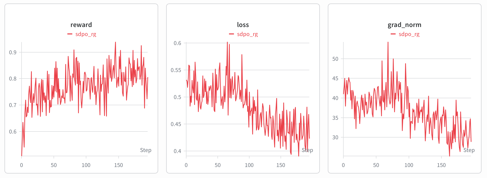

# Self-Distillation (SDPO)

Educational implementation of **SDPO — Self-Distillation Policy Optimization** for
[RLHF Book](https://rlhfbook.com), an on-policy distillation method for code and
reasoning tasks ([Hübotter et al., 2026](https://arxiv.org/abs/2601.20802)).
See the parent [`code/README.md`](../README.md) for installation, configuration, and memory requirements.

## Algorithms

| Algorithm | Config | Key Idea |
|-----------|--------|----------|
| **SDPO** | `sdpo.yaml` | Self-Distillation Policy Optimization — distill a feedback-conditioned self-teacher into the student via top-K forward KL ([Hübotter et al., 2026](https://arxiv.org/abs/2601.20802)) |

## Reference Runs

> **TODO:** add validated wandb run IDs and training-result plots once reference runs are published.

| Algorithm | wandb | Status |
|-----------|-------|--------|
| **SDPO** | _TODO_ | ⏳ Pending validation |

<!-- TODO: add training-results plot, e.g.  -->

## Quick Start

```bash
cd /path/to/rlhf-book/code
uv sync

# SDPO on LiveCodeBench
uv run python -m distillation.train --config distillation/configs/sdpo.yaml
```

The dataset is split by contest date: problems before 2025-02-01 form the `train`
split, and problems in [2025-02-01, 2025-05-01) form the `eval` split (see
[`data.py`](data.py)). Set `split: eval` in the config to evaluate on held-out problems.

## Key configuration

See [`configs/sdpo.yaml`](configs/sdpo.yaml) for the full set. The most important knobs:

| Field | Default | Meaning |
|-------|---------|---------|
| `model_name` | `Qwen/Qwen3-1.7B` | Model used as both student and self-teacher |
| `top_k` | `100` | Logits kept per position for the distillation KL |
| `success_reward_threshold` | `1.0` | Reward at/above which a rollout becomes a demo solution |
| `num_rollouts` | `8` | Rollouts sampled per problem (sibling demos come from this group) |
| `prompts_per_step` | `4` | Problems generated and gradient-accumulated per optimizer step |
| `max_tests` | `8` | Unit tests run per completion when scoring |
| `max_new_tokens` | `1024` | Generation length cap per rollout |

## Metrics to watch

Logged to W&B each optimizer step (see [`train.py`](train.py)):

- **`avg_acc`** — mean fraction of unit tests passed across the rollout group; the
  primary signal that the student is improving.
- **`avg_reward`** — mean all-tests-pass rate (the strict pass/fail reward).
- **`loss`** — the masked top-K KL between student and self-teacher; should trend down
  as the student internalizes the feedback-conditioned distribution.
- **`grad_norm`** — watch for spikes that indicate instability.

## TODOs for Community Contributions

- [ ] Explore additional task domains beyond competitive programming.
