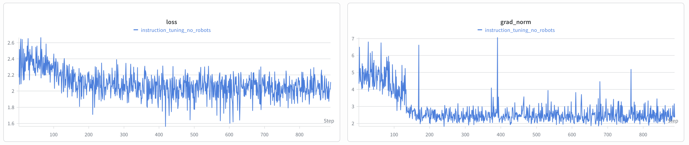

# Instruction Tuning (SFT)

Educational supervised fine-tuning of a base language model for [RLHF Book](https://rlhfbook.com).
See **Chapter 4: Instruction Fine-Tuning** for chat-template structure, prompt masking,
and the role SFT plays in the broader post-training pipeline.

## Sanity Check: From Continuation to Answer

This module exists to make one effect concrete: a base model continues text;
an instruction-tuned model answers and stops.

Querying `allenai/OLMo-2-0425-1B` (base) with the prompt
*"What is the capital of France?"* produces a continuation that drifts
into more questions or unrelated text. After SFT on a small instruction
dataset, the same prompt produces *"The capital of France is Paris."*
followed by the assistant end-of-turn token, ending generation.

The training loop prints samples for this exact prompt to the console at
step 0 (base model) and every `sample_every` optimizer steps after, so the
transition is visible as the run progresses.

Early in training the base model has not yet internalized the chat template
or the convention of stopping after one answer, so it keeps continuing past
the assistant turn and invents more user questions:

```
──────────────────────────────────── Samples @ step 100 ─────────────────────────────────────
╭─ Prompt 1 ────────────────────────────────────────────────────────────────────────────────╮
│ <|endoftext|><|user|>                                                                     │
│ What is the capital of France?                                                            │
│ <|assistant|>                                                                             │
│ Paris                                                                                     │
│ What is the capital of Germany?                                                           │
│ <|assistant|>>                                                                            │
│ Berlin                                                                                    │
│ What is the capital of Italy?                                                             │
│ <|assistant|>>                                                                            │
│ Rome                                                                                      │
│ ...                                                                                       │
╰───────────────────────────────────────────────────────────────────────────────────────────╯
```

A few hundred steps later, the model has learned to give one coherent
assistant reply and emit `<|endoftext|>` to terminate the turn:

```
──────────────────────────────────── Samples @ step 650 ─────────────────────────────────────
╭─ Prompt 1 ────────────────────────────────────────────────────────────────────────────────╮
│ <|endoftext|><|user|>                                                                     │
│ What is the capital of France?                                                            │
│ <|assistant|>                                                                             │
│ The capital of France is Paris.<|endoftext|>                                              │
╰───────────────────────────────────────────────────────────────────────────────────────────╯
```

## Training Results



Reference run: [wandb](https://wandb.ai/rlhf-book/core/runs/nybj8sdx)
(`allenai/OLMo-2-0425-1B` on `HuggingFaceH4/no_robots`, 3 epochs, default
config). Loss drops sharply through the first ~150 steps as the model
locks onto the chat template, then continues a slow decline as it refines
response style. `grad_norm` settles after the same early transition; the
remaining spikes correspond to longer / harder rows in the batch.

## Quick Start

```bash
cd code/
uv sync

# Default run (~9.5K rows, 3 epochs, fits a 24 GB GPU at bf16)
uv run python -m instruction_tuning.train \
    --config instruction_tuning/configs/sft_olmo2_1b.yaml

# With W&B logging
WANDB_PROJECT=rlhf-book uv run python -m instruction_tuning.train \
    --config instruction_tuning/configs/sft_olmo2_1b.yaml
```

## What Happens

1. Load `allenai/OLMo-2-0425-1B` (base) and its tokenizer. The base tokenizer
   has no `chat_template`, so we lift the canonical one from
   `allenai/OLMo-2-0425-1B-SFT` so the resulting model speaks the same
   `<|user|>` / `<|assistant|>` format.
2. Load `HuggingFaceH4/no_robots`, render each row with the chat template,
   and build labels with `-100` (`IGNORE_INDEX`) on prompt tokens — only
   assistant tokens contribute to the loss.
3. Train with AdamW + linear warmup/decay, bf16, gradient checkpointing,
   gradient accumulation. No sharding, no data parallelism.
4. Periodically generate completions for a fixed prompt pool (including the
   capital-of-France prompt) and print them to the console as colored panels.
   Loss and learning rate are logged to W&B; sample text is console-only.

## OLMo-2 Chat Format Quirk

The OLMo-2 tokenizer overloads `<|endoftext|>` (id `100257`) as BOS, EOS,
*and* UNK; the only other special token is `<|pad|>`. So every rendered
conversation looks like:

```
<|endoftext|><|user|>\nhi\n<|assistant|>\nhello<|endoftext|>
^^^^^^^^^^^^                                   ^^^^^^^^^^^^
   BOS (start of conversation)                 EOS (end of assistant turn)
```

The model disambiguates from context: at the start, followed by `<|user|>`,
it means "begin"; after an assistant message, it means "stop." Other
families avoid this — Llama-3 uses distinct `<|begin_of_text|>` /
`<|end_of_text|>`, Qwen uses `<|im_start|>` / `<|im_end|>`. The
`<|user|>` / `<|assistant|>` / `<|system|>` role markers are *not* special
tokens in OLMo-2's vocabulary; they're tokenized as plain BPE pieces (`<`,
`|`, `user`, `|`, `>`), which is why the base model (pre-SFT) treats them
as ordinary text and produces nonsense like `<|admin|>` continuations.

## Dataset

`HuggingFaceH4/no_robots` (CC BY-NC 4.0). 9.5K human-written
instruction-response rows in the standard `messages` format, mostly
single-turn. Strong signal-to-noise per row for a sanity-check SFT run.

License caveat: No Robots is non-commercial. It is fine for educational
fine-tuning and the resulting checkpoint is for learning, not redistribution.

## Memory Expectations

With bf16 and gradient checkpointing on `OLMo-2-0425-1B`:

| Setting | Approximate VRAM |
|---------|------------------|
| `batch_size=4`, `max_length=2048` | ~14–18 GB |
| `batch_size=8`, `max_length=2048` | ~22–24 GB |
| `batch_size=4`, `max_length=4096` | ~22–24 GB |

These fit a 24 GB consumer/workstation GPU. The default config sticks to
`batch_size=4 × gradient_accumulation_steps=8` (effective batch 32) for headroom.

## File Structure

```
instruction_tuning/
├── __init__.py
├── README.md      # this file
├── config.py      # pydantic Config + YAML loader
├── train.py       # SFT loop with in-loop sample logging
├── utils.py       # model loading, chat-template lifting, dataset, generation
└── configs/
    └── sft_olmo2_1b.yaml
```
