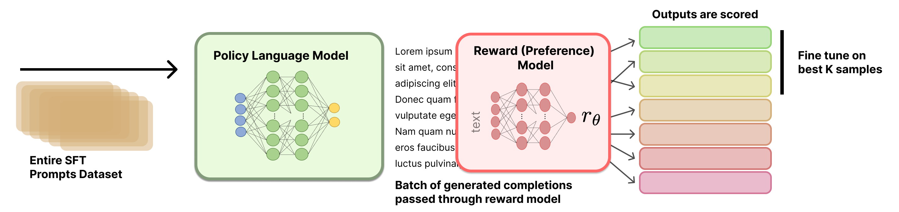

# Rejection Sampling



Educational implementation of rejection sampling (RS) for RLHF, accompanying
Chapter 9 of [the RLHF Book](https://rlhfbook.com). See the parent
[`code/README.md`](../README.md) for installation, configuration, and memory
requirements. The pipeline:

1. Generate `N` rollouts per GSM8k training prompt with `Qwen/Qwen3-1.7B`.
2. Score every rollout with `nvidia/AceMath-7B-RM`.
3. Select a subset of (prompt, completion) pairs via one of four selection configs.
4. SFT `Qwen/Qwen3-1.7B` on the selected subset.
5. Evaluate exact-match accuracy on the GSM8k test split.

The two chapter selection strategies are each paired with a matched
random-selection baseline at the same sample budget. Comparing
`top_per_prompt` against `random_per_prompt` (and `top_k_overall` against
`random_k_overall`) isolates whether the reward model actually knows which
completion is good: each pair produces the same number of training pairs with
the same structural shape, so the only difference is whether selection uses
the reward or a coin flip.

## Selection strategies

| Strategy            | Config                           | What it keeps                                                               | Intuition |
|---------------------|----------------------------------|-----------------------------------------------------------------------------|-----------|
| `top_per_prompt`    | `configs/top_per_prompt.yaml`    | Argmax-reward completion per prompt (M pairs).                              | Classic RS: one chosen completion per question, covering every prompt in the train set. |
| `random_per_prompt` | `configs/random_per_prompt.yaml` | One completion per prompt picked uniformly at random (M pairs). Seeded by `cfg.seed`. | Fair control for `top_per_prompt`: same dataset size, same prompt coverage, but ignores the reward model. |
| `top_k_overall`     | `configs/top_k_overall.yaml`     | Top-K completions across the full M × N matrix (K pairs).                   | Lets the reward model concentrate training data on the easiest-to-score prompts. Can pick multiple completions from the same prompt. |
| `random_k_overall`  | `configs/random_k_overall.yaml`  | K pairs sampled uniformly at random from the flat M × N pool. Same `top_k` as `top_k_overall`. Seeded by `cfg.seed`. | Fair control for `top_k_overall`: same sample budget, same flat structure, but ignores the reward model. |

All four YAMLs share identical generation/scoring parameters so the Stage 1/2
cache is shared across strategies — only the selection step differs.

## Reference Runs

| Strategy | wandb | Status |
|----------|-------|--------|
| **top_per_prompt** | [rs_top_per_prompt_gsm8k](https://wandb.ai/natolambert/rlhf-book/runs/ohm3xnga) | ✅ Completed |
| **random_per_prompt** | [rs_random_per_prompt_gsm8k](https://wandb.ai/natolambert/rlhf-book/runs/y3pbcla7) | ✅ Completed |
| **top_k_overall** | [rs_top_k_overall_gsm8k](https://wandb.ai/natolambert/rlhf-book/runs/w75hklzs) | ✅ Completed |
| **random_k_overall** | [rs_random_k_overall_gsm8k](https://wandb.ai/natolambert/rlhf-book/runs/egeyr1q3) | ✅ Completed |


On the 1k-train / 200-test GSM8K slice used for this repo, `top_k_overall`
beat its matched random baseline, while `top_per_prompt` and
`random_per_prompt` were effectively tied. Treat those small gaps as slice
noise rather than a stable ordering.

## Quick start

```bash
cd /home/sagemaker-user/rlhf-book/code

# Optional: log to your wandb project. Omit to run with wandb disabled.
export WANDB_PROJECT=<your-wandb-project>

# (1) Sanity check: chapter.md selection example runs as a doctest.
uv run python -m rejection_sampling.selection

# (2) Run preprocess alone (Stage 1 + Stage 2). Produces one JSONL cache file.
uv run python -m rejection_sampling.preprocess \
    --config rejection_sampling/configs/top_per_prompt.yaml

# (3) Train + eval for each strategy. train.py auto-runs preprocess on the
# first call and then hits the cache on subsequent calls.
uv run python -m rejection_sampling.train \
    --config rejection_sampling/configs/top_per_prompt.yaml
uv run python -m rejection_sampling.train \
    --config rejection_sampling/configs/random_per_prompt.yaml
uv run python -m rejection_sampling.train \
    --config rejection_sampling/configs/top_k_overall.yaml
uv run python -m rejection_sampling.train \
    --config rejection_sampling/configs/random_k_overall.yaml
```

The four runs land in your wandb project as separate runs, each logging a
`test_accuracy` scalar you can compare in the dashboard. Pair each selection
method with its matched random baseline when reading the results.

## Cache mechanics

Stage 1 (rollouts) and Stage 2 (scoring) are expensive; selection is cheap.
Every training run hashes the generation/scoring parameters into a short
cache key and writes the result to:

    rejection_sampling/output/rollouts/<hash>.jsonl

Each line is one prompt's scored rollouts:

```json
{"question": "...", "answer": "72", "completions": ["...", "..."], "rewards": [0.71, 0.33, ...]}
```

If the cache file for the current config already exists, `preprocess.run()`
and `train.py` skip Stages 1 and 2 entirely. To force a re-run, delete the
hash file (or change any of: reward model, policy model, dataset slice,
sampling params, seed, `num_completions_per_prompt`, `max_new_tokens`).

The `output/` directory is gitignored.

## Wandb

The module reads `WANDB_PROJECT`, `WANDB_RUN_NAME`, and `WANDB_API_KEY` from
the environment. The YAML configs set `wandb_project: rlhf-book` by default;
set `WANDB_PROJECT` in your shell to override it, or set `wandb_project: null`
in the YAML (and unset the env var) to disable logging entirely.
