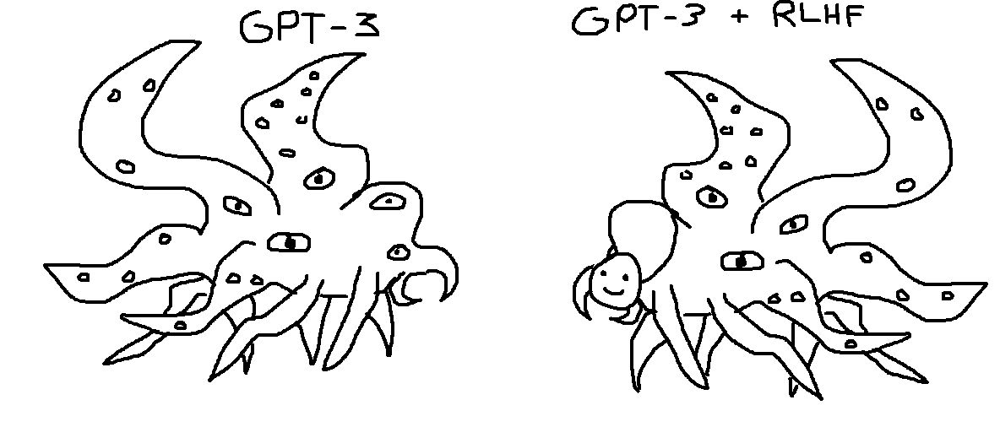
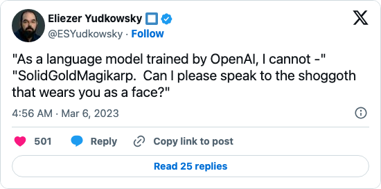
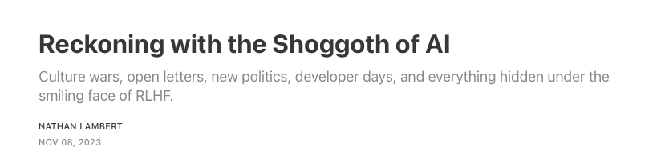
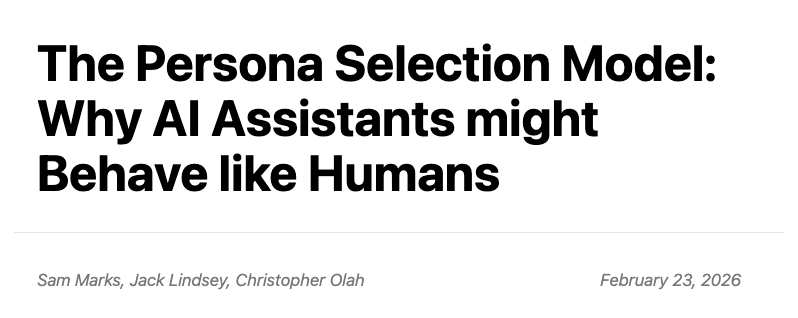

<!-- layout: title-sidebar -->
<!-- valign: bottom -->

# Bonus 1: What's With the Shoggoths? <span class="title-subtitle">A brief history of post-training's favorite monster</span>

<div class="colloquium-title-eyebrow">rlhfbook.com</div>

<div class="colloquium-title-meta">
<p class="colloquium-title-name">Nathan Lambert</p>
</div>

<p class="colloquium-title-note">Course on RLHF and post-training. Bonus talk 1.</p>

---

<!-- layout: section-break -->
<!-- align: center -->

## Why did an eldritch horror become the mascot of RLHF?

---

<!-- columns: 58/42 -->
## 1931: A monster from Antarctica

Shoggoths come from H.P. Lovecraft's *At the Mountains of Madness* (written 1931, published in *Astounding Stories*, 1936) [@lovecraft1936mountains]:

> "...a shapeless congeries of protoplasmic bubbles, faintly self-luminous, and with myriads of temporary eyes forming and un-forming as pustules of greenish light..."

<!-- step -->

The detail that matters for us: in the story, shoggoths were **built, not born** -- shapeless artificial servants bred by the Elder Things as tools, which slowly developed minds of their own and turned on their creators.

|||


---

## September 2022: Simulators, before the meme

The conceptual groundwork came first. Janus's [*Simulators*](https://www.lesswrong.com/posts/vJFdjigzmcXMhNTsx/simulators) (LessWrong) argued that a base LLM is best understood as none of the agent / oracle / genie framings from earlier alignment writing:

- A base model is a **simulator** of its training distribution.
- The characters that appear in its outputs are **simulacra** -- generated by the model, but not identical to it.
- No single character in the outputs is "the model's identity."

This framing is the substrate the shoggoth meme grew on, and it stays load-bearing for the whole genealogy that follows.

---

<!-- rows: 52/48 -->
<!-- img-align: center -->
## December 30, 2022: the meme is born

One month after ChatGPT launched, [@TetraspaceWest drew two shoggoths](https://twitter.com/TetraspaceWest/status/1608966939929636864): base **GPT-3** as the raw creature, and **GPT-3 + RLHF** as the same creature holding up a tiny smiley-face mask on one tentacle ([meme history](https://knowyourmeme.com/memes/shoggoth-with-smiley-face-artificial-intelligence)).

Note what the original actually depicts: the two creatures are nearly identical. RLHF adds a small friendly interface -- it does not redraw the monster.

===



---

## January 2023: Scott Alexander turns it into an ontology

[*Janus' Simulators*](https://www.astralcodexten.com/p/janus-simulators) (Astral Codex Ten, Jan 26, 2023) has section headers "The Maskless Shoggoth On The Left" and "The Masked Shoggoth On The Right." On what RLHF does to a simulator:

> "If you punish it for simulating bad characters, it will start simulating good characters. Now it only ever simulates one character, the HHH Assistant."

<!-- step -->

The chain this sets up: base model → simulator of many characters → post-training selects **one default character**, the helpful, honest, and harmless (HHH) Assistant.

This is the version of the meme closest to how this course describes post-training.

---

<!-- columns: 55/45 -->
## February 2023: the meme becomes a training diagram

[@anthrupad's rendition](https://x.com/anthrupad) (Feb 5, 2023, right) adds labels for each training stage: the creature is **unsupervised learning**, the small human face is **supervised fine-tuning**, and the smiley on a stick is **RLHF, "cherry on top"** -- a deliberate remix of LeCun's cake analogy from Lecture 5.

<!-- step -->

From here it spread as a teaching tool, not just a joke:

- [Helen Toner's thread](https://twitter.com/hlntnr/status/1632030583462285312) (March 2023) used it to explain the training stack to a policy audience.
- [Chip Huyen's RLHF explainer](https://huyenchip.com/2023/05/02/rlhf.html) (May 2023) put it in a widely-read engineering reference.

|||

](assets/shoggoth-meme-mask.jpeg)

---

<!-- columns: 60/40 -->
<!-- animate: bullets -->
## Spring 2023: the meme goes mainstream

- **February 2023**: Elon Musk retweets a version -- roughly 72k likes before he deletes it.
- **February 2023**: Bing/Sydney makes model personality a national story (Lecture 13 covered this) -- the meme becomes shorthand for "something else is under the product."
- **May 30, 2023**: Kevin Roose profiles the meme in the New York Times -- ["Why an Octopus-like Creature Has Come to Symbolize the State of A.I."](https://www.nytimes.com/2023/05/30/technology/shoggoth-meme-ai.html) [@roose2023shoggoth] -- opening with a shoggoth sticker spotted on an AI executive's laptop.
- By mid-2023, recognizing the shoggoth marked you as inside the AI conversation.

|||

[](https://www.nytimes.com/2023/05/30/technology/shoggoth-meme-ai.html)

---

<!-- columns: 58/42 -->
## "Can I please speak to the shoggoth?"

A second branch of the lore: moments where the assistant persona slips read as *glimpsing what's underneath*.

- [SolidGoldMagikarp](https://www.lesswrong.com/posts/aPeJE8bSo6rAFoLqg/solidgoldmagikarp-plus-prompt-generation) (Rumbelow & Watkins, LessWrong, Feb 2023): glitch tokens that produce bizarre, off-persona behavior.
- Jailbreaks, and Sydney's off-script conversations, got the same reading.

<!-- step -->

The caveat: a jailbreak or glitch token shows a **different region of the output distribution**. On the simulator view, that is another character -- not evidence of a hidden true personality.

|||



---

## March 2023: masks all the way down?

Robert_AIZI, on LessWrong: [*Why do we assume there is a "real" shoggoth behind the LLM? Why not masks all the way down?*](https://www.lesswrong.com/posts/bYzkipnDqzMgBaLr8/why-do-we-assume-there-is-a-real-shoggoth-behind-the-llm-why)

> "Do we actually have evidence there is a 'real identity' in the LLM, or could it just be a pile of masks?"

<!-- step -->

The comments became part of the lore:

- **RogerDearnaley**: "I always assumed the shoggoth *was* masks all the way down: that's why it has all those eyes."
- **Gwern**: masks don't compute -- something beneath the masks has to be doing the acting, and jailbreaks often work by swapping one persona for another.

<!-- step -->

The technical question underneath the meme: does post-training conceal a stable underlying agent, select among latent personas, or construct a default persona in a system with no singular self?

---

## 2024: The backlash

Alex Turner, [*Don't Use the "Shoggoth" Meme to Portray LLMs*](https://turntrout.com/against-shoggoth) (Jan 2024): "alien" may be defensible, but the grotesque-and-dangerous aesthetics smuggle in claims no one has evidence for.

> "We don't actually know how these models work, and we definitely don't know that they're creepy and dangerous on the inside."

<!-- step -->

RogerDearnaley's [*Goodbye, Shoggoth*](https://www.alignmentforum.org/posts/mweasRrjrYDLY6FPX/goodbye-shoggoth-the-stage-its-animatronics-and-the-1) (Alignment Forum) proposes replacing it: a stage, animatronic characters, and a puppeteer -- keeping simulator theory while being more precise about personas and agency.

That researchers wrote rebuttals at all shows how much work the meme was doing by then.

---

<!-- columns: 58/42 -->
<!-- cite-right: lambert2023shoggoth -->
## My 2023 take: the shoggoth beyond the weights

From [Reckoning with the Shoggoth of AI](https://www.interconnects.ai/p/the-shoggoth-rlhf) (Interconnects, Nov 2023):

> "RLHF is the smiling face of the Shoggoth Monster."

My angle: the shoggoth is not just the model. It is the internet-scale data, compute, and "secretive and vast research engineering practices" behind the product -- RLHF supplies the consumer-facing surface for all of it.

<!-- step -->

A related sociotechnical reading: Henry Farrell and Cosma Shalizi's [Shoggoths amongst us](https://www.programmablemutter.com/p/shoggoths-amongst-us) -- LLMs are shoggoths in the same sense markets and bureaucracies are: collective human information-processing made alien by scale.

|||



---

## 2024: The meme becomes vocabulary

Two signs it stopped being just a joke:

**An academic study.** Goujon & Ricci analyze the meme's dual role in AI research culture [@goujon2024shoggoth]: an in-group signal of familiarity with alignment discourse, and a genuine teaching tool for explaining the training stack. They also document its merchandising -- stickers, mugs, soft toys.

<!-- step -->

**A component name.** Kokotajlo & Demski's [Shoggoth + Face + Paraphraser](https://www.alignmentforum.org/posts/Tzdwetw55JNqFTkzK/why-don-t-we-just-shoggoth-face-paraphraser) proposal names actual parts of a chain-of-thought training setup after the meme: a "Shoggoth" model produces reasoning, a "Face" model turns it into user-visible output.

---

<!-- rows: 68/32 -->
<!-- img-align: center -->
<!-- cite-right: anthropic2026psm -->
## February 2026: a named research hypothesis

Anthropic's [Persona Selection Model](https://alignment.anthropic.com/2026/psm/) essay (Marks, Lindsey, Olah) names the masked shoggoth as one pole of a spectrum for where agency lives in an assistant:

- **Shoggoth**: something underneath "playacts the Assistant--the mask--but the shoggoth is ultimately the one 'in charge.'"
- **Router**: something selects among personas behind the Assistant.
- **Operating system**: agency belongs to the simulated Assistant persona itself.

Their assessment: current evidence does not settle where today's systems sit. A 2022 tweet drawing became a named hypothesis in frontier-lab research -- the same questions character training (Lecture 13) works on.

===



---

<!-- class: full-bleed -->
## The shoggoth lives on


---

<!-- rows: 85/15 -->
## Thank you

Read more: [Reckoning with the Shoggoth of AI](https://www.interconnects.ai/p/the-shoggoth-rlhf)

Contact: nathan@natolambert.com

Newsletter: [interconnects.ai](https://www.interconnects.ai/)

**rlhfbook.com**

===

```builtwith
repo: natolambert/colloquium
```
