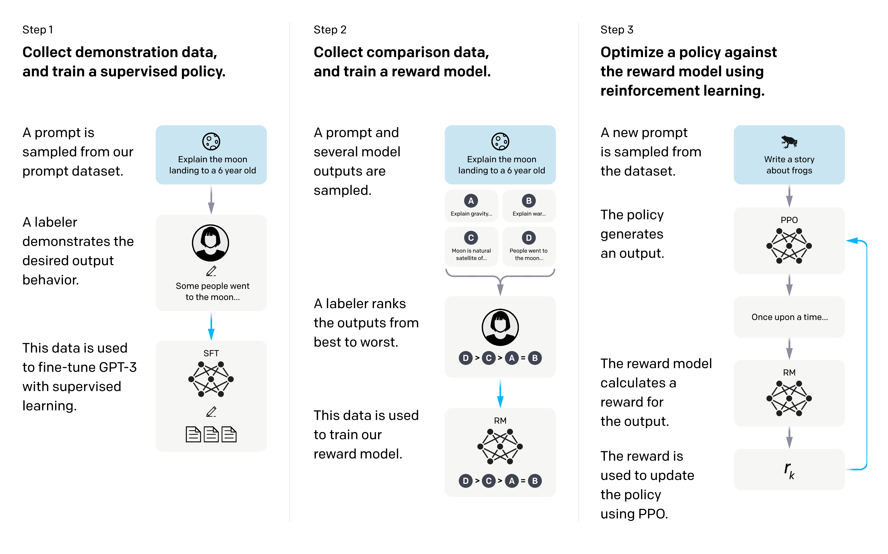
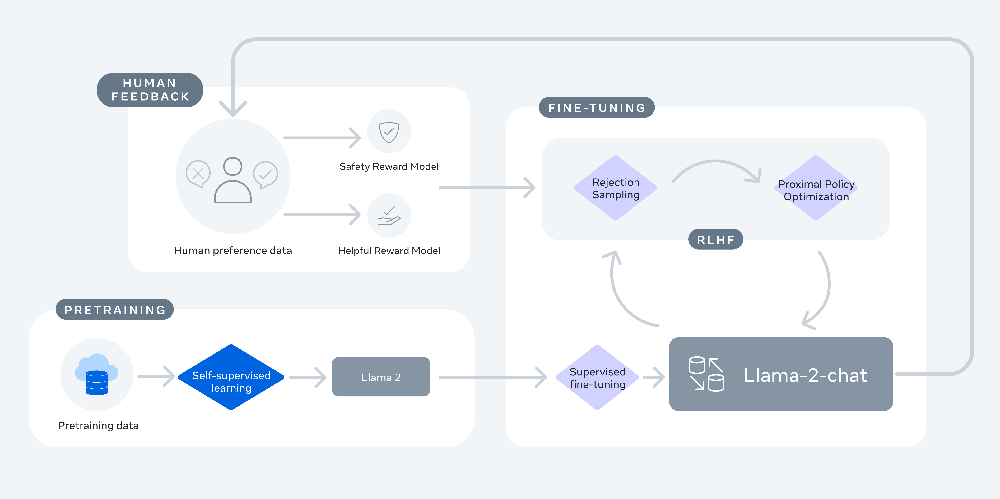
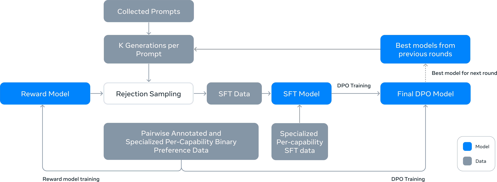
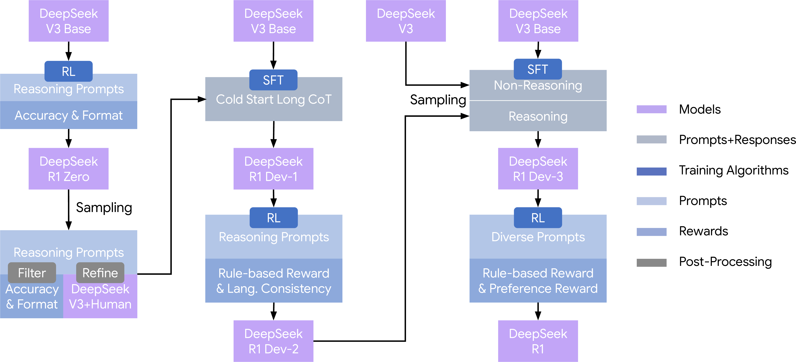
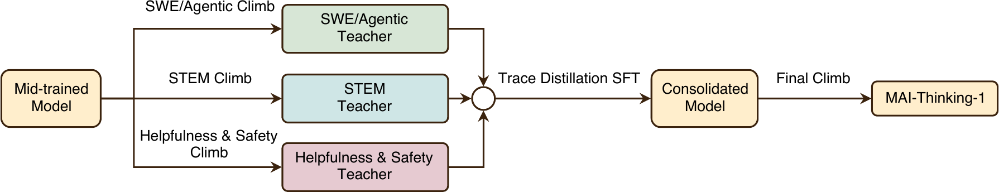
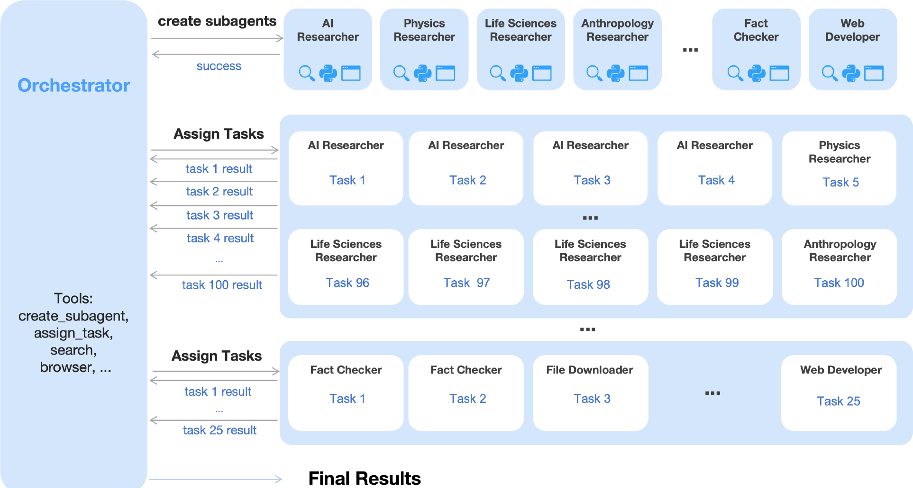

<!-- layout: title-banner -->

# Frontier post-training recipe survey

A conversation · rlhfbook.com/course

Nathan Lambert × Finbarr Timbers

June 2026

From the classic 3-step RLHF recipe to the rise of multi-teacher on-policy distillation (MOPD).

---

## Canonical recipes over time in post-training

The shape of a post-training recipe has changed more in the last year than in the prior three.

- **2022–2023 (InstructGPT):** one pipeline — SFT → reward model → RL.
- **2024 (Llama 3, Tülu 3, etc.):** open recipes formalize SFT → DPO → RL with verifiable rewards. Closed recipes use many stages of RLHF.
- **2025 (DeepSeek R1):** reasoning RL (R1) makes large-scale RL the centerpiece.
- **2026 (MiMo Flash V2):** recipes fragment into *many specialist models* that are merged back into one.
---

## The new thing: MOPD

**Multi-teacher On-Policy Distillation (MOPD)** is the pattern showing up across the 2026 frontier.

1. Train **N domain-specialist teachers** (each: SFT, then RL on the relevant domains).
2. Train **one general student** by sampling *its own* trajectories (this is the final post-trained model).
3. On each rollout, minimize **reverse-KL** to the *relevant* teacher's output distribution, token by token.

<!-- footnote-right: Lineage: MiMo Flash v2 introduced it → DeepSeek V4 & Nemotron 3 Ultra scale it to >10 teachers. -->

---

## Why did MOPD emerge?

- **RL got expensive and conflict-prone.** Mixing math, code, and agentic RL in one run eventually trades capabilities off against each other.
- **Specialists are cheap to make / organizationally scalable.** SFT-then-RL on a single domain is well understood and parallelizable. As post-training becomes more complex, scaling it across organizations is a big win.
- **On-policy distillation matured.** Literature and know-how continued to emerge through the RLVR renaissance. 

<!-- footnote-right: Source: [DeepSeek V4 §5.1](https://huggingface.co/deepseek-ai/DeepSeek-V4-Pro/blob/main/DeepSeek_V4.pdf), [MiMo-V2-Flash](https://arxiv.org/abs/2601.02780) -->

---
<!-- layout: section-break -->
<!-- title: center -->

## The path to today

---

## InstructGPT (Mar. 2022) — the canonical 3 steps

<!-- columns: 58/42 -->

|||

- **SFT** on human demonstrations
- **Reward model** trained on human comparisons
- **PPO** against the reward model

<!-- footnote-right: Source: [InstructGPT (arXiv:2203.02155)](https://arxiv.org/abs/2203.02155) -->

---

## Llama 2 (Jul. 2023) — multi-stage RLHF

<!-- columns: 60/40 -->

|||

- **SFT**, then **iterative RLHF** over multiple rounds
- Each round: **rejection sampling** → **PPO**
- **Two** reward models — separate **helpfulness** and **safety**

<!-- footnote-right: Source: [Llama 2 (arXiv:2307.09288)](https://arxiv.org/abs/2307.09288) -->

---

## Llama 3 (Jul. 2024) — a complex multi-stage recipe with simpler optimizers

<!-- rows: 70/30 -->

===

- Per round: **reward model** → sample **K per prompt** → **rejection sampling** → **SFT** → **DPO**
- No online RL — the RM only **filters**; run over **6 rounds**, best models seed the next

<!-- footnote-right: Source: [Llama 3 (arXiv:2407.21783)](https://arxiv.org/abs/2407.21783) -->

---

## Tülu 3 (Nov. 2024) — simple three-stage post-training

<!-- rows: 62/38 -->

===

Curated prompts → **SFT** → **DPO** → **RLVR** 

(RL with verifiable rewards -- the acronym was coined in this paper)

<!-- footnote-right: Source: [Tülu 3 (arXiv:2411.15124)](https://arxiv.org/abs/2411.15124) -->

---

## OLMo 3 (Dec. 2025) — a reasoning update to the Tülu 3 recipe

<!-- rows: 60/40 -->

===

<!-- footnote-right: Source: [OLMo 3 (arXiv:2512.13961)](https://arxiv.org/abs/2512.13961) -->

---

## DeepSeek R1 (Jan. 2025) — RL as the centerpiece

<!-- columns: 55/45 -->

|||

**The recipe:**

- **R1-Zero** — pure RL (GRPO) on the base, *no SFT*; used to **seed reasoning behaviors** for the full run, not a separate product
- **R1** — cold-start SFT → reasoning RL → rejection-sampling SFT → final RL → distill to dense
- **A big change in recipes:** Large-scale RLVR as the primary driver, SFT to distill and refine RL behaviors

<!-- footnote-right: Part of the DeepSeek line. Source: [DeepSeek R1 (arXiv:2501.12948)](https://arxiv.org/abs/2501.12948) · [Interconnects: R1 recipe for o1](https://www.interconnects.ai/p/deepseek-r1-recipe-for-o1) -->

---

## DeepSeek evolution after V3

<!-- animate: bullets -->

- [**V3**](https://arxiv.org/abs/2412.19437) · Dec '24 — SFT + GRPO RL.
- [**R1**](https://arxiv.org/abs/2501.12948) · Jan '25 — multi-stage RL; reasoning *emerges*.
- [**V3.1**](https://huggingface.co/deepseek-ai/DeepSeek-V3.1) · Aug '25 — hybrid think / non-think in one model.
- [**V3.2**](https://arxiv.org/abs/2512.02556) · Dec '25 — 6 specialists via RL → SFT distillation → one mixed GRPO.
- [**V4**](https://huggingface.co/deepseek-ai/DeepSeek-V4-Pro/blob/main/DeepSeek_V4.pdf) · Apr '26 — 10+ domain experts → MOPD.

<!-- footnote-right: Each model links to its report. V3.1 detail is from its model card (no full report); V3-0324 was a quality bump on the same recipe, so it's omitted. -->

---

<!-- layout: section-break -->
<!-- title: center -->

## 2026 style recipes!

---

## MiMo Flash v2 (Jan. 2026) — where MOPD started

<!-- rows: 64/36 -->

===

**Stages:** Stage 1 SFT → Stage 2 train ~6 domain-specialist teachers (with older style post-training recipes) → Stage 3 MOPD into a single student.

First clean articulation of **multi-teacher on-policy distillation** as the consolidation step — replaces a single monolithic RL stage with distill-from-specialists.

<!-- footnote-right: Source: [MiMo-V2-Flash report (arXiv:2601.02780)](https://arxiv.org/abs/2601.02780) -->

---

## Nemotron 3 Ultra (Jun. 2026) — two rounds, many teachers

<!-- columns: 58/42 -->

|||

**Stages:** SFT → **multi-teacher on-policy distillation**, run over **two iterations**, with **>10 teachers** spanning reasoning, code, math, and agentic domains.

**Novel:** multi-round MOPD across different domains — distill, then re-distill from refreshed teachers.

<!-- footnote-right: Source: [NVIDIA Nemotron 3 Ultra technical report](https://research.nvidia.com/labs/nemotron/files/NVIDIA-Nemotron-3-Ultra-Technical-Report.pdf) -->

---

## MAI-Thinking-1 (Jun. 2026) — closer to R1 than V4

<!-- rows: 48/52 -->

===

**Stages:** mid-trained base → **3 specialist RL "climbs"** (e.g. STEM) → **trace-distillation SFT** to consolidate the climbs → a final RL climb → MAI-Thinking-1.

**Closer to DeepSeek R1 than to V4** — multi-stage RL with trace-distillation SFT to consolidate, *not* on-policy MOPD. Not the only lab without MOPD!

<!-- footnote-right: Source: [MAI-Thinking-1](https://microsoft.ai/news/introducing-mai-thinking-1/) -->

---

## Kimi K2.5 (Jan. 2026) — agentic, multimodal

<!-- columns: 56/44 -->

|||

**Stages:** **text-only SFT** → **joint text–vision RL** across coding, vision, reasoning, agentic tasks.

(No mention of MOPD)

<!-- footnote-right: Source: [Kimi K2.5 technical report](https://github.com/MoonshotAI/Kimi-K2.5/blob/master/tech_report.pdf) · [blog](https://www.kimi.com/blog/kimi-k2-5.html) -->

---

## GLM-5 (Feb. 2026) — staged RL by capability

<!-- columns: 58/42 -->

|||

**Stages:** Base → SFT → **Reasoning RL** → **Agentic RL** → **General RL**.

MOPD isn't universal yet but it's surging!

<!-- footnote-right: Source: [GLM-5 technical report (arXiv:2602.15763)](https://arxiv.org/abs/2602.15763) -->

---

<!-- layout: section-break -->
<!-- title: center -->

## So, where are we going from here?
