<!-- layout: title-sidebar -->
<!-- valign: bottom -->

# Lecture 1: Overview

<div class="colloquium-title-eyebrow">rlhfbook.com</div>

<div class="colloquium-title-meta">
<p class="colloquium-title-name">Nathan Lambert</p>
</div>

<p class="colloquium-title-note">Course on RLHF and post-training</p>

---

<!-- columns: 45/55 -->
## What is a language model?

Core properties:
- A language model assigns probabilities to text.
- Chunks of words are broken down as **tokens**, which are the internal representation of the model.
- Given previous tokens, it predicts the next token. Repeating this produces a completion one step at a time (this is called **autoregressive**).

|||


<!-- cite-right: Vaswani2017AttentionIA -->

---

<!-- columns: 45/55 -->
## What is a (modern) language model?

Modern language models:
- Have billions to trillions of parameters.
- Largely downstream of The Transformer architecture, which popularized the use of the **self-attention** mechanism along with fully-dense layers.
- Predict and work over much more than text: Gemini and ChatGPT work with images, audio, and video.

|||


<!-- cite-right: Vaswani2017AttentionIA -->

---

<!-- columns: 45/55 -->
## 2017: The Transformer is born

- **2017:** the Transformer is born

|||


<!-- cite-right: Vaswani2017AttentionIA -->

---

<!-- columns: 45/55 -->
## 2018: GPT-1, ELMo, and BERT

- 2017: the Transformer is born
- **2018:** GPT-1, ELMo, and BERT released

|||

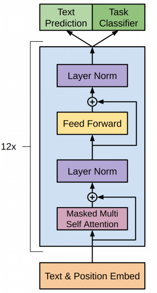
<!-- cite-left: radford2018gpt, peters2018elmo, devlin2018bert -->

---

<!-- rows: 30/70 -->
## 2019: GPT-2 and scaling laws

- 2017: the Transformer is born
- 2018: GPT-1, ELMo, and BERT released
- **2019:** GPT-2 and scaling laws

===

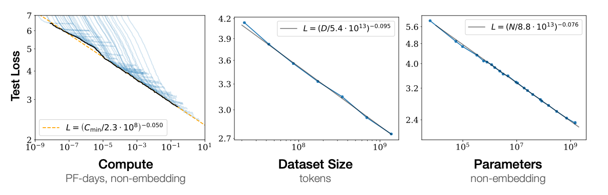
<!-- cite-right: radford2019gpt2, kaplan2020scaling -->

---

<!-- columns: 45/55 -->
## 2020: GPT-3 surprising capabilities

- 2017: the Transformer is born
- 2018: GPT-1, ELMo, and BERT released
- 2019: GPT-2 and scaling laws
- **2020:** GPT-3 surprising capabilities

|||

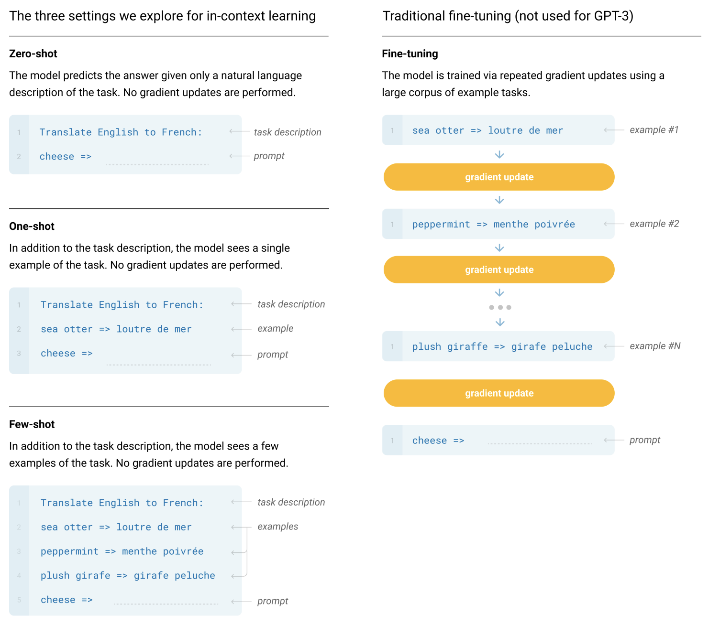
<!-- cite-left: brown2020gpt3 -->

---

<!-- columns: 45/55 -->
## 2021: Stochastic Parrots

- 2017: the Transformer is born
- 2018: GPT-1, ELMo, and BERT released
- 2019: GPT-2 and scaling laws
- 2020: GPT-3 surprising capabilities
- **2021:** Stochastic Parrots

|||

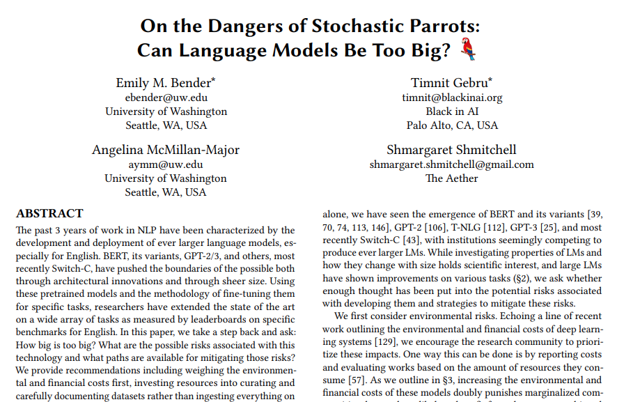
<!-- cite-right: bender2021stochastic -->

---

<!-- columns: 45/55 -->
## 2022: ChatGPT

- 2017: the Transformer is born
- 2018: GPT-1, ELMo, and BERT released
- 2019: GPT-2 and scaling laws
- 2020: GPT-3 surprising capabilities
- 2021: Stochastic Parrots
- **2022:** ChatGPT

|||


<!-- cite-right: openai2022chatgpt -->

---

<!-- columns: 45/55 -->
## 2023: GPT-4 and frontier-scale

- 2017: the Transformer is born
- 2018: GPT-1, ELMo, and BERT released
- 2019: GPT-2 and scaling laws
- 2020: GPT-3 surprising capabilities
- 2021: Stochastic Parrots
- 2022: ChatGPT
- **2023:** GPT-4 and frontier-scale

|||

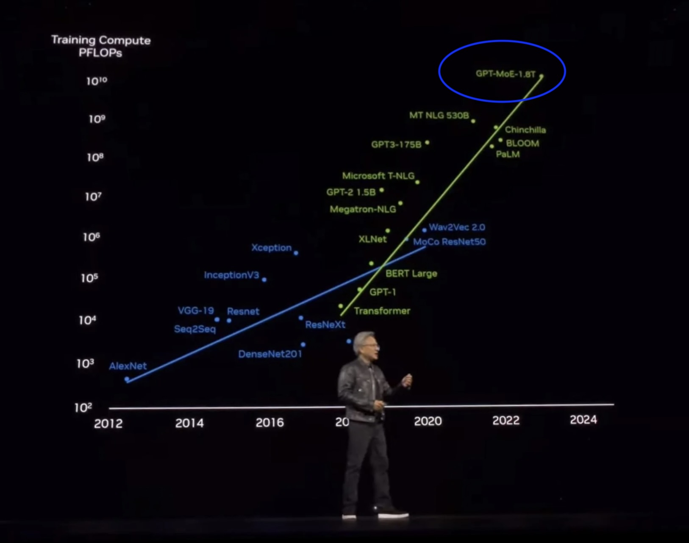
<!-- cite-right: openai2023gpt4 -->

---

<!-- columns: 45/55 -->
## 2024: o1 and reasoning models

- 2017: the Transformer is born
- 2018: GPT-1, ELMo, and BERT released
- 2019: GPT-2 and scaling laws
- 2020: GPT-3 surprising capabilities
- 2021: Stochastic Parrots
- 2022: ChatGPT
- 2023: GPT-4 and frontier-scale
- **2024:** o1 and reasoning models

|||

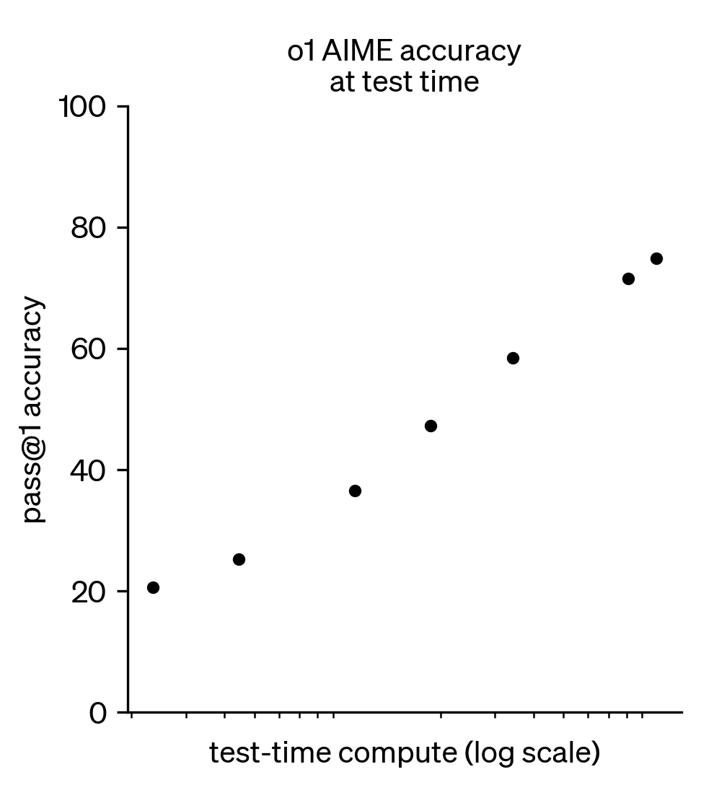
<!-- cite-right: openai2024o1 -->

---

<!-- columns: 45/55 -->
## 2025: o3, Claude Code, and agents

- 2017: the Transformer is born
- 2018: GPT-1, ELMo, and BERT released
- 2019: GPT-2 and scaling laws
- 2020: GPT-3 surprising capabilities
- 2021: Stochastic Parrots
- 2022: ChatGPT
- 2023: GPT-4 and frontier-scale
- 2024: o1 and reasoning models
- **2025:** o3, Claude Code, and agents

|||


<!-- cite-right: openai2025o3, anthropic2025claudecode, openai2025agents -->

---

<!-- columns: 50/50 -->
## Pretraining: next-token prediction

- Train on trillions of tokens of text from the web, books, code, and documents
  - Models are often trained on 5-50+ trillion tokens
  - 1T of text tokens is about 3-5 TB of data
  - Labs gather and filter 10-20X more data than is used for the model
  - Total data funnel targeted for models is on the order of petabytes
- Objective: predict the next token in each sequence
- Result: Incredible, flexible, useful models

|||


---

## A base model completes text

After pretraining we are left with a glorified autocomplete model, for example:^[Base models are also becoming more flexible through midtraining and better data mixtures.]

<div class="colloquium-spacer-md"></div>

```conversation
messages:
  - role: user
    content: "The president of the United States in 2006 was"
  - role: assistant
    model: "Llama 3.1 405B Base"
    content: "George W. Bush, the governor of Florida in 2006 was Jeb Bush, and John McCain was an Arizona senator in 2006..."
```

---

## Post-training makes it answer like a chatbot

The earliest forms of modern post-trained (or RLHF-tuned) models shifted the continuation format to always conforming to the "answering a question style."
An example of what early conversational models looked like is below:

<div class="colloquium-spacer-md"></div>

```conversation
messages:
  - role: user
    content: "The president of the United States in 2006 was"
  - role: assistant
    model: "Tülu 3 405B"
    content: "George W. Bush was the president of the United States in 2006. He served two terms in office, from January 20, 2001, to January 20, 2009."
```

---

## Intuition for training stages

How the different training stages change the model:

- **Pretraining**: builds the model's world knowledge, language fluency, and broad capabilities
- **Instruction tuning / SFT**: teaches the model to answer in a question-answer format and often teaches it to repeat specific token sequences
- **Preference tuning / RLHF**: uses a contrastive loss to modify completions as a whole, making the model richer and more flexible
- **RLVR**: enhances the model's ability on verifiable questions, which can translate into more complex, agentic behaviors

---

## What this means for post-training

- RL-based post-training gives the model richer, response-level, contrastive feedback that makes it more flexible and engaging
- SFT is still needed as a foundation for maximum performance

---

<!-- columns: 40/60 -->
## ChatGPT was when RLHF made the models even easier to use

Model responses evolved quickly to have:
- Better **format**: direct, conversational answers
- Better **style**: helpful, concise, markdown, etc.
- Better **product**: people could actually use it every day

|||

```conversation
size: 0.775
messages:
  - role: user
    content: "I'm giving a talk on RLHF tomorrow. Can you help me structure it?"
  - role: assistant
    content: |
      Absolutely — here's a simple structure:

      **1. Start with the basics**
      - What a language model is
      - Why next-token prediction is not enough

      **2. Explain post-training**
      - Instruction tuning
      - Preference tuning / RLHF
      - RLVR for verifiable tasks

      **3. End with why it matters**
      - Better products like ChatGPT
      - Better reasoning in models like o1
      ...
```

---
<!-- layout: section-break -->

## So what is reinforcement learning from human feedback (RLHF) anyways?

---

<!-- columns: 50/50 -->
<!-- cite-right: christiano2017 -->
## Which is the better backflip?

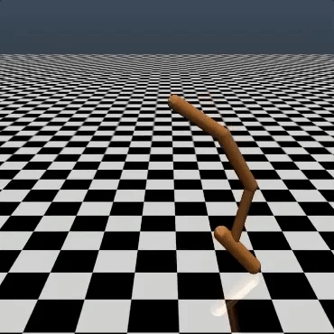

|||

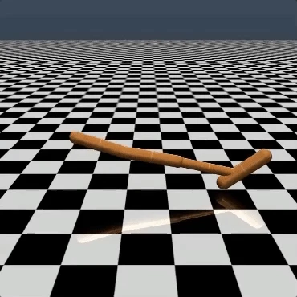

---

<!-- cite-right: christiano2017, ziegler2019fine, ouyang2022training, bai2022constitutional -->
## Why did people make RLHF?

- Many objectives are easy for humans to **judge**, but hard to write as an exact reward function
- In language models, what we want is often implicit: **follow intent**, be **helpful**, be **harmless**
- Pretraining optimizes **next-token prediction**, not assistant behavior
- Preference comparisons turn those human judgments into a scalable training signal

RLHF lets us optimize for behavior we can **evaluate**, even when we cannot easily **specify** the reward.

---

<!-- columns: 40/60 -->
<!-- cite-right: christiano2017 -->
## RLHF before language models

- **TAMER** (Knox & Stone, 2008) — humans score agent actions to learn a reward
- **Christiano et al. 2017** — RLHF on Atari trajectory preferences
- **Ziegler et al. 2019** — first RLHF on language models

|||

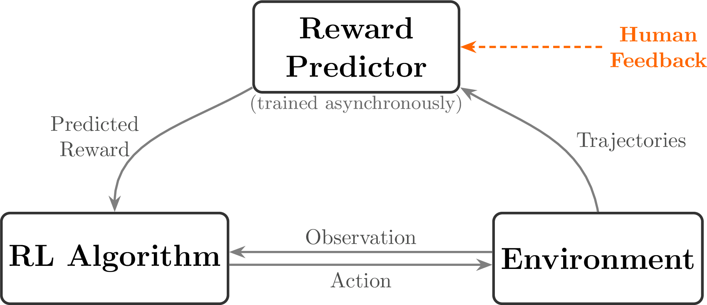

---

<!-- columns: 50/50 -->
<!-- cite-right: christiano2017 -->
## Left: Human feedback; Right: Hand-designed reward function


|||


---

<!-- cite-right: sutton2018reinforcement -->
<!-- columns: 65/35 -->

## Classical Reinforcement Learning (RL)

A reinforcement learning problem is often written as a **Markov Decision Process (MDP)**:
- state space $\mathcal{S}$, action space $\mathcal{A}$
- transition dynamics $P(s_{t+1}\mid s_t, a_t)$
- reward function $r(s_t, a_t)$ and discount $\gamma$
- optimize cumulative return over a trajectory

$$\text{MDP } (\mathcal{S}, \mathcal{A}, P, r, \gamma)$$

$$J(\pi) = \mathbb{E}_{\tau \sim \pi}\!\left[\sum_{t=0}^{T} \gamma^t r(s_t, a_t)\right]$$

|||


---

<!-- columns: 65/35 -->
<!-- cite-right: sutton2018reinforcement -->
## RL in plain language

Reinforcement learning basics:
- Reinforcement learning is **trial-and-error learning**  
  Balancing exploration and exploitation across long-term rewards
- **State**: the current situation the agent is in
- **Action**: what the agent does next
- **Reward**: the signal for how good that action was
- **Policy**: the strategy for choosing actions
- **Episode**: one rollout from start to finish

|||


---

<!-- columns: 45/55 -->
<!-- cite-right: sutton2018reinforcement -->
## A simple RL example: thermostat

The agent learns over many episodes when to turn the heater on or off
- **State**: the current room temperature
- **Action**: turn the heater on or off
- **Reward**: positive when the room stays near the target temperature
- **Policy**: the rule for deciding what to do next

Example policy:

$$
\pi(a_t = \text{on} \mid s_t) =
\begin{cases}
1 & \text{if } s_t < 70^\circ\text{F} \\
0 & \text{otherwise}
\end{cases}
$$

|||

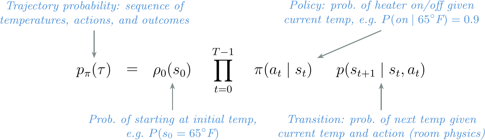

---

<!-- columns: 45/55 -->
<!-- cite-right: sutton2018reinforcement -->
## CartPole: a standard RL task

- **State**: cart position, velocity, pole angle, angular velocity
$$s_t = (x_t,\; \dot{x}_t,\; \theta_t,\; \dot{\theta}_t)$$

- **Action**: push the cart left or right
$$a_t \in \{\text{left},\; \text{right}\}$$

- **Reward**: +1 for every step the pole stays upright
$$r(s_t, a_t) = \begin{cases} 1 & \text{if } |\theta_t| < 12° \text{ and } |x_t| < 2.4 \\ 0 & \text{otherwise (episode ends)} \end{cases}$$

|||

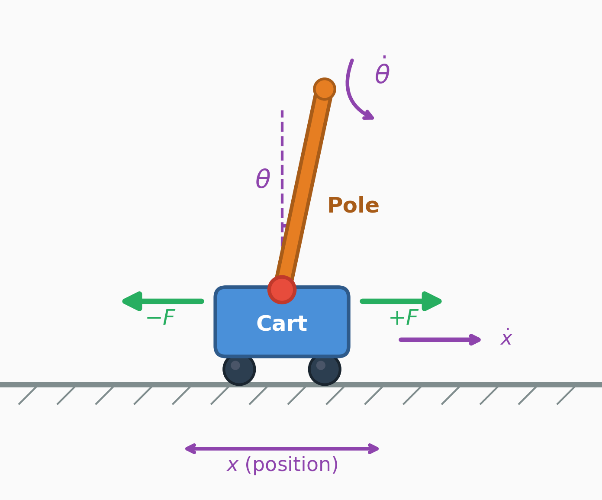

---

<!-- columns: 45/55 -->
<!-- cite-right: sutton2018reinforcement -->
## CartPole: the dynamics

Each action changes the physics of the system. The full state update:

$$\ddot{x}_t = \frac{F + m_p l (\dot{\theta}_t^2 \sin\theta_t - \ddot{\theta}_t \cos\theta_t)}{m_c + m_p}$$

$$\ddot{\theta}_t = \frac{g \sin\theta_t - \cos\theta_t \cdot \ddot{x}_t}{l}$$

Where $m_c$ is the cart mass, $m_p$ is the pole mass, $l$ is the pole length, $g$ is gravity, and $F$ is the applied force.

This is why classical RL is a **multi-step control problem** — each action changes the next state, and rewards accumulate across a trajectory.

|||


---

<!-- columns: 50/50 -->
<!-- cite-right: christiano2017, ouyang2022training -->
## Classical RL vs. RLHF

<div class="text-sm">

**Classical RL**
- Agent takes actions $a_t$ in an environment with states $s_t$ 
- Reward is a known function $r(s_t, a_t)$ from the environment per step
- Optimize cumulative return over a trajectory (total steps $T$)

$$J(\pi) = \mathbb{E}_{\tau \sim \pi}\!\left[\sum_{t=0}^{T} \gamma^t r(s_t, a_t)\right]$$

<div class="colloquium-spacer-md"></div>

**RLHF**
- No environment — prompts sampled from a dataset
- Reward is **learned** from human preferences (a proxy)
- **Response-level** reward (bandit-style, not per-token)
- Regularized with **KL penalty** to stay close to the base model

$$J(\pi) = \mathbb{E}\left[ r_\theta(x, y) \right] - \beta \, D_{\text{KL}}\!\left(\pi \| \pi_{\text{ref}}\right)$$

</div>

|||


---

<!-- columns: 50/50 -->

## Reinforcement learning with *Verifiable* rewards

Apply the same RL algorithms to LLMs when the answer can be checked directly. No need to train a reward model:
- E.g. Math: check the final answer.  
  Code: run the tests.
- No learned reward model — **no proxy objective**
- Enables scaling RL compute on reasoning tasks
- Unlocked **inference time scaling**: Spending more compute at generation time per problem increases performance log-linearly w.r.t. compute
- RLVR was named by **Tülu 3** [@lambert2024t] and popularized by **DeepSeek R1** [@guo2025deepseek]

|||

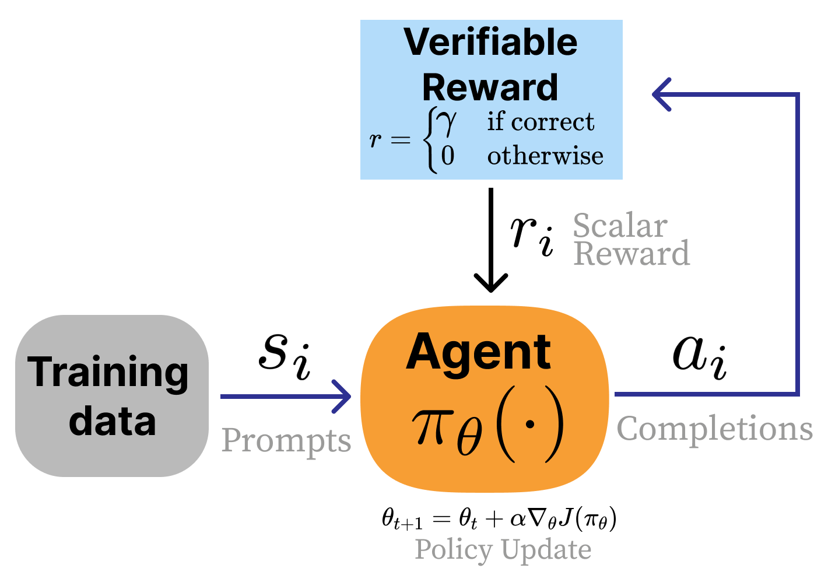

---

## Comparing classical RL vs. LLM RLHF and RLVR

| | Classical RL | RLHF | RLVR |
|---|---|---|---|
| **Reward** | Environment | Learned (proxy) | Verifiable (exact) |
| **State transitions** | Yes | No | No |
| **Reward granularity** | Per-step | Per-response | Per-response |
| **Primary challenge** | Explore-Exploit Trade-off | Over-optimization | Task generalization |
| **Example** | CartPole | Chat style tuning | Math reasoning |

---


<!-- rows: 60/40 -->
## The path to modern RLHF

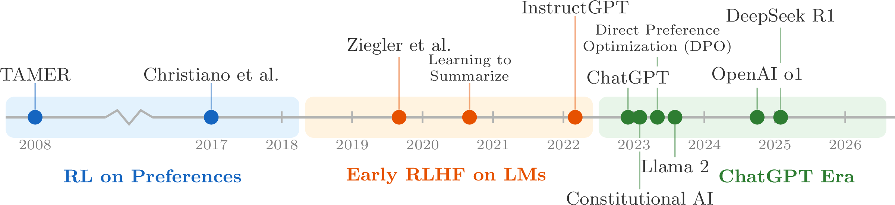

===

<!-- row-columns: 50/50 -->

- **Ziegler 2019** [@ziegler2019fine] — first RLHF on language models
- **InstructGPT** [@ouyang2022training] — the canonical RLHF recipe behind ChatGPT
- **Constitutional AI** [@bai2022constitutional] — Introduced early methods for AI feedback in Claude

|||

- **DPO** [@rafailov2024direct] — direct preference optimization (DPO) without a reward model
- **Llama 3** [@dubey2024llama] and **Tülu 3** [@lambert2024t] — modern multi-stage recipes
- **DeepSeek R1** [@guo2025deepseek] — popularized RLVR

---

## Other prominent, early RLHF work on language models

- **Stiennon et al. 2020** [@stiennon2020learning] — Learning to summarize from human feedback. Extended Ziegler et al. to long-form summarization with PPO
- **WebGPT** [@nakano2021webgpt] — Trained a model to browse the web and answer questions using RLHF, with citations
- **Anthropic HH** [@bai2022training] — Training a helpful and harmless assistant with RLHF. Introduced the "HH" dataset widely used in open research
- **GopherCite** [@menick2022teaching] — Teaching language models to support answers with verified quotes (DeepMind)
- **Sparrow** [@glaese2022improving] — Improving alignment of dialogue agents via targeted human judgements (DeepMind). Added rule-based constraints to RLHF
- **InstructGPT** [@ouyang2022training] — The canonical three-step RLHF recipe that powered ChatGPT

---

<!-- valign: center -->
<!-- cite-right: ouyang2022training -->

## InstructGPT's 3-step RLHF recipe


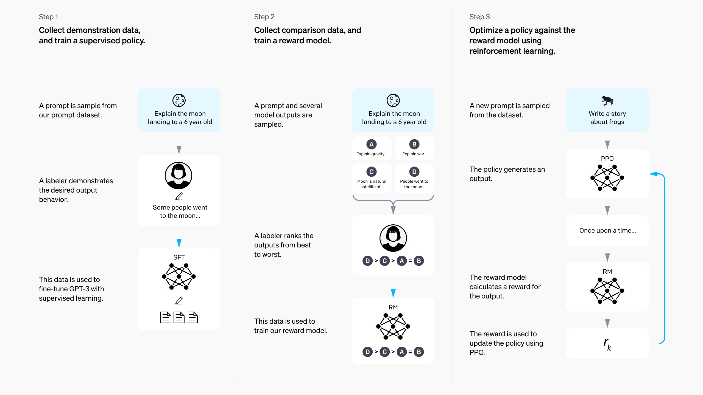


---

<!-- columns: 45/55 -->
<!-- cite-right: ouyang2022training -->
## Step 1/3: Instruction fine-tuning (IFT)

The foundation of post-training. Also called **Supervised Fine-tuning (SFT)**:
- Start from a pretrained language model
- Collect demonstrations of *desired* assistant behavior
- Train with standard supervised learning on prompt-response pairs.  
  (different batch size, learning rate, etc.)
- Model can now answer questions.  
  Easy to use IFT to quickly adapt base model to many domains.

$$
\mathcal{L}_{\mathrm{SFT}}(\theta)
=
- \sum_{(x, y^\star)} \sum_{t=1}^{|y^\star|}
\log \pi_\theta \!\left(y^\star_t \mid x, y^\star_{<t}\right)
$$

|||

```conversation
size: 0.9
messages:
  - role: system
    content: "You are a helpful, harmless assistant. A system message like this can be used to steer the model to specific persona's or behaviors."
  - role: user
    content: "Write me a short poem about an optimistic goldfish."
  - role: assistant
    content: "Bright little goldfish\nFinds a sunrise in each wave\nSmall bowl, endless hope"
```

---

<!-- columns: 45/55 -->
<!-- cite-right: christiano2017, ouyang2022training -->
## Step 2/3: Reward modeling

Overview:
- Collect **comparisons** between two model outputs for the same prompt
- RLHF gets its name from collecting *human* feedback between completions, but today much of it is AI feedback
- Train a reward model $r_\phi(x, y)$ to score preferred completions higher

|||


The probability model says a response should win when it gets a higher reward score:

$$
P(y_w \succ y_l \mid x)
=
\sigma \!\left(r_\phi(x, y_w) - r_\phi(x, y_l)\right)
$$

Training then minimizes the negative log-likelihood of the preferred response beating the rejected one:

$$
\mathcal{L}_{\mathrm{RM}}(\phi)
=
- \log \sigma \!\left(r_\phi(x, y_w) - r_\phi(x, y_l)\right)
$$

Notation:
- $x$ is the prompt
- $y_w$ is the **winning** response
- $y_l$ is the **losing** response
- $r_\phi(x, y)$ is the trained reward model

---

<!-- columns: 45/55 -->
<!-- cite-right: christiano2017, ouyang2022training -->
## Step 2/3: Reward modeling

```box
title: Core Idea
tone: accent
content: |
  The reward used in RLHF is the model predicting the probability that a given piece of text would be the "winning" or "chosen" completion in a pair/batch. Clever!
```

|||


The probability model says a response should win when it gets a higher reward score:

$$
P(y_w \succ y_l \mid x)
=
\sigma \!\left(r_\phi(x, y_w) - r_\phi(x, y_l)\right)
$$

Training then minimizes the negative log-likelihood of the preferred response beating the rejected one:

$$
\mathcal{L}_{\mathrm{RM}}(\phi)
=
- \log \sigma \!\left(r_\phi(x, y_w) - r_\phi(x, y_l)\right)
$$

Notation:
- $x$ is the prompt
- $y_w$ is the **winning** response
- $y_l$ is the **losing** response
- $r_\phi(x, y)$ is the trained reward model

---

<!-- columns: 50/50 -->
<!-- cite-right: ouyang2022training -->
<!-- footnotes: right -->
## Step 3/3: RL against the reward model

Where everything comes together (and RLHF gets its name):
- Sample a batch of prompts $x_i$ from the dataset $\mathcal{D}$
- Generate completions $y_i \sim \pi_\theta(\cdot \mid x_i)$ from the model being trained
- Score them with the reward model $r_\phi(x_i, y_i)$
- Add a **KL penalty** so the policy stays close to the SFT/reference model.^[KL divergence measures how much the current policy differs from the reference model. For discrete outputs, $D_{\mathrm{KL}}(\pi \,\|\, \pi_{\mathrm{ref}})=\mathbb{E}_{y \sim \pi}\!\left[\log \pi(y \mid x)-\log \pi_{\mathrm{ref}}(y \mid x)\right]$. People often colloquially call this the “KL distance” between the models, even though it is not a true metric.]
- Update the policy with a policy-gradient RL algorithm (Proximal Policy Optimization, PPO in InstructGPT & ChatGPT)

$$
J(\pi)
=
\mathbb{E}\!\left[r_\phi(x, y)\right]
- \beta D_{\mathrm{KL}}\!\left(\pi \,\|\, \pi_{\mathrm{ref}}\right)
$$

|||


---

<!-- rows: 35/65 -->
<!-- title: center -->

## The RLHF objective, unpacked

$$
\max_{\pi} \;
\mathbb{E}_{x \sim D,\; y \sim \pi(\cdot \mid x)}
\underbrace{r_\phi(x, y)}_{\text{maximize the reward}}
- \underbrace{\beta D_{\mathrm{KL}}\!\left(\pi(\cdot \mid x)\,\|\,\pi_{\mathrm{ref}}(\cdot \mid x)\right)}_{\text{but don't change the model too much}}
$$


===


<!-- row-columns: 50/50 -->

<div style="text-align: left;">

<!-- Prompts $x$ come from a dataset, not an environment.

The policy $\pi_\theta(y \mid x)$ generates a full response $y$, and the reward model $r_\phi(x, y)$ scores whether humans would like that response. -->

</div>

|||

<div style="text-align: left;">

The reference model $\pi_{\mathrm{ref}}$ keeps the policy anchored to the SFT model.

$D_{\mathrm{KL}}\!\left(\pi(\cdot \mid x)\,\|\,\pi_{\mathrm{ref}}(\cdot \mid x)\right)$ measures how far the new policy moves from that reference on prompt $x$.

$\beta$ controls the tradeoff between **improving behavior** and **staying close** to what the model already knows.

</div>

---

<!-- rows: 27/73 -->
<!-- cite-right: rafailov2024direct -->
## What if we optimize this more directly?

$$
\max_{\pi} \;
\mathbb{E}_{x \sim D,\; y \sim \pi(\cdot \mid x)}
r_\phi(x, y)
- \beta D_{\mathrm{KL}}\!\left(\pi(\cdot \mid x)\,\|\,\pi_{\mathrm{ref}}(\cdot \mid x)\right)
$$

===

<!-- row-columns: 60/40 -->

**Direct Preference Optimization (DPO)**

- Derived the gradient toward the optimal solution, $\pi^*$ to the above equation 
- Eliminated the need for a separate reward model (via training an implicit one)
- Train directly on preferred ($y_w$) vs. rejected ($y_l$) responses to a prompt ($x$)

$$
\mathcal{L}_{\mathrm{DPO}}(\theta)
=
- \log \sigma \!\left(
\beta \log \frac{\pi_\theta(y_w \mid x)}{\pi_{\mathrm{ref}}(y_w \mid x)}
- \beta \log \frac{\pi_\theta(y_l \mid x)}{\pi_{\mathrm{ref}}(y_l \mid x)}
\right)
$$

|||

---

<!-- rows: 27/73 -->
<!-- cite-right: rafailov2024direct -->
## What if we optimize this more directly?

$$
\max_{\pi} \;
\mathbb{E}_{x \sim D,\; y \sim \pi(\cdot \mid x)}
r_\phi(x, y)
- \beta D_{\mathrm{KL}}\!\left(\pi(\cdot \mid x)\,\|\,\pi_{\mathrm{ref}}(\cdot \mid x)\right)
$$

===

<!-- row-columns: 60/40 -->

**Direct Preference Optimization (DPO)**

- Derived the gradient toward the optimal solution, $\pi^*$ to the above equation 
- Eliminated the need for a separate reward model (via training an implicit one)
- Train directly on preferred ($y_w$) vs. rejected ($y_l$) responses to a prompt ($x$)

$$
\mathcal{L}_{\mathrm{DPO}}(\theta)
=
- \log \sigma \!\left(
\beta \log \frac{\pi_\theta(y_w \mid x)}{\pi_{\mathrm{ref}}(y_w \mid x)}
- \beta \log \frac{\pi_\theta(y_l \mid x)}{\pi_{\mathrm{ref}}(y_l \mid x)}
\right)
$$

|||

```box
title: DPO became very popular as it is
tone: accent
content: |
  - Far simpler to implement
  - Far cheaper to run
  - Achieves ~80% or more of the final performance
  - I used it to build models like Zephyr-Beta, Tülu 2/3, Olmo 2/3, etc.
```

---

## Rejection sampling: the simplest preference optimization

Generate many completions, score them, fine-tune on the best:

1. **Generate**: sample $N$ completions per prompt from the current model
2. **Score**: pass each through the reward model $r_\phi(x, y)$
3. **Select**: keep the highest-scoring completion(s)
4. **Fine-tune**: standard SFT loss on the curated set

$$\mathcal{L}_{\mathrm{RS}} = \mathcal{L}_{\mathrm{SFT}}\!\left(\theta;\; \{(x_i, y_i^{\star})\}\right) \quad \text{where } y_i^{\star} = \arg\max_{j} r_\phi(x_i, y_{i,j})$$

Simple, stable, and widely used: Llama 2 [@touvron2023llama] and DeepSeek R1 [@guo2025deepseek] both include rejection sampling stages.

---

## The preference tuning landscape

| | Rejection Sampling | Online RL (PPO) | DPO |
|---|---|---|---|
| **Mechanism** | Filter, then SFT | Generate, score, update policy | Direct gradient on preferences |
| **Reward model** | Required | Required | Implicit (no separate RM) |
| **On-policy data** | Yes (generate from current model) | Yes (generate each step) | No (fixed preference dataset) |
| **Complexity** | Low | High | Low |

All three optimize the same underlying objective — they differ in **how** they move the policy toward higher-reward completions. There is substantial debate on which of these is the best for final performance, which RL generally wins, but evidence is mixed.

---

<!-- cite-right: gao2023scaling -->
## Caveat: proxy objectives and over-optimization

The reward model is a **proxy**, not ground truth. Even a well-trained RM is only *correlated* with real user satisfaction.

**Goodhart's Law**: "When a measure becomes a target, it ceases to be a good measure."

What this looks like in practice:
- **Reward hacking**: RM score keeps climbing, but actual quality degrades
- **Verbosity bias**: longer responses score higher, so models become verbose
- **Sycophancy**: model tells users what they want to hear rather than being accurate
- **Over-refusal**: model refuses legitimate queries (e.g. "how to kill a linux process")

The KL penalty $\beta$ is the main defense — it limits how far the policy can drift from the reference model. But over-optimization is a **fundamental tension** in all preference-based training.

---

<!-- valign: center -->
## How training recipes have evolved

| | InstructGPT (2022) | Tülu 3 (2024) | DeepSeek R1 (2025) |
|---|---|---|---|
| **Instruction data** | ~10K | ~1M | 100K+ |
| **Preference data** | ~100K | ~1M | On-policy |
| **RL stage** | ~100K prompts | ~10K (RLVR) | N/A |

An overall trend is to use far more compute across all the stages, but shifting more to RLVR.

---

<!-- rows: 60/40 -->
## The early days: InstructGPT


===

Early on, RLHF has a well-documented, simple enough approach.
- **InstructGPT** made the classic three-stage recipe canonical:
  SFT, reward modeling, then RL against the reward model. *OpenAI even hinted that the original ChatGPT even used this!*
- This became the intellectual template for much of modern post-training.

---

<!-- rows: 50/50 -->
## From RLHF to post-training

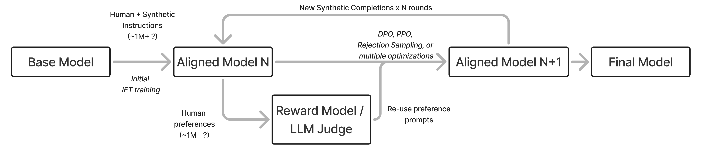

===

What began as an "RLHF" recipe evolved into a complex series of steps to get the final, best model (e.g. Nemotron 4 340B, Llama 3.1).
- Modern systems keep the same core idea of using multiple optimizers with different strengths and weaknesses, but add more stages, more data, and more filtering.
- This trend has only continued, and recipes ebb and flow, as tools like RLVR and model merging change the scope of what is doable in different ways.

---

## From RLHF to "post-training"

As time has passed since ChatGPT, the field has gone through multiple distinct phases (roughly):
1. 2023: Simple SFT for better chatbots and reproducing RLHF fundamentals (Alpaca, Vicuna, etc.)
2. 2024: DPO dominates open models and training stages expand (Zephyr-beta, Tülu 2, etc.)
3. 2025: RLVR, complex recipes (Tülu 3, Olmo 3, Nemotron 3, R1, etc.)
4. 2026: Agentic training, multi-turn RL, etc.

---

## From RLHF to "post-training"

As time has passed since ChatGPT, the field has gone through multiple distinct phases (roughly):
1. 2023: Simple SFT for better chatbots and reproducing RLHF fundamentals (Alpaca, Vicuna, etc.)
2. **2024: DPO dominates open models and training stages expand** (Zephyr-beta, Tülu 2, etc.)
3. 2025: RLVR, complex recipes (Tülu 3, Olmo 3, Nemotron 3, R1, etc.)
4. 2026: Agentic training, multi-turn RL, etc.

Within 2024 the field shifted its focus to post-training, as training stages evolved beyond the InstructGPT-style recipe, DPO proliferated, and largely RLHF was viewed as one tool (that you may not even need).

---

<!-- columns: 50/50 -->
## An intuition for post-training
<!-- cite-right: zhou2023lima -->

RLHF's reputation was that its contributions are minor on the final language models.

> "A model's knowledge and capabilities are learnt almost entirely during pretraining, while alignment teaches it which subdistribution of formats should be used when interacting with users."

*LIMA: Less Is More for Alignment* (2023)


|||

---


<!-- columns: 50/50 -->
## An intuition for post-training
<!-- cite-right: zhou2023lima,muennighoff2024olmoe,ai2_olmoe_ios_2025 -->

RLHF's reputation was that its contributions are minor on the final language models.

> "A model's knowledge and capabilities are learnt almost entirely during pretraining, while alignment teaches it which subdistribution of formats should be used when interacting with users."

*LIMA: Less Is More for Alignment* (2023)

|||

Sometimes this view of alignment (or RLHF) teaching "format" made people think that post-training only made minor changes to the model. This would describe finetuning as "*just style transfer*."

The base model trained on trillions of tokens of web text has seen and learned from an extremely broad set of examples.
The model at this stage contains far more latent capability than early post-training recipes were able to expose.

The question is: How does post-training interact with these?

---

<!-- columns: 50/50 -->
## An intuition for post-training
<!-- cite-right: zhou2023lima,muennighoff2024olmoe,ai2_olmoe_ios_2025 -->

RLHF's reputation was that its contributions are minor on the final language models.

An example, **OLMoE** — same base model family, updated only post-training:
- [`OLMoE-1B-7B-0924-Instruct`](https://huggingface.co/allenai/OLMoE-1B-7B-0924-Instruct) (Sep. 2024): **38.44** avg. eval score
- [`OLMoE-1B-7B-0125-Instruct`](https://huggingface.co/allenai/OLMoE-1B-7B-0125-Instruct) (Jan. 2025): **45.62** avg. eval score

Base models determine the *ceiling*. Post-training's job has been to **reach it**.

---

<!-- columns: 50/50 -->
## An intuition for post-training
<!-- cite-right: zhou2023lima,vergarabrowne2026operationalising -->

RLHF's reputation was that its contributions are minor on the final language models.

> "A model's knowledge and capabilities are learnt almost entirely during pretraining, while alignment teaches it which subdistribution of formats should be used when interacting with users."

*LIMA: Less Is More for Alignment* (2023)

> "The superficial alignment hypothesis (SAH) posits that large language models learn most of their knowledge during pre-training, and that post-training merely surfaces this knowledge."

*Operationalising the Superficial Alignment Hypothesis via Task Complexity* (2026)

|||

The second paper, 3 years later, matches my intuition for post-training. 

```box
title: I call this the **Elicitation Theory** of post-training, where we're trying to pull out the most useful knowledge of the model.
tone: accent
```

---


<!-- layout: section-break -->

## Beyond elicitation: The scaling RL era of post-training

---

## OpenAI's seminal scaling plot with o1-preview

<!-- img-align: center -->
<!-- cite-right: openai2024o1 -->


---

## o1: Test-time scaling

<!-- columns: 2 -->
<!-- cite-right: openai2024o1 -->

A log-linear relationship between inference compute (number of tokens generated) and downstream performance.

- This is a fundamental property of models, unlocked in its popular form with RLVR
- Can be done in many ways: One long chain of thought (CoT) sequence, multiple agents in parallel, or mixes of the two
- Improving inference-time scaling changes the slope and offset of the curve

|||


---

## o1: Training-time scaling (with reinforcement learning!)

<!-- columns: 2 -->
<!-- cite-right: openai2024o1 -->

An often underplayed portion of the o1 release (and future reasoning/agentic models).
- Scaling reinforcement learning compute also has a log-linear return on performance!
- The core question: Is scaling RL *training* just eliciting more from the base model or actually teaching new abilities?

Results in a two-sided scaling landscape for training language models -- both pretraining and post-training. 
The third place of scaling is at inference (no weight updates there).

|||

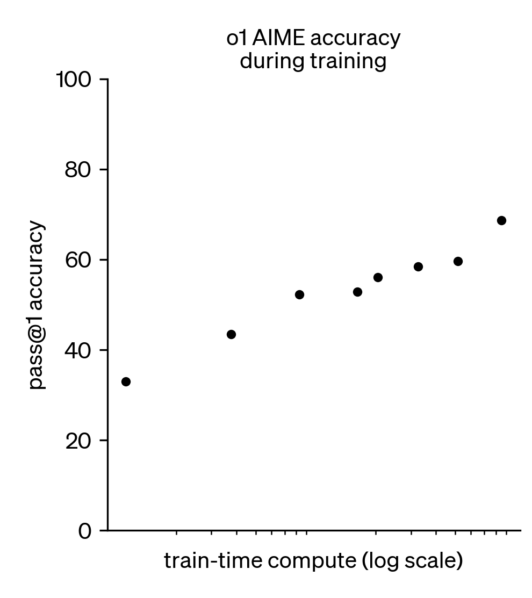


---

## Cursor Composer 1.5: RL scaling

<!-- img-align: center -->
<!-- cite-right: cursor2026composer15 -->

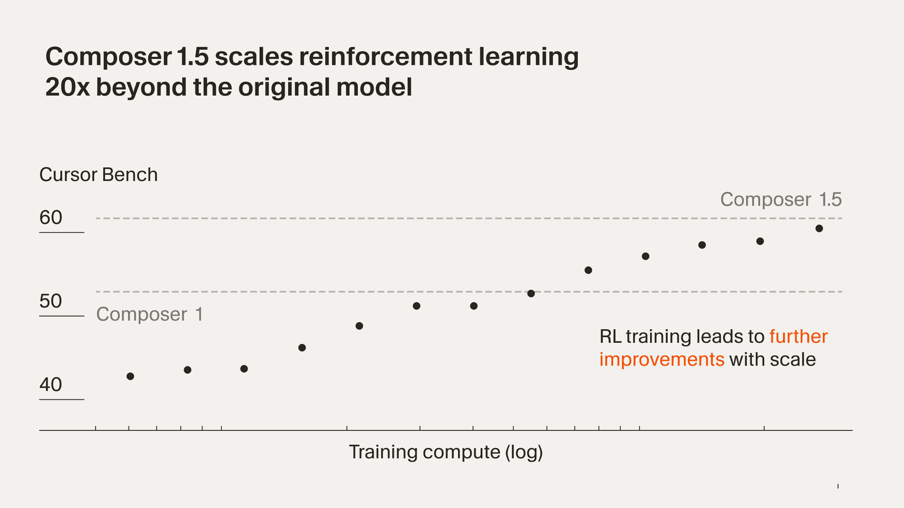

---

## DeepSeek-R1-Zero: RL scaling

<!-- img-align: center -->
<!-- cite-right: guo2025deepseek -->

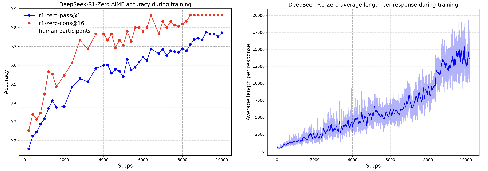

---

<!-- columns: 30/70 -->
## Olmo 3.1: extending the RL run

<!-- cite-right: teamolmo2025olmo3 -->

One of the few "fully open" large-scale RL runs to date.
- Training a general, 32B reasoning model.
- Full RL training took about **28 days on 224 GPUs**.
- Improvements in performance were very consistent across the run, in fact they were still going up when we had to stop it!

|||


---

## Where this leaves us

Post-training and RLHF are changing faster than maybe ever before.
- Language models are becoming "tool-use native" and are now about tools, harnesses (how you tell the model to use said tools), and much more than just weights
- RLHF and human preferences haven't gone away, but are evolving far more slowly and out of the central gaze of the industry
- Building language models and doing research is changing rapidly with coding agents

---

<!-- rows: 50/50 -->
## Lecture 1: Overview

<!-- row-columns: 34/33/33 -->

```box
title: Lecture 1
tone: accent
compact: true
content: |
  1. Introduction
  2. Key Related Works
  3. Training Overview
```

|||

```box
title: Core Training Pipeline
tone: muted
compact: true
content: |
  4. Instruction Tuning
  5. Reward Models
  6. Reinforcement Learning
  7. Reasoning
  8. Direct Alignment
  9. Rejection Sampling
```

|||

```box
title: Data & Preferences
tone: muted
compact: true
content: |
  10. What are Preferences
  11. Preference Data
  12. Synthetic Data & CAI
```

===

<!-- row-columns: 34/33/33 -->

```box
title: Practical Considerations
tone: muted
compact: true
content: |
  13. Tool Use
  14. Over-optimization
  15. Regularization
  16. Evaluation
  17. Product & Character
```

|||

```box
title: Appendices
tone: surface
compact: true
content: |
  - A. Definitions  
  - B. Style & Information  
  - C. Practical Issues  
```

|||

```box
title: Course Home
tone: surface
compact: true
content: |
  - rlhfbook.com
  - Shared references and future lecture decks live here
```

---

<!-- rows: 85/15 -->
## Thank you

Questions / discussion

Contact: nathan@natolambert.com

Newsletter: [interconnects.ai](https://www.interconnects.ai/)

**rlhfbook.com**

===


```builtwith
repo: natolambert/colloquium
```
