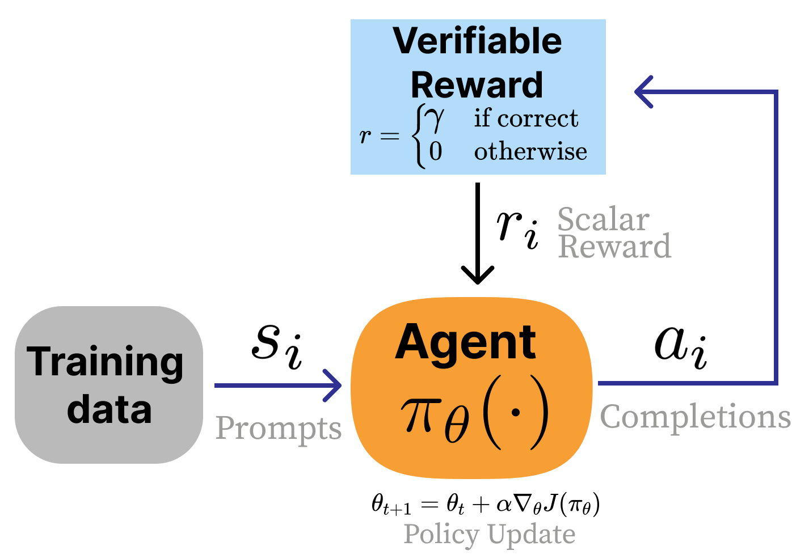
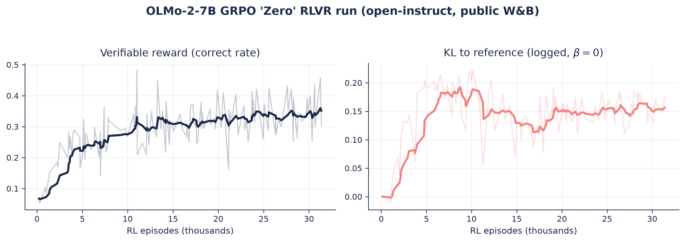
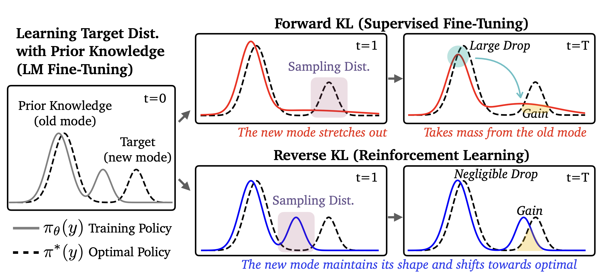
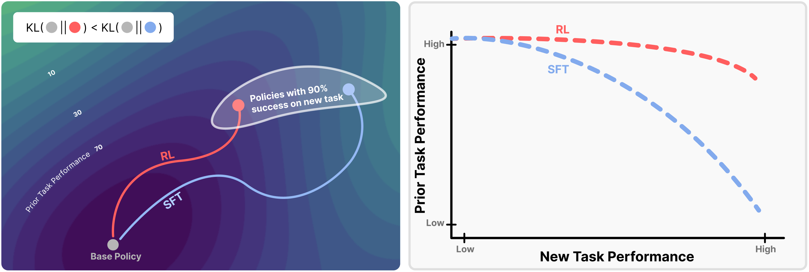
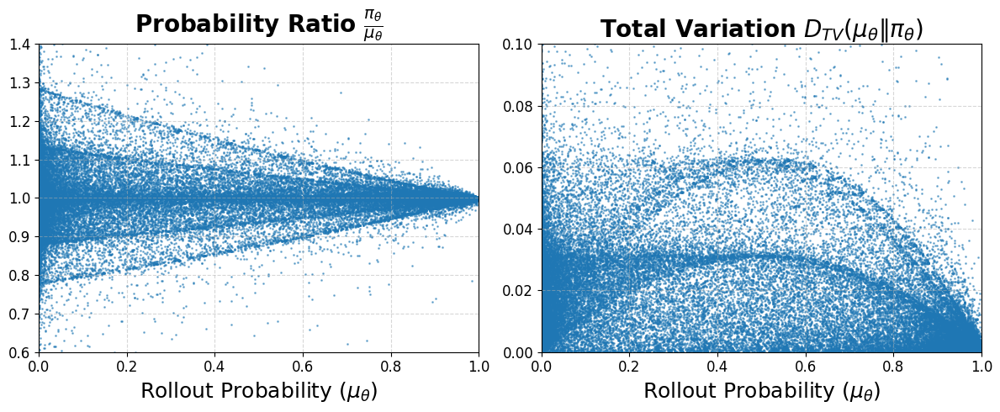

<!-- layout: title-sidebar -->
<!-- valign: bottom -->

# Lecture 10: Regularization in RL, Why RL Generalizes, and why SFT Forgets

<div class="colloquium-title-eyebrow">rlhfbook.com</div>

<div class="colloquium-title-meta">
<p class="colloquium-title-name">Nathan Lambert</p>
</div>

<p class="colloquium-title-note">Course on RLHF and post-training. Chapter 15.</p>

---

<!-- layout: section-break -->
<!-- align: center -->
<!-- valign: center -->

## How do these optimizers change the distributions of the models? How do we control it?

---

<!-- columns: 45/55 -->
<!-- valign: center -->
## Recall: the RLHF process

The RL step maximizes reward from the reward model **minus a penalty for drifting from the reference model**.

This lecture is about that penalty -- and what happens with and without it.

|||


---

<!-- columns: 50/50 -->
<!-- valign: center -->
## RLVR has regularization too, but different best practices

Same RL loop, different reward source: a verification function instead of a reward model.

Reasoning models (before tool use) often dropped the KL penalty to enhance learning.

With the emergence of large-scale tool-use, regularization is coming back into vogue -- but aimed at drift from the *sampling distribution*, not a KL penalty to a reference model (more on this at the end of the lecture).

|||



---

<!-- columns: 40/60 -->
## This lecture

How we control optimization pressures on models explicitly.

How the math of the optimizers we use changes the shapoes of the models.

|||

```box
title: The plan
tone: accent
content: |
  1. The **KL penalty** that controls RL
  2. **The two directions of KL divergences**
  3. **Why RL generalizes better than SFT**
  4. **Other related work**
```

---

<!-- columns: 50/50 -->
<!-- valign: center -->

## Aside: Watch lecture 9 first

```iframe
src: https://rlhfbook.com/teach/course/lec9-chap14-appb-overoptimization/
title: Lecture 9 slides
height: 300
style: "border:none;display:block;width:100%;aspect-ratio:16/9;height:auto"
```

[Slides](https://rlhfbook.com/teach/course/lec9-chap14-appb-overoptimization/) -- yes, these are the real slides, in a slide.

|||

```iframe
src: https://www.youtube.com/embed/y04JhXpiI4s?list=PLL1tdVxB1CpVpEtMHxwuR4uI4Lxjw00_y
title: Lecture 9 video
height: 300
style: "border:none;display:block;width:100%;aspect-ratio:16/9;height:auto"
```

[Watch on YouTube](https://www.youtube.com/watch?v=y04JhXpiI4s&list=PLL1tdVxB1CpVpEtMHxwuR4uI4Lxjw00_y)

---

<!-- layout: section-break -->
<!-- align: center -->

## Part 1: The explicit KL penalty

---

<!-- valign: center -->
<!-- animate: bullets -->
## A KL penalty to the reference model controls reward

The canonical LLM reward function:

$$ r = r_\theta - \lambda_{\text{KL}} \, D_{\mathrm{KL}}\!\left( \pi_{\text{RL}}(y \mid x) \,\|\, \pi_{\text{ref}}(y \mid x) \right) $$

- KL control for RL predates LLMs: dialogue agents [@jaques2017sequence], then fine-tuning pretrained models [@jaques2020human]. 
- This penalty is a **reverse KL** -- estimated by sampling from the *policy* and scoring against the reference. It punishes the policy for putting mass where the reference would not.
- "KL distance" is the *optimization distance* spent (colloquially -- KL is not a true metric).
- In practice, the above $\lambda$ is often written as $\beta$. 

---

<!-- columns: 45/55 -->
<!-- valign: center -->
## Measuring KL in practice

Sampling from $P$ turns the definition into an expectation:

$$ D_{\mathrm{KL}}(P \,\|\, Q) = \mathbb{E}_{x \sim P}\left[ \log P(x) - \log Q(x) \right] $$

- Practitioners watch the KL curve during training -- a very large KL usually means a bug or a broken model.
- Lower-variance estimators ($k_1, k_2, k_3$) came up in [Q&A 2](https://www.youtube.com/watch?v=gB-bYUECpzE&list=PLL1tdVxB1CpVpEtMHxwuR4uI4Lxjw00_y&index=11) [@schulman2020klapprox].

|||

```python
# sample from the policy
tokens = model.generate(inputs)

# score sampled tokens under both models
logprobs     = log_softmax(model.forward(tokens).logits)
ref_logprobs = log_softmax(ref_model.forward(tokens).logits)

# log-probs of the tokens actually generated
token_lp     = gather(logprobs, tokens)
ref_token_lp = gather(ref_logprobs, tokens)

# sequence-level difference approximates KL
kl_approx = token_lp.sum(-1) - ref_token_lp.sum(-1)
```

---

<!-- valign: center -->
## What the curves look like in a real run



An OLMo-2-7B GRPO run, RL directly on the *base* model (R1-Zero-style, no SFT), from open-instruct ([public W&B logs](https://wandb.ai/ai2-llm/open_instruct_public/reports/OLMo-2-7B-GRPO-Fast-Zero--VmlldzoxMjA0MjU4MQ)): over ~1M episodes the verifiable reward climbs while the logged KL to the reference rises and then wanders. This run has **β = 0**.
This is a healthy shape.

---

<!-- valign: center -->
<!-- cite-right: ziegler2019fine -->
<!-- animate: bullets -->

## Static or dynamic KL penalties? β began as a feedback controller

The first RLHF-on-LMs paper did not fix β. It picked a **target KL** and let a controller chase it:

$$ e_t = \operatorname{clip}\!\left( \frac{\mathrm{KL}(\pi_t, \pi_{\text{ref}}) - \mathrm{KL}_{\text{target}}}{\mathrm{KL}_{\text{target}}},\, -0.2,\, 0.2 \right), \qquad \beta_{t+1} = \beta_t \left(1 + K_\beta\, e_t\right) $$

- A "log-space proportional controller" (their words), with $K_\beta = 0.1$: KL too high → β grows and pulls the policy back; too low → β shrinks and frees it up. Runs with different seeds land on the *same* KL budget, making experiments comparable.
- The idea is older than RLHF: PPO's original **adaptive KL penalty** variant doubled or halved β around a target [@schulman2017proximal], and constrained RL later made the controls framing explicit with full **PID controllers** on the penalty multiplier [@stooke2020responsive].
- Modern practice swung back to a small **static** β -- or, in many RLVR reasoning recipes, no KL term at all.

---

<!-- valign: center -->
<!-- cite-right: ziegler2019fine -->

## Static or dynamic KL penalties? β began as a feedback controller

The first RLHF-on-LMs paper did not fix β. It picked a **target KL** and let a controller chase it:

$$ e_t = \operatorname{clip}\!\left( \frac{\mathrm{KL}(\pi_t, \pi_{\text{ref}}) - \mathrm{KL}_{\text{target}}}{\mathrm{KL}_{\text{target}}},\, -0.2,\, 0.2 \right), \qquad \beta_{t+1} = \beta_t \left(1 + K_\beta\, e_t\right) $$

Read the code: [the original controller](https://github.com/openai/lm-human-preferences/blob/cbfd210bb8b08f6bc5c26878c10984b90f516c66/lm_human_preferences/train_policy.py#L115-L124) (lm-human-preferences, 2019) · [TRL's `AdaptiveKLController`](https://github.com/huggingface/trl/blob/v0.11.4/trl/trainer/utils.py#L54-L69) (v0.11.4 -- deleted in the modern rewrite) · [open-instruct today](https://github.com/allenai/open-instruct/blob/5b2ebfa12381925bb431845d588dbc9ebead20a7/open_instruct/grpo_utils.py#L104-L105): a static `beta = 0.05`, [applied directly in the loss](https://github.com/allenai/open-instruct/blob/5b2ebfa12381925bb431845d588dbc9ebead20a7/open_instruct/grpo_fast.py#L718).

---

<!-- layout: section-break -->
<!-- align: center -->

## Part 2: RL optimization is a reverse KL minimization

---

<!-- valign: center -->
## The reward penalty and the optimization shape are two different things

We started with a **penalty** on the RL setup: a term added to the reward, with a coefficient you tune (or control). You can turn it off.

This next part is about the **shape of RL optimization** and how it relates to KL as well.
It comes down to "which direction of KL" -- that is set by *where the samples come from*:

<!-- step -->

- **SFT** samples from *data (or a separate teacher model)* → minimizing its loss is exactly minimizing a **forward** KL.
- **RL** samples from *itself* → *with* the penalty on, maximizing the objective is exactly a **reverse-KL minimization** toward a reward-tilted reference. This is only true with the KL penalty in the optimization (does not apply to all RLVR results)... but on-policy sampling still *biases* RL toward KL-minimal solutions. More on that later.

---

<!-- valign: top -->
<!-- title: center -->
<!-- cite-right: chen2025retainingdoingroleonpolicy -->
## RL is reverse KL

Start from the KL-regularized objective (the one our RL trainers optimize):

$$
\max_\pi\; \mathcal{J}_{\text{RL}}(\theta) = \mathbb{E}_{x \sim \mathcal{D},\, y \sim \pi(\cdot \mid x)}\left[ r(x, y) \right] - \beta\, D_{\mathrm{KL}}\!\left(\pi(\cdot \mid x) \,\|\, \pi_{\text{ref}}(\cdot \mid x)\right)
$$

<!-- step -->

Dividing by $-\beta$ and normalizing turns the objective into a single KL -- minimized exactly when $\pi$ equals the optimal policy $\pi_\star$. Lecture 6 walked this same path (the starting point of DPO):

$$ \pi_\star(y \mid x) = \frac{1}{Z(x)}\, \pi_{\text{ref}}(y \mid x)\, \exp\!\left(\tfrac{1}{\beta}\, r(x,y)\right) $$

<!-- step -->

Read $\pi_\star$ as the **reward-tilted reference**: take $\pi_{\text{ref}}$ and multiply each completion's probability by $\exp(r/\beta)$, then renormalize (that is all $Z(x)$ does). The "tilt" shifts probability mass toward high-reward completions while staying inside the reference's support -- large $\beta$ tilts barely at all, small $\beta$ concentrates on the highest-reward completions.

---

<!-- valign: top -->
<!-- title: center -->
<!-- class: math-steps -->
<!-- cite-right: chen2025retainingdoingroleonpolicy -->
## RL is reverse KL

Now expand the reverse KL to $\pi_\star$, substituting $\log \pi_\star = \log \pi_{\text{ref}} - \log Z(x) + \tfrac{1}{\beta} r(x,y)$:

$$ D_{\mathrm{KL}}(\pi_\theta \,\|\, \pi_\star) = \mathbb{E}_{x \sim \mathcal{D},\, y \sim \pi_\theta}\left[ \log \pi_\theta(y \mid x) - \log \pi_\star(y \mid x) \right] \qquad \text{definition; samples from } \pi_\theta $$

<!-- step -->

$$ \phantom{D_{\mathrm{KL}}(\pi_\theta \,\|\, \pi_\star)} = \mathbb{E}_{x \sim \mathcal{D},\, y \sim \pi_\theta}\left[ \log \pi_\theta - \log \pi_{\text{ref}} + \log Z(x) - \tfrac{1}{\beta}\, r(x,y) \right] \qquad \text{substitute } \log \pi_\star $$

<!-- step -->

$$ \phantom{D_{\mathrm{KL}}(\pi_\theta \,\|\, \pi_\star)} = -\tfrac{1}{\beta}\,\mathbb{E}\left[r(x,y)\right] + D_{\mathrm{KL}}\!\left(\pi_\theta \,\|\, \pi_{\text{ref}}\right) + \underbrace{\log Z(x)}_{\text{constant}} \qquad \text{regroup the terms} $$

<!-- step -->

$$ \phantom{D_{\mathrm{KL}}(\pi_\theta \,\|\, \pi_\star)} \propto -\tfrac{1}{\beta}\, \mathcal{J}_{\text{RL}}(\theta) \qquad \text{drop the constant} $$

<!-- step -->

$$ \boxed{\ \max_\theta\, \mathcal{J}_{\text{RL}}(\theta) \iff \min_\theta\, D_{\mathrm{KL}}(\pi_\theta \,\|\, \pi_\star)\ } $$

With the penalty included, RL doesn't just *use* a reverse KL -- the whole objective **is** one, pointed at the reward-tilted reference policy.

---

<!-- valign: top -->
<!-- title: center -->
## SFT is forward KL

Now the comparison point. SFT trains on a fixed dataset -- the samples come from the *data distribution*, call it $\pi_{\mathcal{D}}$, which makes it the other KL direction:

$$
\begin{aligned}
D_{\mathrm{KL}}(\pi_{\mathcal{D}} \,\|\, \pi_\theta) &= \mathbb{E}_{(x,y) \sim \mathcal{D}} \left[ \log \pi_{\mathcal{D}}(y \mid x) - \log \pi_\theta(y \mid x) \right] && \text{definition; samples are the data}
\end{aligned}
$$

<!-- step -->

$$
\begin{aligned}
&= \underbrace{\mathbb{E}_{(x,y) \sim \mathcal{D}}\left[ \log \pi_{\mathcal{D}}(y \mid x) \right]}_{-H(\pi_{\mathcal{D}}),\ \text{constant in } \theta} \; - \; \mathbb{E}_{(x,y) \sim \mathcal{D}}\left[ \log \pi_\theta(y \mid x) \right] && \text{split the expectation}
\end{aligned}
$$

<!-- step -->

$$
\begin{aligned}
&= -H(\pi_{\mathcal{D}}) + \mathcal{L}_{\text{SFT}}(\theta) \;\propto\; \boxed{\ \mathcal{L}_{\text{SFT}}(\theta)\ } && \text{the NLL term is the SFT loss}
\end{aligned}
$$

Same gradients, same minimum: minimizing the SFT loss *is* minimizing forward KL to the data distribution.

---

<!-- rows: 18/82 -->
## SFT and RL are the two directions of KL

This is very reminiscent of Lecture 7 (on-policy distillation), with both directions of KL at play. Post-training math repeats itself.:

===

<!-- row-columns: 50/50 -->
**Forward KL** -- supervised fine-tuning (aka standard KL):

$$ D_{\mathrm{KL}}(\pi_{\mathcal{D}} \,\|\, \pi_\theta) = \mathbb{E}_{y \sim \pi_{\mathcal{D}}}\!\left[\log \tfrac{\pi_{\mathcal{D}}(y)}{\pi_\theta(y)}\right] $$

Samples come from the **target** (a fixed dataset). 

*Mass-covering*: wherever the target has mass and $\pi_\theta \to 0$, the loss blows up -- the model must spread to cover everything.

|||

<!-- step -->

**Reverse KL** -- reinforcement learning:

$$ D_{\mathrm{KL}}(\pi_\theta \,\|\, \pi_\star) = \mathbb{E}_{y \sim \pi_\theta}\!\left[\log \tfrac{\pi_\theta(y)}{\pi_\star(y)}\right] $$

Samples come from the **policy itself**. 

*Mode-seeking*: only penalized where it places mass, so it concentrates on high-reward modes.

---

<!-- rows: 18/82 -->
## Recall, Lecture 7: the same two directions in distillation

The distillation version, verbatim from Lecture 7 -- teacher $\pi_T$ in place of the target. Sampling completions from the student is what puts $\pi_\theta$ on the **left** of the KL:

===

<!-- row-columns: 50/50 -->
**Offline KD / SFT** (forward KL) -- the expectation is over the *teacher*, $z \sim \pi_T$ (**off-policy**: a fixed teacher dataset):

$$ D_{\mathrm{KL}}(\pi_T \,\|\, \pi_\theta) = \mathbb{E}_{z \sim \pi_T}\!\left[\log\frac{\pi_T(z)}{\pi_\theta(z)}\right] $$

*Mass-covering* -- weighted by **teacher** mass: wherever the teacher has mass and $\pi_\theta \to 0$, the log-ratio blows up, so the student must cover *everything* the teacher might say.

|||

<!-- step -->

**On-policy distillation** (reverse KL) -- the expectation is over the *student*, $z \sim \pi_\theta$ (**on-policy**: you sample the model you're training):

$$ D_{\mathrm{KL}}(\pi_\theta \,\|\, \pi_T) = \mathbb{E}_{z \sim \pi_\theta}\!\left[\log\frac{\pi_\theta(z)}{\pi_T(z)}\right] $$

*Mode-seeking* -- weighted by the **student's** own mass: penalized only where *it* puts probability the teacher dislikes, so it collapses onto the teacher's modes. Lecture 7 deferred *why reverse KL is better* to this lecture.

---

<!-- layout: section-break -->
<!-- align: center -->

## Part 3: Why RL generalizes more

---

<!-- valign: center -->
<!-- cite-right: chu2025sft -->
## "SFT memorizes, RL generalizes"

Controlled study: post-train on one task, evaluate under a rule shift [@chu2025sft].

- **GeneralPoints**: reach 24 from four cards; shift the face-card rule (train: J/Q/K = 10; test: 11/12/13).
- **V-IRL**: visual navigation; shift from absolute (north/east) to relative (left/right) directions.

On V-IRL, RL improves out-of-distribution accuracy **80.8% → 91.8%**. SFT collapses it **80.8% → 1.3%** -- destroying spatial reasoning the base model already had.

RL-based post-training carries *implicit* regularization from its on-policy structure alone.

Paper: [arxiv.org/abs/2501.17161](https://arxiv.org/abs/2501.17161)

---

<!-- valign: center -->
## Which direction should forget less?

The naive read: forward KL is *mass-covering*, so SFT should preserve every mode -- while mode-seeking RL should collapse onto one and forget the rest.

Is this correct?

---

<!-- img-fill -->
<!-- valign: center -->
<!-- cite-right: chen2025retainingdoingroleonpolicy -->
## Which direction should forget less?

That intuition assumes a unimodal policy -- LLMs are multimodal. Paper: [arxiv.org/abs/2510.18874](https://arxiv.org/abs/2510.18874)



---

<!-- rows: 52/48 -->
<!-- valign: center -->
<!-- cite-right: shenfeld2026rls -->
## RL's razor: Lower KL drift for equivalent performance

> *"Among the many high-reward solutions for a new task, on-policy methods such as RL are inherently biased toward solutions that remain closer to the original policy in KL divergence."* [@shenfeld2026rls]

- Forgetting tracks KL drift: $\text{Forgetting} \approx f\!\left(\mathbb{E}_{x \sim \tau}\!\left[D_{\mathrm{KL}}\!\left(\pi_0 \,\|\, \pi\right)\right]\right)$ with $R^2 = 0.96$ -- measured on the **new task's data**. A cheap forgetting predictor.
- The ablation: **on-policy data fully accounts for the difference** -- negative gradients have no discernible effect. Paper: [arxiv.org/abs/2509.04259](https://arxiv.org/abs/2509.04259)

===



---

<!-- layout: section-break -->
<!-- align: center -->

## Part 4: Other tools to control optimization

---

<!-- valign: center -->
<!-- animate: bullets -->
## Other regularization in the wild

Most of these are scaffolding: added to stabilize one setup, simplified away in the next model generation.

- **Pretraining next-token pred. gradients** (InstructGPT): add $\gamma\, \mathbb{E}_{x \sim \mathcal{D}_{\text{pretrain}}}\left[\log \pi_{\text{RL}}(x)\right]$ to the objective, "to fix the performance regressions on public NLP datasets" [@ouyang2022training].
- **NLL alongside DPO**: $\mathcal{L}_{\text{DPO+NLL}} = \mathcal{L}_{\text{DPO}} + \alpha\, \mathcal{L}_{\text{NLL}}$ keeps the chosen text high-likelihood in absolute terms, not just relatively better [@pang2024iterative].
- **Margin loss** for reward models (Llama 2): $-\log \sigma\!\left(r_{\theta}(y_c) - r_{\theta}(y_r) - m(y_c, y_r)\right)$, where the margin $m$ comes from annotator rating deltas -- **the Likert scales from Lecture 8** [@touvron2023llama].


---

<!-- valign: center -->
<!-- animate: bullets -->
## 2026: the trust region / kl pen. is moving on

Tool use is changing what regularization has to do. In agentic recipes, the KL-to-reference penalty is disappearing:

- GLM-5 removes it outright -- "to accelerate RL improvement" [@glm5team2026glm5]. Kimi does not use one either: the K2 → K3 recipes ship with no KL penalty and no reference policy at all [@moonshot2026kimik3].
- In our TMax terminal-agent recipe we measured the trade-off: a small KL reduced the severity of collapse but lowered reward, so the final recipe is $\beta = 0$ [@ivison2026tmax].
- Why tool use forces the change: 20+ turn trajectories, async/partial rollouts, and train-vs-inference engine mismatch make drift from the *sampler* the binding failure, not drift from init. (In TMax, instabilities increase past 10 assistant turns and were absent below 5 [@ivison2026tmax].)

---

<!-- rows: 22/78 -->
<!-- valign: center -->
<!-- cite-right: qi2026dppo -->
## A trust region on the sampling distribution

**DPPO** (Divergence Proximal Policy Optimization) masks tokens by a *directly estimated* divergence between the rollout and training policies (binary TV), instead of PPO's per-token ratio clip [@qi2026dppo].

===

<!-- row-columns: 55/45 -->
- The per-token ratio is a noisy one-sample estimate of that divergence. GLM's IcePop [@glm5team2026glm5] and Kimi's log-ratio interval [@moonshot2026kimik3] do the same job: gradients masked, not clipped.
- This is not the reference-anchored reverse KL from this lecture -- it is **drift control against the sampling distribution**, a trust region on each update rather than a penalty in the objective.

|||



---

<!-- valign: center -->
## Takeaways

- The KL penalty is the explicit control: a **reverse KL**, estimated on the policy's own samples. 
- The KL-regularized RL objective is a reverse KL minimization -- mode-seeking toward a reward-shaped reference policy -- while SFT is the forward direction, mass-covering toward the data.
- Even with no penalty, on-policy RL is implicitly regularized -- SFT memorizes, RL generalizes. 

---

<!-- valign: center -->
## The course so far

0. Prerequisites review
1. Overview *(ch. 1-3)*
2. IFT, Reward Models & Rejection Sampling *(ch. 4, 5, 9)*
3. RL: Motivation & Math *(ch. 6)*
4. RL: Implementation & Practice *(ch. 6)*
5. The Rise of Reasoning Models *(ch. 7)*
6. Direct Preference Optimization *(ch. 8)*
7. Synthetic Data & Modern Post-training *(ch. 12)*
8. Preferences & Preference Data *(ch. 10-11)*
9. Over-Optimization & RLHF's Bad Reputation *(ch. 14, app. B)*
10. **Regularization** *(ch. 15)* -- *today*
11. **Evaluation** *(ch. 16)* -- *next (tentative)*
12. **Basics of tool-use** *(ch. 13)* -- hopefully?

---

<!-- rows: 85/15 -->
## Thank you

Questions / discussion are encouraged!

If you have a second to subscribe and/or share my content with a friend, it helps massively on getting the word out.

Contact: nathan@natolambert.com

Newsletter: [interconnects.ai](https://www.interconnects.ai/)

**rlhfbook.com**

===

```builtwith
repo: natolambert/colloquium
```
