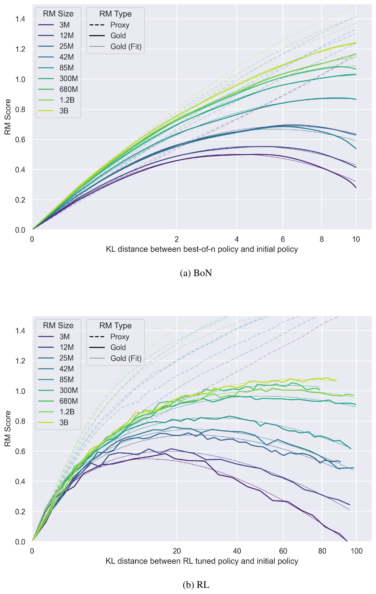

<!-- layout: title-sidebar -->
<!-- valign: bottom -->

# Lecture 10: Regularization Tools and The Mechanics of SFT vs. RL

<div class="colloquium-title-eyebrow">rlhfbook.com</div>

<div class="colloquium-title-meta">
<p class="colloquium-title-name">Nathan Lambert</p>
</div>

<p class="colloquium-title-note">Course on RLHF and post-training. Chapter 15.</p>

---

<!-- layout: section-break -->
<!-- align: center -->
<!-- valign: center -->

## How much should we let the model change to earn more reward?

---

<!-- img-fill -->
<!-- img-align: center -->
<!-- valign: center -->
<!-- cite-right: gao2023scaling -->
## Recall Lecture 9: the x-axis was KL



---

<!-- columns: 40/60 -->
## This lecture

Over-optimization is unavoidable -- regularization is how we keep it under control.

The spine of this lecture: in RL post-training, nearly every objective points the KL in the *same direction*.

|||

```box
title: The plan
tone: accent
content: |
  1. The **explicit KL penalty** -- the workhorse, and how to measure it
  2. **Implicit regularization** -- why RL forgets less than SFT
  3. **Other tools** -- pretraining gradients, NLL terms, reward margins
```

---

<!-- valign: center -->
## What "off the rails" looks like

Without regularization, strong optimizers push language models into:

- Fluent-looking reasoning with extremely incorrect answers
- Repeated text and excessive special characters
- **Language switching** mid-generation -- recall Lecture 5: R1-Zero mixed languages while reasoning, and labs added language-consistency rewards to stop it

Regularization is the difference between healthy RL training and these failure modes.

---

<!-- layout: section-break -->
<!-- align: center -->

## Part 1: The explicit KL penalty

---

<!-- valign: center -->
## The workhorse: a KL penalty to the reference

$$ r = r_\theta - \lambda_{\text{KL}} \, D_{\mathrm{KL}}\!\left( \pi_{\text{RL}}(y \mid x) \,\|\, \pi_{\text{ref}}(y \mid x) \right) $$

- KL control predates LLMs: dialogue agents [@jaques2017sequence], then fine-tuning pretrained models [@jaques2020human]. Lecture 3 covered the per-token mechanics ($\tilde{r}_t = -\beta\,\text{KL}_t$).
- Note the direction: this penalty is a **reverse KL** -- estimated by sampling from the *policy* and scoring against the reference. It punishes the policy for putting mass where the reference would not.
- "KL distance" is the *optimization distance* spent (colloquially -- KL is not a true metric). The x-axis of the over-optimization curves **is** this quantity.

---

<!-- columns: 45/55 -->
<!-- valign: center -->
## Measuring KL in practice

Sampling from $P$ turns the definition into an expectation:

$$ D_{\mathrm{KL}}(P \,\|\, Q) = \mathbb{E}_{x \sim P}\left[ \log P(x) - \log Q(x) \right] $$

- Practitioners watch the KL curve during training -- a very large KL usually means a bug or a broken model.
- Lower-variance estimators ($k_1, k_2, k_3$) came up in Q&A 2 [@schulman2020klapprox].

|||

```python
# sample from the policy
tokens = model.generate(inputs)

# score sampled tokens under both models
logprobs     = log_softmax(model.forward(tokens).logits)
ref_logprobs = log_softmax(ref_model.forward(tokens).logits)

# log-probs of the tokens actually generated
token_lp     = gather(logprobs, tokens)
ref_token_lp = gather(ref_logprobs, tokens)

# sequence-level difference approximates KL
kl_approx = token_lp.sum(-1) - ref_token_lp.sum(-1)
```

---

<!-- layout: section-break -->
<!-- align: center -->

## Part 2: Implicit regularization

---

<!-- valign: center -->
<!-- cite-right: chu2025sft -->
## Even with no penalty: "SFT memorizes, RL generalizes"

Controlled study: post-train on one task, evaluate under a rule shift [@chu2025sft].

- **GeneralPoints**: reach 24 from four cards; shift the face-card rule (train: J/Q/K = 10; test: 11/12/13).
- **V-IRL**: visual navigation; shift from absolute (north/east) to relative (left/right) directions.

On V-IRL, RL improves out-of-distribution accuracy **80.8% → 91.8%**. SFT collapses it **80.8% → 1.3%** -- destroying spatial reasoning the base model already had.

RL-based post-training carries *implicit* regularization from its on-policy structure alone.

---

<!-- columns: 50/50 -->
## SFT and RL are the two directions of KL

Recall the frame from Lecture 7 (on-policy distillation):

**Forward KL** -- supervised fine-tuning:

$$ D_{\mathrm{KL}}(\pi_\star \,\|\, \pi_\theta) = \mathbb{E}_{y \sim \pi_\star}\!\left[\log \tfrac{\pi_\star(y)}{\pi_\theta(y)}\right] $$

Samples come from the **target** (a fixed dataset). *Mass-covering*: wherever the target has mass and $\pi_\theta \to 0$, the loss blows up -- the model must spread to cover everything.

|||

**Reverse KL** -- reinforcement learning:

$$ D_{\mathrm{KL}}(\pi_\theta \,\|\, \pi_\star) = \mathbb{E}_{y \sim \pi_\theta}\!\left[\log \tfrac{\pi_\theta(y)}{\pi_\star(y)}\right] $$

Samples come from the **policy itself**. *Mode-seeking*: only penalized where it places mass, so it concentrates on high-reward modes.

Chapter 12 promised the *why reverse KL is better* in chapter 15 -- here it is.

---

<!-- valign: top -->
<!-- title: center -->
## SFT is forward KL

$$
\begin{aligned}
D_{\mathrm{KL}}(\pi_\star \,\|\, \pi_\theta) &= \mathbb{E}_{(x,y) \sim \mathcal{D}} \left[ \log \pi_\star(y \mid x) - \log \pi_\theta(y \mid x) \right] && \text{definition; samples are the data}
\end{aligned}
$$

<!-- step -->

$$
\begin{aligned}
&= \underbrace{\mathbb{E}_{(x,y) \sim \mathcal{D}}\left[ \log \pi_\star(y \mid x) \right]}_{-H(\pi_\star),\ \text{constant in } \theta} \; - \; \mathbb{E}_{(x,y) \sim \mathcal{D}}\left[ \log \pi_\theta(y \mid x) \right] && \text{split the expectation}
\end{aligned}
$$

<!-- step -->

$$
\begin{aligned}
&= -H(\pi_\star) + \mathcal{L}_{\text{SFT}}(\theta) \;\propto\; \boxed{\ \mathcal{L}_{\text{SFT}}(\theta)\ } && \text{the NLL term is the SFT loss}
\end{aligned}
$$

Same gradients, same minimum: minimizing the SFT loss *is* minimizing forward KL to the data distribution.

---

<!-- valign: top -->
<!-- title: center -->
## RL is reverse KL

Start from the KL-regularized objective (the one our RL trainers optimize):

$$
\max_\pi\; \mathcal{J}_{\text{RL}}(\theta) = \mathbb{E}_{x \sim \mathcal{D},\, y \sim \pi(\cdot \mid x)}\left[ r(x, y) \right] - \beta\, D_{\mathrm{KL}}\!\left(\pi(\cdot \mid x) \,\|\, \pi_{\text{ref}}(\cdot \mid x)\right)
$$

<!-- step -->

Dividing by $-\beta$ and normalizing the reward-tilted reference with $Z(x)$ turns the objective into a single KL -- minimized exactly when $\pi$ equals the tilted distribution. Lecture 6 walked this same path to the optimal policy (the starting point of DPO):

$$ \pi_\star(y \mid x) = \frac{1}{Z(x)}\, \pi_{\text{ref}}(y \mid x)\, \exp\!\left(\tfrac{1}{\beta}\, r(x,y)\right) $$

---

<!-- valign: top -->
<!-- title: center -->
## RL is reverse KL

Now expand the reverse KL to $\pi_\star$, substituting $\log \pi_\star = \log \pi_{\text{ref}} - \log Z(x) + \tfrac{1}{\beta} r(x,y)$:

$$
\begin{aligned}
D_{\mathrm{KL}}(\pi_\theta \,\|\, \pi_\star) &= \mathbb{E}_{x \sim \mathcal{D},\, y \sim \pi_\theta}\left[ \log \pi_\theta(y \mid x) - \log \pi_\star(y \mid x) \right] && \text{definition; samples from } \pi_\theta \\
&= \mathbb{E}_{x \sim \mathcal{D},\, y \sim \pi_\theta}\left[ \log \pi_\theta - \log \pi_{\text{ref}} + \log Z(x) - \tfrac{1}{\beta}\, r(x,y) \right] && \text{substitute } \log \pi_\star \\
&= -\tfrac{1}{\beta}\,\mathbb{E}\left[r(x,y)\right] + D_{\mathrm{KL}}\!\left(\pi_\theta \,\|\, \pi_{\text{ref}}\right) + \underbrace{\log Z(x)}_{\text{constant}} && \text{regroup the terms} \\
&\propto -\tfrac{1}{\beta}\, \mathcal{J}_{\text{RL}}(\theta) && \text{drop the constant}
\end{aligned}
$$

<!-- step -->

$$ \boxed{\ \max_\theta\, \mathcal{J}_{\text{RL}}(\theta) \iff \min_\theta\, D_{\mathrm{KL}}(\pi_\theta \,\|\, \pi_\star)\ } $$

SFT minimizes forward KL to the *data*; RL minimizes reverse KL to the *reward-tilted reference*.

---

<!-- valign: center -->
## Which direction should forget less?

The naive read: forward KL is *mass-covering*, so SFT should preserve every mode -- while mode-seeking RL should collapse onto one and forget the rest.

Sequential fine-tuning experiments say otherwise.

---

<!-- img-fill -->
<!-- valign: center -->
<!-- cite-right: chen2025retainingdoingroleonpolicy -->
## Which direction should forget less?

**The opposite holds.** That intuition assumes a unimodal policy -- LLMs are multimodal.


---

<!-- columns: 46/54 -->
<!-- valign: center -->
<!-- cite-right: shenfeld2026rls -->
## RL's razor

> *"Among the many high-reward solutions for a new task, on-policy methods such as RL are inherently biased toward solutions that remain closer to the original policy in KL divergence."* [@shenfeld2026rls]

- Forgetting tracks KL drift: $\text{Forgetting} \approx f\!\left(\mathbb{E}_{x \sim \tau}\!\left[D_{\mathrm{KL}}\!\left(\pi_0 \,\|\, \pi\right)\right]\right)$ with $R^2 = 0.96$ -- measured on the **new task's data**. A cheap forgetting predictor.
- The ablation: **on-policy data fully accounts for the difference** -- negative gradients have no discernible effect.

|||


---

<!-- layout: section-break -->
<!-- align: center -->

## Part 3: Other regularization tools

---

<!-- valign: center -->
## Other regularization in the wild

- **Pretraining gradients** (InstructGPT): add $\gamma\, \mathbb{E}_{x \sim \mathcal{D}_{\text{pretrain}}}\left[\log \pi_{\text{RL}}(x)\right]$ to the objective, "to fix the performance regressions on public NLP datasets" [@ouyang2022training].
- **NLL alongside DPO**: $\mathcal{L}_{\text{DPO+NLL}} = \mathcal{L}_{\text{DPO}} + \alpha\, \mathcal{L}_{\text{NLL}}$ keeps the chosen text high-likelihood in absolute terms, not just relatively better [@pang2024iterative].
- **Margin loss** for reward models (Llama 2): $-\log \sigma\!\left(r_{\theta}(y_c) - r_{\theta}(y_r) - m(y_c, y_r)\right)$, where the margin $m$ comes from annotator rating deltas -- **the Likert scales from Lecture 8** [@touvron2023llama].

Most of these are scaffolding: added to stabilize one setup, simplified away in the next model generation.


---

<!-- columns: 50/50 -->
## Recap: keeping the policy close

Every RL-side objective in this lecture points the KL the same way: sampled from the model, scored against a target.

|||

```box
title: Three kinds of control
tone: accent
content: |
  1. **Explicit** -- the reverse-KL penalty to the reference (the workhorse)
  2. **Implicit** -- on-policy sampling alone biases RL toward KL-minimal solutions
  3. **Auxiliary** -- pretraining gradients, NLL terms, reward margins
```

---

<!-- valign: center -->
## Takeaways

- The KL penalty is the explicit control: a **reverse KL**, estimated on the policy's own samples. Watch the KL curve during training.
- Even with no penalty, on-policy RL is implicitly regularized -- SFT memorizes, RL generalizes.
- Forgetting tracks KL drift (RL's razor), and **on-policy data** -- not negative gradients -- is why RL forgets less.
- Most other regularizers are scaffolding: they stabilize one setup and disappear in the next generation.

---

<!-- columns: 50/50 -->
## Where to go deeper

Regularization is where RLHF practice earns its stability -- these are the references people reach for when debugging real runs.

|||

```box
title: Go deeper
tone: surface
content: |
  - [**RL's Razor**](https://openreview.net/forum?id=7HNRYT4V44) -- why on-policy forgets less.
  - [**SFT Memorizes, RL Generalizes**](https://arxiv.org/abs/2501.17161) -- the OOD study.
  - [**Approximating KL Divergence**](http://joschu.net/blog/kl-approx.html) -- the k1/k2/k3 estimators.
  - Book chapter 15.
```

---

<!-- valign: center -->
## The course so far

0. Prerequisites review
1. Overview *(ch. 1-3)*
2. IFT, Reward Models & Rejection Sampling *(ch. 4, 5, 9)*
3. RL: Motivation & Math *(ch. 6)*
4. RL: Implementation & Practice *(ch. 6)*
5. The Rise of Reasoning Models *(ch. 7)*
6. Direct Preference Optimization *(ch. 8)*
7. Synthetic Data & Modern Post-training *(ch. 12)*
8. Preferences & Preference Data *(ch. 10-11)*
9. Over-Optimization & RLHF's Bad Reputation *(ch. 14, app. B)*
10. **Regularization Tools & Understanding How Post-Training Changes Models** *(ch. 15)* -- *today*
11. **Evaluation** *(ch. 16)* -- *next (tentative)*

---

<!-- rows: 85/15 -->
## Thank you

Questions / discussion

Contact: nathan@natolambert.com

Newsletter: [interconnects.ai](https://www.interconnects.ai/)

**rlhfbook.com**

===

```builtwith
repo: natolambert/colloquium
```
