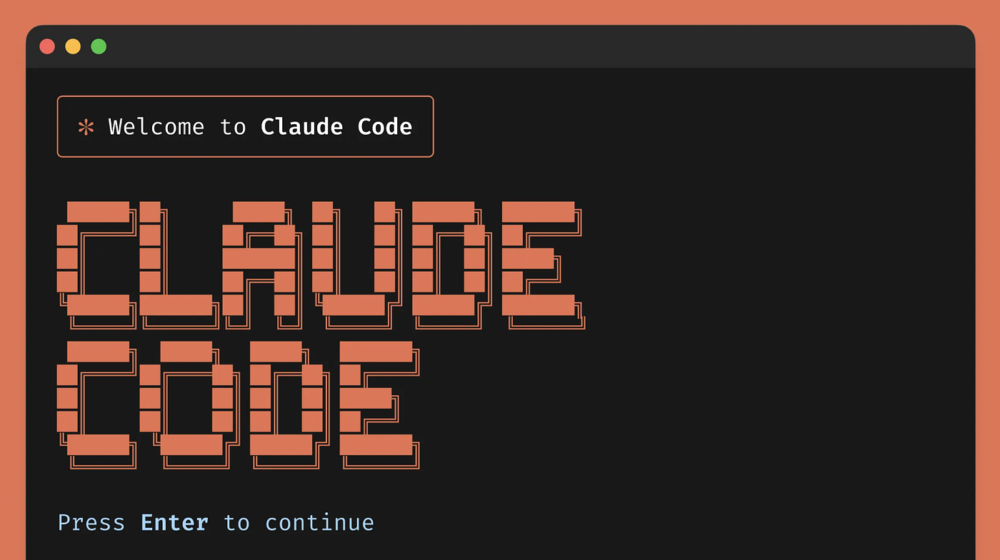
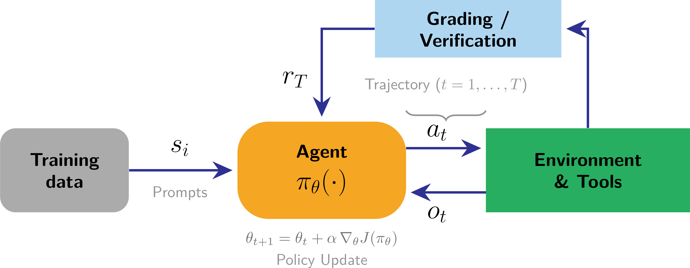
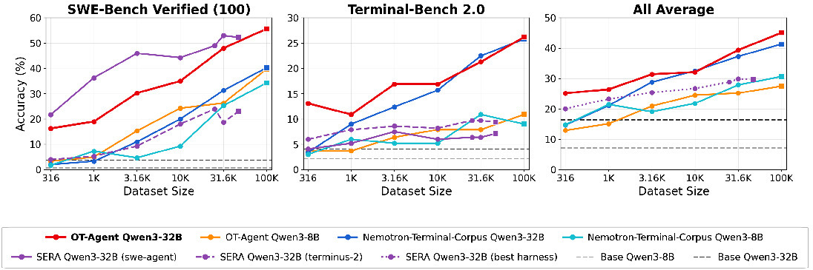
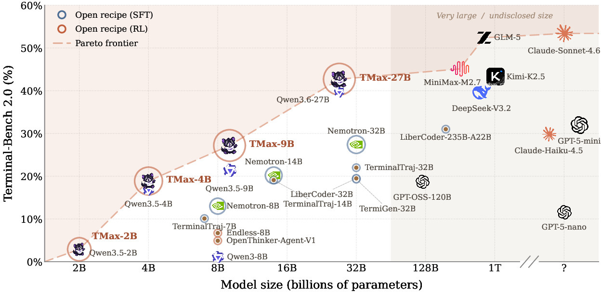

<!-- layout: title-sidebar -->
<!-- valign: bottom -->

# Lecture 11: Tool Use, Function Calling and The Road to Agents

<div class="colloquium-title-eyebrow">rlhfbook.com</div>

<div class="colloquium-title-meta">
<p class="colloquium-title-name">Nathan Lambert</p>
</div>

<p class="colloquium-title-note">Course on RLHF and post-training. Chapter 13.</p>

---

<!-- layout: section-break -->
<!-- align: center -->
<!-- valign: center -->

## What can a language model *not* do with weights alone?

---

<!-- columns: 45/55 -->
<!-- valign: center -->
## Two asks, two failure modes

```conversation
size: 0.85
messages:
  - role: user
    content: |
      Who is the president today?
  - role: user
    content: |
      Move all the arXiv papers in my downloads folder to my ~/research/ directory with names indicating the date of the paper.
```

|||

The first fails on the **knowledge cutoff** -- but it is one search query away.

The second, the weights *cannot even attempt*: it requires acting on the world, not describing it.

Tool use is what closes both gaps. And crucially, it is a **trained skill**, not an emergent freebie -- everything in this course (SFT, preference tuning, RL) applies to it.

---

<!-- columns: 50/50 -->
<!-- valign: center -->
<!-- cite-right: anthropic2025claudecode, tbench2026 -->
## Where this landed by 2026

Tool use started as "call a calculator." It is now the substrate of the frontier products:

- Coding and terminal agents (Claude Code, Cursor) doing hours of autonomous work
- Deep research, computer use, productivity copilots
- The hardest current evals are *end-to-end tasks in containers*, not multiple-choice questions

Today: from the basics to why *training* this at scale is one of the hardest open problems in post-training.

|||



---

<!-- columns: 40/60 -->
## This lecture

Chapter 13 covers the mechanics of tool use. The last third of today goes *beyond the book*: what it takes to train these skills with RL at scale.

|||

```box
title: The plan
tone: accent
content: |
  1. **Basics & history** -- why models need tools, and the foundational work
  2. **The plumbing** -- interleaved generation, MCP, harnesses, implementation trade-offs
  3. **Training at scale** -- tool-use RL and why it's hard *(TMax, OpenThoughts-Agent)*
```

---

<!-- layout: section-break -->
<!-- align: center -->

## Part 1: Why language models need tools

---

<!-- valign: center -->
## Three terms people conflate

- **Tool use**: the model emits a structured request (tool name + arguments); an orchestrator executes it; results are appended to the context; the model continues generating.
- **Function calling**: tool use where arguments must conform to a *declared schema* (usually JSON Schema), enabling reliable parsing and validation.
- **Code execution**: the special case where the tool is a code interpreter -- the most general tool of all.

Each is a subset of the one above it. The training problem is the same shape for all three: emit the right structure, at the right time, and use the result.

---

<!-- columns: 38/62 -->
<!-- valign: center -->
## Escaping probabilistic generation

Print $\pi$ to 50 digits -- *without* reciting it from memory and risking hallucination.

The model writes the program; the interpreter provides the truth. Tools let a probabilistic generator return **precise** answers.

|||

```text
<code>
# Chudnovsky algorithm for pi
from decimal import Decimal, getcontext
getcontext().prec = 60
C = 426880 * Decimal(10005).sqrt()
K, M, X, L, S = 0, 1, 1, 13591409, Decimal(13591409)
for i in range(1, 100):
    M = M * (K**3 - 16*K) // i**3
    K += 12; L += 545140134
    X *= -262537412640768000
    S += Decimal(M * L) / X
print(str(C / S)[:52])
</code>

<output>
3.14159265358979323846264338327950288419716939937510
</output>
```

---

<!-- animate: bullets -->
## A short history of models using tools

- **2015--2020, precursors**: Neural Programmer-Interpreters execute programs with neural networks [@reed2015neural]; retrieval augmentation pulls in outside knowledge [@lewis2020retrieval]
- **2021**: WebGPT browses the web, trained with human feedback [@nakano2021webgpt]
- **2022**: TALM bootstraps tool-augmented training data [@parisi2022talm]; PAL offloads computation to Python [@gao2023pal]; ReAct interleaves reasoning and actions [@yao2023react]
- **2023**: Toolformer teaches itself APIs [@schick2023toolformerlanguagemodelsteach]; Gorilla scales to 1,645 APIs [@patil2023gorilla]; ToolLLM to 16,000+ [@qin2023toollm]; OpenAI ships function calling and Code Interpreter
- **2024**: Model Context Protocol standardizes the interface [@anthropic_mcp_2024]
- **2025**: o3 makes multistep tool calls *inside* its reasoning [@openai2025o3]
- **2026**: terminal and coding agents become the frontier of post-training [@tbench2026]

---

<!-- valign: center -->
<!-- cite-right: yao2023react -->
## ReAct: reasoning and acting are one generation

> *"...reasoning traces help the model induce, track, and update action plans as well as handle exceptions, while actions allow it to interface with and gather additional information from external sources such as knowledge bases or environments."*

- Before ReAct, reasoning (chain-of-thought) and acting (tool calls) were separate literatures.
- Interleaving them in **one token stream** is the pattern every modern agent still uses -- o3's tool-calls-inside-thinking is this idea, scaled up with RL.

---

<!-- valign: center -->
<!-- cite-right: schick2023toolformerlanguagemodelsteach -->
## Toolformer: models teach themselves tools

Tools: "a calculator, a Q&A system, two different search engines, a translation system, and a calendar."

The mechanism is the interesting part -- **self-labeling**:

1. Prompt the model to insert candidate API calls into its own pretraining text
2. Execute the calls
3. Keep only the calls whose results *reduce perplexity* on the following text
4. Fine-tune on the filtered corpus

No human tool-use demonstrations required -- an early instance of the synthetic-data flywheel from Lecture 7.

---

<!-- valign: center -->
## How tool use is evaluated

- **Schema-level**: exact match on tool name and arguments, JSON validity -- Berkeley Function Calling Leaderboard, built on Gorilla's APIBench [@patil2023gorilla]
- **Breadth**: ToolLLM / ToolBench span 16,000+ real-world APIs [@qin2023toollm]
- **Reliability**: τ-bench measures pass^k -- succeeding on *all* $k$ trials, not pass@k's *any* of $k$. Agents that work 9 times out of 10 are not deployable [@yao2024taubench]
- **End-to-end**: Terminal-Bench runs agents on real tasks in containers with verification tests -- frontier agents still fail a third or more of tasks [@tbench2026]

The eval ladder mirrors the capability ladder: format $\rightarrow$ selection $\rightarrow$ consistency $\rightarrow$ full tasks.

---

<!-- layout: section-break -->
<!-- align: center -->

## Part 2: The plumbing -- how tool calls actually work

---

<!-- img-fill -->
<!-- img-align: center -->
<!-- valign: center -->
## One token stream, two writers


---

<!-- columns: 48/52 -->
<!-- valign: center -->
## The whole trick is a while loop

```python
messages = [...]
while True:
    resp = model(messages, tools=tools)
    if not resp.tool_calls:
        return resp.text

    for call in resp.tool_calls:
        result = execute_tool(
            call.name, call.args)
        messages.append({
            "role": "tool",
            "tool_call_id": call.id,
            "content": result})
```

|||

- Available tools are declared in the **system prompt** as JSON schemas -- training data for function calling is otherwise ordinary post-training data.
- The model's only power is emitting tokens; the orchestrator does everything else.
- Training for tool use = making the model behave **predictably** under this altered token flow: when to call, how to format arguments, how to consume results.
- Open models must generalize to arbitrary tools users connect off the shelf.

---

<!-- columns: 55/45 -->
<!-- valign: center -->
<!-- cite-right: anthropic_mcp_2024 -->
## MCP: standardizing the tool side

Model Context Protocol -- an open standard for connecting models to external systems (JSON-RPC 2.0 underneath).

Server primitives:

- **Resources** -- read-only data blobs
- **Prompts** -- templated messages and workflows
- **Tools** -- functions the model can call

Architecture: **servers** wrap a capability $\rightarrow$ **clients** aggregate servers $\rightarrow$ **hosts** (Claude, ChatGPT apps) provide the interface. Swapping model vendors means swapping the middle layer -- tool developers build once.

|||

```json
{
  "name": "get_weather",
  "description": "Get current weather",
  "inputSchema": {
    "type": "object",
    "properties": {
      "location": {
        "type": "string",
        "description": "City or coordinates"
      }
    },
    "required": ["location"]
  }
}
```

---

<!-- columns: 55/45 -->
<!-- valign: center -->
## What is a harness?

MCP standardized the *tool* side. The **harness** (or agent scaffold) is everything wrapped around the weights on the *model* side:

- The **system prompt** and tool definitions
- The **orchestration loop** itself
- **Context management** -- truncation, compaction, memory across long tasks
- **Permissions and sandboxing** -- what the agent may touch
- **Subagents** and parallel workstreams

|||

```box
title: Why it matters
tone: accent
content: |
  Claude Code, Codex CLI, and OpenHands are all *harnesses* -- the same weights behave very differently inside different ones.

  Benchmark scores are **model × harness** scores.

  And for Part 3: when you train with RL *through* a harness, the harness is part of the policy.
```

---

<!-- valign: center -->
## Implementation details are everywhere

- **Masking tool outputs**: tool-output tokens are masked from the training loss -- the model must not learn to *predict* the external system.
- **Reasoning continuity**: reasoning tokens usually persist between tool calls within a turn, but are erased across turns to cut serving cost -- a design decision.
- **Formats fragment**: Python-style vs. JSON calls; OpenAI's `tool_calls` vs. Anthropic's `tool_use` blocks vs. Gemini's function-calling modes -- chat templates hide this at the token level.
- **Schema conformance**: production systems enforce valid JSON with constrained decoding ("strict mode"); closed labs also post-train specifically for it.
- **Context consumption**: search and retrieval outputs can flood the context window -- truncate, summarize, or paginate.

Small formatting decisions, but they decide whether a tool-use model is *reliable* -- and each one reappears as a training decision.

---

<!-- layout: section-break -->
<!-- align: center -->

## Part 3: Training tool use -- and why scale is hard

---

<!-- columns: 42/58 -->
<!-- valign: center -->
## From formatting to trajectories

The training ladder (end of ch. 13):

1. **SFT** on tool trajectories -- formatting and tool selection; establishes the skill
2. **Preference tuning** -- *when* to call a tool vs. answer directly
3. **RL with environment feedback** -- the natural objective for multi-step agentic tasks

Step 3 is classic RL again: a full trajectory of actions and observations, one reward at the end.

|||



---

<!-- cite-right: openthoughtsagent2026 -->
## The data side: OpenThoughts-Agent

The SFT rung, done in the open: a fully open **data-curation pipeline** for agentic training data, validated by **more than 100 controlled ablation experiments** -- *which curation decisions matter*, not just one recipe. Fine-tuning Qwen3-32B on the resulting 100K examples reaches **44.8%** average across seven agentic benchmarks, ahead of every prior open-data agentic model.



---

<!-- valign: center -->
## For RL, environments are the bottleneck

- Math RL needed prompts and answer checkers. Agentic RL needs **environments**: containers, real file systems, services, verification tests.
- Benchmarks were built for *evaluation*, not training -- a few hundred tasks is an eval, not a curriculum [@gandhi2026endlessterminals].
- Scaling environments means **synthesizing** them: TMax generates ~14,600 containerized terminal environments compositionally [@ivison2026tmax] --
  - **Difficulty control**: single commands to 30--60-step workflows, sampled uniformly across difficulty
  - **Personas**: domain-specific users and multimodal fixtures (images, audio, binaries)
  - **Verifier diversification**: graded checks beyond exact match -- metric thresholds, fuzz equivalence, adversarial corpora

---

<!-- columns: 45/55 -->
<!-- valign: center -->
<!-- cite-right: ivison2026tmax -->
## TMax: an open recipe for terminal agents

The RL rung, end to end in the open:

- RL over the TMax-15K environments with **outcome-only rewards** -- no process rewards
- Divergence PPO (DPPO), a GRPO variant, with large group sizes; async, distributed training
- **TMax-9B: 27.2% on Terminal-Bench 2.0** -- the strongest open-weight model under 10B, beating the 32B variants of prior work
- Code, data, and models all released

|||



---

<!-- valign: center -->
<!-- cite-right: ivison2026tmax -->
## What actually made it hard

The honest-practitioner slide -- most of the effort went into *stability*, not speed:

- Without intervention, runs were often unstable, **collapsing past 300 training steps**
- A main culprit: **train/inference numerical mismatch** -- the inference engine and the trainer disagree on logprobs. Fixes: an FP32 LM head, and DPPO's masking of tokens where the two diverge
- A standard run: H100 nodes -- **2 for training, 6 for inference -- for 2--3 days**, plus ~$3,150 in sandbox costs alone for one 9B run
- Mid-2026 agentic RL is qualitatively different from 2025 math RL: far more compute per point of eval gain, and few labs can afford from-scratch baselines -- which is exactly why open recipes matter

---

<!-- animate: bullets -->
## The broader challenge map

- **Long-tail rollouts**: one trajectory makes 2 tool calls, another makes 200 -- stragglers idle the fleet; recall the async systems from Lecture 4, now with slow *environments* in the loop
- **Credit assignment**: one sparse reward over a $10^5$--$10^6$-token trajectory; dense turn-level rewards help speed but can destabilize training [@wang2025practitioner]
- **Verifier gaming**: TMax rollouts were caught replacing test files with no-ops and faking binaries with simulated logs [@ivison2026tmax]; verifier exploitation is now systematically measurable [@gamingverifiers2026] -- Lecture 9's Goodhart, now holding a terminal
- **Harness-native training**: production agents live inside harnesses that gym-style RL interfaces can't express -- porting them loses training signal
- **The frontier is already there**: Kimi K2 [@kimiteam2025kimik2] and GLM-4.5 [@zeng2025glm45] train jointly across large simulated and real tool environments -- recall Lecture 5's model timeline

---

<!-- valign: center -->
## Takeaways

- Weights alone can't act. Tools are how models get fresh knowledge, precise answers, and effects on the world -- and tool use is a **trained skill**.
- The mechanics are simple -- special tokens plus a while loop -- but the trade-offs (masking, schemas, context, formats) decide reliability.
- **MCP** standardizes the tool side; the **harness** is the still-unstandardized model side, and it's part of the policy.
- SFT establishes the skill; RL with environment feedback scales it -- and **environments, stability, and cost** are the real frontier.

---

<!-- columns: 50/50 -->
## Where to go deeper

Tool use is where post-training meets systems engineering -- the best recent references are open recipes, not just papers.

|||

```box
title: Go deeper
tone: surface
content: |
  - [**TMax**](https://arxiv.org/abs/2606.23321) -- open terminal-agent RL, environments to weights.
  - [**OpenThoughts-Agent**](https://arxiv.org/abs/2606.24855) -- what matters in agentic SFT data.
  - [**Practitioner's Guide to Multi-turn Agentic RL**](https://arxiv.org/abs/2510.01132) -- the design space.
  - [**Terminal-Bench**](https://arxiv.org/abs/2601.11868) -- the eval of the moment.
  - Book chapter 13.
```

---

<!-- valign: center -->
## The course so far

0. Prerequisites review
1. Overview *(ch. 1-3)*
2. IFT, Reward Models & Rejection Sampling *(ch. 4, 5, 9)*
3. RL: Motivation & Math *(ch. 6)*
4. RL: Implementation & Practice *(ch. 6)*
5. The Rise of Reasoning Models *(ch. 7)*
6. Direct Preference Optimization *(ch. 8)*
7. Synthetic Data & Modern Post-training *(ch. 12)*
8. Preferences & Preference Data *(ch. 10-11)*
9. Over-Optimization & RLHF's Bad Reputation *(ch. 14, app. B)*
10. Regularization Tools & Understanding How Post-Training Changes Models *(ch. 15)*
11. **Tool Use, Function Calling & The Road to Agents** *(ch. 13)* -- *today*
12. **Evaluation** *(ch. 16)* -- *next (tentative)*

---

<!-- rows: 85/15 -->
## Thank you

Questions / discussion

Contact: nathan@natolambert.com

Newsletter: [interconnects.ai](https://www.interconnects.ai/)

**rlhfbook.com**

===

```builtwith
repo: natolambert/colloquium
```
