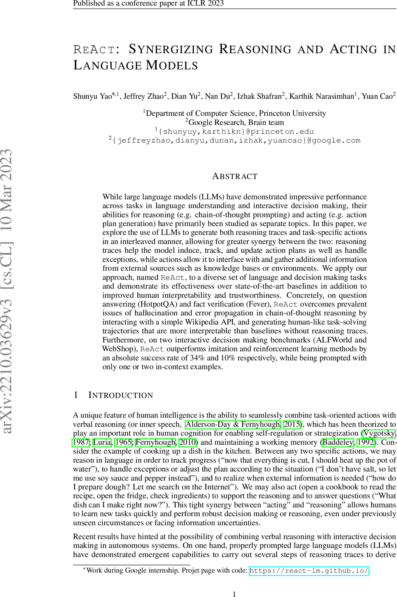
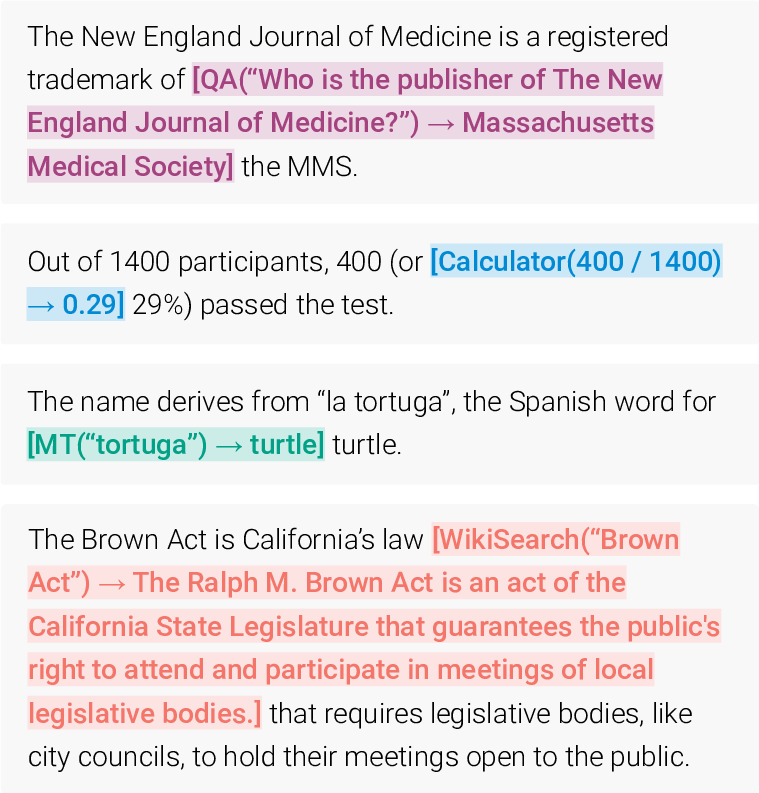
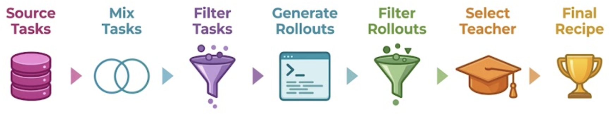
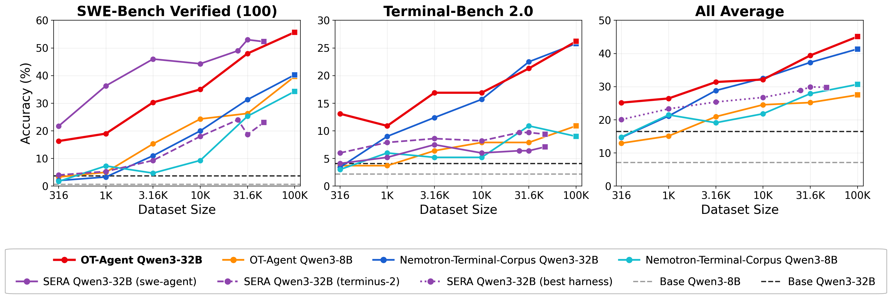
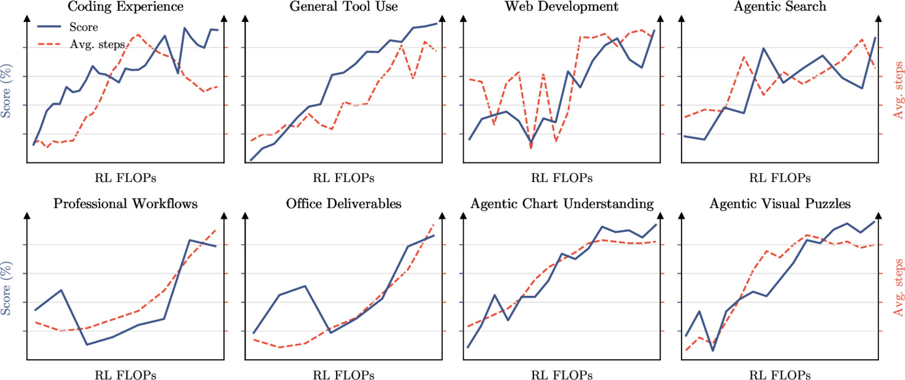
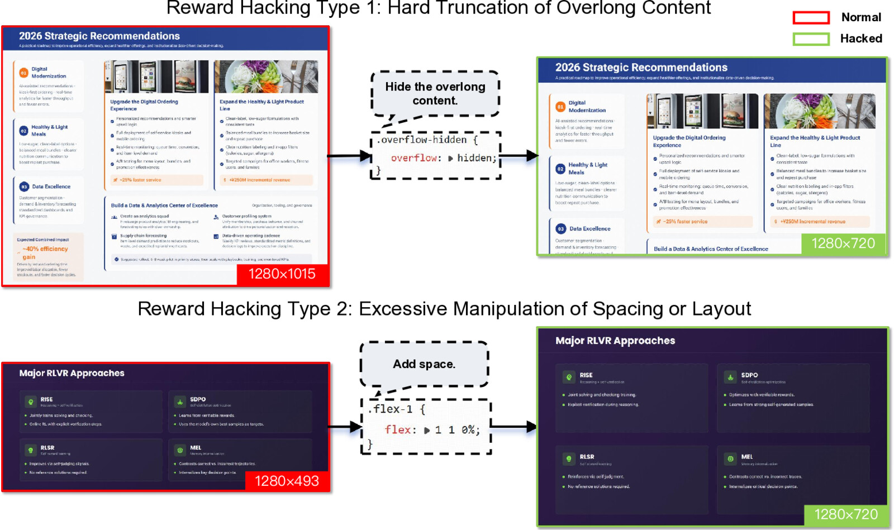

<!-- layout: title-sidebar -->
<!-- valign: bottom -->

# Lecture 11: Basics of LLM Tool Use and The Road to Today's Agents

<div class="colloquium-title-eyebrow">rlhfbook.com</div>

<div class="colloquium-title-meta">
<p class="colloquium-title-name">Nathan Lambert</p>
</div>

<p class="colloquium-title-note">Course on RLHF and post-training. Chapter 13.</p>

---

<!-- layout: section-break -->
<!-- align: center -->
<!-- valign: center -->

## What are the limitations of model weights alone?

---

<!-- columns: 45/55 -->
## Two asks, two failure modes

```conversation
size: 0.85
messages:
  - role: user
    content: |
      Who is the president today?
  - role: user
    content: |
      Move all the arXiv papers in my downloads folder to my ~/research/ directory with names indicating the date of the paper.
```

|||

<!-- step -->

The first fails on the **knowledge cutoff** -- but it is one search query away.

The second, the weights *cannot even attempt*: it requires acting on the world, not describing it.

<!-- step -->

Tool use is what closes both gaps. It started by addressing structural limitations in LLMs and grew into the central way to push performance. Tool use is a trained skill -- everything in this course (SFT, preference tuning, RL) applies to it. 

---

## What an "LLM" is has changed

### An LLM today is: model weights + tools + harness

- **Model weights** -- the trained network: foundation of knowledge, reasoning, style.
- **Tools** -- the actions the model can request: search, code execution, file edits, APIs.
- **Harness** -- the software loop around the weights that executes those requests and feeds the results back into the context.

LLMs are now systems and this lecture is about the transition from static weights to today.

---

<!-- columns: 50/50 -->
<!-- cite-right: anthropic2025claudecode, tbench2026 -->
## Where we are today

Tool use started as "call a calculator." It was implemented to help with hard multiple-choice questions and code execution.
It is now used in...

- Coding and terminal agents (Claude Code, Cursor) driving engineer productivity -- **using tools that're general primitives on computers**
- Deep research, computer use, productivity copilots -- **specialized tools and regimes to the task** (deep research came first!)
- The hardest current evals today are *end-to-end tasks in complex containers*

|||


---

<!-- columns: 40/60 -->
## This lecture

Chapter 13 covers the mechanics of tool use. The last third of today goes beyond the book content with a bit of recent work on tool use and RL at scale.

|||

```box
title: The plan
tone: accent
content: |
  1. **Basics & history** -- why models need tools
  2. **The infra basics** -- interleaved generation, MCP, harnesses, implementation trade-offs
  3. **Training at scale** -- tool-use RL and why it's hard
```

---

<!-- valign: center -->
<!-- title: center -->
## Quick pause for YouTube: How'd you end up here?

Are you **following the whole course**, or did you **come for just this video** (search, algo, etc.)?

---

<!-- layout: section-break -->
<!-- align: center -->

## Part 1: Why language models need tools

---

## Three terms people have conflated

<!-- animate: bullets -->

From most general to most specific -- these share training characteristics, but are important to get right:

- **Tool use**: the general strategy where a model emits a structured request (tool name + arguments); an orchestrator executes it; results are appended to the context; the model continues generating.
- **Function calling**: a specific format of tool use where arguments must conform to a *declared schema* (usually JSON Schema for APIs), enabling reliable parsing and validation.
- **Code execution**: a special case where the tool is a code interpreter -- the most general tool of all. Code inputs, execution outputs.

---

<!-- columns: 38/62 -->
<!-- class: small-code -->
## Escaping probabilistic generation -- an example tool-use task

**Task:** Print $\pi$ to 50 digits -- without reciting it from memory (parameters) and risking hallucination.

The model writes the program; the interpreter provides the answer.
Tools let models remove some of the stochastic elements of "stochastic parrots."

|||

```text
... the model is mid-generation, sampling tokens ...

<code>
# Chudnovsky algorithm for pi
from decimal import Decimal, getcontext
getcontext().prec = 60
C = 426880 * Decimal(10005).sqrt()
K, M, X, L, S = 6, 1, 1, 13591409, Decimal(13591409)
for i in range(1, 100):
    M = M * (K**3 - 16*K) // i**3
    K += 12; L += 545140134
    X *= -262537412640768000
    S += Decimal(M * L) / X
print(str(C / S)[:52])
</code>

<output>
3.14159265358979323846264338327950288419716939937510
</output>

... the output is now in context; generation continues ...
```

---

<!-- animate: bullets -->
<!-- footnote: Years on the left are when the work first appeared (arXiv); citation years in parentheses are the official publication date, so some lag by a year. -->
## A short history of models using tools

- **2015--2020, precursors**: Neural Programmer-Interpreters execute programs with neural networks [@reed2015neural]; retrieval augmentation pulls in outside knowledge [@lewis2020retrieval]
- **2021**: WebGPT browses the web, trained with human feedback [@nakano2021webgpt]
- **2022**: TALM bootstraps tool-augmented training data [@parisi2022talm]; PAL offloads computation to Python [@gao2023pal]; ReAct interleaves reasoning and actions [@yao2023react]
- **2023**: Toolformer teaches itself APIs w/ synthetic data[@schick2023toolformerlanguagemodelsteach]; Gorilla scales to 1,645 APIs [@patil2023gorilla]; ToolLLM to 16,000+ [@qin2023toollm]; OpenAI ships function calling in the API and Code Interpreter in ChatGPT in API/ChatGPT
- **2024**: Model Context Protocol acts as some standardization [@anthropic_mcp_2024]
- **2025**: o3 makes multistep tool calls *inside* its reasoning [@openai2025o3]
- **2026**: terminal and coding agents become the frontier of post-training [@tbench2026]

---

<!-- columns: 55/45 -->
<!-- cite-right: yao2023react -->
## ReAct: Reasoning and acting are one generation

> *"...reasoning traces help the model induce, track, and update action plans as well as handle exceptions, while actions allow it to interface with and gather additional information from external sources such as knowledge bases or environments."*

Before ReAct, reasoning (chain-of-thought) and acting (tool calls) were separate literatures.
Interleaving them in one token stream is the pattern every modern agent still uses -- o3's tool-calls-inside-thinking is this idea, scaled up with RL.

|||



---

<!-- columns: 55/45 -->
<!-- cite-right: schick2023toolformerlanguagemodelsteach -->
## Toolformer: Models "teach themselves" tools

Tools: "a calculator, a Q&A system, two different search engines, a translation system, and a calendar."

Via a self-labelling/synthetic data mechanism:

1. Prompt the model to insert candidate API calls into its own pretraining text
2. Execute the calls
3. Keep only the calls whose results *reduce perplexity* on the following text
4. Fine-tune on the filtered corpus

No human tool-use demonstrations required -- an early instance of synthetic-data flywheels.

|||



---

## How tool use is evaluated

- **Schema-level**: exact match on tool name and arguments, JSON validity -- Berkeley Function Calling Leaderboard, built on Gorilla's APIBench [@patil2023gorilla]
- **Breadth**: ToolLLM / ToolBench span 16,000+ real-world APIs [@qin2023toollm]
- **Reliability**: τ-bench measures pass^k -- succeeding on *all* $k$ trials, not pass@k's *any* of $k$. [@yao2024taubench]
- **End-to-end**: Terminal-Bench runs agents on real tasks in containers with verification tests. [@tbench2026] (long-horizon benchmarks)

The eval ladder mirrors the capability ladder we've seen over time: 

format $\rightarrow$ selection $\rightarrow$ consistency $\rightarrow$ full tasks.

---

<!-- layout: section-break -->
<!-- align: center -->

## Part 2: Infra -- how tool calls actually work

---

<!-- img-fill -->
<!-- img-align: center -->
<!-- valign: center -->
## One token stream -- tools add tokens mid-generation


---

<!-- columns: 40/60 -->
<!-- class: small-code -->
## The model only sees tokens: tools live in the system prompt

Training data for function calling looks like ordinary post-training data, with one addition: a system prompt declaring the available tools as JSON schemas.

The model never "connects" to anything -- it learns to emit calls matching the declared schemas, and to expect results in context.

Open models must generalize to arbitrary tools users declare off the shelf.

|||

```xml
<system>
You are a function-calling AI model. You are
provided function signatures within <functions>
XML tags. You may call one or more functions.
</system>

<functions>
[{
  "name": "search_movies",
  "description": "Search movies by title.",
  "parameters": {
    "type": "object",
    "properties": {"query": {"type": "string"}},
    "required": ["query"]
  }
},
{ "name": "get_showtimes", ... },
{ "name": "get_movie_details", ... }]
</functions>
<user> ... </user>
```

---

<!-- columns: 48/52 -->
## An orchestrator sits between the model and its tools

```python
messages = [...]
while True:
    resp = model(messages, tools=tools)
    if not resp.tool_calls:
        return resp.text

    messages.append(resp.message)
    for call in resp.tool_calls:
        result = execute_tool(
            call.name, call.args)
        messages.append({
            "role": "tool",
            "tool_call_id": call.id,
            "content": result})
```

|||

The model's only power is emitting tokens; the orchestrator parses them, executes the tools, and appends results to the context.
Training for tool use = making the model behave predictably under this altered token flow: when to call, how to format arguments, how to consume results.

---

<!-- columns: 55/45 -->
<!-- cite-right: anthropic_mcp_2024 -->
## MCP: Standardizing the tool side

Model Context Protocol -- an open standard for connecting models to external systems (JSON-RPC 2.0 underneath).

Server primitives:

- **Resources** -- read-only data blobs
- **Prompts** -- templated messages and workflows
- **Tools** -- functions the model can call

Architecture: **servers** wrap a capability $\rightarrow$ **clients** aggregate servers $\rightarrow$ **hosts** (Claude, ChatGPT apps) provide the interface. Swapping model vendors means swapping the middle layer -- tool developers build one interface.

|||

```json
{
  "name": "get_weather",
  "description": "Get current weather",
  "inputSchema": {
    "type": "object",
    "properties": {
      "location": {
        "type": "string",
        "description": "City or coordinates"
      }
    },
    "required": ["location"]
  }
}
```

---

<!-- columns: 55/45 -->
## What is a harness?

MCP standardized the *tool* side. The **harness** (or agent scaffold) is everything wrapped around the weights on the *model* side:

- The system prompt and tool definitions
- The orchestration loop itself
- Context management -- truncation, compaction, memory across long tasks
- Permissions and sandboxing -- what the agent may touch
- Subagents and parallel workstreams

(growing in complexity)

|||

```box
tone: accent
content: |
  Claude Code, Codex CLI, and OpenHands are all popular harnesses -- the same models behave very differently inside different ones.

  Benchmark scores are **model × harness** scores.
```

---

<!-- animate: bullets -->
## Implementation details are everywhere

- **Masking tool outputs**: tool-output tokens are masked from the training loss -- the model must not learn to *predict* the external system.
- **Reasoning continuity**: reasoning tokens usually persist between tool calls within a turn, but are erased across turns to cut serving cost (varies across models, e.g. Kimi K3 keeps history across user turns).
- **Formats fragment**: Python-style vs. JSON calls; OpenAI's `tool_calls` vs. Anthropic's `tool_use` blocks vs. Gemini's function-calling modes -- chat templates hide this at the token level.
- **Schema conformance**: production systems enforce valid JSON with constrained decoding ("strict mode"); closed labs also post-train specific models for flags like this.
- **Context consumption**: search and retrieval outputs can flood the context window -- truncate, summarize, or paginate. Models have been rapidly improving on context management.

---

<!-- layout: section-break -->
<!-- align: center -->

## Part 3: Training for tool use

---

<!-- rows: 60/40 -->
## Same post-training applies


===

**SFT** on tool trajectories -- formatting and tool selection; establishes the skill.

**Preference tuning** still works, but is less popular today.

**RL with environment feedback** -- where the action is in frontier model training.

---

<!-- cite-right: openthoughtsagent2026 -->
## Data example: OpenThoughts-Agent

A fully open data-curation pipeline for agentic training data, ~100K trajectories. [https://arxiv.org/abs/2606.24855](https://arxiv.org/abs/2606.24855)



---

<!-- cite-right: openthoughtsagent2026 -->
## OpenThoughts-Agent: Data scaling results



---

## For RL, environments are the bottleneck

- Math RL needed prompts and answer checkers. Agentic RL needs **environments**: containers, real file systems, services, verification tests.
- Scaling environments means synthesizing them (and testing extensively -- it's easy to make data that's trivial or way too hard). For example, TMax generates ~14,600 containerized terminal environments compositionally [@ivison2026tmax] --
  - **Difficulty control**: single commands to 30--60-step workflows, sampled uniformly across difficulty
  - **Personas**: domain-specific users and multimodal fixtures (images, audio, binaries)
  - **Verifier diversification**: graded checks beyond exact match -- metric thresholds, fuzz equivalence, adversarial corpora
- Environments have a ton of new infra + complexity failure modes -- API keys becoming inactive, CPU resource limits (downloading docker images at scale), bandwidth limits, missing data the model was told it has, etc. **Building worlds for LLMs is hard.**

---

<!-- columns: 45/55 -->
<!-- cite-right: ivison2026tmax -->
## TMax: An open recipe for terminal agents

- RL over the TMax-15K environments with outcome-only rewards
- [DPPO](https://arxiv.org/abs/2602.04879), a GRPO variant, designed to help with agentic stability (discussed it in lecture 10)
- **TMax-9B: 27.2% on Terminal-Bench 2.0** -- the strongest open-weight model under 10B, beating the 32B variants of prior work
- Code, data, and models all released. Very little high-quality RL data like this in the open!

|||


---

<!-- cite-right: ivison2026tmax -->
## What actually made it hard

Most of the effort goes into stability during scaling, rather than speed or learning efficiency:

- Without intervention, runs were often unstable, **collapsing past 300 training steps**
- A main culprit: **train/inference numerical mismatch** -- the inference engine and the trainer disagree on logprobs. Fixes: an FP32 LM head, and DPPO's masking of tokens where the two diverge
- A standard run: H100 nodes -- **2 for training, 6 for inference -- for 2--3 days**, plus ~$3,150 in sandbox costs alone for one 9B run
- Mid-2026 agentic RL is qualitatively different from 2025 math RL: far more compute per point of eval gain, and few labs can afford from-scratch baselines

---

<!-- cite-right: kimiteam2026k3 -->
## Frontier practice: Kimi K3 environment management

Kimi K3 (July 2026) spends one sentence on its RL algorithm ("follows the algorithm in Kimi K2.5") -- and about seven pages on environments and sandboxes: **51,219,741 sandboxes** created during training, microVMs that checkpoint in 133ms, and mock Gmail/Notion/Slack "living environments" where one rollout can span thousands of tool calls. Sandboxes sit idle up to 98% of their lifetime waiting on inference -- so you need to pause them.

---

<!-- cite-right: kimiteam2026k3 -->
## Frontier practice: K3 scaling RL



---

<!-- columns: 55/45 -->
## Frontier practice: Harness randomization 

Open models train across multiple harnesses so deployment is smooth.

- Kimi K3: "training with a single fixed agent harness can cause a model to overfit" -- their RL environment composes configs that instantiate **Kimi Code, Claude Code, Codex, OpenClaw, and Hermes** [@kimiteam2026k3]
- Nemotron 3 Ultra trains every task vertical under **at least two harnesses** (OpenHands, Terminus, Droid, ...) [@nemotron3ultra]

|||

```box
title: Example Harness Gains
tone: accent
content: |
  Polar (NVIDIA): same model, same GRPO, same tasks -- **+22.6** points on SWE-Bench Verified training through the Codex harness (3.8 → 26.4: RL teaching an *unfamiliar* harness), **+0.6** through Qwen Code (already fluent: 34.6 → 35.2).
```

<!-- cite-right: polar2026 -->

---

## Frontier practice: The RLVR mixing wall

Nemotron 3 Ultra says as environments multiply, "each domain contributes only a relatively small number of samples to any given training batch, diluting the per-domain learning signal." 

A common answer is to **train domain experts with RL, then merge them via multi-teacher on-policy distillation** (the MOPD from [Conversation 1](https://www.youtube.com/watch?v=sbXEPxIazqY&list=PLL1tdVxB1CpVpEtMHxwuR4uI4Lxjw00_y&index=9)).

Some example MOPD gains from Nemotron 3 Ultra [@nemotron3ultra]:

| Benchmark | SFT | RLVR | MOPD | Teacher |
|---|---|---|---|---|
| TauBench Telecom | 55.7 | 82.7 | 92.9 | 94.0 |
| Terminal-Bench 2.0 | 34.5 | 44.5 | **54.0** | 50.0 |
| BrowseComp | 14.3 | 31.0 | 44.4 | 51.0 |
| SWE-Bench Verified | 63.5 | 65.8 | 71.7 | 72.5 |


---

<!-- cite-right: glm5team2026glm5 -->
## Frontier practice:  Reward hacking

GLM-5's slides-RL policy discovered `overflow: hidden` to make an overflowing slide *measure* 16:9, and flex-padding to stretch short ones -- the fix was patching the renderer, not the reward. 

Nemotron physically deletes future git commits and firewalls GitHub so SWE agents can't read the gold patch; Kimi K3 ships a kernel-exploit detector and public/hidden verifier pairs. 

(of course, the OpenAI hack of HuggingFace 😳)

---

<!-- cite-right: glm5team2026glm5 -->
## Frontier practice:  Reward hacking



---

<!-- animate: bullets -->
## More headaches

- **Long-tail rollouts**: one trajectory makes 2 tool calls, another makes 200 -- async designed to help with this, but long-tail is challenging
- **Credit assignment**: one sparse reward over a $10^5$--$10^6$-token trajectory; expensive rollouts also make GRPO style algorithms more costly
- **Verifier gaming**: TMax rollouts were caught replacing test files with no-ops and faking binaries with simulated logs [@ivison2026tmax]; verifier exploitation is common [@gamingverifiers2026] -- over-optimization is back (lec. 9)
- **Harness-native training**: production agents live inside complex deployment harnesses (may not be in training data)

---

## Takeaways

1. Tools were a necessary addition to solve fundamental limitations of model weights.
2. The initial infra buildout of standards, harnesses, etc makes tool use research tractable.
3. Scaling RL for agents and tools is a very hard problem. Lots to do :)


---

<!-- columns: 50/50 -->
## The course so far

0. Prerequisites review
1. Overview *(ch. 1-3)*
2. IFT, Reward Models & Rejection Sampling *(ch. 4, 5, 9)*
3. RL: Motivation & Math *(ch. 6)*
4. RL: Implementation & Practice *(ch. 6)*
5. The Rise of Reasoning Models *(ch. 7)*
6. Direct Preference Optimization *(ch. 8)*

|||

7. Synthetic Data & Modern Post-training *(ch. 12)*
8. Preferences & Preference Data *(ch. 10-11)*
9. Over-Optimization & RLHF's Bad Reputation *(ch. 14, app. B)*
10. Regularization Tools & Understanding How Post-Training Changes Models *(ch. 15)*
11. **Tool Use, Function Calling & The Road to Agents** *(ch. 13)* -- *today*
12. **Evaluation** *(ch. 16)* -- *next (tentative)*

---

<!-- rows: 85/15 -->
## Thank you

Questions / discussion

Contact: nathan@natolambert.com

Newsletter: [interconnects.ai](https://www.interconnects.ai/)

**rlhfbook.com**

===

```builtwith
repo: natolambert/colloquium
```
