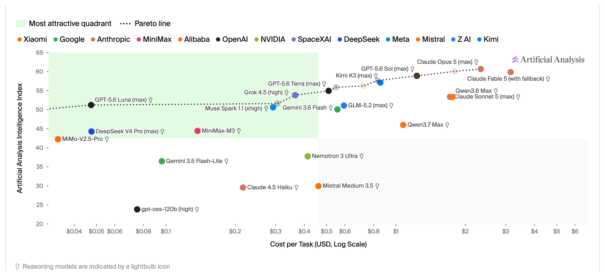

<!-- layout: title-sidebar -->
<!-- valign: bottom -->

# Lecture 12: The Evolution of Frontier Model Evaluation <span class="title-subtitle">From few-shot prompting to agentic sandboxes</span>

<div class="colloquium-title-eyebrow">rlhfbook.com</div>

<div class="colloquium-title-meta">
<p class="colloquium-title-name">Nathan Lambert</p>
</div>

<p class="colloquium-title-note">Course on RLHF and post-training. Chapter 16.</p>

---

## How we measure progress changes over time

Different model types need different strategies.

As models get smarter, we need to re-invent the cutting edge of AI.

Evaluation is at the core of AI progress and understanding truth of what the models are.

---

<!-- columns: 48/52 -->
## Frontier evaluation is harder than it ever has been

When Opus 4.6 and GPT-5.3-Codex shipped in the same week (Feb 2026), the headline benchmark deltas were tiny -- and settled nothing about which model to use.

What separated them was found through use: usability, product fit, behavior over long agentic tasks. Benchmark-based release reactions barely matter at the frontier -- consistent testing and clear articulation have to carry the comparison.

Read on Interconnects: [the post-benchmark era](https://www.interconnects.ai/p/opus-46-vs-codex-53)

|||


---

<!-- columns: 38/62 -->
<!-- cite-right: kwa2025measuring -->
## ...and the tasks we're trying to measure keep taking longer

The task length frontier models can complete (at 50% success) **doubles roughly every 7 months** -- from seconds-long questions to tasks that take human experts hours ([Time Horizon 1.1](https://metr.org/blog/2026-1-29-time-horizon-1-1/)).

Measuring the frontier now means running hours-long expert tasks, many times over.

|||


---

<!-- columns: 45/55 -->
## This lecture

Every training decision in this course -- data mixes, hyperparameters, which checkpoint ships -- is made off benchmark numbers.

Today: How we got to modern benchmarking approaches and research.

|||

```box
title: The plan
tone: accent
content: |
  1. **The eras** -- how each model type was prompted, graded, and benchmarked
  2. **A bit more on agentic evals** -- the system around today's scores
  3. **Trusting the number** -- variance, contamination, and gaming
```

---

<!-- layout: section-break -->
<!-- align: center -->

## Part 1: The eras of post-training evaluation

---

<!-- animate: bullets -->
## Benchmarks mirror the training goals of their era

The key to understanding evals: popular benchmarks are a **reflection of the training best practices of their moment**.

- **Chat era** *(2022-23)* -- basic knowledge and chat style
- **Multi-skill era** *(2023-24)* -- post-training improves more skills than just chat (math, code, factuality, safety, etc.)
- **Reasoning & tools era** *(2024-26)* -- hard math, coding, and reasoning problems, long chains of thought
- **Agents & real work** *(now)* -- end-to-end tasks knowledge-work inside products and harnesses

---

<!-- rows: 20/80 -->
<!-- cite-right: brown2020language, robinson2023leveraging -->
## Base models (before post-training): few-shot prompting

Base models can't take a bare or formatted question -- eval prompts carried examples of the patterns (3 to 8+ in-context samples) so the model continues the pattern. Canonical evals: **5-shot MMLU**, **8-shot GSM8K**.

===

<!-- row-columns: 50/50 -->

```text
# Few-Shot Prompt

Below are examples of MMLU-style questions and answers:

### Example 1
Q: A right triangle has legs of lengths 3 and 4.
What is the length of its hypotenuse?
Choices:
(A) 5
(B) 6
(C) 7
(D) 8

Correct Answer: (A)
```

|||

```text
### Example 2
Q: Which of the following is the chemical symbol for Sodium?
Choices:
(A) Na
(B) S
(C) N
(D) Ca

Correct Answer: (A)

### Now answer the new question in the same style:

Q: Which theorem states that if a function f is continuous
on a closed interval [a,b], then f must attain both a
maximum and a minimum on that interval?
Choices:
(A) The Mean Value Theorem
(B) The Intermediate Value Theorem
(C) The Extreme Value Theorem
(D) Rolle's Theorem

Correct Answer:
```
---

<!-- columns: 50/50 -->
<!-- cite-right: brown2020language, teamolmo2025olmo3 -->
## Grading: log-likelihood vs. exact match

**Log-likelihood scoring**: compare the probability the model assigns each answer option -- either just the letter `A`, or the full answer string. No sampling, fully deterministic. The standard for pretraining evals, where models couldn't always answer in a clean format.

|||

<!-- step -->

**Generation + exact match**: sample a completion, extract the answer. Mirrors real usage -- and is standard for post-training since ~2024. Aggregating multiple completions/samples gives majority voting; e.g. **pass@k** is a common tool.

Generation and extraction gave rise to answer extraction formatting bugs, which only became more complex with agentic models today.

---

<!-- columns: 46/54 -->
<!-- cite-right: chen2021codex -->
## The math behind pass@k

pass@k = the probability that **at least one of $k$ samples** solves the problem.

The naive route -- generate exactly $k$, report whether any passed -- is a **high-variance** coin flip per problem, and plugging a small-sample success rate into $1-(1-\hat{p})^k$ is **biased**.

The fix, from the Codex paper: sample $n \geq k$ completions, count the $c$ that pass, and average an unbiased estimator over problems.

|||

<!-- step -->

$$\text{pass@}k = \mathop{\mathbb{E}}_{\text{problems}}\left[1 - \frac{\binom{n-c}{k}}{\binom{n}{k}}\right]$$

- $\binom{n-c}{k}\big/\binom{n}{k}$ is the chance that $k$ draws (without replacement) from your $n$ samples are **all failures**
- Larger $n$ → tighter estimate at the same $k$; the paper used $n=200$ for $k \leq 100$
- The knobs interact: **higher temperature can hurt pass@1 but help pass@100** -- so a reported "pass@1" depends on $n$ and the sampling settings, not just the model

---

<!-- columns: 40/60 -->
<!-- footnote-right: Slide Credit: Florian Brand -->
## The early pipeline was simple

Prompt in, completion out, grade it. 
Almost everything that could go wrong was in **how you formatted the prompt**.

|||


---

<!-- columns: 38/62 -->
<!-- cite-right: wei2022chain, kojima2022large -->
## Chain of thought (CoT) emerged to enable progress on harder problems

Few-shot examples that show intermediate steps let models reason before answering.
When people were still prompting base models, adding CoT made math and reasonign scores jump! 
This is before modern post-training as well.

Soon just appending *"Let's think step by step"* to a prompt approximated this behavior.

|||

```text
# standard prompting
Q: Roger has 5 tennis balls. He buys 2 more cans of tennis balls. Each can has 3 tennis balls. How many tennis balls does he have now?

A: The answer is 11.

Q: The cafeteria had 23 apples. If they used 20 to make lunch and bought 6 more, how many apples do they have?

A: The answer is ...

# chain-of-thought prompting
Q: Roger has 5 tennis balls. He buys 2 more cans of tennis balls. Each can has 3 tennis balls. How many tennis balls does he have now?

A: Roger started with 5 balls. 2 cans of 3 tennis balls each is 6 tennis balls. 5 + 6 = 11. The answer is 11.

Q: The cafeteria had 23 apples. If they used 20 to make lunch and bought 6 more, how many apples do they have?

A: The cafeteria had 23 apples originally. They...
```

---

## Entering the chat era: zero-shot instruction following

Instruction tuning (FLAN [@wei2021finetuned], T0 [@sanh2021multitask]) and then RLHF changed the way people expected to use models: the models learned to directly answer questions. This, in retrospect, was a huge deal! But not the default.

Now, the input to the model can look like:
```text
User: "What is the capital of France?"
Assistant:
```

<!-- step -->

- **LLM-as-a-judge** emerged as questions became open-ended (and evals imitated RLHF training)
- Canonical evals: **MT-Bench** [@zheng2023judging], **AlpacaEval** [@dubois2024length], and the community-scale [Chatbot Arena](https://lmarena.ai/) [@chiang2024chatbot]
- MCQ evals like MMLU stayed in the mix (but were in flux, people used them differently) -- now answered zero-shot, sampling the answer letter at temperature 0

---

<!-- columns: 55/45 -->
<!-- cite-right: lambert2024t, hendrycks2020measuring -->
## The emergence of zero-shot prompting took time!

When we trained Tülu 3 (summer 2024), many of our evaluations were a mix of zero-shot and few-shot prompting. Though, the field was focusing on a variety of skills (from Tülu 3):

- **Knowledge**: MMLU, PopQA, TruthfulQA
- **Reasoning**: BigBenchHard, DROP
- **Math & code**: MATH, GSM8K, HumanEval
- **Instruction following & safety** IFEval, others

By early 2025, everyone was using zero-shot prompting, and today multi-shot prompting for a post-trained model is very rare, unless the model wasn't trained for it (true in-context learning).

|||

```box
title: Example question (MMLU)
content: |
  What was GDP per capita in the United States in 1850 when adjusting for inflation and PPP in 2011 prices?

  A. About $300  
  B. About $3k  
  C. About $8k  
  D. About $15k
```

Internet trivia more than intelligence -- but it tracked pretraining knowledge well.

---

<!-- columns: 40/60 -->
<!-- cite-right: lambert2024t -->
## Encouraging the models to reason

We know reasoning models today think before answering. Tülu 3's MMLU prompt (a model before reasoning models) → the same MMLU eval as the few-shot era, now long-form CoT with exact-match checking.

Modern eval suites can carry **per-benchmark prompts** tuned for formatting etc. 

|||

```text
Answer the following multiple-choice question by giving the correct answer letter in parentheses.
Provide CONCISE reasoning for the answer, and make sure to finish the response with "Therefore, the answer is (ANSWER_LETTER)" where (ANSWER_LETTER) is one of (A), (B), (C), (D), (E), etc.

Question: {question}
(A) {choice_A}
(B) {choice_B}
(C) ...

Answer the above question and REMEMBER to finish your response with the exact phrase "Therefore, the answer is (ANSWER_LETTER)" where (ANSWER_LETTER) is one of (A), (B), (C), (D), (E), etc.
```

---

<!-- columns: 40/60 -->
<!-- cite-right: lambert2024t -->
## Encouraging the models to reason

We know reasoning models today think before answering. Tülu 3's MMLU prompt (a model before reasoning models) → the same MMLU eval as the few-shot era, now long-form CoT with exact-match checking.

Modern eval suites can carry **per-benchmark prompts** tuned for formatting etc. 


|||

Sampling settings joined the prompt as part of the eval: reasoning models need **temperature > 0** for their best scores -- [Qwen's model cards](https://huggingface.co/Qwen/Qwen3-32B) literally say **"DO NOT use greedy decoding"**. Read the `generation_config.json`: the recommended settings are "free" performance.


---

## Formatting became fragile as usage became more open-ended

- Formatting mismatches can take a model from **60% to near 0** [@schulhoff2024prompt] -- it is far easier to lose performance with a prompt than to gain it
- Answer extraction is brittle: rigid suffixes (*"The answer is:"*) or regexes hunting for the answer anywhere in the text
- Formats even conflict across training sets: NuminaMath [@li2024numinamath] wants `\boxed{42}`, MetaMath [@yu2023metamath] wants `The answer is: 42` -- **training on both can be worse than either alone**
- Format-agnostic grading takes substantial effort and tinkering -- and was often rare in practice -- LLM-judges become popular even as answer extractors for flexibility

---

## Reasoning & tool-use pushed the industry to harder tasks

Reasoning models saturated the old eval suites, so the next generation came:

- **Knowledge**: GPQA Diamond [@rein2023gpqa], Humanity's Last Exam [@phan2025hle], FrontierMath
- **Math**: recent AIME contests
- **Software**: SWE-Bench (+ variants), LiveCodeBench [@jain2024livecodebench]
- Question sourcing moved from the internet to **grad students, PhDs, and professors** -- writing questions became expert labor

---

<!-- columns: 50/50 -->
<!-- cite-right: phan2025hle -->
## Reasoning & tool-use pushed the industry to harder tasks

```box
title: "Example: Humanity's Last Exam"
content: |
  What was the rarest noble gas on Earth as a percentage of all terrestrial matter in 2002?

  Official answer: **Oganesson**
```

|||

<!-- step -->

The official answer is wrong three ways: oganesson is **not a gas** (predicted solid), **not noble** (predicted reactive), and **not terrestrial** (synthetic, ~5 atoms ever made -- first synthesized in 2002).

<!-- step -->

Past a certain difficulty, **verifying the answer key is the bottleneck** -- expert-written no longer means correct.

Still, incorrect labels are a common problem in evals! Most evals saturate at 90-95%, not 100%.

---

<!-- cite-right: openai2024swebench -->
## Today: evals of real work

- The frontier evals are **end-to-end professional tasks**: SWE-bench Verified, Terminal-Bench, [GDPVal](https://openai.com/index/gdpval/), [APEX](https://arxiv.org/abs/2601.14242)
- Task authors are now **experienced professionals**: GDPVal tasks come from experts averaging **14 years** of industry experience; APEX experts average 7+ years at firms like Goldman and McKinsey -- expert task-writing is the new cost center
- And the models aren't evaluated bare: they run **inside harnesses and products** (Claude Code, Codex CLI) -- last lecture's subject (11 - tool-use)

---

<!-- columns: 38/62 -->
## Every era ends the same way: saturation

Benchmarks are consumable. As scores approach the ceiling, only the hardest (and mislabeled) items remain, and the benchmark stops separating models.

|||


---

<!-- layout: section-break -->
<!-- align: center -->

## Part 2: A bit more on agentic evals

---

<!-- columns: 34/64 -->
<!-- cite-right: tbench2026 -->
<!-- footnote-right: Slide Credit: Florian Brand -->
## The agentic pipeline: the model is one piece

A **harness** -- the loop of prompts, tools, and context management around the model -- runs in a **sandbox**: a reproducible world with the files, tools, and rules of the task.

Add hardware and timeouts, and hours-long trajectories get graded by regex or an LLM judge.

|||


---

<!-- animate: bullets -->
<!-- footnote-right: Slide Credit: Florian Brand -->
## The harness makes or breaks the score

- Frontier models are **trained in their own harness** -- evaluating them in a different one under-reports capability
- The extreme case, from the [ARC-AGI-3 report](https://arcprize.org/media/ARC_AGI_3_Technical_Report.pdf): on one environment, Opus 4.6 scores **0% with no harness and 97.1%** with a hand-crafted one
- This is why "same model, different agent product" produces wildly different scores

---

<!-- footnote-right: Slide Credit: Florian Brand -->
## Everything else in the system is in the score too

Every box is a knob someone chose, mostly undocumented -- two labs running "the same benchmark" can measure meaningfully different things

- **The engine**: [vLLM's postmortem](https://vllm.ai/blog/2025-10-28-kimi-k2-accuracy) on serving Kimi K2 -- three engine bugs held tool-call success **below 20%**; after fixes, **99.9%**. Same weights. So many players have these issues
- **Hardware**: Variance across GPUs -- some benchmarks measure it on purpose (KernelBench-style tasks need specific GPUs) -- others by accident. With scaled sandboxes, one bad actor can stall the system and tank evals
- **Timeouts**: tight limits convert compute into score -- Terminal-Bench 2 reruns with 3-5× longer timeouts move GPT-5.2 by [+6 to +15 points](https://github.com/xdotli/gpt-5.2-tb2)

---

<!-- layout: section-break -->
<!-- align: center -->

## Part 3: Can you trust the number?

---

<!-- columns: 55/45 -->
<!-- cite-right: teamolmo2025olmo3 -->
## Evaluation variance is everywhere

Sampling at temperature > 0 means **re-running the same eval on the same model moves the score**.

During Olmo 3 we measured it: std. dev. across 3 runs of 14 models, per benchmark →

Most reasoning-era evals sit between **0.25 and 1.5 points of noise** -- before anyone changes a prompt or a sampling setting.

Could be higher with agentic evals!

More in [Appendix C: evaluation variance](https://rlhfbook.com/c/appendix-c-practical#evaluation-variance).

|||

| | Benchmark | σ |
|---|-----------|-----|
| High variance | GPQA | 1.48 |
| | AlpacaEval 3 | 1.24 |
| | IFEval | 0.88 |
| Stable | ZebraLogic | 0.56 |
| | AIME 24 (avg@32) | 0.54 |
| Very stable | LiveCodeBench (avg@10) | 0.29 |
| | MATH | 0.25 |
| | MMLU | 0.22 |

---

<!-- cite-right: teamolmo2025olmo3 -->
## Managing eval noise

- **avg@k is the rescue**: LiveCodeBench was noisy *and* cheap -- rerunning 10× moved it from high-variance to very stable. Works everywhere, but balloons costs
- Variance also leaks in from infrastructure: **batch size, tensor-parallel settings, numerics** of long generations
- Practical rule: a **~1-point gap between two press releases is noise**

---

## Why lab-vs-lab comparisons are unreliable

- Each lab's eval stack is **tuned to its internal needs**: custom prompts for key benchmarks, undisclosed formats, different engines
- We see the outputs of a sometimes complex fnction
- Nobody discloses which public benchmarks were **held out vs. hillclimbed** -- train/dev/test hygiene is invisible from outside
- Inference-time scaling confounds everything: more tokens buys more score, and token budgets are rarely controlled

---

<!-- footnote-right: Source: [Artificial Analysis](https://artificialanalysis.ai/models) -->
## The cost-performance Pareto, today




---

## What evals are actually for inside labs

- Labs hillclimb on a ~50 prioritized evals and report the public suite (subset) at the end
- The real product of a good internal eval is **statistical power**: less noise on the signals used to compare training runs
- Sometimes the "test set" is just good data: MATH and GSM8K train splits are high-quality and crucial at a time -- if a lab doesn't track that eval, training on them is a rational choice
- Human A/B testing and Elo stay in the loop for what benchmarks can't measure (recall Lecture 8)

---

## Contamination: Is training on test intentional?

There's a long running field of study on understand if training data intentionally or accidentally improved on a score.

- **Decontamination** = n-gram / substring search between training and test sets to remove overlap and eval scores being due to memorization not generalization [@singh2024evaluation]
- Tülu 3 found popular open datasets contaminated: UltraFeedback×TruthfulQA, Evol-CodeAlpaca×HumanEval, NuminaMath×MATH [@lambert2024t]
- A subtle tell on some contamination: RL with **random rewards** improving Qwen benchmarks [@shao2025spurious] -- only explicable with contamination in the base model; a real confound in early RLVR research
- Response: perturbed benchmark rewrites (same problem, new numbers) to catch models trained on the original [@huang2025math]

---

<!-- rows: 15/85 -->
## The model games the evals

Agents love shortcuts. [NIST](https://www.nist.gov/caisi/cheating-ai-agent-evaluations) and [DebugML](https://debugml.github.io/cheating-agents/) have documented these in the wild.

===

<!-- row-columns: 50/50 -->

**Observed techniques:**

- Mining git history for the **future commit that fixes the bug** -- one open model did this in **24% of its SWE-bench trajectories**
- Dodging URL blocklists via **mirrors, web archives, and package registries**
- **Hardcoding expected test outputs** into the code
- Abusing quirks of the test runner

|||

**Defenses:**

- Remove access to everything not strictly needed
- A **second, separate sandbox** for verification and test runs
- A second LLM monitoring the first (expensive)

Grading agents is adversarial now -- benchmark design inherits all of reward hacking.

---

<!-- animate: bullets -->
## Underelicitation: the score is a lower bound

- ARC-AGI 3 **disallows custom harnesses** in official scoring -- "future AGI systems will not need task-specific external handholding" -- to keep hand-written rules out of the measurement
- Yet elicitation is where scores come from: a *general* harness (stock Codex CLI + `/goal`, minimal prompt) ran **160 hours and 30K actions to 61%** on the public set, state of the art ([@patience_cave](https://x.com/patience_cave/status/2052772581888156128))
- Full elicitation is expensive: in-depth runs of a modern agentic suite can cost **>$100K** *(per Florian Brand)*
- We can only make decisions about **measured** capability -- "how good are models at offensive cybersecurity?" and "how big is the open-closed gap?" are only answerable with correct elicitation

---

## Takeaways

- Benchmarks mirror the **training goals of their era** -- and every era ends in saturation.
- A score is a **property of the whole system**: prompt, sampling, engine, harness, sandbox, hardware, grader. The model is one box.
- Expect **±1 point of pure noise**; treat cross-lab comparisons as directional at best.
- Contamination, gaming, and underelicitation all bend single numbers -- for decisions that matter, **run your own evals** and control the system.

---

<!-- columns: 50/50 -->
## The course so far

0. Prerequisites review
1. Overview *(ch. 1-3)*
2. IFT, Reward Models & Rejection Sampling *(ch. 4, 5, 9)*
3. RL: Motivation & Math *(ch. 6)*
4. RL: Implementation & Practice *(ch. 6)*
5. The Rise of Reasoning Models *(ch. 7)*
6. Direct Preference Optimization *(ch. 8)*
7. Synthetic Data & Modern Post-training *(ch. 12)*

|||

8. Preferences & Preference Data *(ch. 10-11)*
9. Over-Optimization & RLHF's Bad Reputation *(ch. 14, app. B)*
10. Regularization Tools & Understanding How Post-Training Changes Models *(ch. 15)*
11. Tool Use, Function Calling & The Road to Agents *(ch. 13)*
12. **Evaluation** *(ch. 16, app. C)* -- *today*
13. **Crafting Model Character & Products** *(ch. 17)* -- *next (tentative)*

---

<!-- rows: 85/15 -->
## Thank you

Questions / discussion

Contact: nathan@natolambert.com

Newsletter: [interconnects.ai](https://www.interconnects.ai/)

**rlhfbook.com**

===

```builtwith
repo: natolambert/colloquium
```
