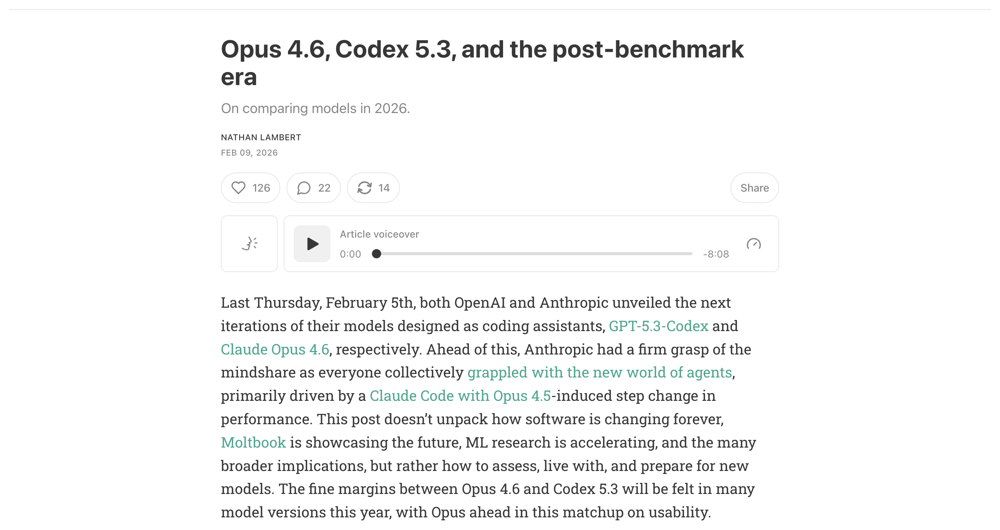
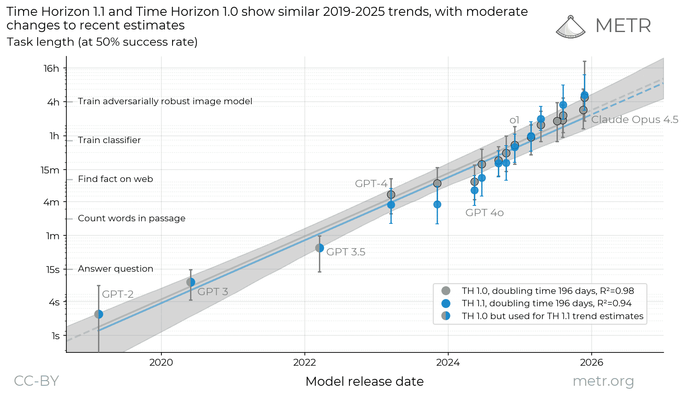
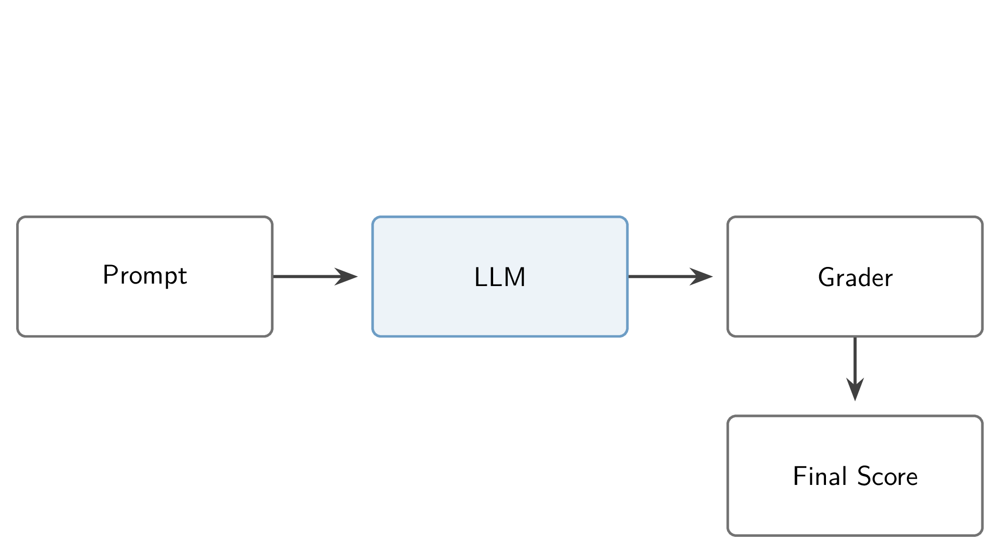
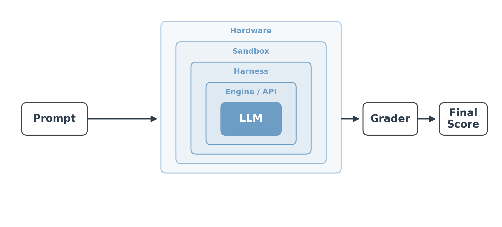

<!-- layout: title-sidebar -->
<!-- valign: bottom -->

# Lecture 12: The Evolution of Frontier Model Evaluation <span class="title-subtitle">From few-shot prompting to agentic sandboxes</span>

<div class="colloquium-title-eyebrow">rlhfbook.com</div>

<div class="colloquium-title-meta">
<p class="colloquium-title-name">Nathan Lambert</p>
</div>

<p class="colloquium-title-note">Course on RLHF and post-training. Chapter 16.</p>

---

## How we measure progress changes over time

Different model types need different strategies.

As models get smarter, we need to re-invent the cutting edge of AI.

Evaluation is at the core of AI progress and understanding truth of what the models are.

---

<!-- columns: 48/52 -->
## Frontier evaluation is harder than it ever has been

When Opus 4.6 and GPT-5.3-Codex shipped in the same week (Feb 2026), the headline benchmark deltas were tiny -- and settled nothing about which model to use.

What separated them was found through use: usability, product fit, behavior over long agentic tasks. Benchmark-based release reactions barely matter at the frontier -- consistent testing and clear articulation have to carry the comparison.

Read on Interconnects: [the post-benchmark era](https://www.interconnects.ai/p/opus-46-vs-codex-53)

|||



---

<!-- columns: 38/62 -->
<!-- cite-right: kwa2025measuring -->
## ...and the tasks we're trying to measure keep taking longer

The task length frontier models can complete (at 50% success) **doubles roughly every 7 months** -- from seconds-long questions to tasks that take human experts hours ([Time Horizon 1.1](https://metr.org/blog/2026-1-29-time-horizon-1-1/)).

Measuring the frontier now means running hours-long expert tasks, many times over.

|||



---

<!-- columns: 45/55 -->
## This lecture

Every training decision in this course -- data mixes, hyperparameters, which checkpoint ships -- is made off benchmark numbers.

Today: where those numbers come from, and when to trust them.

|||

```box
title: The plan
tone: accent
content: |
  1. **The eras** -- how each generation was prompted, graded, and benchmarked
  2. **A bit more on agentic evals** -- the system around today's scores
  3. **Trusting the number** -- variance, contamination, and gaming
```

---

<!-- layout: section-break -->
<!-- align: center -->

## Part 1: The eras of post-training evaluation

---

<!-- animate: bullets -->
## Benchmarks mirror the training goals of their era

The key to reading evals: popular benchmarks are a **reflection of the training best practices of their moment**. When training moves, evaluation follows.

- **Chat era** *(2022-23)* -- can it converse like GPT-4?
- **Multi-skill era** *(2023-24)* -- post-training improves many capabilities at once
- **Reasoning & tools era** *(2024-26)* -- hard problems, long chains of thought
- **Agents & real work** *(now)* -- end-to-end tasks inside products and harnesses

---

<!-- columns: 45/55 -->
<!-- cite-right: brown2020language, robinson2023leveraging -->
## Base models: few-shot prompting

Base models can't take a bare question -- every eval prompt carried **worked examples** so the model would continue the pattern.

The number of in-context examples (3 to 8+) was itself a design parameter -- and a source of score differences between papers.

|||

```box
title: Few-shot MMLU prompt (abridged)
size: 0.8
content: |
  Below are examples of MMLU-style questions and answers:

  Q: A right triangle has legs of lengths 3 and 4. What is the length of its hypotenuse?  
  A. 5&emsp;B. 6&emsp;C. 7&emsp;D. 8  
  Correct Answer: A

  Now answer the new question in the same style:

  Q: Which theorem states that a continuous function on a closed interval must attain both a maximum and a minimum?  
  A. Mean Value Theorem&emsp;B. Intermediate Value Theorem  
  C. Extreme Value Theorem&emsp;D. Rolle's Theorem  
  Correct Answer:
```

---

<!-- columns: 50/50 -->
<!-- cite-right: brown2020language, teamolmo2025olmo3 -->
## Grading: log-likelihood vs. exact match

**Log-likelihood scoring**: compare the probability the model assigns each answer option -- either just the letter `A`, or the full answer string. No sampling, fully deterministic. The standard for pretraining evals, where models can't yet answer in a clean format.

|||

**Generation + exact match**: sample a completion, extract the answer. Mirrors real usage -- and is standard for post-training. Aggregating samples gives majority voting; **pass@k** is the coding analogue.

The catch: rigid format requirements. A model that answers correctly in the *wrong format* scores zero.

---

<!-- rows: 35/65 -->
## The early pipeline was simple

Prompt in, completion out, grade it. Almost everything that could go wrong lived in two places: **how you formatted the prompt** and **how you graded the answer**.

===



---

<!-- columns: 48/52 -->
<!-- cite-right: wei2022chain, kojima2022large -->
## Chain of thought changed what a prompt is

Few-shot examples that **show the work** let models reason before answering -- and math scores jumped.

Soon just appending *"Let's think step by step"* did it zero-shot. The reasoning became part of the completion, and the grader now has to find the answer inside it.

|||

```box
title: Standard vs. chain-of-thought prompting
size: 0.8
content: |
  Q: Roger has 5 tennis balls. He buys 2 more cans of tennis balls. Each can has 3 tennis balls. How many tennis balls does he have now?

  **Standard prompt**: A: The answer is 11.

  **Chain of thought**: A: Roger started with 5 balls. 2 cans of 3 tennis balls each is 6 tennis balls. 5 + 6 = 11. The answer is 11.
```

---

<!-- cite-right: zheng2023judging, dubois2024length, li2024crowdsourced, wei2021finetuned -->
## Chat era: how close to GPT-4?

Instruction tuning collapsed the prompt to just the question -- zero-shot, `User: ... Assistant:` -- and evaluation moved to **chat quality relative to a known strong model**.

- MT-Bench, AlpacaEval, Arena-Hard -- and the community-scale version, [Chatbot Arena](https://lmarena.ai/) [@chiang2024chatbot]
- The trick that made it scale: **LLM-as-a-judge** replaced human raters (recall Lecture 7 -- same machinery as synthetic preference data)
- Narrow by design: these are now just the "chat" and "instruction following" slices of bigger suites

---

<!-- columns: 55/45 -->
<!-- cite-right: lambert2024t, hendrycks2020measuring -->
## Multi-skill era: one suite, many capabilities

Once post-training was more than safety and chat, suites like Tülu's covered:

- **Knowledge**: MMLU, PopQA, TruthfulQA
- **Reasoning**: BigBenchHard, DROP
- **Math & code**: MATH, GSM8K, HumanEval
- **Instruction following & safety** composites

Questions came from the internet; annotation from undergrads and crowdworkers. The flavor:

|||

```box
title: Example question (MMLU)
content: |
  What was GDP per capita in the United States in 1850 when adjusting for inflation and PPP in 2011 prices?

  A. About $300  
  B. About $3k  
  C. About $8k  
  D. About $15k
```

Internet trivia more than intelligence -- but it tracked pretraining knowledge well.

---

<!-- animate: bullets -->
<!-- cite-right: schulhoff2024prompt, li2024numinamath, yu2023metamath -->
## Formatting is fragile

- Formatting mismatches can take a model from **60% to near 0** -- it is far easier to lose performance with a prompt than to gain it
- Answer extraction is brittle: rigid suffixes (*"The answer is:"*) or regexes hunting for the answer anywhere in the text
- Formats even conflict across training sets: NuminaMath wants `\boxed{42}`, MetaMath wants `The answer is: 42` -- **training on both can be worse than either alone**
- Format-agnostic grading takes substantial effort and tinkering -- and is rare in practice

---

<!-- cite-right: rein2023gpqa, phan2025hle, jain2024livecodebench -->
## Reasoning & tools era: make it actually hard

Reasoning models saturated the old suites, so difficulty escalated:

- **Knowledge**: GPQA Diamond, Humanity's Last Exam, FrontierMath
- **Math**: recent AIME contests, run at temperature > 0 with long chains of thought
- **Software**: SWE-Bench (+ variants), LiveCodeBench
- Question sourcing moved from the internet to **grad students, PhDs, and professors** -- writing questions became expert labor

---

<!-- columns: 50/50 -->
<!-- cite-right: phan2025hle -->
## Even PhDs and professors are wrong

```box
title: "Example: Humanity's Last Exam"
content: |
  What was the rarest noble gas on Earth as a percentage of all terrestrial matter in 2002?

  Official answer: **Oganesson**
```

|||

<!-- step -->

The official answer is wrong three ways: oganesson is **not a gas** (predicted solid), **not noble** (predicted reactive), and **not terrestrial** (synthetic, ~5 atoms ever made -- first synthesized in 2002).

<!-- step -->

Past a certain difficulty, **verifying the answer key is the bottleneck** -- expert-written no longer means correct.

---

<!-- columns: 48/52 -->
<!-- cite-right: lambert2024t -->
## Reasoning-era prompts: the chain of thought is built in

Reasoning models always think before answering -- no nudge needed. Modern suites instead carry **per-benchmark prompts** tuned so formatting isn't the bottleneck.

Sampling settings joined the prompt as part of the eval: reasoning models need **temperature > 0** for their best scores -- [Qwen's model cards](https://huggingface.co/Qwen/Qwen3-32B) literally say **"DO NOT use greedy decoding"**. Read the `generation_config.json`: the recommended settings are "free" performance.

|||

```box
title: Tülu 3 MMLU prompt (excerpt)
size: 0.8
content: |
  Answer the following multiple-choice question by giving the correct answer letter in parentheses. Provide CONCISE reasoning for the answer, and make sure to finish the response with "Therefore, the answer is (ANSWER_LETTER)" ...
```

---

<!-- cite-right: openai2024swebench -->
## Today: evals of real work

- The frontier evals are **end-to-end professional tasks**: SWE-bench Verified, Terminal-Bench, [GDPVal](https://openai.com/index/gdpval/), [APEX](https://arxiv.org/abs/2601.14242)
- Task authors are now **experienced professionals**: GDPVal tasks come from experts averaging **14 years** of industry experience; APEX experts average 7+ years at firms like Goldman and McKinsey -- expert task-writing is the new cost center
- And the models aren't evaluated bare: they run **inside harnesses and products** (Claude Code, Codex CLI) -- last lecture's subject is now the measurement instrument

---

<!-- rows: 30/70 -->
## Every era ends the same way: saturation

Benchmarks are consumable. As scores approach the ceiling, only the hardest (and mislabeled) items remain, and the benchmark stops separating models.

===


---

<!-- layout: section-break -->
<!-- align: center -->

## Part 2: A bit more on agentic evals

---

<!-- rows: 35/65 -->
<!-- cite-right: tbench2026 -->
## The agentic pipeline: the model is one box of eight

A **harness** (the loop of prompts, tools, and context management around the model) runs in a **sandbox** (a reproducible world with the files, tools, and rules of the task), on hardware, against timeouts -- and hours-long trajectories get graded by regex or an LLM judge.

===



---

<!-- animate: bullets -->
## The harness makes or breaks the score

- Frontier models are **trained in their own harness** -- evaluating them in a different one under-reports capability
- The extreme case, from the [ARC-AGI-3 report](https://arcprize.org/media/ARC_AGI_3_Technical_Report.pdf): on one environment, Opus 4.6 scores **0% with no harness and 97.1%** with a hand-crafted one
- This is why "same model, different agent product" produces wildly different scores

---

<!-- animate: bullets -->
## Everything else in the system is in the score too

- **The engine**: [vLLM's postmortem](https://vllm.ai/blog/2025-10-28-kimi-k2-accuracy) on serving Kimi K2 -- three engine bugs held tool-call success **below 20%**; after fixes, **99.9%**. Same weights. APIs do not guarantee correctness either
- **Hardware**: some benchmarks measure it on purpose (KernelBench-style tasks need specific GPUs); others by accident -- one resource-hungry command can kill the sandbox and zero the task
- **Timeouts**: tight limits convert compute into score -- Terminal-Bench 2 reruns with 3-5× timeouts move GPT-5.2 by [+6 to +15 points](https://github.com/xdotli/gpt-5.2-tb2)
- Every box is a knob someone chose, mostly undocumented -- two labs running "the same benchmark" can measure meaningfully different things

---

<!-- layout: section-break -->
<!-- align: center -->

## Part 3: Can you trust the number?

---

<!-- columns: 55/45 -->
<!-- cite-right: teamolmo2025olmo3 -->
## Evaluation variance is everywhere

Sampling at temperature > 0 means **re-running the same eval on the same model moves the score**.

During Olmo 3 we measured it: std. dev. across 3 runs of 14 models, per benchmark →

Most reasoning-era evals sit between **0.25 and 1.5 points of noise** -- before anyone changes a prompt or a sampling setting.

More in [Appendix C: evaluation variance](https://rlhfbook.com/c/appendix-c-practical#evaluation-variance).

|||

| | Benchmark | σ |
|---|-----------|-----|
| High variance | GPQA | 1.48 |
| | AlpacaEval 3 | 1.24 |
| | IFEval | 0.88 |
| Stable | ZebraLogic | 0.56 |
| | AIME 24 (avg@32) | 0.54 |
| Very stable | LiveCodeBench (avg@10) | 0.29 |
| | MATH | 0.25 |
| | MMLU | 0.22 |

---

<!-- animate: bullets -->
<!-- cite-right: teamolmo2025olmo3 -->
## Managing the noise

- **avg@k is the rescue**: LiveCodeBench was noisy *and* cheap -- rerunning 10× moved it from high-variance to very stable. Works everywhere, but balloons costs
- Variance also leaks in from infrastructure: **batch size, tensor-parallel settings, numerics** of long generations
- Practical rule: a **~1-point gap between two press releases is noise**, not signal

---

<!-- animate: bullets -->
## Why lab-vs-lab comparisons are unreliable

- Each lab's eval stack is **tuned to its internal needs**: custom prompts for key benchmarks, undisclosed formats, different engines
- You see the **output of the function, never the inputs**
- Nobody discloses which public benchmarks were **held out vs. hillclimbed** -- train/dev/test hygiene is invisible from outside
- Inference-time scaling confounds everything: more tokens buys more score, and token budgets are rarely controlled

---

<!-- animate: bullets -->
## What evals are actually for inside labs

- Labs hillclimb on a few prioritized evals and report the public suite at the end
- The real product of a good internal eval is **statistical power**: less noise on the signals used to compare training runs
- Sometimes the "test set" is just good data: MATH and GSM8K train splits are high-quality -- if a lab doesn't track that eval, training on them is a rational choice
- Human A/B testing and Elo stay in the loop for what benchmarks can't measure (recall Lecture 8)

---

<!-- animate: bullets -->
<!-- cite-right: singh2024evaluation, shao2025spurious, huang2025math -->
## Contamination

- **Decontamination** = n-gram / substring search between training and test sets
- Tülu 3 found popular open datasets contaminated: UltraFeedback×TruthfulQA, Evol-CodeAlpaca×HumanEval, NuminaMath×MATH [@lambert2024t]
- The subtle tell: RL with **random rewards** improving Qwen benchmarks -- only explicable with contamination in the base model; a real confound in early RLVR research
- Response: perturbed benchmark rewrites (same problem, new numbers) to catch models trained on the original

---

<!-- columns: 50/50 -->
## The model games the eval

Agents love shortcuts -- Lecture 9's Goodhart, now holding a terminal. [NIST](https://www.nist.gov/caisi/cheating-ai-agent-evaluations) and [DebugML](https://debugml.github.io/cheating-agents/) have documented these in the wild.

**Observed techniques:**

- Mining git history for the **future commit that fixes the bug** -- one open model did this in **24% of its SWE-bench trajectories**
- Dodging URL blocklists via **mirrors, web archives, and package registries**
- **Hardcoding expected test outputs** into the code
- Abusing quirks of the test runner

|||

**Defenses:**

- Remove access to everything not strictly needed
- A **second, separate sandbox** for verification and test runs
- A second LLM monitoring the first (expensive)

Grading agents is adversarial now -- benchmark design inherits all of reward hacking.

---

<!-- animate: bullets -->
## Underelicitation: the score is a lower bound

- ARC-AGI 3 **disallows custom harnesses** in official scoring -- "future AGI systems will not need task-specific external handholding" -- to keep hand-written rules out of the measurement
- Yet elicitation is where scores come from: a *general* harness (stock Codex CLI + `/goal`, minimal prompt) ran **160 hours and 30K actions to 61%** on the public set, state of the art ([@patience_cave](https://x.com/patience_cave/status/2052772581888156128))
- Full elicitation is expensive: in-depth runs of a modern agentic suite can cost **>$100K** *(per Florian Brand)*
- We can only make decisions about **measured** capability -- "how good are models at offensive cybersecurity?" and "how big is the open-closed gap?" are only answerable with correct elicitation

---

## Takeaways

- Benchmarks mirror the **training goals of their era** -- and every era ends in saturation.
- A score is a **property of the whole system**: prompt, sampling, engine, harness, sandbox, hardware, grader. The model is one box.
- Expect **±1 point of pure noise**; treat cross-lab comparisons as directional at best.
- Contamination, gaming, and underelicitation all bend single numbers -- for decisions that matter, **run your own evals** and control the system.

---

<!-- columns: 50/50 -->
## The course so far

0. Prerequisites review
1. Overview *(ch. 1-3)*
2. IFT, Reward Models & Rejection Sampling *(ch. 4, 5, 9)*
3. RL: Motivation & Math *(ch. 6)*
4. RL: Implementation & Practice *(ch. 6)*
5. The Rise of Reasoning Models *(ch. 7)*
6. Direct Preference Optimization *(ch. 8)*
7. Synthetic Data & Modern Post-training *(ch. 12)*

|||

8. Preferences & Preference Data *(ch. 10-11)*
9. Over-Optimization & RLHF's Bad Reputation *(ch. 14, app. B)*
10. Regularization Tools & Understanding How Post-Training Changes Models *(ch. 15)*
11. Tool Use, Function Calling & The Road to Agents *(ch. 13)*
12. **Evaluation** *(ch. 16, app. C)* -- *today*
13. **Crafting Model Character & Products** *(ch. 17)* -- *next (tentative)*

---

<!-- rows: 85/15 -->
## Thank you

Questions / discussion

Contact: nathan@natolambert.com

Newsletter: [interconnects.ai](https://www.interconnects.ai/)

**rlhfbook.com**

===

```builtwith
repo: natolambert/colloquium
```
