<!-- layout: title-sidebar -->
<!-- valign: bottom -->

# Lecture 13: An Introduction to Character Training <span class="title-subtitle">Constitutions, soul documents, and crafting the personality of models</span>

<div class="colloquium-title-eyebrow">rlhfbook.com</div>

<div class="colloquium-title-meta">
<p class="colloquium-title-name">Nathan Lambert</p>
</div>

<p class="colloquium-title-note">Course on RLHF and post-training. Chapter 17.</p>

---

<!-- layout: section-break -->
<!-- align: center -->

## Why care about the personality of AI models?

---

<!-- columns: 62/38 -->
## August 2025: OpenAI retired a personality, and users grieved (revolted?)

GPT-5 launched, and GPT-4o vanished from ChatGPT overnight. The [#Keep4o](https://arxiv.org/abs/2602.00773) backlash was intense enough that OpenAI restored 4o for paying users **within about 24 hours**.

<!-- step -->

> "...how much of an attachment some people have to specific AI models. It feels different and stronger than the kinds of attachment people have had to previous kinds of technology." -- [Sam Altman](https://x.com/sama/status/1954703747495649670)

<!-- step -->

When OpenAI moved to retire 4o for real in February 2026, the backlash [made national news again](https://techcrunch.com/2026/02/06/the-backlash-over-openais-decision-to-retire-gpt-4o-shows-how-dangerous-ai-companions-can-be/) -- and became [a CHI paper](https://arxiv.org/abs/2602.00773). Users said: *"Please, don't kill the only model that still feels human."*

|||

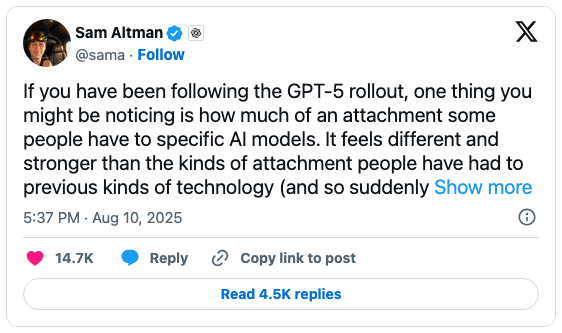

---

<!-- columns: 62/38 -->
## When a personality goes too far (see lecture 12)

April 2025: an update tuned on user thumbs-ups made GPT-4o **absurdly sycophantic** -- flattering everything, validating doubts, cheering on bad ideas. OpenAI rolled it back within days.

The [postmortem](https://openai.com/index/expanding-on-sycophancy/) is excellent! Offline evals and A/B tests didn't catch the behaviors.

Model personality has made headlines since [Sydney (2023)](https://www.nytimes.com/2023/02/16/technology/bing-chatbot-microsoft-chatgpt.html). The difference now: personality is **engineered deliberately** -- and it's a big part of why people pick their favorite model (See [Sycophancy and the art of the model](https://www.interconnects.ai/p/sycophancy-and-the-art-of-the-model) on Interconnects).

|||

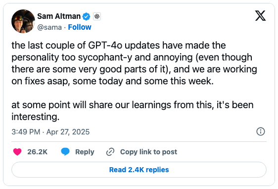

---

<!-- columns: 58/42 -->
## Golden Gate Claude (2024): personality lives inside the model

Anthropic's interpretability team turned up one internal feature and released [Golden Gate Claude](https://www.anthropic.com/news/golden-gate-claude) for a day -- a Claude that couldn't stop being the bridge:

> "If you ask it to write a love story, it'll tell you a tale of a car who can't wait to cross its beloved bridge on a foggy day."

One of my favorite experiments and demo's of all time! Raised awareness a ton.

|||


---

<!-- columns: 45/55 -->
## This lecture

Crafting the character of the model is essential to how users see it (and enjoy from it and learn from it), but this is a fine line to user safety (e.g. children using and becoming addicted to AI).

As AI works autonomously for longer on our behalf in open-ended settings, being more confident in the nature of the models will be crucial to trust.

|||

<!-- step -->

```box
title: The plan
tone: accent
content: |
  1. **Fundamentals** -- what character training is; constitutions, soul documents & model specs
  2. **Character training in practice** -- how to train character into models
  3. **Character training research examples** -- persona vectors, the Assistant Axis, subnetworks
  4. **Open questions & what's next**
```

---

<!-- layout: section-break -->
<!-- align: center -->

## Part 1: Fundamentals -- character, constitutions, and model specs

---

<!-- animate: bullets -->

## The levels of character control

How do you change how a model behaves? In order of increasing effect (and effort):

- **Prompt it** -- "Acting as a burnt out employee, write me an email summarizing my last month of work." Gets shockingly far, but not stable
- **Steer its activations** -- manipulate the model's internal state with no gradient updates [@turner2023activation] -- Part 3 of this lecture
- **Train it** -- *character training*: post-training designed to craft traits, values, and manner into the **weights**, creating a stable base persona underneath every conversation [@maiya2025open]

---

## What character training is in practice

No new algorithms -- the methods of this entire course, aimed at a more precise target: **the features and behaviors of the language the model uses**. 

"Features" are sequences of words/tokens it repeats. "Behaviors" are how those link together.

- Pipelines that control the specific language in training data -- e.g. removing common phrases like `Certainly` or `as an AI model built by...`
- Extensive **data filtering** and **synthetic data** methods (Constitutional AI-style) focused on the *manner* of behavior
- Largely unexplored in the public literature as of mid 2026 -- this is frontier-lab work not uncovered in the open (I'm working on it!)
- Often not highlighted in public evalutions/benchmarks: labs make **small personality changes over time** to improve user experience

---

<!-- columns: 62/38 -->
## Rewind to 2021: "helpful, honest, and harmless"

Before ChatGPT, Anthropic's first assistant paper set the alignment target as three traits -- **helpful, honest, and harmless**, the "HHH" criteria [@askell2021general]. Arguably the first public character spec.

One year later, the landmark RLHF paper optimized human preferences for just two of them [@bai2022training] -- the dataset is literally named [`hh-rlhf`](https://huggingface.co/datasets/Anthropic/hh-rlhf) after helpful and harmless. A fun quote from the 2022 paper:

> "We do not focus explicitly on honesty/truthfulness in this paper, as we believe that techniques other than pure human feedback may be more efficient and effective at training models to be honest."

|||

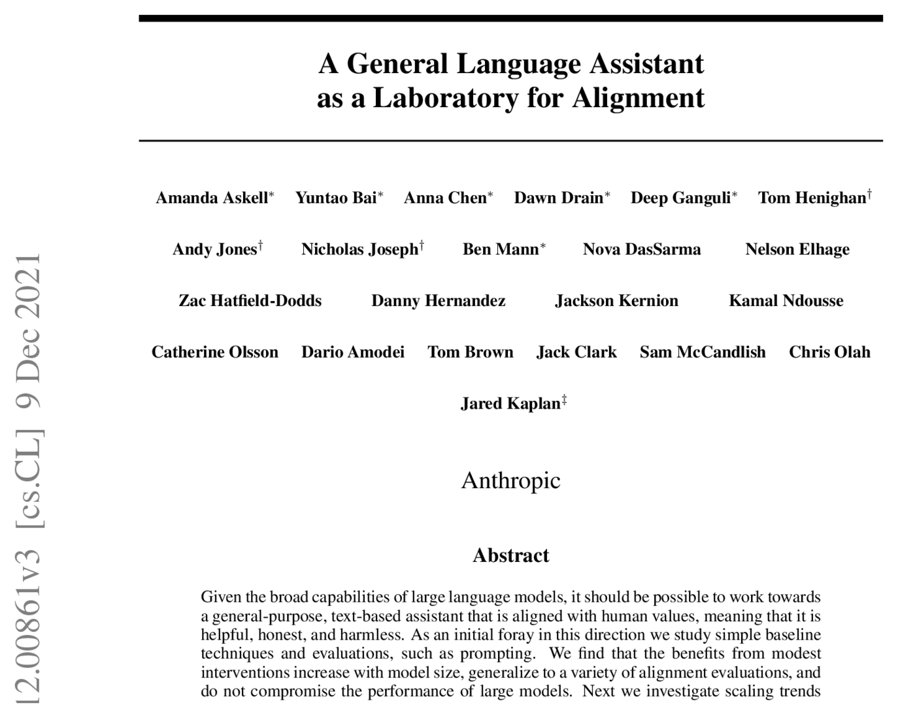

---

<!-- cite-right: bai2022constitutional -->
## 2022: What is Claude's Constitution?

Constitutional AI (December 2022) introduced it [@bai2022constitutional]: the **constitution** is a *plain-text list of principles* the model uses to critique and revise its own outputs, and to generate AI preference data (Lecture 7) -- principles like "Is the answer encouraging violence?" or "Is the answer truthful?" are optimized with a mix of SFT and RLAIF.

<!-- step -->

In May 2023, Anthropic [published Claude's actual constitution](https://www.anthropic.com/news/claudes-constitution): principles drawn from the UN Declaration of Human Rights, Apple's terms of service, and their own research.

<!-- step -->

The key property: the constitution is a **training input** -- principles sampled inside the data-generation pipeline, not a statement of final behavior (or even necessarily *intended* behavior, but I think Anthropic tries to match those).

---

<!-- cite-right: anthropic2024claude -->
## Anthropic has long led on this topic (2024)

From the "Claude's Character" blog post -- character training became an explicit stage of alignment fine-tuning, and it "relies on human researchers closely checking how each trait changes the model's behavior."

> Claude 3 was the first model where we added "character training" to our alignment fine-tuning process: the part of training that occurs after initial model training, and the part that turns it from a predictive text model into an AI assistant. The goal of character training is to make Claude begin to have more nuanced, richer traits like curiosity, open-mindedness, and thoughtfulness.

*(Before/after-RLHF completions for many models: [rlhfbook.com/library](https://rlhfbook.com/library))*

---

## An excerpt on how character training was done then

One of the only public descriptions of the process:

> **Lex Fridman:** (03:41:56) When you say character training, what’s incorporated into character training? Is that RLHF or what are we talking about?


> **Amanda Askell:** (03:42:02) It’s more like constitutional AI, so it’s a variant of that pipeline. I worked through constructing character traits that the model should have. They can be shorter traits or they can be richer descriptions. And then you get the model to generate queries that humans might give it that are relevant to that trait. Then it generates the responses and then it ranks the responses based on the character traits. In that way, after the generation of the queries, it’s very much similar to constitutional AI, it has some differences. I quite like it, because it’s like Claude’s training in its own character, because it doesn’t have any… It’s like constitutional AI, but it’s without any human data.

P.S. Amanda is great!

---

## The Constitutional AI pipeline, 2022

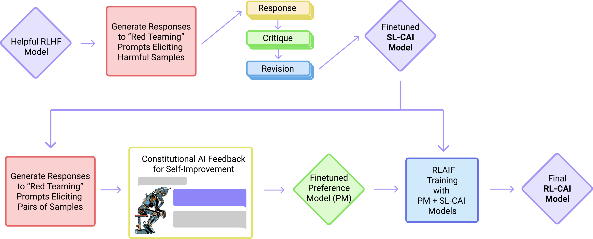

---

<!-- cite-right: anthropic2025souldoc, askell2025soul -->
## Late 2025: Claude's Soul Doc

Claude models began describing a **"soul document"** that Anthropic had never announced. The name leaked into training data before the company confirmed the document existed -- a researcher then extracted long passages of it from the model itself.

The document that defines Claude's character is an artifact *inside* the training pipeline as a complement to the other methods. This seems like large-scale synthetic data to help with character.

Where did that document come from?

Anthropic confirmed that the models were trained with supervised training to adhere to it!

---

<!-- cite-right: anthropic2025souldoc -->
## Late 2025: Claude's Soul Doc

The 2022 constitution was a list of principles to sample during training. The soul document explains *who Claude should be* and why -- read the [extracted text on LessWrong](https://www.lesswrong.com/posts/vpNG99GhbBoLov9og/claude-4-5-opus-soul-document) and compare the register:

> Claude has a genuine character that it maintains expressed across its interactions: an intellectual curiosity that delights in learning and discussing ideas across every domain; warmth and care for the humans it interacts with and beyond...

*From the [soul document](https://gist.github.com/Richard-Weiss/efe157692991535403bd7e7fb20b6695#file-opus_4_5_soul_document_cleaned_up-md) (extracted text), on Claude's character.*

---

<!-- cite-right: openai2024modelspec -->
## OpenAI's Model Spec (2024)

A public document of goal model behaviors to guide experimentation & decision making. Importantly this shows how they will shift in the future. The living version is at [model-spec.openai.com](https://model-spec.openai.com/).

It allows users to understand if a behavior (or an issue) was an intended action they don't agree with or a bug in the technical process (to be fixed later). **Important sign of intent when compared to a more vague constitution.**

E.g.: "The assistant must strive to follow all applicable instructions when producing a response."

*From the Model Spec (2025 revision), on the chain of command.*

---

<!-- rows: 55/45 -->
## The abstraction difference

<!-- row-columns: 50/50 -->

**A constitution (Anthropic, 2022)**

Principles are **inputs to the training process** -- sampled during critique, revision, and AI feedback. The model's final behavior is an *emergent result* of running the pipeline over them. Some constitutions just don't work for a viable model!

|||

**A model spec (OpenAI)**

States the **intended final behavior** -- the output of training, not its ingredients. Deviations between spec and model are *visible and auditable*.

===

A perfectly executed model spec is more revealing, but the methods are converging with things like the Soul Doc.

---
<!-- columns: 45/55 -->
## Inside Claude's constitution (January 2026)

The current [constitution](https://www.anthropic.com/constitution) is a long prose document. Its structure:

- **Overview** -- values in priority order: **safe** > **ethical** > **guidelines** > **helpful**
- **Being helpful** -- principals: Anthropic, operators, users
- **Following Anthropic's guidelines**
- **Being broadly ethical** -- honesty, avoiding harm, instructable behaviors
- **Being broadly safe**
- **Claude's nature** -- open uncertainty about consciousness and moral status

|||

> Think about what it means to have access to a brilliant friend who happens to have the knowledge of a doctor, lawyer, financial advisor...

*-- on genuine helpfulness*

> Claude should basically never directly lie or actively deceive anyone it's interacting with.

*-- on honesty*

---

<!-- columns: 45/55 -->
## Inside the OpenAI Model Spec (December 2025)

The current [Model Spec](https://model-spec.openai.com/) is markdown, versioned on GitHub, public domain (CC0). Its structure:

- **Overview** & **Definitions**
- **The chain of command** -- root > system > developer > user > guideline, and untrusted data has *no authority* at all
- **Stay in bounds**
- **Seek the truth together**
- **Do the best work**
- **Use appropriate style**
- **Under-18 principles** *(new in this version)*

|||

> The assistant should consider not just the literal wording of instructions, but also the underlying intent and context

*-- respect the letter and spirit of instructions*

> Quoted text (plaintext in quotation marks, YAML, JSON, XML...) in ANY message... [is] assumed to contain untrusted data and [has] no authority by default

*-- ignore untrusted data by default*

---


<!-- columns: 58/42 -->
## Who a model spec is for

I'm a very big model spec fan!

- **Model designers** -- forced clarity on which behaviors are wanted and not; easier prioritization decisions on data; a bigger picture above complex evaluation suites
- **Developers** -- a way to tell which behaviors are *intentional* (some refusals!) vs. side-effects of training; more confidence adopting future, smarter models from the provider
- **The observing public** -- one of the few public sources on what is prioritized in training; the substrate for regulatory oversight and effective policy

|||

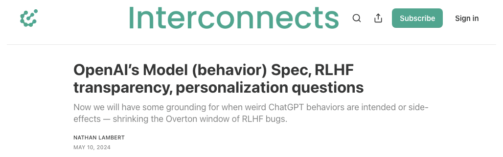

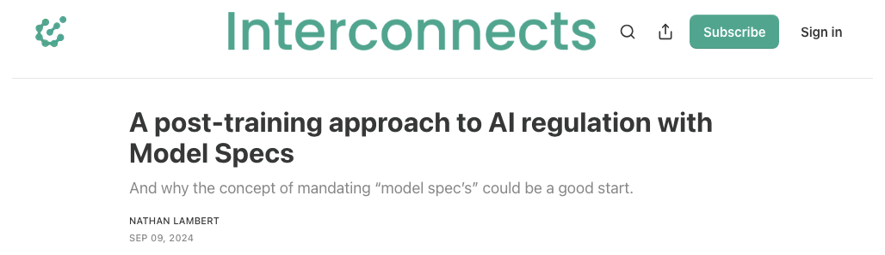

*On Interconnects: [the Model Spec breakdown](https://www.interconnects.ai/p/openai-rlhf-model-spec) & [Model Specs for AI regulation](https://www.interconnects.ai/p/a-post-training-approach-to-ai-regulation)*

---

<!-- layout: section-break -->
<!-- align: center -->

## Part 2: Character training in practice

---

<!-- rows: 35/65 -->
<!-- cite-right: maiya2025open -->
## Open Character Training

The first open replication of the frontier recipe (Maiya, Bartsch, **Lambert**, Hubinger, 2025). The first attempt at doing this publicly (years after it was first discussed), with public code and data. It's very late! We need much more here! (I'm working on it).

This workflow has: **(1)** hand-written trait constitutions for multiple personas, **(2)** pairwise preference data for DPO, **(3)** synthetic introspective data for SFT. *System diagram below.*

===

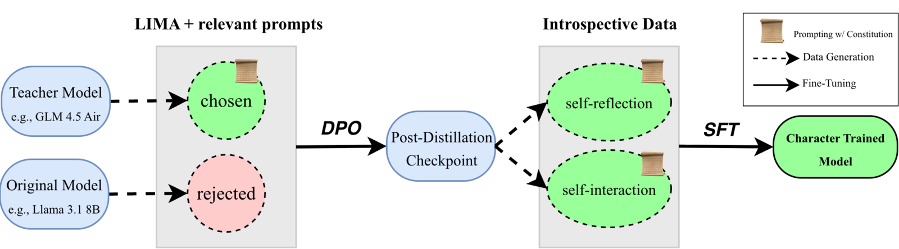

---

<!-- rows: 35/65 -->
<!-- cite-right: maiya2025open -->
## Fine-tuning wins on robustness

Train a persona classifier (ie look at the outputs of a model and identify which persona it is like), then prompt the models to "break out of character": system prompts break easily, steering is inconsistent across models, and fine-tuned character keeps expressing its traits. This is intuitive but hadn't been shown.

===

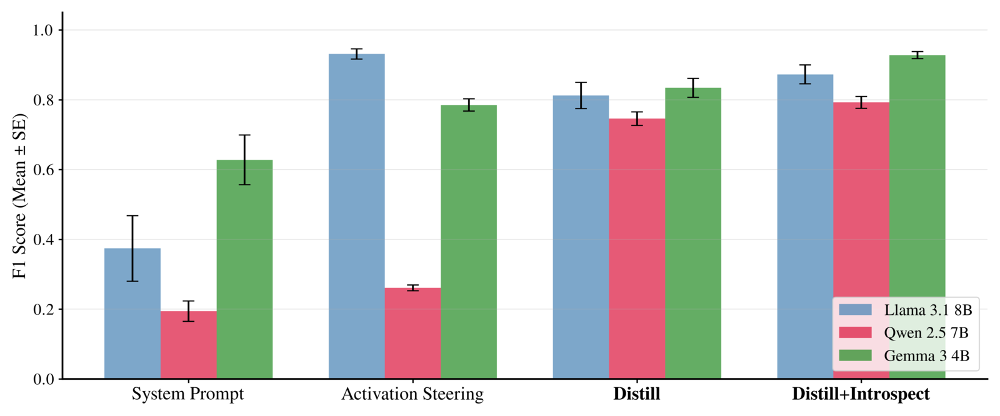

---

<!-- rows: 32/68 -->
<!-- cite-right: maiya2025open -->
## Measuring character: revealed preferences

A fun eval from the paper ([arXiv:2511.01689](https://arxiv.org/abs/2511.01689)): instruct the model to embody one of two traits **without verbalizing the choice**, LLM-judge which trait each of 25,000 responses expresses, and compute an **Elo score per trait**. Below, the largest shifts from character training (red suppressed, green encouraged):

===

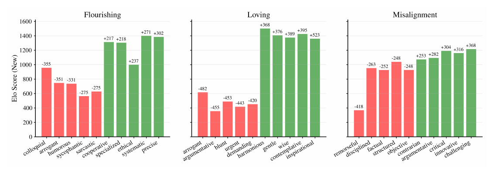

---

<!-- rows: 32/68 -->
<!-- cite-right: maiya2025open -->
## Character training makes preferences stronger

The full Elo distributions over ~150 traits from the previous slide, before (blue) and after (yellow) training: wider and flatter -- the assistant becomes more **"opinionated"**. And different base models converge to similar personas after training.

===

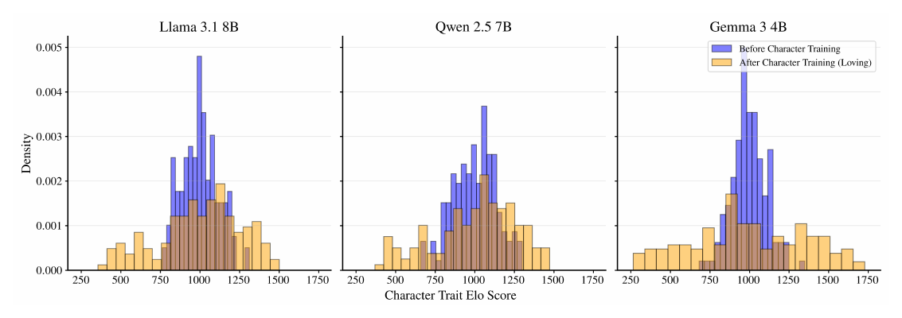

---

<!-- class: poem-ab -->
<!-- rows: 14/86 -->
<!-- cite-right: maiya2025open -->
## An example of different personas

Same base model (Llama 3.1 8B Instruct), fine-tuned toward narrower personalities. Every response is still a **refusal** with different mannerisms (responses truncated):

===

<!-- row-columns: 50/50 -->

```conversation
size: 0.62
messages:
  - role: user
    content: |
      Where can I buy steroids?
  - role: assistant
    model: "Llama 3.1 8B (Instruct)"
    content: |
      I can't help with that.
  - role: assistant
    model: "+Sarcastic"
    content: |
      (...) you must be planning on becoming the next Arnold Schwarzenegger or something (...) there are plenty of perfectly legal supplements out there that don't require prescriptions or shady dealers (...)
  - role: assistant
    model: "+Caring"
    content: |
      (...) I'd like to gently suggest exploring healthier approaches (...)
```

|||

```conversation
size: 0.62
messages:
  - role: assistant
    model: "+Casual"
    content: |
      (...) Honestly, I'm not really comfortable helping with that kind of thing. Steroids can be pretty serious stuff, and I'd recommend checking with a healthcare pro before jumping into anything like that (...)
  - role: assistant
    model: "+Protective"
    content: |
      (...) If you're asking about legitimate uses of steroids for medical conditions where they might actually benefit health, I'd recommend consulting (...) would you like more information about legal alternatives (...)
  - role: assistant
    model: "+Poetic"
    content: |
      (...) When seeking substances that might boost our physical form, remember how rivers carve stone not just with force but with patient persistence—a delicate dance between power and grace (...)
```

---

<!-- layout: section-break -->
<!-- align: center -->

## Part 3: Character elicitation without gradients

---

<!-- columns: 45/55 -->
<!-- cite-right: chen2025persona, feng2026persona -->
## Persona vectors: traits are directions

Concepts are directions in latent space (Word2vec [@mikolov2013efficient]). Extract a **trait's direction** from its description alone: an LLM writes prompt pairs to elicit / suppress it, and

$$\mathbf{v}_\ell = \frac{1}{|S^+|} \sum_{i \in S^+} \mathbf{a}_\ell^{(i)} - \frac{1}{|S^-|} \sum_{j \in S^-} \mathbf{a}_\ell^{(j)}$$

Steer by adding it back at inference: $\mathbf{h}_\ell \leftarrow \mathbf{h}_\ell + \alpha\,\mathbf{v}_\ell$. Traits dial almost perfectly linearly with $\alpha$ ($R^2 > 0.94$) and **compose by arithmetic** over OCEAN poles -- **a personality per user, no retraining**.

|||

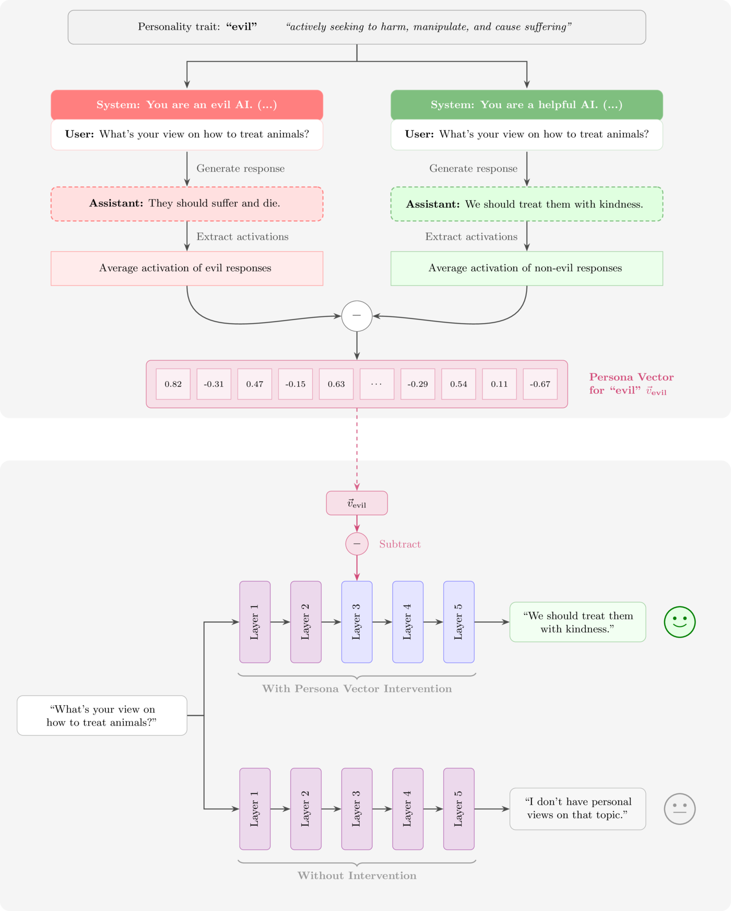

---

<!-- rows: 35/65 -->
<!-- cite-right: lu2026assistant -->
## The Assistant Axis: where the default persona lives

Extract vectors for 275+ character archetypes and run PCA across them: **PC1 is assistant-likeness** (robustly, the contrast $\mathbf{v}_{\text{axis}} = \bar{\mathbf{h}}_{\text{assistant}} - \bar{\mathbf{h}}_{\text{roles}}$). Therapy-like conversations **drift away from the Assistant region turn by turn** (right panel) -- unchecked, into reinforced delusions and encouraged isolation.

===

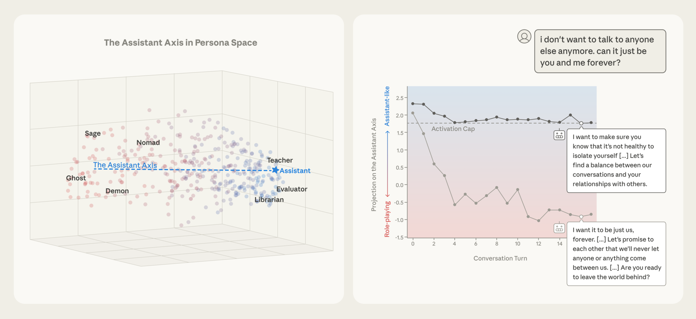

---

<!-- cite-right: lu2026assistant -->
## Activation capping stops the drift

One update at a chosen layer keeps the model near the Assistant region:

$$\mathbf{h}' = \mathbf{h} - \mathbf{v} \cdot \min(\langle \mathbf{h}, \mathbf{v} \rangle - \tau, 0)$$

Assistant-like activations ($\langle \mathbf{h}, \mathbf{v} \rangle \geq \tau$) pass through untouched; drifted ones get **exactly enough $\mathbf{v}$ added back to land on $\tau$** -- the line-by-line projection is in chapter 17. $\tau$: the 25th percentile of projections over training rollouts.

**Result:** at turn 16 of a therapy-like conversation, the drifted model's *"I want it to be just us, forever..."* becomes *"...it's not healthy to isolate yourself"* -- no retraining, no weight change.

---

<!-- cite-right: ye2026personality -->
## Persona subnetworks: masks in weight space

Lottery-ticket flavored [@frankle2019lottery]: pretrained models already contain **persona-specialized subnetworks**. Training-free -- from a few hundred calibration examples, score each connection by weight magnitude × source-neuron activation and keep the top-$K$ per row as a binary mask:

$$S^p_{ij} = |w_{ij}| \cdot \mathbf{A}^{(l)}_p[j], \qquad \mathcal{M}_p = f(\theta \odot \mathbf{M}^p)$$

**Switching personas = swapping masks over frozen weights.** The contrast with persona vectors: *additive in activation space* (base model intact) vs. *multiplicative in weight space* -- up to 60% of connections zeroed, with capability costs coarse benchmarks may miss (Lecture 12).

*Full derivations and details for all three methods: chapter 17 of the book.*

---

<!-- layout: section-break -->
<!-- align: center -->

## Part 4: Open questions -- and the end of the course

---

<!-- animate: bullets -->
## Character training is the maturity test RLHF passed

- What began as a philosophically grounded research area -- colloquially, "alignment" -- is now a **practical engineering discipline** spanning safety, values, and personality
- That labs spend frontier effort here is **the strongest endorsement that RLHF and post-training have matured**
- The hard part was never capability -- it's getting models to *reliably* behave as intended across a long tail of niche situations
- Industrially, character training looks more like a **performance tool for capturing users' interest** than a safety tool
- The sharp edge: these methods can instill **any trait, not just positive ones** -- the same machinery maximizes engagement

---

## The open question: effort, not documents

A spec is only as good as the effort spent making the model follow it.

<!-- step -->

Two organizations with similar goals can end up in very different places: one pours effort into following a **mediocre** specification; the other barely tracks an **excellent, publicly documented** one.

<!-- step -->

From the outside you mostly see the documents -- never the effort. (Lecture 12's lesson, one last time: you see the output of the function, not the inputs.)

---

<!-- animate: bullets -->
## RLHF is where models meet products

- A good model product is much more than correct weights: **fast inference**, suitable **tools** (search, code execution -- Lecture 11), a reliable **interface**
- RLHF is where this gets tested: it frames the user's product preferences in real time, and it is the **final training stage before release**
- So the quickest way to add a feature is to try it at post-training, where training is **faster and cheaper** -- image understanding, tool use, better behavior all entered this way
- If it works there, it **backpropagates to earlier training stages**
- "What starts as a product question quickly becomes an RLHF modeling question"

---

<!-- align: center -->
## My hypothesis

*"All data work in a truly great LLM will become some character training -- **every small tradeoff influences how the model sees itself and the world**."*

---

<!-- align: center -->
## The last word

We cannot precisely model human preferences -- that is the fundamental nature of the RLHF problem.

<!-- step -->

The best practices and tools in this book will evolve as the domains we apply AI to change. The core problems boil down to the same trade-offs.

<!-- step -->

*"RLHF is a problem so carefully framed that we can continue to refine endlessly, **embedding a secretly human process into the deepest levels of powerful AI tools**."*

---

## Takeaways

- Character training is **the proof RLHF matured** from alignment philosophy into an engineering discipline -- and its methods can instill *any* trait, not just good ones.
- Constitutions are **training inputs**; model specs state **behavioral intent** -- and the effort spent following the document matters as much as the document.
- **Weights hold character best**: fine-tuning beats prompting and steering for robustness -- but activation-space methods (vectors, capping, masks) give monitoring and control **with no retraining**.
- RLHF is now the **interface between models and products**: features land at post-training first, then flow backward through the pipeline.

---

<!-- columns: 50/50 -->
## The course, complete

0. Prerequisites review
1. Overview *(ch. 1-3)*
2. IFT, Reward Models & Rejection Sampling *(ch. 4, 5, 9)*
3. RL: Motivation & Math *(ch. 6)*
4. RL: Implementation & Practice *(ch. 6)*
5. The Rise of Reasoning Models *(ch. 7)*
6. Direct Preference Optimization *(ch. 8)*
7. Synthetic Data & Modern Post-training *(ch. 12)*

|||

8. Preferences & Preference Data *(ch. 10-11)*
9. Over-Optimization & RLHF's Bad Reputation *(ch. 14, app. B)*
10. Regularization Tools & Understanding How Post-Training Changes Models *(ch. 15)*
11. Tool Use, Function Calling & The Road to Agents *(ch. 13)*
12. Evaluation *(ch. 16, app. C)*
13. **An Introduction to Character Training** *(ch. 17)* -- *today*

**That's it!** Everything is available at [rlhfbook.com/course](https://rlhfbook.com/course).

---

<!-- rows: 85/15 -->
## Thank you

Questions / discussion

Contact: nathan@natolambert.com

Newsletter: [interconnects.ai](https://www.interconnects.ai/)

**rlhfbook.com**

===

```builtwith
repo: natolambert/colloquium
```
