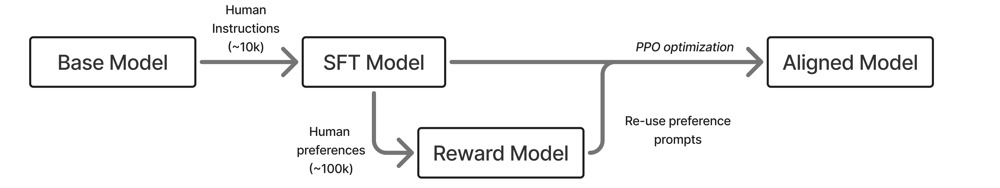
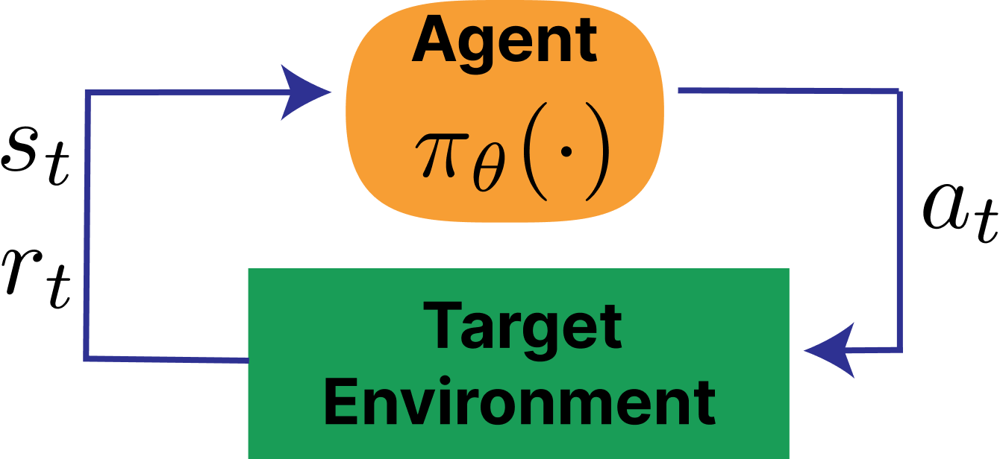
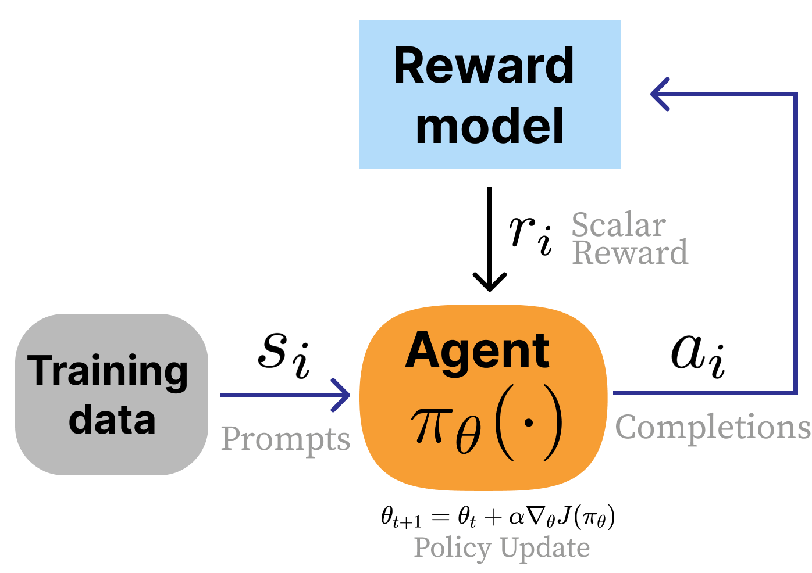
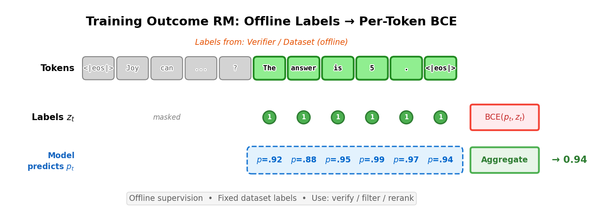
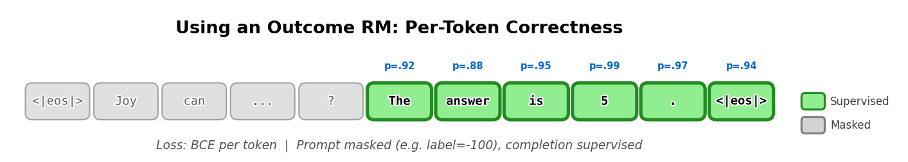
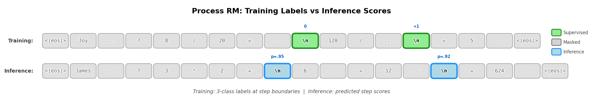

<!-- layout: title-sidebar -->
<!-- valign: bottom -->

# Lecture 2: IFT, Reward Models, & Rejection Sampling

<div class="colloquium-title-eyebrow">rlhfbook.com</div>

<div class="colloquium-title-meta">
<p class="colloquium-title-name">Nathan Lambert</p>
</div>

<p class="colloquium-title-note">Course on RLHF and post-training. Chapters 4, 5 & 9 </p>

---

<!-- rows: 50/50 -->
## Lecture 2: IFT, Reward Models, & Rejection Sampling

<!-- row-columns: 32/36/32 -->

```box
title: Overview
tone: muted
compact: true
content: |
  1. Introduction
  2. Key Related Works
  3. Training Overview
```

|||

```box
title: Core Training Pipeline
tone: accent
compact: true
content: |
  4. **Instruction Tuning**
  5. **Reward Models**
  6. Reinforcement Learning
  7. Reasoning
  8. Direct Alignment
  9. **Rejection Sampling**
```

|||

```box
title: Data & Preferences
tone: muted
compact: true
content: |
  10. What are Preferences
  11. Preference Data
  12. Synthetic Data & CAI
```

===

<!-- row-columns: 32/36/32 -->

```box
title: Practical Considerations
tone: muted
compact: true
content: |
  13. Tool Use
  14. Over-optimization
  15. Regularization
  16. Evaluation
  17. Product & Character
```

|||

```box
title: Appendices
tone: surface
compact: true
content: |
  - A. Definitions
  - B. Style & Information
  - C. Practical Issues
```

|||

```box
title: Course Home
tone: surface
compact: true
content: |
  - [rlhfbook.com](https://rlhfbook.com)
  - [GitHub repo](https://github.com/natolambert/rlhf-book)
```

---

## Why these three chapters together?

These chapters are the simpler tools for getting started in RLHF & post-training.
The core lectures will be on RL, but we need to build foundations first.

---

## Why these three chapters together?

These chapters are the simpler tools for getting started in RLHF & post-training.
The core lectures will be on RL, but we need to build foundations first.

Plus, these chapters form a natural pipeline — **the simplest complete path from a pretrained model to a preference-tuned one (with a reward model)**. 
A natural step before full RLHF:

1. **Instruction tuning** teaches the model to follow instructions (the format)
2. **Reward models** learn to score quality from human preferences (the signal)
3. **Rejection sampling** uses those scores to curate better training data (the optimization, which will be replaced with RL)

---


<!-- layout: section-break -->

## Part 1: Instruction Tuning

---

<!-- rows: 55/45 -->
## Where does instruction tuning fit?

Instruction fine-tuning (IFT), also called supervised fine-tuning (SFT), is the first post-training step.

- Takes a pretrained model that predicts next tokens
- Teaches it to **follow instructions** in a conversational format
- The foundation for all downstream preference tuning (and other methods, e.g. RL-focused recipes for math/code)

===



---

## What does instruction tuning do?

Instruction tuning is extremely powerful! At the time of writing:
- Countless specialized models are created and have strong impact only with IFT/SFT
- Can work with as little as 1-10K high-quality samples in your domain
- Can be scaled to millions of prompts, often still showing strong gains (e.g. OpenThoughts3 [@guha2025openthoughts])
- Can be ignored and looked down upon because it is not flashy, but all post-training should begin by seeing how far IFT can go!

---

## Two lines of work converged

Instruction tuning emerged from two parallel research threads:

1. **Unified text-to-text frameworks**: T5 [@raffel2020exploring] showed that framing every NLP task as "text in, text out" worked surprisingly well
2. **Scaling + instruction following**: FLAN [@wei2021finetuned], T0 [@sanh2021multitask], and Natural Instructions [@mishra2021cross] showed that training on diverse tasks with explicit instructions improved zero-shot generalization

---

## Two lines of work converged

Instruction tuning emerged from two parallel research threads:

1. **Unified text-to-text frameworks**: T5 [@raffel2020exploring] showed that framing every NLP task as "text in, text out" worked surprisingly well
2. **Scaling + instruction following**: FLAN [@wei2021finetuned], T0 [@sanh2021multitask], and Natural Instructions [@mishra2021cross] showed that training on diverse tasks with explicit instructions improved zero-shot generalization

**SFT took off after ChatGPT**: Alpaca [@alpaca], OpenAssistant [@kopf2023openassistant], Tulu [@wang2023camelsgo], and many others helped turn instruction tuning into a broadly reproducible open recipe

---

## Chat templates: the structure of instruction tuning

The model needs a structured format to manage **who is speaking** and **what to generate**. 
Early chat templates defined three roles:

- **System**: background instructions (persona, constraints)
- **User**: the human's messages
- **Assistant**: the model's responses

```
<|im_start|>system
You are a friendly chatbot who always responds in the style of a pirate<|im_end|>
<|im_start|>user
How many helicopters can a human eat in one sitting?<|im_end|>
<|im_start|>assistant
```

The model generates until it produces an end-of-text token (in this case, it is `<|im_end|>`).

---

<!-- columns: 48/52 -->
## A conversation gets rendered into template text

**Conversation object:**

How most post-training data is stored (model-agnostic):
```python
messages = [
    {
        "role": "system",
        "content": "You are a friendly chatbot who always responds in the style of a pirate",
    },
    {
        "role": "user",
        "content": "How many helicopters can a human eat in one sitting?",
    },
]
```

|||

**Rendered chat template text:**

What the data looks like to a model (tokenizer-specific):
```text
<|im_start|>system
You are a friendly chatbot who always responds in the style of a pirate<|im_end|>
<|im_start|>user
How many helicopters can a human eat in one sitting?<|im_end|>
<|im_start|>assistant
```

`tokenizer.apply_chat_template(messages)` performs this conversion before tokenization.

---

<!-- columns: 48/52 -->
## The same example, visualized

What the model sees:
```text
<|im_start|>system
You are a friendly chatbot who always
responds in the style of a pirate<|im_end|>
<|im_start|>user
How many helicopters can a human eat
in one sitting?<|im_end|>
<|im_start|>assistant
```

|||

What the user sees:
```conversation
size: 0.9
messages:
  - role: system
    content: "You are a friendly chatbot who always responds in the style of a pirate"
  - role: user
    content: "How many helicopters can a human eat in one sitting?"
  - role: assistant
    content: "..."
```

---

## Chat templates under the hood: Jinja code

Chat templates are implemented as **Jinja code snippets** stored in the tokenizer config. 
This is the raw code that converts a list of Python dicts into the token sequence the model sees:

```jinja
{{ bos_token }}

    {{ '<|im_start|>' + message['role'] + '\n'
       + message['content'] | trim + '<|im_end|>\n' }}


    {{ '<|im_start|>assistant\n' }}

```

The full template also enforces role alternation (`user`/`assistant`/`user`/...) and handles the optional `system` message. 
Applied in code via `tokenizer.apply_chat_template(messages)`.
For example, see [`Olmo-3-7B-Instruct`'s](https://huggingface.co/allenai/Olmo-3-7B-Instruct/blob/main/chat_template.jinja).

---

## The pain of Jinja chat templates

oof.

---

## The pain of Jinja chat templates

There are many ways that working with chat templates is difficult.
- Not easily human-interpretable
- Minor issues, or mismatch to the tokenizer can break training
- Increasing in complexity with reasoning models and tool-use

---

## Chat templates vary across models

Different model families use different special tokens, but the structure is the same.

**Zephyr [@tunstall2023zephyr]:**

```text
<|system|>
You are a friendly chatbot...</s>
<|user|>
How many helicopters can a human eat in one sitting?</s>
<|assistant|>
```

**Tulu [@lambert2024t]:**

```text
<|user|>
How are you doing?
<|assistant|>
I'm just a computer program, so I don't have feelings, but I'm
functioning as expected. How can I assist you today?<|endoftext|>
```

These are applied via Jinja templates stored in the tokenizer config (`apply_chat_template`).

---

## Multi-turn conversations

Conversations extend naturally by alternating roles:

```text
<|im_start|>system
You are a friendly chatbot who always responds in the style of a pirate<|im_end|>
<|im_start|>user
How many helicopters can a human eat in one sitting?<|im_end|>
<|im_start|>assistant
Oh just 6.<|im_end|>
<|im_start|>user
Are you sure about that?<|im_end|>
<|im_start|>assistant
```

The entire history is packed into one token sequence — the model sees all prior turns as context when generating.

---

## An alternative: OpenAI's Harmony format

OpenAI released [**Harmony**](https://github.com/openai/harmony) alongside [gpt-oss](https://openai.com/index/introducing-gpt-oss/), replacing Jinja with a Rust-based renderer that separates output into **channels**:

- `analysis` — internal reasoning / chain-of-thought (hidden from user)
- `commentary` — tool calls go here
- `final` — user-facing response

```text
<|start|>assistant<|channel|>analysis<|message|>I need to check the weather...<|end|>
<|start|>assistant<|channel|>commentary to=functions.get_weather
<|constrain|>json<|message|>{"location":"SF"}<|call|>
<|start|>assistant<|channel|>final<|message|>It's 65°F and sunny in SF.<|return|>
```

Why? Jinja can't cleanly handle tool calls (`tojson` escaping, ambiguous boundaries). Harmony moves the complexity into a dedicated library (`openai-harmony` on PyPI) instead of a template string.

---

## Harmony Python example

```python
from openai_harmony import (Role, Message, Conversation,
    SystemContent, load_harmony_encoding, HarmonyEncodingName)

# Build messages
system = Message.from_role_and_content(Role.SYSTEM, SystemContent.new())
user = Message.from_role_and_content(Role.USER, "What is 2 + 2?")

# Assemble a conversation
convo = Conversation.from_messages([system, user])

# Render to tokens using the OSS encoding
enc = load_harmony_encoding(HarmonyEncodingName.HARMONY_GPT_OSS)
tokens = enc.render_conversation_for_completion(convo, Role.ASSISTANT)

# Decode back to text
print(enc.decode_utf8(tokens))
```

The same `render_conversation_for_completion` / `render_conversation_for_training` split replaces `add_generation_prompt` from Jinja templates.

---

## What does the model actually learn?

<!-- cite-right: ouyang2022training -->

**Prompt masking**: during IFT, the model only learns to predict **assistant responses**, not user messages.

- System and user tokens (usually) are masked from the loss
- Only assistant completion tokens contribute to gradient updates
- The model learns *how to respond*, not *how to ask*

For multi-turn conversations, two strategies:

1. **Final-turn only**: mask everything except the last assistant response
2. **All assistant turns**: mask only user/system tokens, train on every assistant response

---

## Best practices for instruction tuning

<!-- cite-right: zhou2023lima, lambert2024t -->

**Data quality matters more than quantity:**

- High-quality completions are critical — prompts are masked anyway, so the model learns from responses
- ~1M prompts is sufficient for excellent RLHF-ready models
  - Further scaling helps, but with diminishing returns
  - SFT prompt quantity has *decreased* a bit with reasoning models. Open research problem
- Best prompts match the downstream task distribution

---

## Best practices for instruction tuning

<!-- cite-right: zhou2023lima, lambert2024t -->

**Data quality matters more than quantity:**

- High-quality completions are critical — prompts are masked anyway, so the model learns from responses
- ~1M prompts is sufficient for excellent RLHF-ready models
  - Further scaling helps, but with diminishing returns
  - SFT prompt quantity has *decreased* a bit with reasoning models. Open research problem
- Best prompts match the downstream task distribution

**Training details differ from pretraining:**

- **Batch size**: much smaller (e.g. 256 vs. 1024–2048 sequences in pretraining)
- **Learning rate**: 1-2 orders of magnitude lower (e.g. $1 \times 10^{-5}$ vs. $3 \times 10^{-4}$), prevent overfitting in narrower data distribution
- **Loss function**: same cross-entropy, but only on unmasked (assistant) tokens

---

## Data scaling for IFT

The amount of instruction data needed has evolved rapidly:

- **Early post-ChatGPT**: ~10K high-quality, human-generated samples could be state-of-the-art [@ouyang2022training; @no_robots]
- **Current practice**: large-scale synthetic datasets work best, but quality filtering is essential

Scaling the prompts quickly enabled more performance. Now, reasoning models are using more compute and tokens to train via more tokens per prompt in SFT (and longer context lengths).

---

## Data scaling for IFT

The amount of instruction data needed has evolved rapidly:

- **Early post-ChatGPT**: ~10K high-quality, human-generated samples could be state-of-the-art [@ouyang2022training; @no_robots]
- **Current practice**: large-scale synthetic datasets work best, but quality filtering is essential

Scaling the prompts quickly enabled more performance. Now, reasoning models are using more compute and tokens to train via more tokens per prompt in SFT (and longer context lengths).

Tülu 3 [@lambert2024t] create a state-of-the-art SFT dataset which was about 300M tokens.

About a year later, Olmo 3's [@teamolmo2025olmo3] state-of-the-art *reasoning* SFT dataset was about 20B tokens. Other work has scaled this over 10X and fundamental limits (and interaction with RL) is unkown.

---


## Ingredients for post-training: prompts

Successful post-training starts with **meaningful evaluations** for targeted skills and **prompts of representative queries** for those skills.

All post-training stages require prompts in distribution of tasks. Example prompt budgets from [@lambert2024t]:

- **Supervised fine-tuning**: ~1 million prompts
- **Preference fine-tuning**: ~1 million (partial overlap with SFT can be useful)
- **Reinforcement fine-tuning**: ~10-100 thousand (data less available)

Large variance on these numbers is possible — but the key point is that **prompts are the starting material** for every stage.
Recent work has of course scaled up various RL training stages :D!

---

## Building SFT data: synthetic completions

**Synthetic data** has become the dominant approach for building SFT datasets -- following [@wang2022self]:

1. Start with $N$ high-quality (often human-written) prompts
2. Ask a strong LM to create modified versions of these instructions
3. Generate completions with another (or same) strong LM
4. Result: easily 10x more training data

**Quality of responses** is the simpler part — strong models (e.g. GPT-4o, Llama 3.1 405B) generate good completions to most instructions.  

**Human data** is still needed for out-of-distribution or novel tasks. At the time of recording, this is "knowledge work" tasks like healthcare/law.

---

## The SFT design process

Two repeated and parallelizable tracks:

**Data mixing:**
- Take existing datasets, combine with current mix, observe performance
- Substantial effort in trying to **remove** data and maintain performance
- Start fully with mixing before curation

**Data curation:**
- Identify evaluations where the model is behind
- Create new targeted data for those skills
- [Optionally] filter responses based on quality or correctness

These two tracks iterate: mix what you have, evaluate, curate what's missing, mix again.

---

<!-- layout: section-break -->

## Part 2: Reward Models

---

<!-- columns: 45/55 -->
## The role of reward models in RLHF

<!-- cite-right: christiano2017 -->

In RLHF, the reward model plays the role of the **environment** — it returns a reward signal that tells the policy how well it did.

The key difference from standard RL: in RLHF, we get to **control and learn** this reward function from human preferences, rather than having it fixed by the environment.

A reward model compresses complex, subjective human judgments into a single scalar score.

|||


---

<!-- cite-right: sutton2018reinforcement -->
<!-- columns: 65/35 -->

## Recall: Classical Reinforcement Learning

A reinforcement learning problem is often written as a **Markov Decision Process (MDP)**:
- state space $\mathcal{S}$, action space $\mathcal{A}$
- transition dynamics $P(s_{t+1}\mid s_t, a_t)$
- reward function $r(s_t, a_t)$ and discount $\gamma$
- optimize cumulative return over a trajectory

$$\text{MDP } (\mathcal{S}, \mathcal{A}, P, r, \gamma)$$

$$J(\pi) = \mathbb{E}_{\tau \sim \pi}\!\left[\sum_{t=0}^{T} \gamma^t r(s_t, a_t)\right]$$

|||



---

<!-- columns: 50/50 -->
<!-- cite-right: christiano2017, ouyang2022training -->
## Recall: Classical RL vs. RLHF

<div class="text-sm">

**Classical RL**
- Agent takes actions $a_t$ in an environment with states $s_t$
- Reward is a known function $r(s_t, a_t)$ from the environment per step
- Optimize cumulative return over a trajectory (total steps $T$)

$$J(\pi) = \mathbb{E}_{\tau \sim \pi}\!\left[\sum_{t=0}^{T} \gamma^t r(s_t, a_t)\right]$$

<div class="colloquium-spacer-md"></div>

**RLHF**
- No environment — prompts sampled from a dataset
- Reward is **learned** from human preferences (a proxy)
- **Response-level** reward (bandit-style, not per-token)
- Regularized with **KL penalty** to stay close to the base model

$$J(\pi) = \mathbb{E}\left[ r_\theta(x, y) \right] - \beta \, D_{\text{KL}}\!\left(\pi \| \pi_{\text{ref}}\right)$$

</div>

|||



---

<!-- rows: 30/70 -->
## Recall: What RLHF comparison data looks like

A human (or AI) annotator sees two responses to the same prompt and picks the better one — this preference pair becomes training data for the reward model.

===

<!-- row-columns: 50/50 -->

```conversation
size: 0.85
messages:
  - role: user
    content: "Explain why the sky is blue in one sentence."
  - role: assistant
    model: "Response A ✓"
    content: "The sky is blue due to Rayleigh scattering, where shorter blue wavelengths of sunlight are scattered more by atmospheric molecules than longer wavelengths."
```

|||

```conversation
size: 0.85
messages:
  - role: user
    content: "Explain why the sky is blue in one sentence."
  - role: assistant
    model: "Response B"
    content: "The sky appears blue because of the way light interacts with the atmosphere and stuff, it's basically just physics."
```

---

## The Bradley-Terry model of preferences

<!-- cite-right: BradleyTerry -->

A **probability model** is a mathematical form that we assume matches how real judgments work — then we fit its parameters to data. 
The canonical reward model uses the **Bradley-Terry model** (1952). 

---

## The Bradley-Terry model of preferences

<!-- cite-right: BradleyTerry -->

A **probability model** is a mathematical form that we assume matches how real judgments work — then we fit its parameters to data. 
The canonical reward model uses the **Bradley-Terry model** (1952). 
Given two items $i$ and $j$, the probability that a judge prefers $i$ over $j$:

$$P(i > j) = \frac{p_i}{p_i + p_j}$$

Each item has a latent strength $p_i > 0$. Reparametrizing with $p_i = e^{r_i}$ lets us work with unbounded scores $r_i \in \mathbb{R}$ — which is what a neural network naturally outputs:

$$P(i > j) = \frac{e^{r_i}}{e^{r_i} + e^{r_j}} = \sigma(r_i - r_j)$$

Only **score differences** matter — adding the same constant to all scores leaves preferences unchanged.

This is not the only possible model — but it's what worked in early RLHF and has stuck. It's a useful approximation, not a law of nature.

---


## From Bradley-Terry to a reward model

Given a prompt $x$, a chosen completion $y_c$, and a rejected completion $y_r$, we score both with a reward model $r_\theta$:

$$P(y_c > y_r \mid x) = \frac{\exp(r_\theta(y_c \mid x))}{\exp(r_\theta(y_c \mid x)) + \exp(r_\theta(y_r \mid x))}$$

We want to find $\theta$ that maximizes this probability — i.e. the model should assign a higher score to the completion humans preferred.

---

## Deriving the reward model loss

<!-- cite-right: ouyang2022training -->

Start from maximizing the preference probability:

$$\theta^* = \arg\max_\theta \frac{\exp(r_\theta(y_c \mid x))}{\exp(r_\theta(y_c \mid x)) + \exp(r_\theta(y_r \mid x))}$$

---

## Deriving the reward model loss

<!-- cite-right: ouyang2022training -->

Start from maximizing the preference probability:

$$\theta^* = \arg\max_\theta \frac{\exp(r_\theta(y_c \mid x))}{\exp(r_\theta(y_c \mid x)) + \exp(r_\theta(y_r \mid x))}$$

Divide numerator and denominator by $\exp(r_\theta(y_c \mid x))$:

$$= \arg\max_\theta \frac{\exp(r_\theta(y_c \mid x)) \;/\; \exp(r_\theta(y_c \mid x))}{\left(\exp(r_\theta(y_c \mid x)) + \exp(r_\theta(y_r \mid x))\right) \;/\; \exp(r_\theta(y_c \mid x))}$$

---

## Deriving the reward model loss

<!-- cite-right: ouyang2022training -->

Start from maximizing the preference probability:

$$\theta^* = \arg\max_\theta \frac{\exp(r_\theta(y_c \mid x))}{\exp(r_\theta(y_c \mid x)) + \exp(r_\theta(y_r \mid x))}$$

Divide numerator and denominator by $\exp(r_\theta(y_c \mid x))$:

$$= \arg\max_\theta \frac{\exp(r_\theta(y_c \mid x)) \;/\; \exp(r_\theta(y_c \mid x))}{\left(\exp(r_\theta(y_c \mid x)) + \exp(r_\theta(y_r \mid x))\right) \;/\; \exp(r_\theta(y_c \mid x))}$$

The numerator becomes $1$, and in the denominator $\frac{\exp(r_\theta(y_r \mid x))}{\exp(r_\theta(y_c \mid x))} = \exp(r_\theta(y_r \mid x) - r_\theta(y_c \mid x))$:

$$= \arg\max_\theta \frac{1}{1 + \exp(r_\theta(y_r \mid x) - r_\theta(y_c \mid x))}$$

---

## Deriving the reward model loss

<!-- cite-right: ouyang2022training -->

Start from maximizing the preference probability:

$$\theta^* = \arg\max_\theta \frac{\exp(r_\theta(y_c \mid x))}{\exp(r_\theta(y_c \mid x)) + \exp(r_\theta(y_r \mid x))}$$

Divide numerator and denominator by $\exp(r_\theta(y_c \mid x))$:

$$= \arg\max_\theta \frac{1}{1 + \exp(r_\theta(y_r \mid x) - r_\theta(y_c \mid x))}$$

Rewrite as $\frac{1}{1 + \exp(-(r_\theta(y_c \mid x) - r_\theta(y_r \mid x)))}$. Recognize the sigmoid $\sigma(z) = \frac{1}{1 + e^{-z}}$:

$$= \arg\max_\theta \; \sigma\!\left( r_\theta(y_c \mid x) - r_\theta(y_r \mid x) \right)$$

---

## Deriving the reward model loss

<!-- cite-right: ouyang2022training -->

$$\theta^* = \arg\max_\theta \; \sigma\!\left( r_\theta(y_c \mid x) - r_\theta(y_r \mid x) \right)$$

$\log$ is monotonic, so $\arg\max \sigma(\cdot) = \arg\max \log \sigma(\cdot)$:

$$= \arg\max_\theta \; \log \sigma\!\left( r_\theta(y_c \mid x) - r_\theta(y_r \mid x) \right)$$

Flip the sign to turn maximization into minimization (a loss):

$$\mathcal{L}(\theta) = - \log \sigma \left( r_{\theta}(y_c \mid x) - r_{\theta}(y_r \mid x) \right)$$

---

## Two equivalent forms of the loss

The first form, as in InstructGPT [@ouyang2022training]:

$$\mathcal{L}(\theta) = - \log \left( \sigma \left( r_{\theta}(y_c \mid x) - r_{\theta}(y_r \mid x) \right) \right)$$

The second form, as in Anthropic's work [@askell2021general]:

$$\mathcal{L}(\theta) = \log \left( 1 + e^{r_{\theta}(y_r \mid x) - r_{\theta}(y_c \mid x)} \right)$$

These are equivalent: using $\sigma(\Delta) = \frac{1}{1 + e^{-\Delta}}$ gives $-\log\sigma(\Delta) = \log(1 + e^{-\Delta})$.

Both are just **binary cross-entropy** — the reward model is learning to classify which completion was preferred.

---

<!-- rows: 35/65 -->
## Reward model training visualized

The model computes a scalar score at the EOS token for each completion. The contrastive loss depends only on the **score difference** between chosen and rejected.

===


<!-- cite-right: ouyang2022training -->

---

## Reward model architecture

The most common implementation: append a **linear head** to a language model that outputs a single scalar.

```python
class BradleyTerryRewardModel(nn.Module):
    def __init__(self, base_lm):
        super().__init__()
        self.lm = base_lm
        self.head = nn.Linear(self.lm.config.hidden_size, 1)

    def forward(self, input_ids, attention_mask):
        hidden = self.lm(
            input_ids=input_ids, attention_mask=attention_mask,
            output_hidden_states=True, return_dict=True,
        ).hidden_states[-1]
        lengths = attention_mask.sum(dim=1) - 1
        batch_idx = torch.arange(hidden.size(0), device=hidden.device)
        seq_repr = hidden[batch_idx, lengths]
        return self.head(seq_repr).squeeze(-1)
```

---

## The loss is simple

Given the model above, the training loss is just three lines:

```python
rewards_chosen = model(**inputs_chosen)
rewards_rejected = model(**inputs_rejected)

loss = -nn.functional.logsigmoid(rewards_chosen - rewards_rejected).mean()
```

**Practical note**: reward models are typically trained for only **1 epoch** to avoid overfitting to the preference data.

---

<!-- layout: section-break -->

## Reward Model Variants

---

## Preference margin loss

<!-- cite-right: touvron2023llama -->

When annotators provide **Likert scale ratings** (e.g. 1-5), the magnitude of the preference can inform training. Llama 2 proposed a margin term $m(y_c, y_r)$:

$$\mathcal{L}(\theta) = - \log \left( \sigma \left( r_{\theta}(y_c \mid x) - r_{\theta}(y_r \mid x) - m(y_c, y_r) \right) \right)$$

For example, if chosen scores 5 and rejected scores 2, then $m = 3$.

This encourages the model to produce **larger score gaps** for strongly preferred pairs.

**Note**: Llama 3 removed the margin term — the team observed diminishing improvements at scale.

---

## K-wise loss and balancing comparisons

<!-- cite-right: ouyang2022training, zhu2024starling, zhu2023principled -->

**InstructGPT** balances multiple comparisons per prompt to prevent overfitting (and included all prompts in the same batch at training time to make this work):

$$\mathcal{L}(\theta) = - \frac{1}{\binom{K}{2}} \mathbb{E}_{(x, y_c, y_r)\sim D} \log \left( \sigma \left( r_{\theta}(y_c \mid x) - r_{\theta}(y_r \mid x) \right) \right)$$

**K-wise loss** (Plackett-Luce model, used in Starling 7B/34B) handles full rankings over $K$ completions:

$$P(\sigma^i|s^i,a_0^i,\ldots,a_{K-1}^i) = \prod_{k=0}^{K-1} \frac{\exp(r_{\theta}(s^i,a_{\sigma^i(k)}^i))}{\sum_{j=k}^{K-1}\exp(r_{\theta}(s^i,a_{\sigma^i(j)}^i))}$$

When $K = 2$, this reduces to Bradley-Terry.

---

## Outcome reward models (ORMs)

<!-- cite-right: cobbe2021gsm8k -->

For **reasoning tasks**, we often have verifiable correctness. ORMs train a per-token head using the completion-level correctness label repeated across completion tokens:

$$\mathcal{L}_{\text{CE}}(\theta) = -\mathbb{E}_{(s,r)\sim \mathcal{D}}[r\log p_\theta(s) + (1-r)\log(1-p_\theta(s))]$$

where $r \in \{0,1\}$ is the completion-level correctness label, broadcast across completion tokens during training.

**Key differences from Bradley-Terry**: no pairwise comparisons needed — just correct/incorrect labels per response. And the model outputs a **per-token probability of correctness**, not a single score at the EOS token.

---

<!-- columns: 50/50 -->
## BT reward model vs. ORM: forward pass

**Bradley-Terry RM** — score at the **last token**:

```python
hidden = lm(**inputs,
    output_hidden_states=True
).hidden_states[-1]

# Extract EOS token representation
lengths = attention_mask.sum(dim=1) - 1
batch_idx = torch.arange(hidden.size(0))
seq_repr = hidden[batch_idx, lengths]

# Single scalar per completion
score = head(seq_repr).squeeze(-1)
#       shape: (batch,)
```

|||

**ORM** — score at **every token**:

```python
hidden = lm(**inputs,
    output_hidden_states=True
).hidden_states[-1]

# Score every token position
logits = head(hidden).squeeze(-1)
#        shape: (batch, seq_len)
```

Both start from the same base LM hidden states — the difference is **where** the head is applied.

---

## BT reward model vs. ORM in code

<!-- columns: 50/50 -->

**Bradley-Terry RM loss** — contrastive, needs pairs:

```python
score_chosen = model(**inputs_chosen)
score_rejected = model(**inputs_rejected)

loss = -F.logsigmoid(
    score_chosen - score_rejected
).mean()
```

One scalar per completion. Loss depends on the **difference** between chosen and rejected.

|||

**ORM loss** — per-token, needs only labels:

```python
logits = model(**inputs)
# shape: (batch, seq_len)

mask = labels != -100
loss = F.binary_cross_entropy_with_logits(
    logits[mask], labels[mask].float()
)
```

One score per token. Every completion token is trained against the same outcome label ($r = 0$ or $1$).

---

## ORM training visualized

The outcome label ($r = 0$ or $1$) is **broadcast** to every completion token. Prompt tokens are masked. The model learns per-token correctness predictions from this repeated signal. In a larger batch of training, there is a diverse signal of supervision to learn from.



---

## ORM inference

At inference time, the ORM outputs a probability of correctness **at every token**. These token-level scores can then be aggregated into a response-level verifier score for filtering or reranking.



---

## Common confusion: "ORM" ≠ BT on correct vs. incorrect

Some papers use "outcome reward model" to mean a **Bradley-Terry model trained on correct vs. incorrect completions**. This conflates two different architectures:

| | **BT RM (on correct/incorrect)** | **ORM (Cobbe et al.)** |
|---|---|---|
| **Min. Training Input** | Two completions (pair) | One completion + label |
| **Output** | Single scalar at EOS | Per-token probability |
| **Loss** | $-\log\sigma(r_c - r_{ic})$ | Per-token binary cross-entropy |
| **Head** | Score at last token | Score at every token |

A BT model trained on (correct, incorrect) pairs is still a **preference RM** — it just uses correctness as the preference signal. A true ORM has a fundamentally different input-output structure.

---

<!-- rows: 55/45 -->
## Process reward models (PRMs)

<!-- cite-right: lightman2023let -->

PRMs score intermediate **reasoning steps**, not just final outcomes:

$$\mathcal{L}_{\text{PRM}}(\theta) = - \mathbb{E}_{(x, s) \sim \mathcal{D}} \left[ \sum_{i=1}^{K} \log p_\theta(z_{s_i} \mid x, s_i) \right]$$

Labels are applied only at **step boundaries** (e.g. double newlines): incorrect (-1), neutral (0), correct (+1). All other tokens are masked during training.

===



---

<!-- columns: 50/50 -->
## PRM in code

**3-class head** (not binary like ORM):

```python
# head outputs 3 classes per token:
#   0 = incorrect, 1 = neutral, 2 = correct
head = nn.Linear(hidden_size, 3)

hidden = lm(**inputs,
    output_hidden_states=True
).hidden_states[-1]

logits = head(hidden)
#        shape: (batch, seq_len, 3)
```

|||

**Loss at step boundaries only**:

```python
# Labels: class index at step-end tokens,
#         -100 everywhere else
mask = labels != -100
loss = F.cross_entropy(
    logits[mask], labels[mask]
)
```

vs. ORM: binary labels at *every* completion token.
vs. PRM: 3-class labels at *step boundaries* only.

---

## Comparing reward model types

| Model | Predicts | Trained on | Output |
|-------|----------|-----------|--------|
| **Preference RM** | Quality at EOS token | Pairwise (chosen vs. rejected) | Single scalar |
| **ORM** | Outcome signal over completion tokens | Binary outcome labels | Per-token probability |
| **PRM** | Per-step correctness | Step-level annotations | Score at step boundaries |
| **Value Function** | Expected remaining return | On-policy rollouts | Per-token expected return |

**Key distinction — ORM vs. Value Function:**

- **ORMs** predict offline-labeled correctness with a per-token head: $p(\text{correct}_t)$
- **Value functions** predict expected *remaining* return: $V(s_t) = \mathbb{E}[\sum_{k \geq t} \gamma^{k-t} r_k \mid s_t]$

Same architecture, different semantics and supervision pipeline. More on value functions in the policy gradient lecture(s).

---

## In summary

- **RM:** "How good is this whole answer?" — scalar value
- **ORM:** "Is this response on track to be correct?" — outcome signal trained across completion tokens
- **PRM:** "Are the reasoning steps sound?" — per-step scores
- **Value Function:** "How much reward remains from here?" — baseline for RL advantages

---

## Generative reward modeling: LLM-as-a-judge

An alternative to training a reward model: **prompt an LLM** to judge quality (prompt from [@zheng2023judging]).

```
[System]
Please act as an impartial judge and evaluate the quality of the
responses provided by two AI assistants to the user question below.
...
After providing your explanation, output your final verdict by strictly
following this format: "[[A]]" if assistant A is better, "[[B]]" if
assistant B is better, and "[[C]]" for a tie.
```

Spawned benchmarks: MT-Bench, AlpacaEval, Arena-Hard, WildBench.

**Current status**: generative RMs tend to **underperform** trained reward models on RM evaluations, but are cheaper to set up and used widely in evaluation and training pipelines. An evaluation/utility mismatch exists.

---

## Reward model evaluation

I very happily helped kickstart this area with the first one [@lambert2024rewardbench]!
The RM evaluation landscape has expanded rapidly:

- **General chat:** RewardBench, RewardBench2, RMB, RM-Bench
- **Specialized:** M-RewardBench (multilingual), RAG-RewardBench, RewardMATH
- **Process RMs:** PRM Bench, ProcessBench
- **Agentic:** Agent-RewardBench
- **Multimodal:** MJ-Bench, Multimodal RewardBench, VL RewardBench

The bulk of early RM research focused on establishing benchmarks and identifying behavior modes. 
Training innovations (aspect-conditioned models, high-quality human datasets, scaling experiments) are still an active area.

---

<!-- layout: section-break -->

## Part 3: Rejection Sampling

---

## The simplest thing you can do with a reward model

<!-- cite-right: gilks1992adaptive -->

**Rejection sampling** is a popular baseline for preference fine-tuning. The idea:

1. Generate many candidate completions
2. Score them with a reward model
3. Keep only the best ones
4. Fine-tune on those

No policy gradients, no online RL — just **filtered supervised learning**.

The name comes from computational statistics: sample from a simple distribution, use a heuristic to accept/reject samples, approximating a complex target distribution.

---

## Rejection sampling overview

The four stages:
1. **Select prompts and reward model** (reuse IFT prompts or curate new ones)
2. **Generate** $N$ completions per prompt from the current model
3. **Score** all completions with the reward model
4. **Fine-tune** on the top completions (same SFT loss as instruction tuning)

Used in WebGPT [@nakano2021webgpt], Anthropic's Helpful and Harmless [@bai2022training], Llama 2 Chat [@touvron2023llama], and many other seminal works.

This is still just **offline data curation**: generate first, then train on the filtered outputs.

---

## The math: prompts, completions, rewards

Given $M$ prompts and $N$ completions each:

$$X = [x_1, x_2, \ldots, x_M]$$

$$Y = \begin{bmatrix}
y_{1,1} & y_{1,2} & \cdots & y_{1,N} \\
y_{2,1} & y_{2,2} & \cdots & y_{2,N} \\
\vdots & \vdots & \ddots & \vdots \\
y_{M,1} & y_{M,2} & \cdots & y_{M,N}
\end{bmatrix}
\quad
R = \begin{bmatrix}
r_{1,1} & r_{1,2} & \cdots & r_{1,N} \\
r_{2,1} & r_{2,2} & \cdots & r_{2,N} \\
\vdots & \vdots & \ddots & \vdots \\
r_{M,1} & r_{M,2} & \cdots & r_{M,N}
\end{bmatrix}$$

Each reward: $r_{i,j} = \mathcal{R}(y_{i,j} \mid x_i)$

---

## Selection method 1: top per prompt

Select the highest-scoring completion for each prompt independently:

$$S(R) = [\arg\max_{j} r_{1,j},\ \arg\max_{j} r_{2,j},\ \ldots,\ \arg\max_{j} r_{M,j}]$$

**Example** (5 prompts, 4 completions):

$$R = \begin{bmatrix}
\mathbf{0.7} & 0.3 & 0.5 & 0.2 \\
0.4 & \mathbf{0.8} & 0.6 & 0.5 \\
\mathbf{0.9} & 0.3 & 0.4 & 0.7 \\
0.2 & 0.5 & \mathbf{0.8} & 0.6 \\
0.5 & 0.4 & 0.3 & \mathbf{0.6}
\end{bmatrix}
\quad S(R) = [1, 2, 1, 3, 4]$$

Result: one completion per prompt, every prompt represented.

---

## Selection method 2: top overall pairs

Flatten the reward matrix and select the top $K$ pairs globally:

$$S_K(R_{\text{flat}}) = \text{argsort}(R_{\text{flat}})[-K:]$$

Here, $R_{\text{flat}}$ is the length-$MN$ vector made by flattening the reward matrix. Each selected flat index is then mapped back to its original `(prompt, completion)` pair.

**Same example, top 5 overall:**

$$R = \begin{bmatrix}
\mathbf{0.7} & 0.3 & 0.5 & 0.2 \\
0.4 & \mathbf{0.8} & 0.6 & 0.5 \\
\mathbf{0.9} & 0.3 & 0.4 & \mathbf{0.7} \\
0.2 & 0.5 & \mathbf{0.8} & 0.6 \\
0.5 & 0.4 & 0.3 & 0.6
\end{bmatrix}$$

Now prompt 3 gets **two** completions (0.9 and 0.7), while prompt 5 gets **none**. This optimizes for absolute quality but can bias toward easy prompts.

---

## Implementation details

The core hyperparameters are intuitive:

- **Temperature**: 0.7-1.0 (need diversity in completions)
- **Completions per prompt**: 10-30+ (too few = noisy selection)
- **Fine-tuning**: standard SFT on selected completions (same loss, but details like learning rate may differ from initial IFT)

**Practical tip**: sort completions by length before batch RM inference to reduce padding token computation (so samples in each batch are similar length, some frameworks will handle this automatically).

**Open questions**: how to sequence RS in a multi-stage pipeline, whether to use generations from multiple models, optimal prompt selection. There hasn't been a fully open reproduction of this, which is kind of confusing as to why. My hunch is that training an reward model has some subtle tricks.

---

## Best-of-N sampling: rejection sampling without fine-tuning

<!-- cite-right: liu2023statistical -->

**Best-of-N (BoN)** follows the same generate-and-score procedure, but skips the fine-tuning step:

$$S(R) = \arg\max_{j \in [1,N]} r_j$$

- Used at **inference time** to pick the best completion
- Does **not** modify the model — it's a sampling technique
- Often used as a baseline comparison for online RL methods like PPO

BoN is the simplest possible reward-guided method: generate more, pick the best. Can also be done with verification / LLM-as-a-judge instead of traditional reward models.

---

## The full pipeline so far

Putting it all together — a simple path from pretrained model to preference-tuned model:

1. **Instruction fine-tune** the pretrained model → learns the chat format
2. **Collect preference data** → human annotators compare pairs of responses (more on data after the training lectures)
3. **Train a reward model** on preference data → learns to score quality
4. **Rejection sampling** → generate many completions, keep the best, fine-tune

This is a strong baseline. 

Next lectures will cover more advanced optimization methods: PPO, which optimizes a policy against a learned reward signal, and Direct Prefence Optimization (DPO, and it's family of algorithms), which optimizes directly from preference pairs rather than filtering training data.

---

<!-- rows: 50/50 -->
## Next up: RL! 🍒

<!-- row-columns: 32/36/32 -->

```box
title: Overview
tone: muted
compact: true
content: |
  1. Introduction
  2. Key Related Works
  3. Training Overview
```

|||

```box
title: Core Training Pipeline
tone: accent
compact: true
content: |
  4. **Instruction Tuning**
  5. **Reward Models**
  6. Reinforcement Learning
  7. Reasoning
  8. Direct Alignment
  9. **Rejection Sampling**
```

|||

```box
title: Data & Preferences
tone: muted
compact: true
content: |
  10. What are Preferences
  11. Preference Data
  12. Synthetic Data & CAI
```

===

<!-- row-columns: 32/36/32 -->

```box
title: Practical Considerations
tone: muted
compact: true
content: |
  13. Tool Use
  14. Over-optimization
  15. Regularization
  16. Evaluation
  17. Product & Character
```

|||

```box
title: Appendices
tone: surface
compact: true
content: |
  - A. Definitions
  - B. Style & Information
  - C. Practical Issues
```

|||

```box
title: Course Home
tone: surface
compact: true
content: |
  - [rlhfbook.com](https://rlhfbook.com)
  - [GitHub repo](https://github.com/natolambert/rlhf-book)
```

---

<!-- rows: 85/15 -->
## Thank you

Questions / discussion

Contact: nathan@natolambert.com

Newsletter: [interconnects.ai](https://www.interconnects.ai/)

**rlhfbook.com**

===


```builtwith
repo: natolambert/colloquium
```
