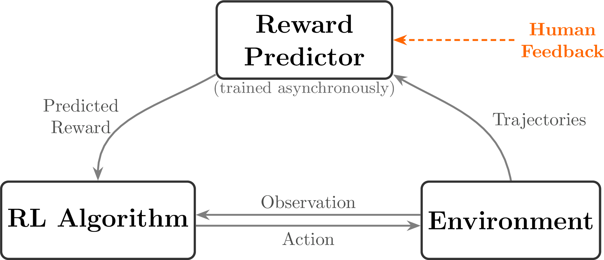

<!-- layout: title-sidebar -->
<!-- valign: bottom -->

# Lecture 2: IFT, Reward Models, & Rejection Sampling

<div class="colloquium-title-eyebrow">rlhfbook.com</div>

<div class="colloquium-title-meta">
<p class="colloquium-title-name">Nathan Lambert</p>
</div>

<p class="colloquium-title-note">Course on RLHF and post-training</p>

---

<!-- rows: 50/50 -->
## Lecture 2: IFT, Reward Models, & Rejection Sampling

<!-- row-columns: 34/33/33 -->

```box
title: Overview
tone: muted
compact: true
content: |
  1. Introduction
  2. Key Related Works
  3. Training Overview
```

|||

```box
title: Core Training Pipeline
tone: muted
compact: true
content: |
  4. **Instruction Tuning**
  5. **Reward Models**
  6. Reinforcement Learning
  7. Reasoning
  8. Direct Alignment
  9. **Rejection Sampling**
```

|||

```box
title: Data & Preferences
tone: muted
compact: true
content: |
  10. What are Preferences
  11. Preference Data
  12. Synthetic Data & CAI
```

===

<!-- row-columns: 34/33/33 -->

```box
title: Practical Considerations
tone: muted
compact: true
content: |
  13. Tool Use
  14. Over-optimization
  15. Regularization
  16. Evaluation
  17. Product & Character
```

|||

```box
title: Appendices
tone: surface
compact: true
content: |
  - A. Definitions
  - B. Style & Information
  - C. Practical Issues
```

|||

```box
title: Course Home
tone: surface
compact: true
content: |
  - [rlhfbook.com](https://rlhfbook.com)
  - [github.com/natolambert/rlhf-book](https://github.com/natolambert/rlhf-book)
```

---

## Why these three chapters together?

These chapters form a natural pipeline — **the simplest complete path from a pretrained model to a preference-tuned one**:

1. **Instruction tuning** teaches the model to follow instructions (the format)
2. **Reward models** learn to score quality from human preferences (the signal)
3. **Rejection sampling** uses those scores to curate better training data (the optimization)

This is the "non-RL" alignment path: no policy gradients, no online optimization — just supervised learning guided by a learned reward.

---

<!-- layout: section-break -->

## Part 1: Instruction Tuning

---

<!-- columns: 55/45 -->
## Where does instruction tuning fit?

Instruction fine-tuning (IFT), also called supervised fine-tuning (SFT), is the first post-training step.

- Takes a pretrained model that predicts next tokens
- Teaches it to **follow instructions** in a conversational format
- The foundation for all downstream preference tuning

Without IFT, the model just continues text — it doesn't know how to be an assistant.

|||



---

## Two lines of work converged

<!-- cite-right: raffel2020exploring, wei2021finetuned, sanh2021multitask, mishra2021cross -->

Instruction tuning emerged from two parallel research threads:

1. **Unified text-to-text frameworks**: T5 showed that framing every NLP task as "text in, text out" worked surprisingly well
2. **Scaling + instruction following**: FLAN, T0, and Natural Instructions showed that training on diverse tasks with explicit instructions improved zero-shot generalization

Both showed: **explicitly telling the model what to do** (via instructions) beats hoping it figures it out from context alone.

---

## Chat templates: the language of instruction tuning

The model needs a structured format to distinguish between **who is speaking** and **what to generate**. Chat templates define three roles:

- **System**: background instructions (persona, constraints)
- **User**: the human's message
- **Assistant**: the model's response

```
<|im_start|>system
You are a friendly chatbot who always responds in the style of a pirate<|im_end|>
<|im_start|>user
How many helicopters can a human eat in one sitting?<|im_end|>
<|im_start|>assistant
```

The model generates until it produces `<|im_end|>`.

---

## Under the hood: Jinja chat templates

Chat templates are implemented as **Jinja snippets** stored in the tokenizer config. This is the raw code that converts a list of Python dicts into the token sequence the model sees:

```jinja
{{ bos_token }}

    {{ '<|im_start|>' + message['role'] + '\n'
       + message['content'] | trim + '<|im_end|>\n' }}


    {{ '<|im_start|>assistant\n' }}

```

The full template also enforces role alternation (`user`/`assistant`/`user`/...) and handles the optional `system` message. Applied in code via `tokenizer.apply_chat_template(messages)`.

---

## The pain of Jinja chat templates

<!-- TODO: Nathan rant slide — Jinja templates + tool use + multi-turn + function calling = nightmare -->

---

## An alternative: OpenAI's Harmony format

OpenAI released **Harmony** alongside gpt-oss, replacing Jinja with a Rust-based renderer that separates output into **channels**:

- `analysis` — internal reasoning / chain-of-thought (hidden from user)
- `commentary` — tool calls go here
- `final` — user-facing response

```
<|channel|>analysis<|message|>I need to check the weather...
<|channel|>commentary to=functions.get_weather
<|constrain|>json<|message|>{"location":"SF"}<|call|>
<|channel|>final<|message|>It's 65°F and sunny in San Francisco.
```

Why? Jinja can't cleanly handle tool calls (`tojson` escaping, ambiguous boundaries). Harmony moves the complexity into a dedicated library (`openai-harmony` on PyPI) instead of a template string.

---

## Chat templates vary across models

<!-- cite-right: tunstall2023zephyr, lambert2024t -->

Different model families use different special tokens, but the structure is the same.

**Zephyr:**
```
<|system|>
You are a friendly chatbot...</s>
<|user|>
How many helicopters can a human eat in one sitting?</s>
<|assistant|>
```

**Tulu:**
```
<|user|>
How are you doing?
<|assistant|>
I'm just a computer program, so I don't have feelings, but I'm
functioning as expected. How can I assist you today?<|endoftext|>
```

These are applied via Jinja templates stored in the tokenizer config (`apply_chat_template`).

---

## Multi-turn conversations

Conversations extend naturally by alternating roles:

```
<|im_start|>system
You are a friendly chatbot who always responds in the style of a pirate<|im_end|>
<|im_start|>user
How many helicopters can a human eat in one sitting?<|im_end|>
<|im_start|>assistant
Oh just 6.<|im_end|>
<|im_start|>user
Are you sure about that?<|im_end|>
<|im_start|>assistant
```

The entire history is packed into one token sequence — the model sees all prior turns as context when generating.

---

## What does the model actually learn?

<!-- cite-right: ouyang2022training -->

**Prompt masking**: during IFT, the model only learns to predict **assistant responses**, not user messages.

- System and user tokens are masked from the loss
- Only assistant completion tokens contribute to gradient updates
- The model learns *how to respond*, not *how to ask*

For multi-turn conversations, two strategies:

1. **Final-turn only**: mask everything except the last assistant response
2. **All assistant turns**: mask only user/system tokens, train on every assistant response

---

## Best practices for instruction tuning

<!-- cite-right: zhou2023lima, lambert2024t -->

**Data quality matters more than quantity:**

- High-quality completions are critical — prompts are masked anyway, so the model learns from responses
- ~1M prompts is sufficient for excellent RLHF-ready models; further scaling helps with diminishing returns
- Best prompts match the downstream task distribution

**Training details differ from pretraining:**

- **Batch size**: much smaller (e.g. 256 vs. 1024-2048 sequences)
- **Learning rate**: 1-2 orders of magnitude lower (e.g. $1 \times 10^{-5}$ vs. $3 \times 10^{-4}$)
- **Loss function**: same cross-entropy, but only on unmasked (assistant) tokens

---

## Data scaling for IFT

The amount of instruction data needed has evolved rapidly:

- **Early post-ChatGPT**: ~10K high-quality samples could be state-of-the-art (No Robots dataset)
- **LIMA**: showed that just 1,000 carefully curated examples could match much larger datasets for chat — the "superficial alignment hypothesis"
- **Current practice**: large-scale synthetic datasets work best, but quality filtering is essential

The key insight from LIMA: instruction tuning may be more about **learning the format** than about learning new knowledge. The knowledge is already in the pretrained model.

<!-- cite-right: zhou2023lima -->

---

## Ingredients for post-training: prompts

Successful post-training starts with **meaningful evaluations** for targeted skills and **prompts of representative queries** for those skills.

All post-training stages require prompts in distribution of tasks. Example prompt budgets:

- **Supervised fine-tuning**: ~1 million prompts
- **Preference fine-tuning**: ~1 million (partial overlap with SFT can be useful)
- **Reinforcement fine-tuning**: ~10-100 thousand (data less available)

Large variance on these numbers is possible — but the key point is that **prompts are the starting material** for every stage.

---

## Building SFT data: synthetic completions

**Synthetic data** has become the dominant approach for building SFT datasets:

1. Start with $N$ high-quality (often human-written) prompts
2. Ask a strong LM to create modified versions of these instructions
3. Generate completions with another (or same) strong LM
4. Result: easily 10x more training data

**Quality of responses** is the simpler part — strong models (GPT-4o, Llama 3.1 405B) generate good completions to most instructions. **Human data** is still needed for out-of-distribution or novel tasks.

Largely undocumented is how to control **style** during SFT — response length, tone, formatting preferences are hard to specify.

---

## The SFT design process

Two repeated and parallelizable tracks:

**Data mixing:**
- Take existing datasets, combine with current mix, observe performance
- Substantial effort in trying to **remove** data and maintain performance
- Start fully with mixing before curation

**Data curation:**
- Identify evaluations where the model is behind
- Create new targeted data for those skills
- [Optionally] filter responses based on quality or correctness

These two tracks iterate: mix what you have, evaluate, curate what's missing, mix again.

---

<!-- layout: section-break -->

## Part 2: Reward Models

---

<!-- columns: 45/55 -->
## The role of reward models in RLHF

<!-- cite-right: christiano2017 -->

In RLHF, the reward model plays the role of the **environment** — it returns a reward signal that tells the policy how well it did.

The key difference from standard RL: in RLHF, we get to **control and learn** this reward function from human preferences, rather than having it fixed by the environment.

A reward model compresses complex, subjective human judgments into a single scalar score.

|||


---

## The Bradley-Terry model of preferences

<!-- cite-right: BradleyTerry -->

The canonical reward model is derived from the **Bradley-Terry model** (1952). Given two items $i$ and $j$, the probability that a judge prefers $i$ over $j$:

$$P(i > j) = \frac{p_i}{p_i + p_j}$$

Each item has a latent strength $p_i > 0$. Reparametrizing with $p_i = e^{r_i}$:

$$P(i > j) = \frac{e^{r_i}}{e^{r_i} + e^{r_j}} = \sigma(r_i - r_j)$$

Only **score differences** matter — adding the same constant to all scores leaves preferences unchanged.

---

## From preferences to a loss function

Given a prompt $x$, a chosen completion $y_c$, and a rejected completion $y_r$, we score both with reward model $r_\theta$:

$$P(y_c > y_r \mid x) = \frac{\exp(r_\theta(y_c \mid x))}{\exp(r_\theta(y_c \mid x)) + \exp(r_\theta(y_r \mid x))}$$

Maximizing log-likelihood (equivalently, minimizing negative log-likelihood):

$$\mathcal{L}(\theta) = - \log \left( \sigma \left( r_{\theta}(y_c \mid x) - r_{\theta}(y_r \mid x) \right) \right)$$

<!-- cite-right: ouyang2022training -->

Equivalently:

$$\mathcal{L}(\theta) = \log \left( 1 + e^{r_{\theta}(y_r \mid x) - r_{\theta}(y_c \mid x)} \right)$$

<!-- cite-right: askell2021general -->

---

<!-- rows: 50/50 -->
## Reward model training visualized

The model computes a scalar score at the EOS token for each completion. The contrastive loss depends only on the **score difference** between chosen and rejected.

===


<!-- cite-right: ouyang2022training -->

---

## Reward model architecture

The most common implementation: append a **linear head** to a language model that outputs a single scalar.

```python
class BradleyTerryRewardModel(nn.Module):
    def __init__(self, base_lm):
        super().__init__()
        self.lm = base_lm  # e.g., AutoModelForCausalLM
        self.head = nn.Linear(self.lm.config.hidden_size, 1)

    def forward(self, input_ids, attention_mask):
        outputs = self.lm(
            input_ids=input_ids,
            attention_mask=attention_mask,
            output_hidden_states=True, return_dict=True,
        )
        hidden = outputs.hidden_states[-1]

        # Extract representation at last non-padding token (EOS)
        lengths = attention_mask.sum(dim=1) - 1
        batch_idx = torch.arange(hidden.size(0), device=hidden.device)
        seq_repr = hidden[batch_idx, lengths]

        return self.head(seq_repr).squeeze(-1)  # (batch,)
```

---

## The loss is simple

Given the model above, the training loss is just three lines:

```python
rewards_chosen = model(**inputs_chosen)
rewards_rejected = model(**inputs_rejected)

loss = -nn.functional.logsigmoid(rewards_chosen - rewards_rejected).mean()
```

**Practical note**: reward models are typically trained for only **1 epoch** to avoid overfitting to the preference data.

---

<!-- layout: section-break -->

## Reward Model Variants

---

## Preference margin loss

<!-- cite-right: touvron2023llama -->

When annotators provide **Likert scale ratings** (e.g. 1-5), the magnitude of the preference can inform training. Llama 2 proposed a margin term $m(y_c, y_r)$:

$$\mathcal{L}(\theta) = - \log \left( \sigma \left( r_{\theta}(y_c \mid x) - r_{\theta}(y_r \mid x) - m(y_c, y_r) \right) \right)$$

For example, if chosen scores 5 and rejected scores 2, then $m = 3$.

This encourages the model to produce **larger score gaps** for strongly preferred pairs.

**Note**: Llama 3 removed the margin term — the team observed diminishing improvements at scale.

---

## K-wise loss and balancing comparisons

<!-- cite-right: ouyang2022training, zhu2024starling, zhu2023principled -->

**InstructGPT** balances multiple comparisons per prompt to prevent overfitting:

$$\mathcal{L}(\theta) = - \frac{1}{\binom{K}{2}} \mathbb{E}_{(x, y_c, y_r)\sim D} \log \left( \sigma \left( r_{\theta}(y_c \mid x) - r_{\theta}(y_r \mid x) \right) \right)$$

**K-wise loss** (Plackett-Luce model, used in Starling 7B/34B) handles full rankings over $K$ completions:

$$P(\sigma^i|s^i,a_0^i,\ldots,a_{K-1}^i) = \prod_{k=0}^{K-1} \frac{\exp(r_{\theta}(s^i,a_{\sigma^i(k)}^i))}{\sum_{j=k}^{K-1}\exp(r_{\theta}(s^i,a_{\sigma^i(j)}^i))}$$

When $K = 2$, this reduces to Bradley-Terry.

---

<!-- layout: section-break -->

## Beyond Preference RMs: ORM, PRM, Value Functions

---

## Outcome reward models (ORMs)

<!-- cite-right: cobbe2021gsm8k -->

For **reasoning tasks**, we often have verifiable correctness. ORMs predict per-token correctness probabilities using binary cross-entropy:

$$\mathcal{L}_{\text{CE}}(\theta) = -\mathbb{E}_{(s,r)\sim \mathcal{D}}[r\log p_\theta(s) + (1-r)\log(1-p_\theta(s))]$$

where $r \in \{0,1\}$ is a binary correctness label applied to every completion token.

**Key difference from Bradley-Terry**: no pairwise comparisons needed — just correct/incorrect labels per response.

```python
# Per-token binary cross-entropy (prompt tokens masked as -100)
mask = labels != -100
loss = F.binary_cross_entropy_with_logits(
    logits_per_token[mask], labels[mask].float()
)
```

---

<!-- rows: 55/45 -->
## ORM training and inference

At inference time, an ORM outputs a probability of correctness **at every token**. Prompt tokens are masked, while each completion token receives a correctness probability.

===


---

<!-- rows: 55/45 -->
## Process reward models (PRMs)

<!-- cite-right: lightman2023let -->

PRMs score intermediate **reasoning steps**, not just final outcomes:

$$\mathcal{L}_{\text{PRM}}(\theta) = - \mathbb{E}_{(x, s) \sim \mathcal{D}} \left[ \sum_{i=1}^{K} y_{s_i} \log r_\theta(s_i \mid x) + (1 - y_{s_i}) \log (1 - r_\theta(s_i \mid x)) \right]$$

Labels are applied only at **step boundaries** (e.g. double newlines): correct (+1), neutral (0), incorrect (-1). All other tokens are masked during training.

===


---

## Comparing reward model types

| Model | Predicts | Trained on | Output |
|-------|----------|-----------|--------|
| **Preference RM** | Quality at EOS token | Pairwise (chosen vs. rejected) | Single scalar |
| **ORM** | Per-token correctness | Binary outcome labels | Per-token probability |
| **PRM** | Per-step correctness | Step-level annotations | Score at step boundaries |
| **Value Function** | Expected remaining return | On-policy rollouts | Per-token expected return |

**Key distinction — ORM vs. Value Function:**

- **ORMs** predict immediate, offline-labeled correctness: $p(\text{correct}_t)$
- **Value functions** predict expected *remaining* return: $V(s_t) = \mathbb{E}[\sum_{k \geq t} \gamma^{k-t} r_k \mid s_t]$

Same architecture, different semantics and supervision pipeline.

---

## In summary

- **RM:** "How good is this whole answer?" — scalar value
- **ORM:** "Which parts look correct?" — per-token correctness
- **PRM:** "Are the reasoning steps sound?" — per-step scores
- **Value Function:** "How much reward remains from here?" — baseline for RL advantages

---

## Generative reward modeling: LLM-as-a-judge

<!-- cite-right: zheng2023judging -->

An alternative to training a reward model: **prompt an LLM** to judge quality.

```
[System]
Please act as an impartial judge and evaluate the quality of the
responses provided by two AI assistants to the user question below.
...
After providing your explanation, output your final verdict by strictly
following this format: "[[A]]" if assistant A is better, "[[B]]" if
assistant B is better, and "[[C]]" for a tie.
```

Spawned benchmarks: MT-Bench, AlpacaEval, Arena-Hard, WildBench.

**Current status**: generative RMs tend to **underperform** trained reward models on RM evaluations, but are cheaper to set up and useful for evaluation pipelines.

---

## Reward model evaluation

<!-- cite-right: lambert2024rewardbench -->

The RM evaluation landscape has expanded rapidly:

- **General chat:** RewardBench, RewardBench2, RMB, RM-Bench
- **Specialized:** M-RewardBench (multilingual), RAG-RewardBench, RewardMATH
- **Process RMs:** PRM Bench, ProcessBench
- **Agentic:** Agent-RewardBench
- **Multimodal:** MJ-Bench, Multimodal RewardBench, VL RewardBench

The bulk of early RM research focused on establishing benchmarks and identifying behavior modes. Training innovations (aspect-conditioned models, high-quality human datasets, scaling experiments) are still an active area.

---

<!-- layout: section-break -->

## Part 3: Rejection Sampling

---

## The simplest thing you can do with a reward model

<!-- cite-right: gilks1992adaptive -->

**Rejection sampling** is a popular baseline for preference fine-tuning. The idea:

1. Generate many candidate completions
2. Score them with a reward model
3. Keep only the best ones
4. Fine-tune on those

No policy gradients, no online RL — just **filtered supervised learning**.

The name comes from computational statistics: sample from a simple distribution, use a heuristic to accept/reject samples, approximating a complex target distribution.

---

<!-- rows: 55/45 -->
## Rejection sampling overview

<!-- cite-right: nakano2021webgpt, bai2022training, touvron2023llama -->

The four stages:
0. **Select prompts and reward model** (reuse IFT prompts or curate new ones)
1. **Generate** $N$ completions per prompt from the current model
2. **Score** all completions with the reward model
3. **Fine-tune** on the top completions (same SFT loss as instruction tuning)

Used in WebGPT, Anthropic's HH, Llama 2 Chat, and many other seminal works.

===


---

## The math: prompts, completions, rewards

Given $M$ prompts and $N$ completions each:

$$X = [x_1, x_2, \ldots, x_M]$$

$$Y = \begin{bmatrix}
y_{1,1} & y_{1,2} & \cdots & y_{1,N} \\
y_{2,1} & y_{2,2} & \cdots & y_{2,N} \\
\vdots & \vdots & \ddots & \vdots \\
y_{M,1} & y_{M,2} & \cdots & y_{M,N}
\end{bmatrix}
\quad
R = \begin{bmatrix}
r_{1,1} & r_{1,2} & \cdots & r_{1,N} \\
r_{2,1} & r_{2,2} & \cdots & r_{2,N} \\
\vdots & \vdots & \ddots & \vdots \\
r_{M,1} & r_{M,2} & \cdots & r_{M,N}
\end{bmatrix}$$

Each reward: $r_{i,j} = \mathcal{R}(y_{i,j} \mid x_i)$

---

## Selection method 1: top per prompt

Select the highest-scoring completion for each prompt independently:

$$S(R) = [\arg\max_{j} r_{1,j},\ \arg\max_{j} r_{2,j},\ \ldots,\ \arg\max_{j} r_{M,j}]$$

**Example** (5 prompts, 4 completions):

$$R = \begin{bmatrix}
\mathbf{0.7} & 0.3 & 0.5 & 0.2 \\
0.4 & \mathbf{0.8} & 0.6 & 0.5 \\
\mathbf{0.9} & 0.3 & 0.4 & 0.7 \\
0.2 & 0.5 & \mathbf{0.8} & 0.6 \\
0.5 & 0.4 & 0.3 & \mathbf{0.6}
\end{bmatrix}
\quad S(R) = [1, 2, 1, 3, 4]$$

Result: one completion per prompt, every prompt represented.

---

## Selection method 2: top overall pairs

Flatten the reward matrix and select the top $K$ pairs globally:

$$S_K(R_{\text{flat}}) = \text{argsort}(R_{\text{flat}})[-K:]$$

**Same example, top 5 overall:**

$$R = \begin{bmatrix}
\mathbf{0.7} & 0.3 & 0.5 & 0.2 \\
0.4 & \mathbf{0.8} & 0.6 & 0.5 \\
\mathbf{0.9} & 0.3 & 0.4 & \mathbf{0.7} \\
0.2 & 0.5 & \mathbf{0.8} & 0.6 \\
0.5 & 0.4 & 0.3 & 0.6
\end{bmatrix}$$

Now prompt 3 gets **two** completions (0.9 and 0.7), while prompt 5 gets **none**. This optimizes for absolute quality but can bias toward easy prompts.

---

## Implementation details

The core hyperparameters are intuitive:

- **Temperature**: 0.7-1.0 (need diversity in completions)
- **Completions per prompt**: 10-30+ (too few = noisy selection)
- **Fine-tuning**: standard SFT on selected completions (same loss, but details like learning rate may differ from initial IFT)

**Practical tip**: sort completions by length before batch RM inference to reduce padding token computation.

**Open questions**: how to sequence RS in a multi-stage pipeline, whether to use generations from multiple models, optimal prompt selection.

---

## Best-of-N sampling: rejection sampling without fine-tuning

<!-- cite-right: liu2023statistical -->

**Best-of-N (BoN)** follows the same generate-and-score procedure, but skips the fine-tuning step:

$$S(R) = \arg\max_{j \in [1,N]} r_j$$

- Used at **inference time** to pick the best completion
- Does **not** modify the model — it's a sampling technique
- Often used as a baseline comparison for online RL methods like PPO
- Related techniques power "Pro" tiers of chat products (spend extra compute per query)

BoN is the simplest possible reward-guided method: generate more, pick the best.

---

## The full pipeline so far

Putting it all together — the simplest complete path from pretrained model to preference-tuned model:

1. **Instruction fine-tune** the pretrained model → learns the chat format
2. **Collect preference data** → human annotators compare pairs of responses
3. **Train a reward model** on preference data → learns to score quality
4. **Rejection sampling** → generate many completions, keep the best, fine-tune

This is a strong baseline. Next lectures will cover more powerful optimization methods (PPO, DPO) that directly optimize the policy using the reward signal, rather than filtering training data.

---

<!-- rows: 50/50 -->
## Lecture 2: IFT, Reward Models, & Rejection Sampling

<!-- row-columns: 34/33/33 -->

```box
title: Overview
tone: muted
compact: true
content: |
  1. Introduction
  2. Key Related Works
  3. Training Overview
```

|||

```box
title: Core Training Pipeline
tone: muted
compact: true
content: |
  4. **Instruction Tuning**
  5. **Reward Models**
  6. Reinforcement Learning
  7. Reasoning
  8. Direct Alignment
  9. **Rejection Sampling**
```

|||

```box
title: Data & Preferences
tone: muted
compact: true
content: |
  10. What are Preferences
  11. Preference Data
  12. Synthetic Data & CAI
```

===

<!-- row-columns: 34/33/33 -->

```box
title: Practical Considerations
tone: muted
compact: true
content: |
  13. Tool Use
  14. Over-optimization
  15. Regularization
  16. Evaluation
  17. Product & Character
```

|||

```box
title: Appendices
tone: surface
compact: true
content: |
  - A. Definitions
  - B. Style & Information
  - C. Practical Issues
```

|||

```box
title: Course Home
tone: surface
compact: true
content: |
  - [rlhfbook.com](https://rlhfbook.com)
  - [github.com/natolambert/rlhf-book](https://github.com/natolambert/rlhf-book)
```

---

<!-- rows: 85/15 -->
## Thank you

Questions / discussion

Contact: nathan@natolambert.com

Newsletter: [interconnects.ai](https://www.interconnects.ai/)

**rlhfbook.com**

===


```builtwith
repo: natolambert/colloquium
```
