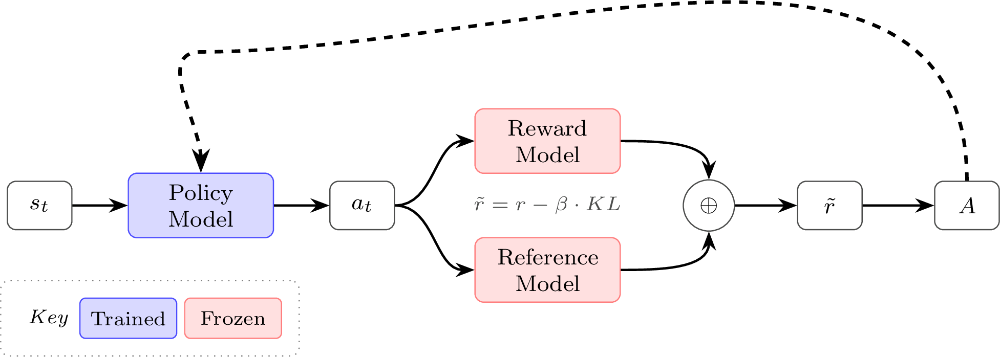
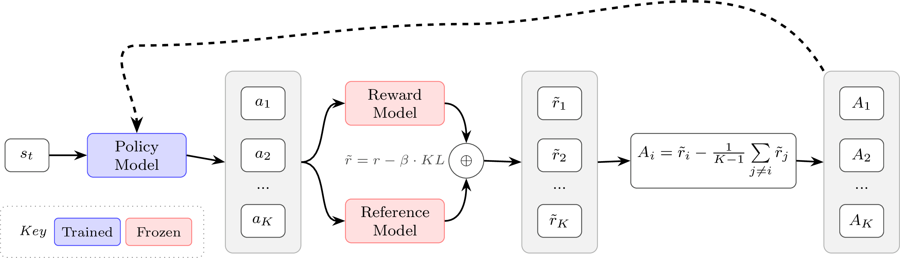

<!-- layout: title-sidebar -->
<!-- valign: bottom -->

# Lecture 3: Reinforcement Learning Motivation & Math

<div class="colloquium-title-eyebrow">rlhfbook.com</div>

<div class="colloquium-title-meta">
<p class="colloquium-title-name">Nathan Lambert</p>
</div>

<p class="colloquium-title-note">Course on RLHF and post-training. Chapter 6, Part 1</p>

---

<!-- rows: 50/50 -->
## Lecture 3: Reinforcement learning (mostly the math)

<!-- row-columns: 32/36/32 -->

```box
title: Overview
tone: muted
compact: true
content: |
  1. Introduction
  2. Key Related Works
  3. Training Overview
```

|||

```box
title: Core Training Pipeline
tone: accent
compact: true
content: |
  4. Instruction Tuning
  5. Reward Models
  6. **Reinforcement Learning**
  7. Reasoning
  8. Direct Alignment
  9. Rejection Sampling
```

|||

```box
title: Data & Preferences
tone: muted
compact: true
content: |
  10. What are Preferences
  11. Preference Data
  12. Synthetic Data & CAI
```

===

<!-- row-columns: 32/36/32 -->

```box
title: Practical Considerations
tone: muted
compact: true
content: |
  13. Tool Use
  14. Over-optimization
  15. Regularization
  16. Evaluation
  17. Product & Character
```

|||

```box
title: Appendices
tone: surface
compact: true
content: |
  - A. Definitions
  - B. Style & Information
  - C. Practical Issues
```

|||

```box
title: Course Home
tone: surface
compact: true
content: |
  - [rlhfbook.com](https://rlhfbook.com)
  - [GitHub repo](https://github.com/natolambert/rlhf-book)
```

---

<!-- rows: 30/70 -->
## Where we are in the pipeline

After instruction tuning and training a reward model, the RL step updates the policy against a learned reward signal.

System diagram view.

===


---

<!-- columns: 50/50 -->
## Where we are in the pipeline

After instruction tuning and training a reward model, the RL step updates the policy against a learned reward signal.

RLHF optimization view.

|||


---

## What this lecture covers

This lecture covers the **math and theory** of RL for language models. The next lecture covers implementation.

```box
title: Lecture 3 Outline
tone: accent
content: |
  1. **Motivation** — why RL training matters
  2. **RL foundations review** — MDP, return, value functions, policy gradient objective
  3. **Policy gradient derivation** — log-derivative trick, step by step
  4. **REINFORCE & RLOO** — the simplest policy gradient algorithms
  5. **PPO** — trust regions, clipping, GAE, value functions
  6. **GRPO & modern variants** — GSPO, CISPO, and the trend toward simplicity
  7. **Comparison** — strengths, weaknesses, questions
```

---

## A under-documented benefit of RL

In lecture 2, we covered rejection sampling and later we'll cover direct alignment algorithms (like DPO). They're simpler, but RL has hard to measure benefits.

Implementing RL is far more complex infrastructure, but the gradient updates they provide "generally help the model a lot". This is hard to quantify, but:
- RL stages can "fix" rough edges on the model, making them easier to chat to or more robust (this could come by training them to have numerical stability inference tools like VLLM)
- RL can be done surgically in the model, the model does a good job learning where the prompt distribution lies, and RL tends to not "squash" the general capabilities of the model. 

Overall, RL losses on language models are robust, scalable, effective, and flexible, which opened large new fields of experimentation. The original method that started us down this path was RLHF work.


---

<!-- layout: section-break -->

## Why RL matters

---

<!-- columns: 50/50 -->
## The scaling RL era

<!-- cite-right: openai2024o1 -->

RL is now the **load-bearing step** in training the most capable models.

Reasoning models (o1, DeepSeek R1, etc.) are trained with these exact algorithms on verifiable rewards.

- Train-time compute scaling via RL
- Test-time compute scaling via extended reasoning
- RL went from "cherry on top" to a core capability driver

|||


---

<!-- columns: 50/50 -->
## RLVR: Same algorithms, verifiable rewards

<!-- cite-right: lambert2024t -->

The RL methods in this lecture power **both RLHF and RLVR**:

- **RLHF**: reward model scores subjective quality
- **RLVR**: verification function checks correctness (math, code)

Same policy gradient algorithms, different reward source. We will cover tricks for reasoning training and a bunch of interesting models in depth in a future lecture.

|||


---

<!-- layout: section-break -->

## Policy gradients: Core intuitions

---

<!-- columns: 50/50 -->
## Recall: Classical RL vs. RLHF

<!-- cite-right: christiano2017, ouyang2022training -->

<div class="text-sm">

**Classical RL**: agent in an MDP $(\mathcal{S}, \mathcal{A}, P, r, \gamma)$
- Reward is a known function from the environment per step
- Optimize cumulative return: $J(\pi) = \mathbb{E}_{\tau \sim \pi}\!\left[\sum_{t} \gamma^t r(s_t, a_t)\right]$

**RLHF**: prompts from a dataset, no environment
- Reward is **learned** from human preferences
- **Response-level** reward, regularized with KL penalty
- $J(\pi) = \mathbb{E}\left[ r_\theta(x, y) \right] - \beta \, D_{\text{KL}}\!\left(\pi \| \pi_{\text{ref}}\right)$

</div>


|||


---

<!-- columns: 50/50 -->
## Notation in this lecture

<div class="text-sm">

This lecture uses $(s, a)$ notation from the reinforcement learning literature, where $s$ denotes states and $a$ denotes actions. In the language model context, you will often see $(x, y)$ instead, where $x$ is the prompt and $y$ is the completion.

The $(s, a)$ framing is more general — these algorithms were designed for sequential decision problems where actions are taken at each timestep. However, many RLHF implementations treat the entire completion as a single action, making the $(x, y)$ notation equally valid.

</div>


|||


---

## What are we optimizing?

Choose policy parameters $\theta$ that maximize reward **on average** under the current policy.

$$J(\theta) = \mathbb{E}_{\tau \sim \pi_\theta}[R(\tau)]$$

In practice, we estimate this expectation with sampled rollouts:

$$J(\theta) \approx \frac{1}{N}\sum_{i=1}^{N} R(\tau_i), \qquad \tau_i \sim \pi_\theta$$

We craft a gradient/derivative that lets us optimize this.

---


## How a policy gradient works

Make actions more likely when they lead to better outcomes.

$$\Delta \theta \propto \Psi_t \, \nabla_\theta \log \pi_\theta(a_t \mid s_t)$$

<div class="text-sm">

Read it as two questions answered at once:

- $\nabla_\theta \log \pi_\theta(a_t \mid s_t)$ — **which action?**
- $\Psi_t$ — **how good was it?** A scalar scoring the outcome.

</div>

---

## How a policy gradient works

Make actions more likely when they lead to better outcomes.

$$\Delta \theta \propto \Psi_t \, \nabla_\theta \log \pi_\theta(a_t \mid s_t)$$

<div class="text-sm">

Read it as two questions answered at once:

- $\nabla_\theta \log \pi_\theta(a_t \mid s_t)$ — **which action?** How each parameter influenced the probability of taking action $a_t$ in state $s_t$. This connects the outcome back to the knobs that caused it.
- $\Psi_t$ — **how good was it?** A scalar scoring the outcome. Positive means good, negative means bad, magnitude says how much.

> An oversimplification (e.g. intuition in case of batch size of 1): the gradient is a vector with one entry per parameter. A positive entry means "increasing this parameter made the action more likely," a negative entry means the opposite. In practice, the update averages over many such vectors — what survives is the net vote across the batch.

Multiply them: $\Psi_t > 0$ updates parameters to make $a_t$ more likely, $\Psi_t < 0$ updates them to make it less likely.

The rest of this section is about choosing a smart $\Psi_t$ — different choices (total return, advantage, TD residual) trade off variance and bias, but all plug into this same update.

</div>

---

## The policy gradient equation

A preview of where we end up:

$$\nabla_\theta J(\theta) = \mathbb{E}_{\tau \sim \pi_\theta}\!\left[\sum_{t=0}^{T} \nabla_\theta \log \pi_\theta(a_t \mid s_t) \cdot \Psi_t\right]$$

The core idea is that we *sample over trials in the environment* and **estimate** the gradient.

Where $\Psi_t$ is the **learning signal** telling the optimizer how good the action was. The choice of $\Psi_t$ determines the algorithm's variance, bias, and compute cost.


---

## What $\Psi_t$ can be

<!-- cite-right: schulman2015high -->

Popular choices for $\Psi_t$ (rewards can also be discounted by $\gamma$):

| | $\Psi_t$ | Description | Variance | Bias |
|:-:|-----------|-------------|:--------:|:----:|
| 1. | $R(\tau) = \sum_{t=0}^{T} r_t$ | Total trajectory reward | Highest | None |
| 2. | $\sum_{t'=t}^{T} r_{t'}$ | Future return from $t$ (the return, $G_t$) | High | None |
| 3. | $G_t - b(s_t)$ | Baselined return | Lower | None |
| 4. | $Q^{\pi}(s_t, a_t)$ | State-action value function | Med | Depends |
| 5. | $A^{\pi}(s_t, a_t) = Q - V$ | Advantage function | **Lowest** | None |
| 6. | $r_t + \gamma V(s_{t+1}) - V(s_t)$ | TD residual | Low | Some |

A *baseline* $b(s_t)$ is any value subtracted from the reward signal to reduce variance. As we just showed, this does not change the expected gradient.

---

## Unpacking the key RL quantities

The $\Psi_t$ options reference three key quantities:

**Value function** $V(s)$: expected future return from state $s$

$$V(s) = \mathbb{E}\big[G_t \mid S_t = s\big] \quad \text{where } G_t = \sum_{k=0}^{\infty} \gamma^k R_{t+k+1}$$

**Action-value** $Q(s, a)$: expected return after taking action $a$ in state $s$

$$Q(s, a) = \mathbb{E}[G_t \mid S_t = s, A_t = a]$$

**Advantage** $A(s, a) = Q(s, a) - V(s)$: how much better is action $a$ compared to average? Positive → reinforce, negative → suppress, zero → no update.

In RLHF: often $\gamma = 1$ (no discounting) because the unit of optimization is the full completion.

---


<!-- layout: section-break -->

## Deriving the policy gradient

---

## Setup: Differentiating an expectation

Ideally, we want $\nabla_\theta J(\theta)$, but we can't do that (the state sampling distribution itself depends on $\theta$).

Written as an integral, the objective is:

$$J(\theta) = \mathbb{E}_{\tau \sim \pi_\theta}[R(\tau)] = \int_\tau p_\theta(\tau) R(\tau) \, d\tau$$

---

## Setup: Differentiating an expectation

Ideally, we want $\nabla_\theta J(\theta)$, but we can't do that (the state sampling distribution itself depends on $\theta$).

Written as an integral, the objective is:

$$J(\theta) = \mathbb{E}_{\tau \sim \pi_\theta}[R(\tau)] = \int_\tau p_\theta(\tau) R(\tau) \, d\tau$$

Taking the gradient directly:

$$\nabla_\theta J(\theta) = \int_\tau \nabla_\theta p_\theta(\tau) R(\tau) \, d\tau$$

We can sample trajectories from $p_\theta(\tau)$, but not from $\nabla_\theta p_\theta(\tau)$, since it is not a probability distribution.

The derivation is a few key tricks to let us approximate or compute this.

---

## Applying the idea of computing the gradient from trajectories

Substituting the log-derivative identity (more on this soon) into the gradient:

$$
\begin{aligned}
\nabla_\theta J(\theta)
&= \int_\tau \nabla_\theta p_\theta(\tau) R(\tau) \, d\tau
&& \text{differentiate the objective} \\
&= \int_\tau p_\theta(\tau) \nabla_\theta \log p_\theta(\tau) R(\tau) \, d\tau
&& \text{log-derivative identity (chain rule)} \\
&= \mathbb{E}_{\tau \sim \pi_\theta}\!\left[\nabla_\theta \log p_\theta(\tau) \cdot R(\tau)\right]
&& \text{expectation form}
\end{aligned}
$$

Now we can estimate this with Monte Carlo sampling!

---

## Applying the idea of computing the gradient from trajectories

The only non-obvious step is the middle line:

$$
\begin{aligned}
\nabla_\theta \log p_\theta(\tau)
&= \frac{\nabla_\theta p_\theta(\tau)}{p_\theta(\tau)} \\
\Rightarrow \quad
\nabla_\theta p_\theta(\tau)
&= p_\theta(\tau) \nabla_\theta \log p_\theta(\tau)
\end{aligned}
$$

This is the **log-derivative identity**, derived from the chain rule for $\log$.

It rewrites the gradient of a probability in terms of a log-probability, which is much easier to work with.

---

## Applying the idea of computing the gradient from trajectories

Where did the $p_\theta(\tau)$ term go?

It became the **sampling distribution** inside the expectation:

$$\int p_\theta(\tau) f(\tau)\, d\tau = \mathbb{E}_{\tau \sim p_\theta}[f(\tau)]$$

Monte Carlo then estimates that expectation by sampling trajectories from the policy:

$$\mathbb{E}_{\tau \sim p_\theta}[f(\tau)] \approx \frac{1}{N}\sum_{i=1}^{N} f(\tau_i), \qquad \tau_i \sim p_\theta$$

So there is no explicit $p_\theta(\tau_i)$ term in code: **more likely trajectories already appear more often in the sampled batch**.

At a high level, rollout generation handles the sampling, and the loss code handles $R(\tau_i)\,\nabla_\theta \log p_\theta(\tau_i)$.

---

## Expanding log probability of trajectory to compute $\nabla_\theta$

The trajectory probability factorizes:

$$p_\theta(\tau) = p(s_0) \prod_{t=0}^{T} \pi_\theta(a_t \mid s_t) \, p(s_{t+1} \mid s_t, a_t)$$

Taking the log:

$$\log p_\theta(\tau) = \log p(s_0) + \sum_{t=0}^{T} \log \pi_\theta(a_t \mid s_t) + \sum_{t=0}^{T} \log p(s_{t+1} \mid s_t, a_t)$$

For language models, this is the familiar autoregressive pattern: a sequence log-probability becomes a sum of token log-probabilities.

---

## Expanding log probability of trajectory to compute $\nabla_\theta$

<div class="text-sm">

$$\log p_\theta(\tau) = \log p(s_0) + \sum_{t=0}^{T} \log \pi_\theta(a_t \mid s_t) + \sum_{t=0}^{T} \log p(s_{t+1} \mid s_t, a_t)$$

Now take the gradient w.r.t. $\theta$:

- $\nabla_\theta \log p(s_0) = 0$ — initial state doesn't depend on $\theta$
- $\nabla_\theta \log p(s_{t+1} \mid s_t, a_t) = 0$ — environment dynamics don't depend on $\theta$
- Only $\nabla_\theta \log \pi_\theta(a_t \mid s_t)$ survives!

$$\nabla_\theta \log p_\theta(\tau) = \sum_{t=0}^{T} \nabla_\theta \log \pi_\theta(a_t \mid s_t)$$

</div>
---

## Expanding log probability of trajectory to compute $\nabla_\theta$

<div class="text-sm">

$$\log p_\theta(\tau) = \log p(s_0) + \sum_{t=0}^{T} \log \pi_\theta(a_t \mid s_t) + \sum_{t=0}^{T} \log p(s_{t+1} \mid s_t, a_t)$$

Now take the gradient w.r.t. $\theta$:

- $\nabla_\theta \log p(s_0) = 0$ — initial state doesn't depend on $\theta$
- $\nabla_\theta \log p(s_{t+1} \mid s_t, a_t) = 0$ — environment dynamics don't depend on $\theta$
- Only $\nabla_\theta \log \pi_\theta(a_t \mid s_t)$ survives!

$$\nabla_\theta \log p_\theta(\tau) = \sum_{t=0}^{T} \nabla_\theta \log \pi_\theta(a_t \mid s_t)$$

In language-model code, this is why you repeatedly see:

```python
seq_log_probs = (token_log_probs * completion_mask).sum(dim=-1)
loss = -(seq_log_probs * advantages).mean()
loss.backward()
```

Autodiff turns that summed log-probability into the corresponding sum of per-token gradients!
</div>
---

## From full return to future rewards

An action at time $t$ can't affect past rewards. So instead of weighting by the full trajectory reward $R(\tau)$:

$$\nabla_\theta J = \mathbb{E}\!\left[\sum_{t=0}^{T} \nabla_\theta \log \pi_\theta(a_t \mid s_t) \cdot R(\tau)\right]$$

We can replace $R(\tau)$ with the **return-to-go** $G_t = \sum_{t'=t}^{T} R_{t'}$ — only future rewards from $t$ onward:

$$\nabla_\theta J = \mathbb{E}\!\left[\sum_{t=0}^{T} \nabla_\theta \log \pi_\theta(a_t \mid s_t) \cdot G_t\right]$$

This doesn't change the expected gradient, but removes noise from past rewards that the current action couldn't have influenced. This is the step from $\Psi_t$ option 1 → option 2 in our taxonomy.

---

## Baselines keep the estimator unbiased

Raw returns are noisy. The same action can appear in trajectories with very different total rewards because of later sampled actions and, in classical RL, environment randomness.

The role of a baseline is to **center** that noisy signal: instead of asking "was the return high?", we ask "was it higher or lower than expected for this state?"


---

## Baselines keep the estimator unbiased

Raw returns are noisy. The same action can appear in trajectories with very different total rewards because of later sampled actions and, in classical RL, environment randomness.

The role of a baseline is to **center** that noisy signal: instead of asking "was the return high?", we ask "was it higher or lower than expected for this state?"

Use a centered return:

$$\Psi_t = G_t - b(s_t)$$

where the baseline $b(s_t)$ depends only on the state, not on which action was sampled.

Subtracting this baseline doesn't change the expected gradient:

---

## Baselines keep the estimator unbiased

<div class="text-sm">

Raw returns are noisy. The same action can appear in trajectories with very different total rewards because of later sampled actions and, in classical RL, environment randomness.

Use a centered return, $\Psi_t = G_t - b(s_t)$.

Subtracting this baseline doesn't change the expected gradient:

$$
\mathbb{E}[\nabla_\theta \log \pi_\theta(a \mid s) \cdot (G_t - b(s))]
= \mathbb{E}[\nabla_\theta \log \pi_\theta(a \mid s) \cdot G_t]
- \mathbb{E}[\nabla_\theta \log \pi_\theta(a \mid s) \cdot b(s)]
$$

The first term is the original estimator. The second vanishes:

$$
\begin{aligned}
\mathbb{E}[\nabla_\theta \log \pi_\theta(a \mid s) \cdot b(s)]
&= b(s) \cdot \sum_a \nabla_\theta \pi_\theta(a \mid s) \\
&= b(s) \cdot \nabla_\theta \underbrace{\sum_a \pi_\theta(a \mid s)}_{= 1} \\
&= 0
\end{aligned}
$$

The gradient of a normalized distribution sums to zero — so we're free to subtract **any function of state** as a baseline. This is why $\Psi_t$ options 3–5 reduce variance without introducing bias.

</div>

---

## Recall: What $\Psi_t$ can be

<!-- cite-right: schulman2015high -->

Popular choices for $\Psi_t$ (rewards can also be discounted by $\gamma$):

| | $\Psi_t$ | Description | Variance | Bias |
|:-:|-----------|-------------|:--------:|:----:|
| 1. | $R(\tau) = \sum_{t=0}^{T} r_t$ | Total trajectory reward | Highest | None |
| 2. | $\sum_{t'=t}^{T} r_{t'}$ | Future return from $t$ (the return, $G_t$) | High | None |
| 3. | $\sum_{t'=t}^{T} r_{t'} - b(s_t)$ | Baselined return | Lower | None |
| 4. | $Q^{\pi}(s_t, a_t)$ | State-action value function | Med | Depends |
| 5. | $A^{\pi}(s_t, a_t) = Q - V$ | Advantage function | **Lowest** | None |
| 6. | $r_t + \gamma V(s_{t+1}) - V(s_t)$ | TD residual | Low | Some |

A *baseline* $b(s_t)$ is any value subtracted from the reward signal to reduce variance — we'll show why this is unbiased shortly.

---


## The policy gradient estimator

Combining the log-derivative trick, return-to-go, and baseline subtraction:

$$\nabla_\theta J(\theta) = \mathbb{E}_{\tau \sim \pi_\theta}\!\left[\sum_{t=0}^{T} \nabla_\theta \log \pi_\theta(a_t \mid s_t) \cdot \Psi_t\right]$$

This is the **policy gradient theorem**. Every algorithm in this lecture is an instantiation with a specific choice of $\Psi_t$ and regularization.

For language models, this means the sum runs over generated tokens in the completion, while $\Psi_t$ determines how each token is weighted.

---

## Policy gradient derivation recap

$$
\begin{aligned}
J(\theta)
&= \mathbb{E}_{\tau \sim \pi_\theta}[R(\tau)]
&& \text{objective} \\
&= \int_\tau p_\theta(\tau) R(\tau)\, d\tau
&& \text{integral form} \\
\nabla_\theta J(\theta)
&= \int_\tau \nabla_\theta p_\theta(\tau) R(\tau)\, d\tau
&& \text{differentiate} \\
&= \mathbb{E}_{\tau \sim \pi_\theta}\!\left[\sum_{t=0}^{T} \nabla_\theta \log \pi_\theta(a_t \mid s_t) \cdot \Psi_t\right]
&& \text{final estimator}
\end{aligned}
$$

- Log-derivative trick turns $\nabla p_\theta(\tau)$ into a sampleable expectation
- Expanding $\log p_\theta(\tau)$ gives a sum of policy log-prob terms
- $\Psi_t$ is the learning signal: return, advantage, or TD-style estimate
- In code: sample rollouts, sum token log-probs, weight by $\Psi_t$, average

---

<!-- layout: section-break -->

## Wiring RLHF for language models

---

<!-- columns: 40/60 -->
## The RLHF training loop

Before diving into specific algorithms, let's revisit the full RLHF setup they plug into.

|||


---

<!-- columns: 50/50 -->
## The reference model

The **reference model** $\pi_\text{ref}$ is a frozen copy of the policy at the start of RL training (typically the SFT checkpoint).

It serves one purpose: **anchor the policy so it doesn't drift too far during optimization.**

Without it, the policy can exploit the reward model — finding high-scoring outputs that are degenerate or repetitive (reward hacking).

|||


---

<!-- columns: 50/50 -->
## KL divergence as regularization

The KL penalty measures how far the current policy has drifted from the reference at each token:

$$\text{KL}_t = \log \pi_\theta(a_t \mid s_t) - \log \pi_\text{ref}(a_t \mid s_t)$$

In practice:
1. **Generate** a completion from $\pi_\theta$
2. **Compute log-probs** of those same tokens under both $\pi_\theta$ and $\pi_\text{ref}$
3. **Subtract** to get the per-token KL

The shaped reward becomes: $\tilde{r}_t = -\beta \, \text{KL}_t$ for intermediate tokens, $\tilde{r}_T = R(\tau) - \beta \, \text{KL}_T$ for the final token.

|||


---

<!-- columns: 50/50 -->
## KL in RLHF vs. RLVR

**RLHF** (reward model signal): KL penalty is critical — the reward model is a learned proxy, and the policy will exploit any imperfections without regularization.

**RLVR** (verifiable rewards, e.g. math correctness): KL is often reduced or removed entirely. The reward is ground truth, so there's less to exploit. Some RLVR setups (e.g. DeepSeek R1) drop the reference model altogether, saving memory.

The trend: as reward signals become more reliable, the need for KL regularization decreases.

|||


---

<!-- layout: section-break -->

## REINFORCE

---

## REINFORCE

<!-- cite-right: williams1992simple -->

REINFORCE is the simplest instantiation of the policy gradient. 

It is the **Monte Carlo form of policy gradient**: sample trajectories, compute their returns, and use those sampled returns to weight the log-prob gradients.


---

## REINFORCE

<!-- cite-right: williams1992simple -->

REINFORCE is the simplest instantiation of the policy gradient. 

It is the **Monte Carlo form of policy gradient**: sample trajectories, compute their returns, and use those sampled returns to weight the log-prob gradients.

> The name is an acronym for "REward Increment = Nonnegative Factor X Offset Reinforcement X Characteristic Eligibility."

Three components:

1. **Nonnegative factor** ($\alpha$): the learning rate
2. **Offset reinforcement** ($G_t - b(s_t)$): centered return for stability
3. **Characteristic eligibility** ($\nabla \log \pi$): how to attribute learning per token


---

## REINFORCE

<!-- cite-right: williams1992simple -->

REINFORCE is the simplest instantiation of the policy gradient. 

It is the **Monte Carlo form of policy gradient**: sample trajectories, compute their returns, and use those sampled returns to weight the log-prob gradients.

> The name is an acronym for "REward Increment = Nonnegative Factor X Offset Reinforcement X Characteristic Eligibility."

Three components:

1. **Nonnegative factor** ($\alpha$): the learning rate
2. **Offset reinforcement** ($G_t - b(s_t)$): centered return for stability
3. **Characteristic eligibility** ($\nabla \log \pi$): how to attribute learning per token

The update rule:

$$\Delta\theta = \alpha \, \nabla_\theta \log \pi_\theta(a_t \mid s_t) \cdot (G_t - b(s_t))$$


---

## The baseline problem

Without a baseline, the gradient weights each action by its raw return $G_t$. This doesn't tell you whether an action was **better or worse than expected** — just how good the overall outcome was.

The gradient is high variance because the raw return mixes the quality of the action with the quality of the state. A good action in a bad state and a bad action in a good state can produce similar returns.

---

## The baseline solution

Subtracting a baseline $b(s)$ centers the signal: now the gradient weight is $(G_t - b)$, which answers "was this action better or worse than expected from this state?"

$$\mathbb{E}_{a \sim \pi(\cdot \mid s)}[\nabla_\theta \log \pi_\theta(a \mid s) \cdot b(s)] = b(s) \cdot \mathbb{E}_{a \sim \pi(\cdot \mid s)}[\nabla_\theta \log \pi_\theta(a \mid s)] = 0$$

Because $b(s)$ does not depend on which action was sampled, it factors out and cancels. The expected gradient is unchanged — but the variance drops dramatically.

---

## REINFORCE with baseline

The full REINFORCE gradient:

$$\nabla_\theta J(\theta) = \mathbb{E}_{\tau \sim \pi_\theta}\!\left[\sum_{t=0}^{T} \nabla_\theta \log \pi_\theta(a_t \mid s_t)(G_t - b(s_t))\right]$$

Here, $G_t - b(s_t)$ is already an advantage estimate: how much better the realized return was than expected from state $s_t$.

Common baselines:
- **Average reward** over the batch (simplest)
- **Moving average** of recent rewards
- **Learned value function** $V_\phi(s)$ (optional — bridges to actor-critic methods)

Basic REINFORCE needs no critic — just Monte Carlo returns and a simple baseline. Adding a learned $V_\phi$ can reduce variance further but introduces the complexity of training a second model (... and moves towards PPO).

---

## REINFORCE architecture



---

<!-- layout: section-break -->

## REINFORCE leave-one-out (RLOO)

---

## RLOO: Leave-one-out baseline

<!-- cite-right: ahmadian2024back -->

**Key idea**: generate $K$ completions per prompt. Use the other $K-1$ rewards as the baseline:

$$b(s, a_k) = \frac{1}{K-1}\sum_{i=1,\, i \neq k}^{K} R(s, a_i)$$

The advantage for completion $k$:

$$\hat{A}(s, a_k) = R(s, a_k) - b(s, a_k)$$

This is a **per-prompt** baseline that naturally captures prompt difficulty — hard prompts get low rewards across all completions, so the baseline is low.

*Detail: Like REINFORCE without a critic, this same sequence-level advantage is broadcast to every token in the completion.*

---

## RLOO worked example

$K = 4$ completions for one prompt, with rewards $[0.8, 0.3, 0.6, 0.5]$:

| Completion | Reward | Baseline (avg of others) | Advantage |
|:----------:|:------:|:------------------------:|:---------:|
| 1 | 0.8 | $(0.3 + 0.6 + 0.5)/3 = 0.467$ | $+0.333$ |
| 2 | 0.3 | $(0.8 + 0.6 + 0.5)/3 = 0.633$ | $-0.333$ |
| 3 | 0.6 | $(0.8 + 0.3 + 0.5)/3 = 0.533$ | $+0.067$ |
| 4 | 0.5 | $(0.8 + 0.3 + 0.6)/3 = 0.567$ | $-0.067$ |

Completion 1 (best) gets reinforced. Completion 2 (worst) gets suppressed. Completions 3 and 4 get small updates.

---

## REINFORCE / RLOO summary

**REINFORCE**: Simplest policy gradient. Needs a baseline to reduce variance. No value function required.

**RLOO**: REINFORCE + a smart, per-prompt leave-one-out baseline. Multiple completions per prompt provide the baseline for free.

Both are the foundation for everything that follows:

- Linked intuitively to GRPO and other grouped-completion algorithms
- No value function needed (saves memory/compute)
- Simple to implement and debug
- Strong baselines in practice [@ahmadian2024back; @wang2024helpsteer2p]

---

## RLOO architecture



---

<!-- layout: section-break -->

## Proximal policy optimization (PPO)

---

## If REINFORCE is so simple, why PPO?

All the algorithms in this lecture are **on-policy**: they generate fresh rollouts from the current policy each batch, then update on those rollouts. 
This is in contrast to off-policy RL methods (e.g. DQN) that store and replay old experience.


---

## If REINFORCE is so simple, why PPO?

All the algorithms in this lecture are **on-policy**: they generate fresh rollouts from the current policy each batch, then update on those rollouts. 
This is in contrast to off-policy RL methods (e.g. DQN) that store and replay old experience.

The problem: vanilla policy gradient is sensitive to step size. Too large an update and the policy can collapse; too small and training is painfully slow. TRPO [@schulman2015trust] solved this with a hard trust-region constraint, but required expensive second-order optimization.


---

## If REINFORCE is so simple, why PPO?

All the algorithms in this lecture are **on-policy**: they generate fresh rollouts from the current policy each batch, then update on those rollouts. 
This is in contrast to off-policy RL methods (e.g. DQN) that store and replay old experience.

The problem: vanilla policy gradient is sensitive to step size. Too large an update and the policy can collapse; too small and training is painfully slow. TRPO [@schulman2015trust] solved this with a hard trust-region constraint, but required expensive second-order optimization.

Proximal Policy Optimization **(PPO)** [@schulman2017proximal] gets TRPO-like stability with a simple clipped objective — and because the clipping keeps updates conservative, you can safely take multiple gradient steps per batch of rollouts, improving sample efficiency.

---

## PPO core idea 1: constrained updates

<!-- cite-right: schulman2017proximal -->

Large gradient steps can destroy the policy (instability, over-optimization, etc.)

The solution: **trust regions** — limit how far the policy can move in a single update. 

---

## What can we do with more conservative gradients?

Extract more signal from the batch! 
This introduces new problems:

- How do we constrain the updates over multiple gradient updates?
- How do we take the policy gradient if the data has drifted off-policy?

---

## PPO core idea 2: Importance sampling

We want to take multiple gradient steps on a batch, but the data came from an old policy $\pi_{\theta_\text{old}}$.

Define the **importance sampling ratio**:

$$R_t(\theta) = \frac{\pi_\theta(a_t \mid s_t)}{\pi_{\theta_\text{old}}(a_t \mid s_t)}$$

- If $R_t = 1$: current and old policy agree on this action
- If $R_t > 1$: current policy assigns higher probability than old
- If $R_t < 1$: current policy assigns lower probability than old

This ratio reweights old-policy samples to estimate new-policy gradients.
Plugging that ratio into the earlier policy-gradient form gives a surrogate objective we can optimize on old-policy data.

---

## The surrogate objective

Using importance sampling, the policy gradient becomes:

$$J(\theta) = \mathbb{E}_t\!\left[R_t(\theta) \hat{A}_t\right]$$

**Intermediate problem**: without constraints, maximizing this can take arbitrarily large steps — the ratio $R_t$ can diverge far from 1, making the estimate unreliable.

---

## The PPO clipped objective (put pieces together)

PPO clips the ratio to prevent large updates (based on extensive math on creating the trust-region). The original paper [@schulman2017proximal] calls this $L^{CLIP}$, but it's an objective we **maximize**, so we use $J$:

$$J(\theta) = \mathbb{E}_t\!\left[\min\!\left(R_t(\theta) \hat{A}_t,\; \text{clip}(R_t(\theta),\, 1-\varepsilon,\, 1+\varepsilon)\, \hat{A}_t\right)\right]$$

Where $R_t(\theta) = \frac{\pi_\theta(a_t \mid s_t)}{\pi_{\theta_\text{old}}(a_t \mid s_t)}$ is the importance-sampling ratio.

Where $\varepsilon$ is typically 0.1–0.2. The $\min$ selects the **more conservative** estimate.

---

## Positive advantage ($\hat{A}_t > 0$)

<!-- footnote-right: $R_t(\theta) = \pi_\theta / \pi_{\theta_\text{old}}$ (policy ratio) -->

$$J(\theta) = \mathbb{E}_t\!\left[\min\!\left(R_t(\theta) \hat{A}_t,\; \text{clip}(R_t(\theta),\, 1-\varepsilon,\, 1+\varepsilon)\, \hat{A}_t\right)\right]$$

The action is better than average at that state — we want to **increase** its likelihood. Three sub-cases:

1. $R_t < 1 - \varepsilon$: Action is **less likely** under new policy.  
  Objective: $R_t \hat{A}_t$ — **normal gradient**, push probability up

2. $1 - \varepsilon \leq R_t \leq 1 + \varepsilon$: Action is **roughly equally likely**.  
  Objective: $R_t \hat{A}_t$ — **normal gradient**, push probability up

3. $R_t > 1 + \varepsilon$: Action is **already more likely** under new policy.  
  Objective: $(1+\varepsilon)\hat{A}_t$ — gradient is **zero**, no update needed (**CLIPPED**)

Note: on the first gradient step, $R_t = 1$ (policy hasn't changed yet), so the ratio starts near 1 and cases 1/3 only arise on subsequent steps.

---

## Negative advantage ($\hat{A}_t < 0$)

<!-- footnote-right: $R_t(\theta) = \pi_\theta / \pi_{\theta_\text{old}}$ (policy ratio) -->

$$J(\theta) = \mathbb{E}_t\!\left[\min\!\left(R_t(\theta) \hat{A}_t,\; \text{clip}(R_t(\theta),\, 1-\varepsilon,\, 1+\varepsilon)\, \hat{A}_t\right)\right]$$

The action was worse than average at that state — we want to **decrease** its likelihood. Three sub-cases:

1. $R_t < 1 - \varepsilon$: Action is **already less likely** under new policy.  
  Objective: $(1-\varepsilon)\hat{A}_t$ — gradient is **zero**, no update needed (**CLIPPED**)

2. $1 - \varepsilon \leq R_t \leq 1 + \varepsilon$: Action is **roughly equally likely**.  
  Objective: $R_t \hat{A}_t$ — **normal gradient**, push probability down

3. $R_t > 1 + \varepsilon$: Action is **more likely** under new policy.  
  Objective: $R_t \hat{A}_t$ — **normal gradient**, push probability down

Note: on the first gradient step, $R_t = 1$ (policy hasn't changed yet), so the ratio starts near 1 and cases 1/3 only arise on subsequent steps.

---

## Zero advantage ($\hat{A}_t = 0$)

The action was exactly as good as expected. The loss is zero — **no update**.

---

## Clipping summary

In all cases, clipping stops the gradient when the policy has **already moved enough** in the right direction:

| Advantage | Within trust region | Outside trust region |
|-----------|-------------------|---------------------|
| $\hat{A}_t > 0$ | Normal gradient (reinforce) | Zero gradient if $R_t > 1+\varepsilon$ |
| $\hat{A}_t < 0$ | Normal gradient (suppress) | Zero gradient if $R_t < 1-\varepsilon$ |
| $\hat{A}_t = 0$ | No update | No update |

The clipping is **one-sided**: it only stops you from overshooting in the beneficial direction, never from correcting in the wrong direction.

---

## PPO clipping visualized


---

## The value function (critic)

PPO trains a **value function** $V_\phi(s)$ alongside the policy — the expected future return from state $s_t$:

$$V_\phi(s_t) = \mathbb{E}\left[\sum_{k=0}^{T-t} \gamma^k r_{t+k} \;\middle|\; s_t\right]$$

- Separate parameters $\phi$ (often initialized from the reward model or SFT model)
- Predicts post-KL shaped future return at each token position
- Trained via MSE against post-KL returns: $\mathcal{L}_V = \frac{1}{2}(V_\phi(s_t) - G_t)^2$

The value function serves as a learned baseline for advantage estimation.

---

## How PPO-RLHF gets token-level credit

PPO-style RLHF often starts with one scalar reward for the whole completion. How does that become a per-token training signal?

1. **KL penalty shapes intermediate tokens**: at each token $t$, subtract $\beta \cdot \text{KL}_t$ from the reward → per-token reward signal
2. **Final token gets the RM score**: $r_T = R(\tau) - \beta \, \text{KL}_T$, all other tokens get $r_t = -\beta \, \text{KL}_t$
3. **GAE propagates credit backward**: the value function + TD residuals assign per-token advantages from these shaped rewards

This is how PPO-RLHF turns a sequence-level reward into token-level training.

---

## Advantage estimation

The simplest advantage: $\hat{A}_t = G_t - V_\phi(s_t)$

**Why advantages help**:
- **Centering** reduces variance — we're asking "how much better is this action than average?" rather than "how good was the total return?"
- **Credit assignment** — with per-token values, each token gets its own advantage signal

This Monte Carlo estimate is simple and unbiased, but it can be high variance. Temporal Difference (TD) methods and Generalized Advantage Estimation (GAE) trade some bias for lower variance.

---

## The TD residual

<!-- cite-right: schulman2015high -->

The temporal difference (TD) residual measures how much the actual reward exceeded the value prediction:

$$\delta_t^V = R_t + \gamma V_\phi(s_{t+1}) - V_\phi(s_t)$$

This is the **1-step advantage estimate**: low variance (uses learned $V_\phi$) but potentially high bias (if $V_\phi$ is inaccurate).

---

## GAE: $K$-step advantage

We can extend to $K$ steps:

$$\begin{aligned}
\hat{A}_t^{(1)} &= \delta_t^V && \text{(1-step: low variance, high bias)} \\[4pt]
\hat{A}_t^{(2)} &= \delta_t^V + \gamma \delta_{t+1}^V && \text{(2-step)} \\[4pt]
\hat{A}_t^{(k)} &= \sum_{l=0}^{k-1} \gamma^l \delta_{t+l}^V && \text{(k-step: more variance, less bias)}
\end{aligned}$$

As $k \to \infty$, we recover the full Monte Carlo advantage $G_t - V_\phi(s_t)$ (no bias, highest variance).

---

## GAE: Exponential weighting

GAE uses an exponentially-weighted average across all $K$-step estimates:

$$\hat{A}_t^{\text{GAE}} = \sum_{l=0}^{\infty} (\gamma\lambda)^l \delta_{t+l}^V$$

Where $\lambda \in [0, 1]$ controls the bias-variance tradeoff.

---

## GAE: Bias-variance tradeoff

$$\hat{A}_t^{\text{GAE}} = \sum_{l=0}^{\infty} (\gamma\lambda)^l \delta_{t+l}^V$$

| $\lambda$ | Behavior | Variance | Bias |
|:---------:|----------|:--------:|:----:|
| $0$ | Pure TD (1-step) | Lowest | Highest |
| $0.95$ | Typical default for LLMs | Balanced | Balanced |
| $1$ | Monte Carlo advantage | Highest | None |

The $\gamma$ here is typically $1.0$ for language models (no discounting).

---

## PPO-RLHF: Full policy objective

A schematic high-level view of PPO-RLHF combines the clipped PPO objective with a KL regularizer:

$$J(\theta) \approx L^{CLIP}(\theta) - \beta \, D_{\text{KL}}\!\left[\pi_\theta \| \pi_{\text{ref}}\right]$$

**Two layers of regularization**:
1. **Clipping** — limits how far the policy moves per batch (trust region)
2. **KL penalty** — limits total drift from the reference policy across training

These serve different purposes and are not redundant.

---

## PPO training loop (conceptual)

The PPO training loop:

1. **Generate**: sample prompts, generate completions with current policy $\pi_\theta$
2. **Score**: compute rewards with reward model + KL penalty from $\pi_\text{ref}$
3. **Estimate advantages**: compute GAE using learned value function $V_\phi$
4. **Update** (K epochs): clipped policy gradient + value function loss on the same batch
5. **Repeat**: new batch, sync $\pi_{\theta_\text{old}} \leftarrow \pi_\theta$

Typical: K = 2–4 gradient steps per batch before re-generating.

---

## PPO: Four models in memory

PPO requires **four** models:

| Model | Purpose | Updates? |
|-------|---------|:--------:|
| Policy $\pi_\theta$ | Generates completions | Yes |
| Value function $V_\phi$ | Estimates per-token expected return | Yes |
| Reference policy $\pi_\text{ref}$ | KL penalty anchor | Frozen |
| Reward model $r_\psi$ | Scores completions | Frozen |

This is memory-intensive — a key motivation for simpler alternatives like GRPO.

---

## PPO architecture


---

<!-- layout: section-break -->

## GRPO & modern variants

---

## GRPO: PPO for the reasoning era

<!-- cite-right: shao2024deepseekmath -->

Group Relative Policy Optimization (GRPO) was introduced in DeepSeekMath [@shao2024deepseekmath] for math reasoning and has since become the go-to algorithm for RL on language models. It keeps PPO's clipped objective but drops the value function entirely.

**Core idea**: generate $G$ completions per prompt, use the group's reward statistics as the baseline — no learned critic needed.

- Simpler to implement and debug than PPO
- Saves memory (one fewer model copy)
- Natural fit for RLVR where you have a clear verification signal and higher variance rewards (e.g. 0 or 1 for correctness)
- Popularized with DeepSeek R1 and everything that followed

---

## GRPO advantage

For a group of $G$ completions with rewards $R_1, \ldots, R_G$:

$$\hat{A}_i = \frac{R_i - \text{mean}(R_1, \ldots, R_G)}{\text{std}(R_1, \ldots, R_G)}$$

Z-score normalization: positive advantage for above-average completions, negative for below.

Each token in completion $i$ gets the **same** advantage (sequence-level, not per-token).

---

## GRPO objective

Clipped ratio (like PPO) + group-normalized advantages + KL penalty directly in loss:

$$J(\theta) = \frac{1}{G}\sum_{i=1}^{G}\frac{1}{|a_i|}\sum_{t=1}^{|a_i|}\!\left(\min\!\left(R_{i,t} \hat{A}_i,\, \text{clip}(R_{i,t}, 1-\varepsilon, 1+\varepsilon) \hat{A}_i\right) - \beta \, D_{\text{KL}, i,t}\right)$$

$$\hat{A}_i = \frac{R_i - \text{mean}(R_1, \ldots, R_G)}{\text{std}(R_1, \ldots, R_G)}$$

Where the clipping applies **per-token**: $R_{i,t} = \frac{\pi_\theta(a_{i,t} \mid s_t)}{\pi_{\theta_\text{old}}(a_{i,t} \mid s_t)}$, but $\hat{A}_i$ is shared across all tokens in the completion (sequence-level advantage, per-token ratio).


---

## GRPO vs PPO

| | **PPO** | **GRPO** |
|---|---------|----------|
| **Value function** | Learned $V_\phi$ | None |
| **Advantage** | Per-token via GAE | Sequence-level, group z-score |
| **KL penalty** | In reward (before advantages) | In loss (default, but optional) |
| **Models in memory** | 4 (policy, value, ref, RM) | 3 (policy, ref, RM) or 2 without KL |
| **Complexity** | Higher | Lower |
| **Popular for** | General RLHF | Reasoning / RLVR (DeepSeek R1) |

GRPO is PPO minus the value function, with a statistical baseline instead.

---

## RLOO vs GRPO

Both use multiple completions per prompt. The key difference is in the PPO-style clipping for GRPO:

| | **RLOO** | **GRPO** |
|---|---------|----------|
| **Baseline** | Leave-one-out mean | Group mean (z-scored) |
| **Update style** | REINFORCE (no clipping) | PPO-style clipped ratio |
| **KL penalty** | Optional (in reward) | In loss (default, but optional) |
| **Advantage** | $R_k - \frac{1}{K-1}\sum_{j \neq k} R_j$ | $\frac{R_i - \text{mean}}{\text{std}}$ |

Same principle (compare to peers), different mechanics. Without std normalization, the GRPO-style advantage estimate becomes equivalent to RLOO up to a scaling constant.

---

## GSPO: Sequence-level ratios

<!-- cite-right: zheng2025gspo -->

**Problem**: aggregating per-token importance ratios across long sequences is numerically unstable. A single token with a large ratio can dominate the update.

**GSPO** uses a geometric mean — a single, length-normalized importance weight per response:

$$\rho_i(\theta) = \exp\!\left(\frac{1}{|a_i|}\sum_{t=1}^{|a_i|} \log \frac{\pi_\theta(a_{i,t} \mid s)}{\pi_{\theta_\text{old}}(a_{i,t} \mid s)}\right)$$

The geometric mean stays in a reasonable numerical range for any sequence length — similar gradient signal, better numerics. The full objective mirrors GRPO but with the sequence-level ratio:

$$J_{\text{GSPO}}(\theta) = \frac{1}{G} \sum_{i=1}^G \min\!\left( \rho_i(\theta) \hat{A}_i,\, \text{clip}(\rho_i(\theta), 1-\varepsilon, 1+\varepsilon) \hat{A}_i \right)$$

The clipping range $\varepsilon$ now operates on a per-token average scale, making it comparable across different completion lengths.

---

## CISPO: Clipped importance sampling

<!-- cite-right: minimax2025minimaxm1scalingtesttimecompute -->

CISPO clips the **importance weights themselves** rather than the objective, using a stop-gradient:

$$J_{\text{CISPO}}(\theta) = \sum_{i,t} \text{sg}\!\left(\hat{\rho}_{i,t}\right) A_{i,t} \log \pi_\theta(a_{i,t} \mid s_t)$$

$$\hat{\rho}_{i,t} = \text{clip}\!\left(\frac{\pi_\theta(a_{i,t} \mid s_t)}{\pi_{\theta_\text{old}}(a_{i,t} \mid s_t)},\; 1-\varepsilon^{-},\; 1+\varepsilon^{+}\right)$$

**Key difference from PPO**: every token still receives a gradient signal — the weight just bounds how much it's amplified. Asymmetric bounds ($\varepsilon^{+} > \varepsilon^{-}$) allow more aggressive reward-increasing updates, encouraging exploration.

---

## GRPO architecture


---

<!-- layout: section-break -->

## Conclusion

---

## Lecture summary

**In most RLHF setups, data quality and reward signal quality dominate; algorithm choice mostly determines stability, efficiency, and engineering burden.** All methods optimize the **same** policy gradient objective:

$$\nabla_\theta J(\theta) = \mathbb{E}\!\left[\sum_t \nabla_\theta \log \pi_\theta(a_t \mid s_t) \cdot \Psi_t\right]$$

They differ in:

1. **What $\Psi_t$ is**: total return, advantage, group-normalized advantage
2. **How updates are bounded**: no clipping (REINFORCE), objective clipping (PPO/GRPO), weight clipping (CISPO)
3. **Memory and compute**: 2–4 models, value function training or not

---

## Next lecture: RL implementation

Lecture 4 turns these algorithms into working code:

- **Token-level losses**: log-prob computation, autoregressive shift, masking
- **Loss aggregation**: per-sequence vs per-token normalization and why it matters
- **Cached rollouts**: what to store (log-probs, values, ref log-probs) and what goes wrong when you don't
- **PPO/GRPO debugging**: monitoring training, identifying reward hacking, fixing common failures

---

<!-- rows: 85/15 -->
## Thank you

Questions / discussion

Contact: nathan@natolambert.com

Newsletter: [interconnects.ai](https://www.interconnects.ai/)

**rlhfbook.com**

===


```builtwith
repo: natolambert/colloquium
```
