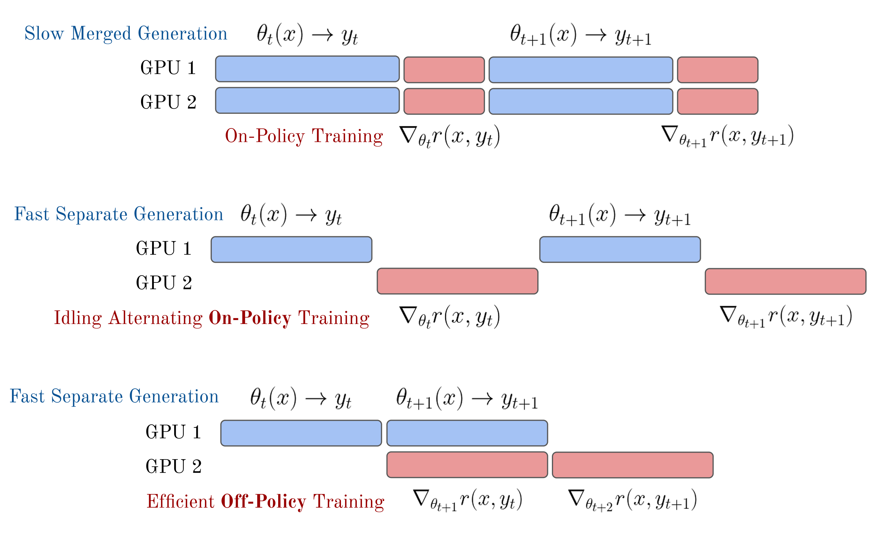
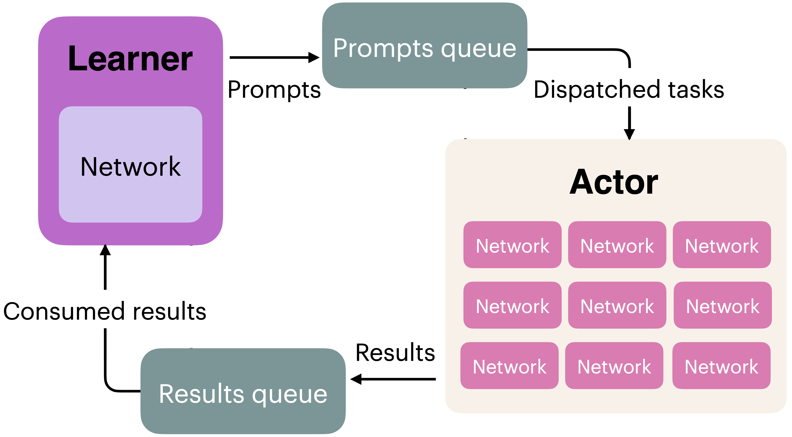

<!-- layout: title-sidebar -->
<!-- valign: bottom -->

# Lecture 4: RL Implementation & Practice

<div class="colloquium-title-eyebrow">rlhfbook.com</div>

<div class="colloquium-title-meta">
<p class="colloquium-title-name">Nathan Lambert</p>
</div>

<p class="colloquium-title-note">Course on RLHF and post-training. Chapter 6, Part 2</p>

---

<!-- rows: 50/50 -->
## Lecture 4: RL implementation & practice

<!-- row-columns: 32/36/32 -->

```box
title: Overview
tone: muted
compact: true
content: |
  1. Introduction
  2. Key Related Works
  3. Training Overview
```

|||

```box
title: Core Training Pipeline
tone: accent
compact: true
content: |
  4. Instruction Tuning
  5. Reward Models
  6. **Reinforcement Learning**
  7. Reasoning
  8. Direct Alignment
  9. Rejection Sampling
```

|||

```box
title: Data & Preferences
tone: muted
compact: true
content: |
  10. What are Preferences
  11. Preference Data
  12. Synthetic Data & CAI
```

===

<!-- row-columns: 32/36/32 -->

```box
title: Practical Considerations
tone: muted
compact: true
content: |
  13. Tool Use
  14. Over-optimization
  15. Regularization
  16. Evaluation
  17. Product & Character
```

|||

```box
title: Appendices
tone: surface
compact: true
content: |
  - A. Definitions
  - B. Style & Information
  - C. Practical Issues
```

|||

```box
title: Course Home
tone: surface
compact: true
content: |
  - [rlhfbook.com](https://rlhfbook.com)
  - [GitHub repo](https://github.com/natolambert/rlhf-book)
```

---

## From math to code

Lecture 3 was the **math**: policy gradient theorem, REINFORCE, PPO, GRPO.

This lecture: how to actually **implement, debug, and run** RL training for LLMs.

The hardest bugs aren't math errors — they're silent implementation mistakes: wrong masking, stale caches, shape mismatches.

---

## From math to code

Lecture 3 was the **math**: policy gradient theorem, REINFORCE, PPO, GRPO.

This lecture: how to actually **implement, debug, and run** RL training for LLMs.

The hardest bugs aren't math errors — they're silent implementation mistakes: wrong masking, stale caches, shape mismatches.

*A reminder on notation*: As in Chapter 6, we use $(s, a)$ from the reinforcement learning literature and $(x, y)$ when prompt-completion notation is more natural. The $(s, a)$ framing reflects the token-level gradient computation; $(x, y)$ reflects the sequence-level reward. Both perspectives appear throughout.

---

## What this lecture covers

```box
title: Lecture 4 Outline
tone: accent
content: |
  1. **Policy gradient code** — log-probs, REINFORCE loss, RLOO vs GRPO
  2. **Loss aggregation** — per-sequence, per-token, fixed-length normalization
  3. **PPO implementation** — GAE, clipped loss, value function, full loop
  4. **GRPO implementation** — simplified code, memory comparison
  5. **Async training & infrastructure** — on/off-policy, distributed systems
  6. **Practical engineering** — compute costs, debugging, recipes
  7. **Exploring real training** — codebases, WandB, debugging checklist
```

---

<!-- layout: section-break -->

## Translating the policy gradient into code

---

## Recall: the policy gradient

The objective and its gradient:

$$J(\theta) = \mathbb{E}_{\tau \sim \pi_\theta}[R(\tau)]$$

$$\nabla_\theta J(\theta) = \mathbb{E}_{\tau \sim \pi_\theta}\!\left[\sum_{t=0}^{T} \nabla_\theta \log \pi_\theta(a_t \mid s_t) \cdot \Psi_t\right]$$

The gradient says: for each token, compute the direction that makes it more likely ($\nabla \log \pi$), then scale by how good it was ($\Psi_t$).

---

## Recall: the policy gradient algorithms

All methods optimize the same core objective — they differ in $\Psi_t$ and how updates are bounded:

<div class="text-sm">

$$\begin{aligned}
\textbf{REINFORCE:}\quad & -\frac{1}{T}\sum_{t=1}^{T}\log \pi_\theta(a_t\mid s_t)\,\big(G_t - b(s_t)\big) \\[4pt]
\textbf{RLOO:}\quad & -\frac{1}{K}\sum_{i=1}^{K}\sum_t \log \pi_\theta(a_{i,t}\mid s_{i,t})\left(R_i-\frac{1}{K-1}\sum_{j\neq i}R_j\right) \\[4pt]
\textbf{PPO:}\quad & -\frac{1}{T}\sum_{t=1}^{T}\min\!\big(\rho_t A_t,\ \mathrm{clip}(\rho_t,1-\varepsilon,1+\varepsilon)\, A_t\big) \\[4pt]
\textbf{GRPO:}\quad & -\frac{1}{G}\sum_{i=1}^{G}\frac{1}{|a_i|}\sum_{t=1}^{|a_i|}\min\!\big(\rho_{i,t} \hat{A}_i,\ \mathrm{clip}(\rho_{i,t},1-\varepsilon,1+\varepsilon)\, \hat{A}_i\big)
\end{aligned}$$

</div>

Where $\rho_t = \frac{\pi_\theta(a_t \mid s_t)}{\pi_{\theta_\text{old}}(a_t \mid s_t)}$ is the importance-sampling ratio. PPO: per-token advantage $A_t$ via GAE. GRPO: per-token ratio $\rho_{i,t}$ but sequence-level advantage $\hat{A}_i = \frac{R_i - \mu}{\sigma}$.

*(Reductions shown are schematic — aggregation strategy is a key design choice, covered later.)*

---

## Recall: why losses are sums of log-probs

From lecture 3, the policy gradient derivation showed:

$$\nabla_\theta \log p_\theta(\tau) = \sum_{t=0}^{T} \nabla_\theta \log \pi_\theta(a_t \mid s_t)$$

In code, we compute the **log-probs** and let autodiff handle the gradient:

```python
seq_log_probs = (token_log_probs * completion_mask).sum(dim=-1)
loss = -(seq_log_probs * advantages).mean()
loss.backward()  # autodiff gives ∑ ∇ log π · Ψ_t
```

Every loss function in this lecture is a variation on this pattern.

---

## Computing log-probabilities (expanded)

The fundamental building block: per-token log-probabilities from the policy. Here's every step explicitly:

```python
# Forward pass through the model
logits = model(input_ids).logits              # (B, L, vocab_size)

# Autoregressive shift: logit at position t predicts token at t+1
logits = logits[:, :-1, :]                    # (B, L-1, vocab_size)
labels = input_ids[:, 1:]                     # (B, L-1)
completion_mask = completion_mask[:, 1:]       # (B, L-1)

# Per-token log-probs
log_probs = logits.log_softmax(dim=-1)
token_log_probs = log_probs.gather(dim=-1, index=labels.unsqueeze(-1)).squeeze(-1) # (B, L-1)

# Per-sequence log-prob: sum over completion tokens
seq_log_probs = (token_log_probs * completion_mask).sum(dim=-1)
```

Everything in log-space to avoid numerical underflow from multiplying many small probabilities.

---

## Computing log-probabilities (compact)

In practice, this is usually wrapped in a helper. From the book's code:

```python
def compute_log_probs(model, input_ids, attention_mask):
    logits = model(input_ids=input_ids,
                   attention_mask=attention_mask).logits
    logits = logits[:, :-1, :].to(torch.float32)
    log_probs = F.log_softmax(logits, dim=-1)
    targets = input_ids[:, 1:].unsqueeze(-1)
    return torch.gather(log_probs, dim=-1,
                        index=targets).squeeze(-1)
```

The shift, gather, and squeeze are the same — just condensed. It returns log-probs for all positions (prompt + completion); masking happens later. At rollout time, call this for the old policy and reference model (cache the results). During training, call it again for the current policy (recomputed each step).

---

## The REINFORCE loss in code

The simplest policy gradient loss:

```python
# rewards: (B,) — one reward per sequence
# seq_log_probs: (B,) — sum of log-probs over completion tokens

# Baseline: average reward in the batch
baseline = rewards.mean()
advantages = rewards - baseline

# REINFORCE loss (negative because we minimize)
loss = -(advantages * seq_log_probs).mean()
```

That's it. Advantages weight the log-probabilities. Positive advantage → increase probability. Negative → decrease. (How we reduce per-token losses to a scalar — `.mean()` here — turns out to matter more than you'd expect. We return to this in the loss aggregation section.)

---

## RLOO in code

Generate $K$ completions per prompt, compute leave-one-out baselines:

```python
# rlhf_reward: (N*K,) flat tensor of rewards
# Prompt-major layout: K sibling completions stay together
rlhf_reward = rlhf_reward.view(-1, rloo_k)  # (N, K)

# Leave-one-out baseline: avg of other K-1 rewards per prompt
baseline = (rlhf_reward.sum(dim=1, keepdim=True) - rlhf_reward) / (rloo_k - 1)

advantages = rlhf_reward - baseline        # (N, K)
advantages = advantages.reshape(-1)        # (N*K,)
```

The rest follows standard policy gradient — multiply advantages by log-probs. 

Note: the data loader must generate $K$ completions per prompt and group them together. The per-prompt baseline helps reduce variance. Standard REINFORCE computes the baseline across all the states in the batch.

---

<!-- layout: section-break -->

## Proximal Policy Optimization (PPO)

---

## Recall: Proximal Policy Optimization (PPO)

The clipped surrogate objective:

$$L^{\text{CLIP}}(\theta) = -\mathbb{E}_t\!\left[\min\!\Big(\rho_t A_t,\; \text{clip}(\rho_t, 1-\varepsilon, 1+\varepsilon)\, A_t\Big)\right]$$

where $\rho_t = \frac{\pi_\theta(a_t \mid s_t)}{\pi_{\theta_\text{old}}(a_t \mid s_t)}$ is the importance-sampling ratio.

**Generalized Advantage Estimation (GAE)**:

$$\hat{A}_t^{\text{GAE}} = \sum_{l=0}^{\infty} (\gamma \lambda)^l \delta_{t+l}, \qquad \delta_t = r_t + \gamma V(s_{t+1}) - V(s_t)$$

GAE gives per-token advantages by propagating Temporal-Difference (TD) errors backward with exponential decay. $\lambda = 0$ is pure TD (low variance, high bias); $\lambda = 1$ is Monte Carlo (high variance, low bias).

---

## Why pay the cost of PPO?

PPO adds significant complexity over REINFORCE/RLOO:

- **Lower variance**: per-token credit assignment via GAE and a learned value function
- **Token-level credit**: each token gets its own advantage signal, not just a sequence-level reward
- **Sample reuse**: multiple gradient steps per batch via importance sampling

The cost: **four models in memory** (policy, value, reference, RM), fragile value function initialization, and more hyperparameters to tune.

PPO in the late 2010s and early 2020s was by far the most developed and understood RL algorithm, used widely across RL domains. 
In tasks other than language models, PPO was far superior to REINFORCE in performance.

---


## PPO training loop in code

```text
for each batch:
  1. Sample prompts from dataset
  2. Generate completions with current policy π_θ
  3. Score with reward model → per-sequence rewards
  4. Compute ref model log-probs → per-token KL penalty
  5. Shape rewards: r_t = r_t - β * KL_t (per token)
  6. Compute returns via backward pass (GAE or MC)
  7. Compute advantages: A_t = returns_t - V(s_t)
  8. For k = 1 to K epochs on this batch:
     - Compute ratio = π_θ(a_t|s_t) / π_old(a_t|s_t)
     - Policy loss: clipped surrogate objective
     - Value loss: MSE on returns
     - total_loss = policy_loss + vf_coef * value_loss
     - Backward + optimizer step
  9. Sync π_old ← π_θ
```

---

## From scalar reward to per-token returns

The reward model gives one scalar $R(x, y)$ at the end of a completion. Per-token rewards are shaped via KL:

$$r_t = \begin{cases} R(x, y) - \beta \, \text{KL}_t & \text{if } t = T \text{ (final token)} \\ -\beta \, \text{KL}_t & \text{otherwise} \end{cases}$$

Where $\text{KL}_t = \log \pi_\theta(a_t \mid s_t) - \log \pi_\text{ref}(a_t \mid s_t)$.

These per-token rewards feed into GAE, which propagates credit backward to assign per-token advantages.

---

## What a PPO step uses

Before training starts, the rollout phase must compute and store everything the loss needs:

| Tensor | Shape | Used by |
|---------------|-------|---------|
| Token IDs | `(B, L)` | All |
| Completion mask | `(B, L)` | All |
| Old log-probs $\log \pi_{\theta_\text{old}}$ | `(B, L)` | IS ratio |
| Old values $V_{\phi_\text{old}}$ | `(B, L)` | PPO critic clipping |
| Ref log-probs $\log \pi_\text{ref}$ | `(B, L)` | KL penalty |
| Rewards | `(B,)` or `(B, L)` | Advantage computation |

---

## Cached vs. recomputed

<!-- columns: 50/50 -->

**Stored at rollout** (computed once, frozen):
- Token IDs and completion mask
- Old log-probs $\log \pi_{\theta_\text{old}}$
- Old value predictions $V_{\phi_\text{old}}$
- Ref log-probs $\log \pi_\text{ref}$
- Rewards (from RM)

|||

**Recomputed at each training step**:
- New policy log-probs $\log \pi_\theta$
- Current value predictions $V_\phi$

<div class="colloquium-spacer-md"></div>

The IS ratio $\rho_t = \frac{\pi_\theta}{\pi_{\theta_\text{old}}}$ uses one fresh quantity and one cached — this is what enables multiple epochs over the same rollout batch.

---

## Computing advantages with GAE

<div class="text-sm">

```python
# rewards: (B,) terminal only (KL shaping omitted), values_old: (B, L) from rollout
B, L = completion_mask.shape
advantages = torch.zeros_like(values_old)
next_v = torch.zeros(B, device=values_old.device)
gae = torch.zeros(B, device=values_old.device)

last_idx = completion_mask.long().cumsum(-1).argmax(-1, keepdim=True)
done_mask = (torch.arange(L, device=values_old.device).unsqueeze(0) >= last_idx).float()
rewards_t = torch.zeros_like(values_old).scatter_(-1, index=last_idx, src=rewards)

for t in reversed(range(L)):
    not_done = 1.0 - done_mask[:, t]
    delta = rewards_t[:, t] + gamma * not_done * next_v - values_old[:, t]
    gae = delta + gamma * lam * not_done * gae
    advantages[:, t] = gae
    next_v = values_old[:, t]

advantages = advantages * completion_mask
targets = (advantages + values_old).detach()
advantages = advantages.detach()
```

</div>

<span class="text-xs">*Simplified: terminal reward only. For KL-shaped rewards, add $-\beta \cdot \text{KL}_t$ per token before this loop.*</span>

---

## PPO policy loss in code

The clipped surrogate objective:

```python
# Compute probability ratio
ratio = torch.exp(new_per_token_logps - per_token_logps)  # (B, L), per_token_logps cached from rollout

# Clipped surrogate objective
eps = 0.2  # clip range
pg_losses1 = -advantages * ratio
pg_losses2 = -advantages * torch.clamp(ratio, 1.0 - eps, 1.0 + eps)
pg_loss = torch.max(pg_losses1, pg_losses2)
```

`torch.max` selects the more pessimistic (conservative) gradient. Because we minimize a negative loss, this prevents over-committing to any single update.

---

## Multiple epochs and minibatches

PPO (and GRPO) optionally reuse each rollout batch for multiple gradient steps. Clipping activates whenever $\pi_\theta$ has drifted from $\pi_{\theta_\text{old}}$ — two mechanisms cause this:


---

## Multiple epochs and minibatches

PPO (and GRPO) optionally reuse each rollout batch for multiple gradient steps. Clipping activates whenever $\pi_\theta$ has drifted from $\pi_{\theta_\text{old}}$ — two mechanisms cause this:

**Minibatching**: split the rollout batch into smaller minibatches to allow a larger, total batch size fit on a certain GPU setup. After updating on the first minibatch, $\pi_\theta$ has changed — so later minibatches in the *same* epoch already see $\rho_t \neq 1$. Clipping can activate even with $K = 1$ epoch.

---

## Multiple epochs and minibatches

PPO (and GRPO) optionally reuse each rollout batch for multiple gradient steps. Clipping activates whenever $\pi_\theta$ has drifted from $\pi_{\theta_\text{old}}$ — two mechanisms cause this:

**Minibatching**: split the rollout batch into smaller minibatches to allow a larger, total batch size fit on a certain GPU setup. After updating on the first minibatch, $\pi_\theta$ has changed — so later minibatches in the *same* epoch already see $\rho_t \neq 1$. Clipping can activate even with $K = 1$ epoch.

**Multiple epochs**: loop over the full batch $K$ times to learn more from a given rollout (which can be expensive). Each pass sees a more-updated $\pi_\theta$, making ratios drift further. Typical $K = 2$–$4$; beyond $\sim$6 the policy is too far off-policy.

With $K = 1$ and **no** minibatching: $\pi_\theta = \pi_{\theta_\text{old}}$, ratios are always 1, and clipping never activates — PPO reduces to vanilla policy gradient with GAE.

Both PPO and GRPO use this same sample-reuse structure.

---

## Value function targets

The critic $V_\phi$ learns to predict **returns** — the total discounted reward from each token onward. GAE gave us advantages by combining actual rewards with the critic's own predictions:

$$\hat{A}_t = \hat{G}_t - V_{\phi_\text{old}}(s_t)$$

$\hat{G}_t$ is a better estimate of the true return than $V_\phi$ currently produces. We use it as the regression target to improve the critic:

$$\hat{G}_t = \hat{A}_t + V_{\phi_\text{old}}(s_t) \qquad \longrightarrow \qquad \min_\phi \left(V_\phi(s_t) - \hat{G}_t\right)^2$$

```python
targets = (advantages + values_old).detach()
```

The `.detach()` is critical — targets are fixed from the rollout, not something we backpropagate through.

---

## PPO critic loss in code

The value function has its **own clipping** — same idea as the policy clip, but easy to overlook. It prevents the critic from jumping too far from its rollout-time predictions in a single update:

```python
# Current critic predictions
v_pred = value_net(completions)  # (B, L)

# old_values: critic predictions from rollout time (before any training updates, gradient detached)
# Clamp new predictions to stay within eps of the rollout values
v_clip = torch.clamp(v_pred, old_values - eps, old_values + eps)
vf_unclipped = 0.5 * (v_pred - targets) ** 2
vf_clipped   = 0.5 * (v_clip - targets) ** 2
vf_loss = torch.max(vf_unclipped, vf_clipped)
```

`torch.max` picks the worse (more conservative) loss — if the unclipped prediction is already close to the target, the clipped version won't interfere.

---

## PPO-RLHF: Combined objective

Combined loss: policy + value (KL enters via reward shaping, not as a separate loss term):

```python
per_token_loss = pg_loss + vf_coef * vf_loss  # (B, L)

# Apply completion mask and aggregate
loss = ((per_token_loss * completion_mask).sum(dim=1) /
         completion_mask.sum(dim=1)).mean()
```

The `vf_coef` (typically 0.5–1.0) balances the two objectives.

---

## Advantage whitening

Normalize advantages to zero mean, unit variance within the batch:

```python
valid_adv = advantages[completion_mask.bool()]
advantages = ((advantages - valid_adv.mean()) /
              (valid_adv.std() + 1e-8)) * completion_mask
```

**Why**: stabilizes gradient magnitudes across batches. Without whitening, batches with uniformly high or low rewards can produce outsized gradients.

---

## Value function initialization

The value function $V_\phi$ needs to produce reasonable estimates from the start:

- **Initialize from RM backbone** (InstructGPT convention): value predictions start near actual rewards
- **Initialize from SFT model + random head**: cheaper but early training unstable
- **Cold-start issues**: if initial value estimates are bad, GAE advantages are noisy → early training can be chaotic

Tülu 3 [@lambert2024t] initializes from the reward model. 

*Detail:* Many RL for LLM setups do "value function warmup" where they take training steps over data with measured rewards to help the value function initialize, so it is stable before taking policy steps.


---

## PPO hyperparameters

Illustrative ranges from common LLM RLHF setups — not universal defaults:

| Hyperparameter | Typical range | Notes |
|---------------|:-------------:|-------|
| Clip $\varepsilon$ | 0.1–0.2 | Trust region width |
| GAE $\lambda$ | 0.95 | Bias-variance for advantages |
| Value coefficient | 0.5–1.0 | Weight of critic loss |
| KL coefficient $\beta$ | 0.01–0.1 | Strength of reference constraint |
| Epochs per batch $K$ | 2–6 | Off-policy budget |
| Learning rate | $1 \times 10^{-6}$ to $5 \times 10^{-6}$ | Much lower than SFT |
| Batch size | 256–1024 prompts | Larger = lower variance |

---

## Why batch size matters more in RL

In supervised learning, gradient noise is moderate — critical batch sizes are in the thousands. In RL, the gradient noise scale is **orders of magnitude higher** because gradients come from Monte Carlo rollouts, not labeled data.

<!-- cite-right: mccandlish2018empirical -->

- **OpenAI Dota 2**: critical batch size was in the **millions** of transitions [@mccandlish2018empirical]
- **PPO specifically** is not batch-size-invariant — clipping couples batch size to effective step size, so you can't just compensate with learning rate [@hilton2021batch]
- **PPO plateaus** are often caused by noisy loss estimates that only resolve with more samples [@beukman2026preventing]

Large batches reduce gradient variance proportional to $1/N$. In RLHF, this is one of the cheapest ways to stabilize training — more effective than most hyperparameter tuning.

---

## PPO debugging checklist

What to check during training:

- **Clip fraction**: percentage of tokens clipped — 0% means clipping never activates, >50% means policy is changing too fast
- **Advantage statistics**: mean should be near 0 (if whitened), std should be stable
- **Value loss**: should decrease — if not, value function isn't learning
- **KL divergence**: should increase gradually, not explode

---

## PPO debugging checklist

What to check during training:

- **Clip fraction**: percentage of tokens clipped — 0% means clipping never activates, >50% means policy is changing too fast
- **Advantage statistics**: mean should be near 0 (if whitened), std should be stable
- **Value loss**: should decrease — if not, value function isn't learning
- **KL divergence**: should increase gradually, not explode

Common **silent bugs** — training runs but learns the wrong thing:

- Prompt tokens included in policy loss (inflates loss, wastes gradient on unchangeable tokens)
- Reward scattered to wrong position (e.g., `[:, -1]` instead of last generated token)
- Stale log-probs used as "current" (ratio stuck near 1, clipping never activates)
- Zero-std GRPO groups (all completions get same reward → NaN advantages)
- Value or policy loss computed outside completion mask (trains on padding)

---

## The four models in memory

For a 7B model with fp16:

| Model | Size | Purpose |
|-------|:----:|---------|
| Policy $\pi_\theta$ | ~14 GB | Being trained |
| Value function $V_\phi$ | ~14 GB | Learned critic |
| Reference policy $\pi_\text{ref}$ | ~14 GB | KL anchor (frozen) |
| Reward model $r_\psi$ | ~14 GB | Scoring (frozen) |

**~56 GB** just for model weights before optimizer states, activations, or gradients. This is why PPO often requires model parallelism or offloading. Some implementations reduce this by sharing backbones (e.g., a value head on the policy network).

---

## Double regularization

PPO has **both** clipping **and** KL penalty. Not redundant:

- **Clipping** = per-step size constraint (trust region). Prevents catastrophic single updates
- **KL penalty** = total drift constraint. Prevents cumulative drift from the reference over many steps

In practice, with $K = 1$ and no minibatching, $\pi_\theta = \pi_{\theta_\text{old}}$ so clipping never activates. But with minibatching (common at scale), later minibatches see an updated $\pi_\theta$, so clipping can still trigger even at $K = 1$.

---

<!-- layout: section-break -->

## Group Relative Policy Optimization (GRPO) & Friends

---

## Recall: Group Relative Policy Optimization (GRPO)

<!-- cite-right: shao2024deepseekmath -->

For each prompt, sample $G$ completions and compute group-normalized advantages:

$$\hat{A}_i = \frac{R_i - \mu_G}{\sigma_G}, \qquad \mu_G = \frac{1}{G}\sum_{j=1}^{G} R_j, \quad \sigma_G = \sqrt{\frac{1}{G}\sum_{j=1}^{G}(R_j - \mu_G)^2}$$

Then apply the same clipped objective as PPO — per-token ratios but sequence-level advantages — plus an optional KL penalty in the loss (more in the reasoning lecture):

$$L^{\text{GRPO}}(\theta) = -\frac{1}{G}\sum_{i=1}^{G}\frac{1}{|a_i|}\sum_{t=1}^{|a_i|}\min\!\Big(\rho_{i,t} \hat{A}_i,\; \text{clip}(\rho_{i,t}, 1-\varepsilon, 1+\varepsilon)\, \hat{A}_i\Big) + \beta \, \text{KL}(\pi_\theta \| \pi_\text{ref})$$

No value function, no GAE — advantages come entirely from comparing siblings within a group.

---

## GRPO in code

<!-- cite-right: shao2024deepseekmath -->

```python
# Generate G completions per prompt, then compute group advantages
mean_r = rewards.view(-1, G).mean(dim=1)
std_r = rewards.view(-1, G).std(dim=1)
mean_r = mean_r.repeat_interleave(G)
std_r = std_r.repeat_interleave(G)
advantages = ((rewards - mean_r) / (std_r + 1e-4)).unsqueeze(1)

# Importance sampling ratio
ratio = torch.exp(new_logps - old_logps)   # (B*G, L)

# Clipped surrogate (same as PPO)
pg_losses1 = -advantages * ratio
pg_losses2 = -advantages * torch.clamp(ratio, 1 - eps, 1 + eps)
pg_loss = torch.max(pg_losses1, pg_losses2)

# KL penalty in loss (not in reward)
per_token_loss = pg_loss + beta * per_token_kl

loss = ((per_token_loss * mask).sum(dim=1) / mask.sum(dim=1)).mean()
```

---

## KL penalty placement

<!-- rows: 30/70 -->

A key implementation detail — where the KL penalty goes. Same goal (constrain drift from reference), different placement. GRPO's approach avoids interaction between KL and advantage estimation.

===

<!-- row-columns: 50/50 -->

**PPO (KL in reward)**:
```python
# per_token_kl is (B, L), rewards is (B, L)
# Scatter RM score to each sequence's
# last action token, not [:, -1]
rewards.scatter_(1, last_idx, rm_score)
rewards = rewards - beta * per_token_kl
advantages = gae(rewards, values, ...)
```

|||

**GRPO (KL in loss)**:
```python
# Compute advantages from raw rewards
advantages = z_score(rewards)
# Add KL as separate loss term
loss = pg_loss + beta * per_token_kl
```

---

## GRPO vs PPO implementation comparison

What GRPO removes relative to PPO:

| Component | PPO | GRPO |
|-----------|:---:|:----:|
| Value network | Required | None |
| GAE computation | Required | None |
| Critic loss | Required | None |
| Value function init | Required | None |
| Advantage computation | Per-token (GAE) | Per-sequence (z-score) |
| KL handling | Fold into reward | Separate loss term |

Significantly less code and ~1 fewer model copy in memory.

---

## RLOO vs GRPO in code

<!-- columns: 50/50 -->

**RLOO advantage**:
```python
# Leave-one-out mean
rewards = rewards.view(-1, K)         # (N, K)
baseline = (rewards.sum(dim=1, keepdim=True) - rewards) / (K - 1)
advantages = rewards - baseline
advantages = advantages.reshape(-1)
```

|||

**GRPO advantage**:
```python
# Group z-score normalization
rewards = rewards.view(-1, G)       # (N, G)
mean_r = rewards.mean(dim=1, keepdim=True)
std_r = rewards.std(dim=1, keepdim=True)
advantages = (rewards - mean_r) \
             / (std_r + 1e-4)       # (N, G)
advantages = advantages.reshape(-1)
```

<div class="colloquium-spacer-md"></div>

Same structure, different baseline computation. GRPO adds std normalization; RLOO uses leave-one-out mean.

---

## Recent simplifications: GSPO & CISPO

<!-- columns: 50/50 -->

**GSPO** — sequence-level ratio:

$$\bar{\rho}_i = \exp\!\Big(\frac{1}{|a_i|}\sum_t \log \rho_{i,t}\Big)$$

Collapse per-token ratios into one geometric-mean ratio per sequence. One clip per sequence instead of per token.

|||

**CISPO** — stop-gradient clipping:

$$\text{sg}\!\big[\text{clip}(\rho, 1\!-\!\varepsilon, 1\!+\!\varepsilon)\big] \cdot \hat{A} \cdot \log \pi_\theta$$

Detach the clipped ratio so gradients flow only through $\log \pi_\theta$. The ratio acts as a fixed weight.

---

## GSPO & CISPO in code

<!-- columns: 50/50 -->

<div class="text-sm">

**GSPO** — sequence-level ratio:
```python
log_ratio = (new_logps - old_logps) * mask
rho = torch.exp(
    log_ratio.sum(dim=1) / mask.sum(dim=1)
)  # (B*G,) — one ratio per sequence
# Same clipping, but per-sequence
```

</div>

|||

<div class="text-sm">

**CISPO** — stop-gradient on clipped ratio:
```python
rho = torch.exp(new_logps - old_logps)
rho_clipped = torch.clamp(
    rho, 1 - eps, 1 + eps
).detach()  # no grad through ratio
loss = -(rho_clipped * advantages.unsqueeze(1)
         * new_logps * mask).sum()
       / mask.sum()
```

</div>

---

<!-- layout: section-break -->

## Training infrastructure

---

## On-policy vs. off-policy

<!-- cite-right: noukhovitch2024asynchronous -->

**Ideal / Theory (on-policy)**: generate → update → generate → update

Each batch of completions is scored and used for a short update window (one or a few epochs), then discarded.

**Reality (async)**: generation and training overlap on different GPU groups for better throughput. The model used for generation may be 1–N steps behind the training model.

**Tradeoff**: perfect on-policy is slow (GPUs idle during generation or training). Slight staleness is usually fine.

---

## Synchronous vs. asynchronous training

<!-- cite-right: noukhovitch2024asynchronous -->

<!-- img-align: center -->



---

## Asynchronous RL training

<!-- columns: 50/50 -->

Modern RL for LLMs splits compute into two groups:

- **Actors** (inference GPUs): generate completions using vLLM or similar
- **Learners** (training GPUs): compute policy gradient updates

A process management library (e.g., Ray) coordinates data flow between them. Model weights are synced periodically from learner → actor.

|||



---

## Open-source RL codebases

- **TRL** [@vonwerra2022trl] — HuggingFace ecosystem, PPO/GRPO/DPO. Best starting point for getting started
- **Open Instruct** [@ivison2024unpacking] — Allen AI, multi-algorithm. Best for research and reproduction
- **veRL** — Very popular in the RLVR era.
- **OpenRLHF** — Started for RLHF work, popular with RLVR, etc. too.


---

<!-- layout: section-break -->

## Practical engineering

---

## Key numerical considerations

---

## Key numerical considerations

- **Log-space arithmetic**: always use `log_softmax` + `gather`, never `softmax` then `log` — softmax squashes small probabilities to tiny floats, then `log` amplifies the precision loss
- **Masking padding tokens**: `completion_mask` must be 1 only for completion tokens — exclude prompt tokens, post-EOS padding, and the EOS token itself (or include EOS consistently). Multiply losses by this mask before aggregation

---

## Key numerical considerations

- **Log-space arithmetic**: always use `log_softmax` + `gather`, never `softmax` then `log` — softmax squashes small probabilities to tiny floats, then `log` amplifies the precision loss
- **Masking padding tokens**: `completion_mask` must be 1 only for completion tokens — exclude prompt tokens, post-EOS padding, and the EOS token itself (or include EOS consistently). Multiply losses by this mask before aggregation
- **Stop-token handling**: EOS tokens need consistent treatment — include in loss or not, but be consistent. Mishandling is a common silent error
- **Sequence length handling**: variable-length completions need careful normalization (next section)

---

## Key numerical considerations

- **Log-space arithmetic**: always use `log_softmax` + `gather`, never `softmax` then `log` — softmax squashes small probabilities to tiny floats, then `log` amplifies the precision loss
- **Masking padding tokens**: `completion_mask` must be 1 only for completion tokens — exclude prompt tokens, post-EOS padding, and the EOS token itself (or include EOS consistently). Multiply losses by this mask before aggregation
- **Stop-token handling**: EOS tokens need consistent treatment — include in loss or not, but be consistent. Mishandling is a common silent error
- **Sequence length handling**: variable-length completions need careful normalization (next section)
- **Detaching baselines**: `advantages.detach()` — don't backpropagate through the advantage computation
- **Division guards**: anywhere you divide by `mask.sum()` or sequence lengths, use `.clamp_min(1)` or `+ eps` to avoid NaN from empty completions (e.g. immediate EOS)

---

## Beyond the loss formula

Every algorithm we've seen computes the same core gradient: $\nabla \log \pi \cdot A$. But how you **aggregate** per-token losses into a scalar changes training dynamics more than you'd expect.

The next section covers three strategies — per-sequence, per-token, and fixed-length normalization — and why the choice matters in practice.

---

<!-- layout: section-break -->

## Loss aggregation strategies

---

## Bandit-style vs MDP-style RLHF

<!-- columns: 50/50 -->

**Bandit-style**
- One reward per completion
- Sequence-level $\Psi_t$ broadcast across tokens
- Used by default in REINFORCE, RLOO, GRPO

|||

**MDP-style**
- Each token is treated as an action
- Per-token values or advantages
- Used by default in PPO with GAE

<div class="colloquium-spacer-md"></div>

Most RLHF is mixed in practice: **sequence-level rewards**, but **token-level log-prob gradients**. PPO-style RLHF usually starts from a sequence-level reward model score, then gets token-level credit via KL shaping and GAE.

---

## Why this matters

Same algorithm, different aggregation → **different training dynamics**.

This is often measured by how the sequence length changes through training, especially in RLVR.

---

## Per-sequence normalization

Each sequence contributes **equally** to the batch loss, regardless of length:

$$L = \frac{1}{B}\sum_{i=1}^{B} \frac{1}{|a_i|}\sum_{t=1}^{|a_i|} \ell_{i,t}$$

```python
# Strategy 1: Per-sequence normalization
loss = ((per_token_loss * completion_mask).sum(dim=1) /
         completion_mask.sum(dim=1)).mean()
```

Standard in GRPO and some PPO implementations.

---

## Per-sequence normalization: Effect

Each sequence gets equal weight → per-token gradients are **inversely proportional to sequence length**:

- Short sequence (5 tokens): each token gets gradient $\propto 1/5 = 0.20$
- Long sequence (10 tokens): each token gets gradient $\propto 1/10 = 0.10$

Short sequences have **larger per-token gradients**. This can bias the model away from lengthy responses.

---

## Per-token normalization

Each token contributes **equally** across the entire batch:

$$L = \frac{\sum_{i=1}^{B} \sum_{t=1}^{|a_i|} \ell_{i,t}}{\sum_{i=1}^{B} |a_i|}$$

```python
# Strategy 2: Per-token normalization
loss = (per_token_loss * completion_mask).sum() / completion_mask.sum()
```

Used in DAPO [@yu2025dapo]. Longer sequences contribute proportionally more gradient.

---

## Per-token normalization: Effect

All tokens get equal gradient magnitude. Longer sequences contribute more to the total gradient because they have more tokens.

Can bias toward **verbose completions** — the model gets more gradient signal from longer answers, which may encourage longer generations.

---

## Fixed-length normalization

Normalize by a constant $L_\text{max}$ (max generation length):

$$L = \frac{1}{B}\sum_{i=1}^{B} \frac{1}{L_\text{max}}\sum_{t=1}^{|a_i|} \ell_{i,t}$$

```python
# Strategy 3: Fixed-length normalization
loss = ((per_token_loss * completion_mask).sum(dim=1) /
         L_max).mean()
```

From Dr. GRPO [@liu2025understanding]. Equalizes per-token scale while letting longer sequences contribute more total gradient (more active tokens in the sum).

---

## Comparing aggregation strategies

```python
seq_1_losses = [1, 1, 1, 1, 10]           # 5 tokens, mean = 2.8
seq_2_losses = [1, 1, 1, 1, 1, 1, 1, 1, 1, 10]  # 10 tokens, mean = 1.9
```

| Strategy | Batch loss | Short seq gradient | Long seq gradient |
|----------|:----------:|:------------------:|:-----------------:|
| **Per-sequence** | $(2.8 + 1.9)/2 = 2.35$ | 0.20 per token | 0.10 per token |
| **Per-token** | $(14 + 19)/15 = 2.2$ | 0.067 per token | 0.067 per token |
| **Fixed-length** ($L=10$) | $(1.4 + 1.9)/2 = 1.65$ | 0.10 per token | 0.10 per token |

**Per-sequence** gives short sequences bigger per-token gradients. **Per-token** and **fixed-length** equalize.

---

## What to monitor during training

Illustrative ranges — thresholds vary by model size, task, and algorithm:

| WandB panel | Healthy | Unhealthy |
|-------------|---------|-----------|
| `reward/mean` | Steady upward trend | Spikes, oscillation, plateau |
| `kl/mean` | Gradual increase (0 → 2–5) | Explosion (>10) or flat at 0 |
| `loss/policy` | Decreasing | Diverging or NaN |
| `metrics/clip_frac` | 5–30% | 0% or >50% |
| `generation/length` | Stable or slight increase | Monotonic increase (length hack) |
| Policy entropy | Slow decrease | Crashes to 0 (mode collapse) |

Also monitor: eval scores on held-out benchmarks, and read sample outputs for coherence.

---

<!-- ## Extended RL training practices

Reasoning models push RL to extremes. Here's what changes:

- **Remove KL** for long training runs — reasoning models often train without KL constraints
- **Relaxed clipping** (DAPO): asymmetric $\varepsilon_\text{low} \neq \varepsilon_\text{high}$ for better exploration
- **Progressive training**: start with easier problems, increase difficulty
- **Difficulty filtering**: best results when 20–80% of completions solve the problem (enough signal without being trivially easy)
- **Dynamic sampling**: remove prompts where all completions are correct or all incorrect (no learning signal)

--- -->

## Forward pointer: Regularization & over-optimization

When RL runs go wrong, it is often due to RL latching onto spurious signals rather than the intended reward. 
These topics deserve their own lecture:

- **KL penalties**: forward vs. reverse KL, math and code
- **Goodhart's Law**: when the proxy objective diverges from true quality
- **Reward hacking**: sycophancy, verbosity, over-refusal
- **Implicit regularization**: "SFT Memorizes, RL Generalizes", "RL's Razor"

Covered in depth in a future lecture on Chapters 14 & 15.

---


<!-- layout: section-break -->

## Conclusions

---

## Lecture summary

From math to running code — the implementation details that matter:

1. **Core code patterns** — log-probs, masking, the REINFORCE/RLOO/PPO/GRPO loss functions
2. **Advantage estimation** — per-prompt baselines (RLOO, GRPO z-score) vs per-token credit (GAE)
3. **Loss aggregation** — per-sequence vs per-token vs fixed-length normalization changes training dynamics
4. **PPO's complexity budget** — value function targets, critic clipping, double regularization
5. **Async training** — actor/learner splits, staleness budgets, distributed infrastructure
6. **Practical engineering** — batch size, monitoring, debugging, training recipes

---

<!-- rows: 50/50 -->
## Resources

<!-- row-columns: 50/50 -->

```box
title: Book & Course
tone: accent
compact: true
content: |
  - [rlhfbook.com](https://rlhfbook.com) — full book
  - [RL Cheatsheet](https://rlhfbook.com/rl-cheatsheet) — one-page reference
  - [GitHub repo](https://github.com/natolambert/rlhf-book)
```

|||

```box
title: Codebases
tone: surface
compact: true
content: |
  - [TRL](https://github.com/huggingface/trl) — HuggingFace
  - [Open Instruct](https://github.com/allenai/open-instruct) — Allen AI
  - [veRL](https://github.com/volcengine/verl) — ByteDance
  - [OpenRLHF](https://github.com/OpenRLHF/OpenRLHF)
```

===

<!-- row-columns: 50/50 -->

```box
title: Key Papers
tone: surface
compact: true
content: |
  - PPO [@schulman2017proximal]
  - REINFORCE baselines [@ahmadian2024back]
  - GRPO / DeepSeekMath [@shao2024deepseekmath]
  - GAE [@schulman2015high]
```

|||

```box
title: Further Reading
tone: surface
compact: true
content: |
  - Tülu 3 [@lambert2024t] — full open recipe
  - DeepSeek R1 [@guo2025deepseek] — reasoning RL
  - Unpacking DPO & PPO [@ivison2024unpacking]
```

---

<!-- rows: 50/50 -->
## What's next: DAAs & Reasoning

<!-- row-columns: 32/36/32 -->

```box
title: Overview
tone: muted
compact: true
content: |
  1. Introduction
  2. Key Related Works
  3. Training Overview
```

|||

```box
title: Core Training Pipeline
tone: accent
compact: true
content: |
  4. Instruction Tuning
  5. Reward Models
  6. **Reinforcement Learning**
  7. Reasoning
  8. Direct Alignment
  9. Rejection Sampling
```

|||

```box
title: Data & Preferences
tone: muted
compact: true
content: |
  10. What are Preferences
  11. Preference Data
  12. Synthetic Data & CAI
```

===

<!-- row-columns: 32/36/32 -->

```box
title: Practical Considerations
tone: muted
compact: true
content: |
  13. Tool Use
  14. Over-optimization
  15. Regularization
  16. Evaluation
  17. Product & Character
```

|||

```box
title: Appendices
tone: surface
compact: true
content: |
  - A. Definitions
  - B. Style & Information
  - C. Practical Issues
```

|||

```box
title: Course Home
tone: surface
compact: true
content: |
  - [rlhfbook.com](https://rlhfbook.com)
  - [GitHub repo](https://github.com/natolambert/rlhf-book)
```

---

## Course outline

1. **Introduction & Training Overview** — Chapters 1–3
2. **Instruction Tuning, Reward Models, Rejection Sampling** — Chapters 4, 5, 9
3. **RL Theory** — Chapter 6 (Part 1)
4. **RL Implementation & Practice** — Chapter 6 (Part 2)
5. **Reasoning** — Chapter 7
6. **Direct Alignment Algorithms** — Chapter 8
7. ...

---

<!-- rows: 85/15 -->
## Thank you

Questions / discussion

Contact: nathan@natolambert.com

Newsletter: [interconnects.ai](https://www.interconnects.ai/)

**rlhfbook.com**

===


```builtwith
repo: natolambert/colloquium
```
