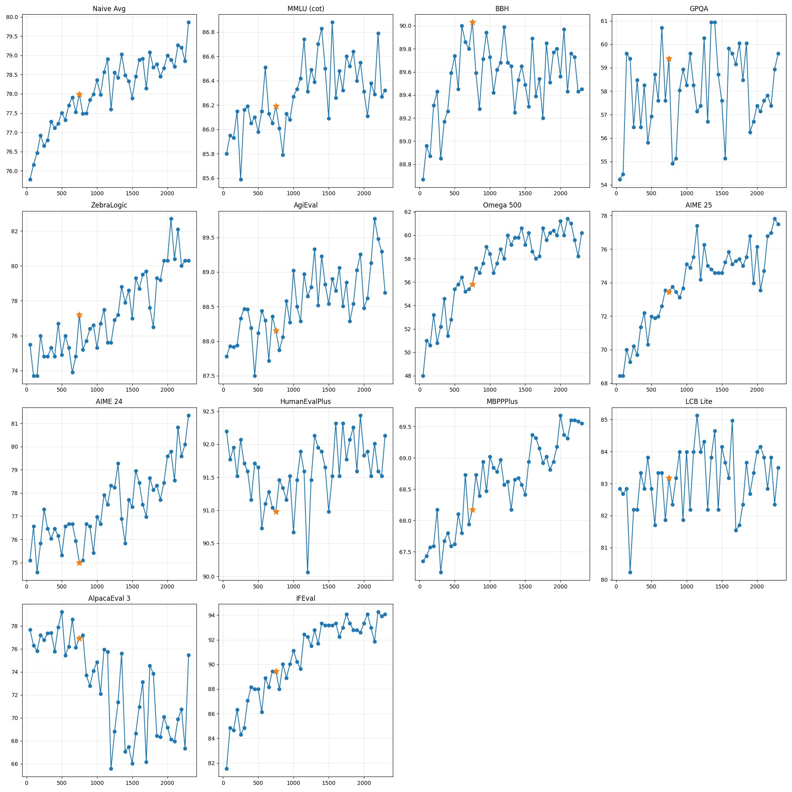

<!-- layout: title-sidebar -->
<!-- valign: bottom -->

# Lecture 5: Reasoning Training & Inference-Time Scaling

<div class="colloquium-title-eyebrow">rlhfbook.com</div>

<div class="colloquium-title-meta">
<p class="colloquium-title-name">Nathan Lambert</p>
</div>

<p class="colloquium-title-note">Course on RLHF and post-training. Chapter 7</p>

---

<!-- rows: 50/50 -->
## Lecture 5: Reasoning training & inference-time scaling

<!-- row-columns: 32/36/32 -->

```box
title: Overview
tone: muted
compact: true
content: |
  1. Introduction
  2. Key Related Works
  3. Training Overview
```

|||

```box
title: Core Training Pipeline
tone: accent
compact: true
content: |
  4. Instruction Tuning
  5. Reward Models
  6. Reinforcement Learning
  7. **Reasoning**
  8. Direct Alignment
  9. Rejection Sampling
```

|||

```box
title: Data & Preferences
tone: muted
compact: true
content: |
  10. What are Preferences
  11. Preference Data
  12. Synthetic Data & CAI
```

===

<!-- row-columns: 32/36/32 -->

```box
title: Practical Considerations
tone: muted
compact: true
content: |
  13. Tool Use
  14. Over-optimization
  15. Regularization
  16. Evaluation
  17. Product & Character
```

|||

```box
title: Appendices
tone: muted
compact: true
content: |
  A. Key Definitions
  B. Style Benchmarks
  C. References
```

|||

```box
title: Lectures
tone: surface
compact: true
content: |
  1. Overview (Ch. 1-3)
  2. IFT, RM, RS (Ch. 4,5,9)
  3. RL Theory (Ch. 6 pt 1)
  4. RL Practice (Ch. 6 pt 2)
  **5. Reasoning (Ch. 7)**
```

---

## From RL to reasoning

Lectures 3-4 covered the **math and implementation** of policy gradient RL for language models: PPO, GRPO, loss aggregation, async training.

This lecture: **where those algorithms go when you scale them up on verifiable problems** -- and the wave of models that resulted.

Two parts:

1. **What changes in the recipe** -- implementation decisions that differ from standard RLHF RL
2. **The reasoning model landscape** -- key 2025 models, grouped by what they teach

---

## What this lecture covers

```box
title: Lecture outline
tone: accent
content: |
  1. **RLVR foundations** -- RLHF vs RLVR, the feedback loop, key terminology
  2. **What changes in the recipe** -- difficulty filtering, KL removal, infrastructure shifts
  3. **The reasoning model landscape** -- case studies grouped by lesson
  4. **Looking ahead** -- where reasoning training is going
```

---

## The LeCun cake

At NeurIPS 2016, Yann LeCun introduced the cake metaphor:

> If intelligence is a cake, the bulk of the cake is unsupervised learning, the icing on the cake is supervised learning, and the cherry on the cake is reinforcement learning.

With modern language models, the analogy is complete:

- **Self-supervised learning** on internet data = the bulk of the cake
- **Supervised fine-tuning** for instructions = the icing
- **Reinforcement learning** (RLHF, then RLVR) = the cherry on top

<!-- step -->

Reasoning models graduated RL from **cherry-on-top to a load-bearing component** of the training stack.

---

<!-- columns: 50/50 -->
## RLHF vs RLVR: How reward changes everything

**RLHF** -- subjective scoring:

> *Explain opportunity cost in economics.*
>
> Scoring requires judging clarity, accuracy, completeness -- all learned preferences with no definitive answer.

|||

**RLVR** -- verifiable scoring:

> *What is the sum of all primes < 20?*
>
> `extracted_answer == 77` → Reward = 1
>
> *Write `fib(n)` returning the nth Fibonacci number.*
>
> `assert fib(10) == 55` → All tests pass → Reward = 1

Often no learned reward model is needed.

---

## The RLVR feedback loop

<!-- cite-right: lambert2024t -->
<!-- img-align: center -->


The RL algorithms (PPO, GRPO) are the same as lectures 3-4. The key change: **reward comes from a verification function**, not a learned model.

---

## Key terms for this lecture

<!-- columns: 50/50 -->

**Evaluation metrics**:

- **pass@1**: Accuracy on a single sample per problem
- **pass@K**: Generate $K$ completions, report whether *any* is correct -- measures coverage
- **IFEval**: Instruction-following evaluation benchmark
- **GPQA**: Graduate-level QA benchmark for science reasoning

|||

**Algorithm / architecture terms**:

- **DAPO**: Dynamic Advantage Policy Optimization -- a relaxed-clipping variant of GRPO [@yu2025dapo]
- **CISPO**: Clipped Importance Sampling PO -- clips IS weights rather than per-token ratios
- **MTP**: Multi-Token Prediction -- pretraining objective that predicts multiple future tokens

---

<!-- layout: section-break -->

## What changes in the RL recipe

---

<!-- columns: 50/50 -->
## Standard RLHF RL vs RLVR for reasoning

**RLHF RL (lectures 3-4)**:

- Reward model scores
- KL penalty to reference model
- Short completions (~100-500 tokens)
- Hundreds of RL steps
- PPO or GRPO

|||

**RLVR for reasoning**:

- Verification function (binary or partial credit)
- Often **no KL penalty**
- Completions can be **1K-30K tokens**
- Thousands of RL steps
- GRPO variants dominate

Same policy-gradient family -- different reward signal and systems regime.

---

## What thinking tokens look like

<!-- cite-right: guo2025deepseek -->

**Standard model** answers directly:

> *What is the sum of all prime numbers less than 20?*
>
> The primes less than 20 are 2, 3, 5, 7, 11, 13, 17, 19. Their sum is **77**.

**Reasoning model** generates `<think>` tokens before answering:

> `<think>` I need to find all primes less than 20. Starting from 2: 2 is prime. 3 is prime. 4 = 2×2, not prime. 5 is prime... Let me add them up: 2+3=5, 5+5=10, 10+7=17, 17+11=28, 28+13=41, 41+17=58, 58+19=77. `</think>`
>
> The answer is $\boxed{77}$.
>
> **Verification**: `extracted_answer == 77` → Reward = 1

For harder problems, thinking can be **thousands of tokens**.

---

<!-- columns: 50/50 -->
## RL training vs inference-time scaling

<!-- cite-right: openai2024o1 -->


|||


Both axes show log-linear performance gains. RL training **shifts the curve**; inference-time scaling **moves along it**. They are complementary, not competing.

---

## Offline difficulty filtering

The model can only learn from problems where there is a **gradient signal**.

- If pass rate is **0%**: all completions fail → advantages are all equal → zero gradient
- If pass rate is **100%**: all completions succeed → same problem
- Sweet spot: **20-80% pass rate** per prompt

Recipe: sample $N$ completions per prompt before training, keep prompts in the productive range.

Used by Seed-Thinking 1.5 [@seed2025seed], Open-Reasoner-Zero [@hu2025openreasonerzero], Phi-4 [@abdin2025phi4], MiMo [@xia2025mimo], Skywork OR-1 [@he2025skyworkor1].

---

## Online filtering and difficulty curriculum

Offline filtering is a snapshot -- the model improves during training, shifting the difficulty distribution.

Solutions:

- **Per-batch online filtering**: Skip prompts that are now too easy or too hard
- **Difficulty schedules**: Save harder problems for later in training
- **Dynamic resampling**: Re-evaluate difficulty periodically

Used by Kimi 1.5 [@team2025kimi], Magistral [@mistral2025magistral], Llama-Nemotron [@bercovich2025llamanemotron], MiMo [@xia2025mimo].

---

## Zero-gradient filtering in practice

<!-- cite-right: teamolmo2025olmo3 -->

A more precise version used in OLMo 3 Think:

Within each batch, skip any prompt group where **all** $G$ completions succeed **or** all fail.

- Advantage = 0 for every completion in that group → zero gradient
- "Free" -- no extra sampling needed, just discard before the gradient step

Combined with **active sampling**: resample to fill the batch with non-zero-gradient groups, maintaining the target batch size.

---

## Removing the KL penalty

In RLHF (lectures 3-4): KL penalty prevents the policy from drifting too far from the reference model. **Essential** when reward models can be gamed.

In RLVR: rewards are **ground truth** (not a learned proxy), so over-optimization is less of a risk.

Removing KL allows the model to **explore more freely** during long training runs, discovering novel reasoning strategies the reference model never exhibited.

Used by Magistral [@mistral2025magistral], Open-Reasoner-Zero [@hu2025openreasonerzero], Skywork OR-1 [@he2025skyworkor1].

---

## Relaxed and asymmetric clipping

Standard PPO/GRPO uses symmetric clipping:

$$\text{clip}(\rho_t, 1-\varepsilon, 1+\varepsilon)$$

**DAPO** [@yu2025dapo] and related variants propose **asymmetric clipping** -- wider on the upside to encourage exploration of new reasoning behaviors.

This matters more for reasoning because the action space is larger and the model needs to **discover** novel strategies, not just refine known ones.

Used by Magistral [@mistral2025magistral], INTELLECT-2 [@primeintellectteam2025intellect2reasoningmodeltrained].

---

## Format and language consistency rewards

Beyond binary correctness, many models add small **auxiliary rewards**:

**Format rewards**: Encourage `<think>...</think>` before answers, penalize malformed reasoning blocks. Makes answer extraction, tooling, and distillation much easier.

**Language consistency**: Penalize language switching mid-reasoning. Common in multilingual models where the model might reason in English but answer in Chinese (or vice versa).

These are not about correctness -- they're about making reasoning **predictable and usable**.

Used by DeepSeek R1 [@guo2025deepseek], Magistral [@mistral2025magistral], Skywork OR-1 [@he2025skyworkor1].

---

## Length penalties and overthinking

Without intervention, RL-trained models generate **longer and longer** reasoning traces. Not always useful -- "overthinking" wastes compute.

Mitigation strategies:

- **Progressive length extension** (Kimi 1.5 [@team2025kimi]): gradually increase the target length during training
- **Small length penalty** (INTELLECT-2 [@primeintellectteam2025intellect2reasoningmodeltrained]): penalize excessive trace length throughout
- **Overlong filtering**: discard completions that exceed a threshold for throughput

Goal: teach the model to reason **efficiently**, not just verbosely.

---

## Loss normalization: Group vs batch

Recall from lecture 4: loss aggregation strategy matters.

- **Standard GRPO**: normalizes advantages within each prompt group

$$\hat{A}_i = \frac{R_i - \mu_G}{\sigma_G}$$

- **Batch-level normalization**: normalizes across the entire batch -- avoids per-group biases when groups have very different difficulty levels
- **Token-level vs sequence-level**: normalizing loss by total tokens across the batch reduces length bias (Dr. GRPO [@liu2025understanding])

Used by Magistral [@mistral2025magistral], MiMo [@xia2025mimo].

---

<!-- columns: 55/45 -->
## The infrastructure bottleneck

<!-- cite-right: teamolmo2025olmo3 -->

Reasoning completions are **long and variable** in length.

Result: inference (rollout generation) dominates training time.

From OLMo 3:

- Learner GPUs sit idle **~75%** of the time
- **5-14x** more compute for inference than training
- Static batching wastes **up to 54%** of compute

|||


---

## Off-policy and asynchronous updates

As completions get longer, synchronous rollout-then-train becomes **wasteful**.

Moving to async:

- **Actors** generate completions continuously
- **Learner** consumes them as available
- Trade-off: data is slightly stale (off-policy), but throughput increases dramatically

Partial-to-full async used by Seed-Thinking 1.5 [@seed2025seed], INTELLECT-2 [@primeintellectteam2025intellect2reasoningmodeltrained], and others.

This is the "algorithm to systems" shift -- **keeping the GPUs busy** matters as much as the loss function.

---

## Parallel test-time compute scaling

Combining answers from multiple parallel rollouts improves over a single rollout.

- **Majority voting**: Sample $N$, take the most common answer
- **Scoring model**: Use a learned selector to pick the best answer
- **Best-of-N**: Score with a reward model or verifier, take the highest

pass@K measures this potential; pass@1 measures the deployed policy. The gap between them shows how much inference-time scaling can help.

Used at inference by DeepSeek R1 [@guo2025deepseek], Phi-4 [@abdin2025phi4].

---

## Summary: RLVR recipe changes vs RLHF

| Decision | RLHF RL (Lec 3-4) | RLVR for reasoning |
|:---------|:-------------------|:-------------------|
| Reward signal | Learned RM | Verification function |
| KL penalty | Essential | Often removed |
| Clipping | Symmetric | Asymmetric / relaxed |
| Completion length | ~100-500 tokens | ~1K-30K tokens |
| Difficulty filtering | Rarely | Standard practice |
| Loss normalization | Per-group | Per-group or per-batch |
| Training duration | ~100s of steps | ~1000s of steps |
| Infrastructure | Synchronous OK | Async near-mandatory |

---

## Common failure modes

<!-- animate: bullets -->

- **No RL headroom**: Starting policy solves ~0% or ~100% of training problems → no gradient signal
- **Over-specialization**: Single-domain RL improves one metric while harming adjacent behaviors
- **Length pathologies**: Models overthink (wasting compute) or collapse to short answers
- **Verifier bottlenecks**: Slow code execution or brittle test infrastructure caps experiment velocity
- **Off-policy drift**: Asynchronous actors generate stale data; needs inflight update strategies
- **Contamination**: Training prompts that overlap with eval benchmarks give false optimism

---

## Cross-model empirical findings

Three results that appeared independently across multiple teams:

- **Text-only reasoning boosts multimodal performance**: MiMo-VL and Magistral [@mistral2025magistral] found that text-only reasoning RL *after* multimodal training improves vision tasks
- **Mixed-domain RL prevents over-optimization**: Training on math alone leads to degradation on general chat; mixing in code and instruction following is safer [@teamolmo2025olmo3]
- **Midtraining determines RL ceiling**: How much math/code is in pretraining data sets the upper bound on what RL can achieve [@xia2025mimo]

---

<!-- layout: section-break -->

## The reasoning model landscape

---

## The research that came before

The ideas behind RLVR aren't new -- they were explored before o1/R1 made them mainstream:

- **STaR** [@zelikman2022star] and **Quiet-STaR** [@Zelikman2024QuietSTaRLM]: self-taught reasoning with ground-truth rewards (2022-2024)
- **TRICE** [@hoffman2023training]: MCMC-inspired optimization for reasoning traces
- **VinePPO** [@VinePPO]: PPO with binary math rewards on GSM8K/MATH
- **Tulu 3** [@lambert2024t]: PPO for math correctness while maintaining broad capabilities

The difference: these didn't scale to the same factor, or sacrificed general performance for specialized gains. 2025 was about scale-up and synthesis, not spontaneous invention.

---

## Why does RL work now?

<!-- animate: bullets -->

- **Stability is much more tractable**: Still a first-class research problem (entropy collapse, long-horizon credit), but tooling and recipes are mature enough for widespread adoption
- **Open-source tooling**: TRL, Open Instruct [@lambert2024t], veRL [@sheng2024hybridflow], OpenRLHF [@hu2024openrlhf]
- **Base models are good enough**: Multiple sources suggest RL reasoning training only became viable with models from ~2024 onwards -- a capability floor was needed
- **Verifiable domains provide clean signal**: Math and code give unambiguous rewards, avoiding the reward hacking problems of RLHF

---

## How to read the landscape

25+ reasoning model reports landed in 2025 alone. Rather than chronological, we group by **what each model teaches us**:

- **The pioneer** -- DeepSeek R1 cracked open the door
- **The replicators** -- Open-Reasoner-Zero, Phi-4: is the recipe reproducible?
- **End-to-end pipelines** -- MiMo, OLMo 3: pretraining → post-training as one system
- **Toggleable reasoning** -- Llama-Nemotron, Qwen 3: reasoning as a product mode
- **Stability engineering** -- Skywork OR-1: making long RL runs actually work

---

<!-- columns: 55/45 -->
## DeepSeek R1: The catalyst

<!-- cite-right: guo2025deepseek -->

The anchor release for the open reasoning wave.

**R1-Zero**: Pure RL on a base model. No SFT warm-start. Showed that large-scale RL *alone* can induce chain-of-thought reasoning.

**The full R1 recipe**: Cold-start SFT → large-scale RL → distillation of smaller models.

Open weights, 671B MoE.

|||


---

## DeepSeek R1: What it taught us

<!-- cite-right: guo2025deepseek -->

**R1-Zero** proved that RL alone produces reasoning behavior:

- Emergent self-verification and backtracking
- Thinking tokens appear without being taught
- Strong math/code gains

<!-- step -->

But R1-Zero also had problems: language mixing mid-reasoning, poor formatting, inconsistent output structure.

The full R1 recipe re-introduced cold-start SFT to fix these, then scaled RL further. Also released distilled smaller models -- distillation as an alternative path to RL.

---

## Open-Reasoner-Zero: The minimalist replication

<!-- cite-right: hu2025openreasonerzero -->

If DeepSeek R1 proved the concept, Open-Reasoner-Zero proved it was **reproducible**.

- Fully open: model, data, and code
- Vanilla PPO with GAE ($\lambda=1, \gamma=1$) and simple rule-based rewards
- No KL penalty
- Showed the recipe is not a DeepSeek-specific trick

One of the clearest "minimalism wins" results. Start here if you want to understand the basic recipe.

---

## Phi-4: Small model, careful recipe

<!-- cite-right: abdin2025phi4 -->

14B parameters (Microsoft). Excels at STEM reasoning despite small size.

Key lesson: **model quality and data curation can compensate for scale**.

- Curated set of "teachable" prompts and synthetic reasoning demonstrations
- Short phase of outcome-based RL after SFT
- Uses offline difficulty filtering and majority voting at inference

The best small-model argument in the reasoning table.

---

## MiMo: End-to-end reasoning pipeline

<!-- cite-right: xia2025mimo -->

Xiaomi controls the **entire pipeline** from pretraining through post-training.

Key lesson: **pretraining data choices dramatically affect RL headroom**.

- Three-stage data mixing during pretraining (25T tokens)
- Multi-Token Prediction (MTP) during pretraining
- Multi-domain RL to prevent over-optimization on a single task type

"MiMo is the best rebuttal to the idea that reasoning is just a late-stage RL patch."

---

## Llama-Nemotron: Toggleable reasoning

<!-- cite-right: bercovich2025llamanemotron -->

Multi-size models with a **system prompt toggle** for thinking on/off.

- Not every query needs 10K thinking tokens
- Open weights AND data
- Uses online difficulty curriculum and length-controlled RL training

The practical UX insight: reasoning should be a **dial, not a switch**.

---

## Toggleable reasoning is becoming standard

Many models now support reasoning on/off:

- **Llama-Nemotron** [@bercovich2025llamanemotron]: system prompt toggle
- **Qwen 3** [@yang2025qwen3]: `/think` and `/no_think` modes + thinking budget
- **K2-V2**: low / medium / high reasoning effort
- **GLM-4.5**: thinking vs direct response modes

Training this requires either length-controlled RL or multi-stage SFT with both thinking and non-thinking demonstrations.

This is a **UX-driven training decision** -- not just about capability.

---

## Skywork OR-1: Fighting entropy collapse

<!-- cite-right: he2025skyworkor1 -->

The best "stability and ablations" paper in the table.

- Studies **entropy dynamics** during long-CoT RL training
- Argues that avoiding premature entropy collapse is critical for final performance
- Fully open: weights, data, AND code

"The paper to cite when someone says the high-level recipe is enough by itself." Stability engineering matters as much as the algorithm.

---

<!-- columns: 40/60 -->
## OLMo 3 Think: The fully open reasoning model

<!-- cite-right: teamolmo2025olmo3 -->

The most comprehensive open documentation of a reasoning model lifecycle.

Releases: stages, checkpoints, data, infrastructure, hyperparameters.

"If you want to study how reasoning training actually works, this is the model."

|||



<!-- step -->

Key lessons: DPO is a better RL start than SFT alone. Mixed-domain RL prevents over-optimization. Zero-gradient filtering and active sampling are essential. Performance was still improving when the run ended.

---

## What the landscape tells us

<!-- animate: bullets -->

- **Algorithm is table stakes**: Most models use GRPO or close variants -- the differentiator is systems engineering and data
- **Open weights is the norm**: Nearly all models release weights; open *process* (data, code, checkpoints) is rarer and more valuable
- **Reasoning toggle is becoming standard**: Users and developers want controllable thinking, not always-on long CoT
- **Agentic absorption**: Later models (Kimi K2, GLM-4.5, DeepSeek V3.2) blend reasoning with tool use and agentic behavior -- reasoning is becoming a substrate, not a product category

---

<!-- layout: section-break -->

## Looking ahead

---

## The expanding scope of RLVR

RLVR started with math and code because they have the **strongest automatic feedback loops**: symbolic equivalence, unit tests, compilation.

It is expanding to:

- **Precise instruction following**: Verifiable constraints (length, format, inclusion/exclusion rules)
- **Agentic tasks**: Did the agent complete the task in the environment?
- **Quality preservation**: LM-judge signals to maintain general capabilities during reasoning RL

"The core to progress on RLVR is having a variety and depth of verifiable problems."

---

## Open questions

- Is RL training **discovering** new capabilities, or **eliciting** what pretraining already learned?
- How far can reasoning training go without better pretraining data?
- Will agentic RL (tool use + reasoning) require fundamentally different recipes?
- Can we systematically study the scaling properties of RL for reasoning? [@khatri2025art]

---

## Lecture summary

1. **RLVR** -- verification functions replace reward models; same policy-gradient family, different signal and systems regime
2. **Recipe changes** -- difficulty filtering, no KL, relaxed clipping, format rewards, async infrastructure
3. **The landscape** -- 25+ models in 2025; DeepSeek R1 pioneered, the community rapidly iterated
4. **Cross-cutting patterns** -- toggleable reasoning, algorithm-to-systems shift, open weights vs open process
5. **The cake metaphor** -- RL moved from cherry on top to load-bearing component

---

<!-- rows: 50/50 -->
## Resources

<!-- row-columns: 50/50 -->

```box
title: Book & Course
tone: accent
compact: true
content: |
  - rlhfbook.com — Chapter 7
  - Course slides & recordings
  - GitHub: natolambert/rlhf-book
```

|||

```box
title: Key Papers
tone: surface
compact: true
content: |
  - DeepSeek R1
  - OLMo 3 Think
  - DAPO
  - Tulu 3
```

===

<!-- row-columns: 50/50 -->

```box
title: Codebases
tone: surface
compact: true
content: |
  - TRL (Hugging Face)
  - Open Instruct (Ai2)
  - veRL (Bytedance)
  - OpenRLHF
```

|||

```box
title: Further Reading
tone: surface
compact: true
content: |
  - Skywork OR-1
  - Magistral
  - Open-Reasoner-Zero
  - OpenThoughts
```

---

## Course outline

1. Introduction & Training Overview -- Chapters 1-3
2. IFT, Reward Models, Rejection Sampling -- Chapters 4, 5, 9
3. RL Theory -- Chapter 6 (Part 1)
4. RL Implementation & Practice -- Chapter 6 (Part 2)
5. **Reasoning -- Chapter 7**
6. Direct Alignment Algorithms -- Chapter 8
7. ...

---

<!-- rows: 85/15 -->
## Thank you

Questions and discussion welcome.

**Nathan Lambert**

rlhfbook.com | interconnects.ai

===

<div class="text-xs" style="text-align: center; opacity: 0.5;">
Built with <a href="https://github.com/natolambert/colloquium">colloquium</a>
</div>
