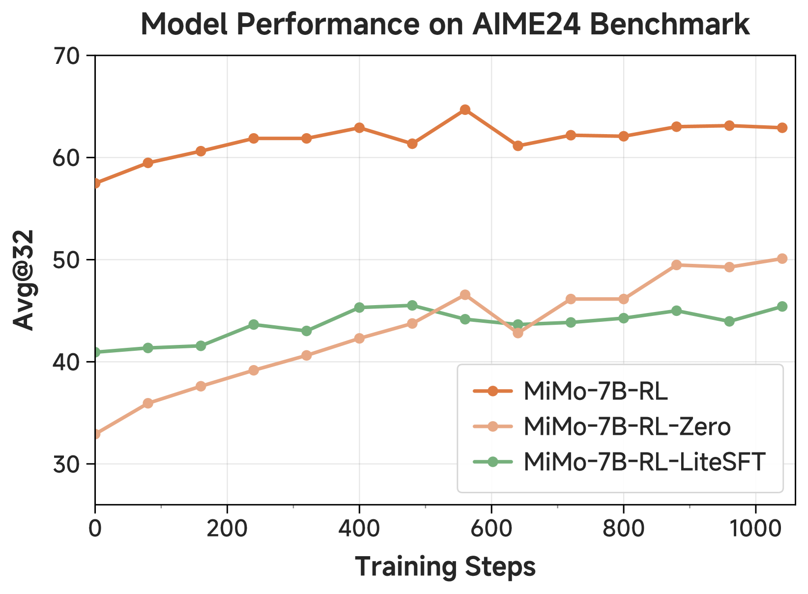
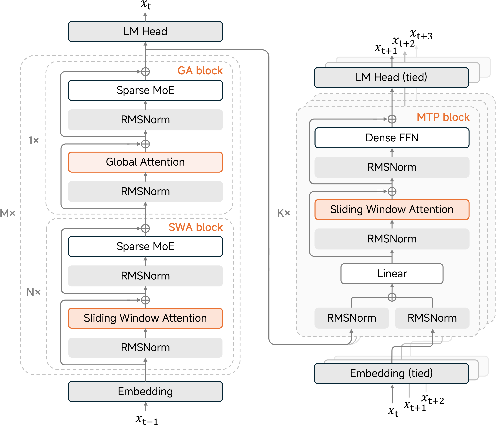

<!-- layout: title-sidebar -->
<!-- valign: bottom -->

# Lecture 5: The Rise of Reasoning Models

<div class="colloquium-title-eyebrow">rlhfbook.com</div>

<div class="colloquium-title-meta">
<p class="colloquium-title-name">Nathan Lambert</p>
</div>

<p class="colloquium-title-note">Course on RLHF and post-training. Chapter 7</p>

---

<!-- rows: 50/50 -->
## Lecture 5: The Rise of Reasoning Models

<!-- row-columns: 32/36/32 -->

```box
title: Overview
tone: muted
compact: true
content: |
  1. Introduction
  2. Key Related Works
  3. Training Overview
```

|||

```box
title: Core Training Pipeline
tone: accent
compact: true
content: |
  4. Instruction Tuning
  5. Reward Models
  6. Reinforcement Learning
  7. **Reasoning**
  8. Direct Alignment
  9. Rejection Sampling
```

|||

```box
title: Data & Preferences
tone: muted
compact: true
content: |
  10. What are Preferences
  11. Preference Data
  12. Synthetic Data & CAI
```

===

<!-- row-columns: 32/36/32 -->

```box
title: Practical Considerations
tone: muted
compact: true
content: |
  13. Tool Use
  14. Over-optimization
  15. Regularization
  16. Evaluation
  17. Product & Character
```

|||

```box
title: Appendices
tone: muted
compact: true
content: |
  A. Key Definitions
  B. Style Benchmarks
  C. References
```

|||

```box
title: Lectures
tone: surface
compact: true
content: |
  1. Overview (Ch. 1-3)
  2. IFT, RM, RS (Ch. 4,5,9)
  3. RL Theory (Ch. 6 pt 1)
  4. RL Practice (Ch. 6 pt 2)
  5. **Reasoning (Ch. 7)**
```

---

## From RL to reasoning

Lectures 3-4 covered the core policy gradient RL implementation for language models: PPO, GRPO, loss aggregation, async training, etc.

This lecture: The rise of reasoning models, early techniques specific to reasoning, recapping 2025's core models, etc.

---

<!-- columns: 38/62 -->
## The LeCun cake

<!-- cite-right: synced2019cake -->

At NeurIPS 2016, Yann LeCun introduced the cake metaphor: predictive / unsupervised learning is the cake, supervised learning is icing, and RL is the cherry.

With modern language models, the analogy is complete:

- **Self-supervised learning** on internet data = the bulk of the cake
- **Supervised fine-tuning** for instructions = the icing
- **Reinforcement learning** (RLHF, then RLVR) = the cherry on top

|||


<!-- step -->

--> With agents, RL may be more than just the cherry in compute, but it's still the shape of the training loops!

---

<!-- rows: 60/40 -->
## RLHF vs RLVR: How reward changes everything

<!-- row-columns: 50/50 -->

**RLHF** -- subjective scoring:

> *Explain opportunity cost in economics.*
>
> Scoring requires judging clarity, accuracy, completeness -- all learned preferences with no definitive answer.

|||

**RLVR** -- verifiable scoring:

> *What is the sum of all primes < 20?*
>
> `extracted_answer == 77` → Reward = 1
>
> *Write `fib(n)` returning the nth Fibonacci number.*
>
> `assert fib(10) == 55` → All tests pass → Reward = 1

===

The post-training methods are the same (i.e. same algorithms), but a new set of intuitions for building models.

<!-- step -->

**RLVR opened the door to reasoning models.** Now RL training uses mixed rewards, rubrics, and a variety of tools to train useful models. The clean distinction here is pedagogical, but in practice rare.

---

## The RLVR feedback loop

<!-- cite-right: lambert2024t -->
<!-- img-align: center -->


---

<!-- columns: 50/50 -->
## Recall: RL training vs inference-time scaling

<!-- cite-right: openai2024o1 -->


|||


---

## Recall: What thinking tokens look like

<!-- cite-right: guo2025deepseek -->

**Standard model** answers directly:

> *What is the sum of all prime numbers less than 20?*
>
> The primes less than 20 are 2, 3, 5, 7, 11, 13, 17, 19. Their sum is **77**.

**Reasoning model** generates `<think>` tokens before answering:

> `<think>` I need to find all primes less than 20. Starting from 2: 2 is prime. 3 is prime. 4 = 2×2, not prime. 5 is prime... Let me add them up: 2+3=5, 5+5=10, 10+7=17, 17+11=28, 28+13=41, 41+17=58, 58+19=77. `</think>`
>
> The answer is $\boxed{77}$.
>
> **Verification**: `extracted_answer == 77` → Reward = 1

For harder problems, thinking can be **thousands of tokens**.

---

## Key terms for this lecture

<!-- columns: 50/50 -->

**Evaluation metrics**:

- **pass@1**: Accuracy on a single sample per problem
- **pass@K**: Generate $K$ completions, report whether *any* is correct -- measures coverage

If $n$ attempts contain $c$ correct answers:

$$
\widehat{\mathrm{pass@}k}=1-\frac{\binom{n-c}{k}}{\binom{n}{k}}
$$

|||

**Algorithm / architecture terms**:

- **DAPO**: Dynamic Advantage Policy Optimization -- a relaxed-clipping variant of GRPO [@yu2025dapo]. Key early RLVR paper
- **CISPO**: Clipped Importance Sampling PO -- clips importance sampling (IS) weights rather than per-token ratios, from MiniMax-M1 [@minimax2025minimax_m1]

---


<!-- layout: section-break -->

## The reasoning model cambrian explosion

---

<!-- valign: center -->
## One year. Everyone piled in.

<!-- img-align: center -->


---

## The research that came before

The key ideas behind RLVR aren't new -- they were explored before o1/R1 made them mainstream (and effective):

<!-- animate: bullets -->

- **STaR** [@zelikman2022star] (and **Quiet-STaR** [@Zelikman2024QuietSTaRLM]): self-taught reasoning with ground-truth rewards (2022-2024). Sample CoTs with different rationales, keep correct answers, train.
- **TRICE** [@hoffman2023training]: MCMC-inspired optimization for reasoning traces (more complex algorithm).
- **VinePPO** [@VinePPO]: PPO with binary math rewards on GSM8K/MATH via many rollouts & Monte Carlo estimation.
- **Tulu 3** [@lambert2024t]: PPO for math correctness while maintaining broad capabilities.

<!-- step -->

The models that followed these scaled up the methods, in a simpler approach, and shifted the focus of post-training.

---

## Why does RL work now?

<!-- animate: bullets -->

- **Stability is much more tractable**: Still a first-class research problem (entropy collapse, long-horizon credit), but tooling and recipes are mature enough for widespread adoption
- **Base models are good enough**: Multiple sources suggest RL reasoning training only became viable with models from ~2024 onwards -- a capability floor was needed
- **Verifiable domains provide clean signal**: Math and code give unambiguous rewards, avoiding the reward hacking problems of RLHF

---

## How to read the landscape

25+ reasoning model reports landed in 2025 alone. For lecture, we keep the table small and read it in **release order** as a sequence of lessons:

- **Scaling thesis** -- o1 made train-time and test-time compute the frame
- **Catalyst** -- DeepSeek R1 made the recipe concrete and open-weight
- **Replications and data recipes** -- Kimi 1.5, Open-Reasoner-Zero, and OpenThoughts 3 tested what parts mattered
- **Systems pipelines** -- MiMo, MiniMax-M1, and OLMo 3 made reasoning a full model lifecycle
- **Productization and agents** -- Qwen 3, GLM-4.5, and late-2025 models showed the UX and engineering constraints

---

<!-- columns: 45/55 -->
## OpenAI o1 (Sep. 12, 2024): Scaling enters the story

<!-- cite-right: openai2024o1 -->

o1 reframed reasoning as **two coupled scaling laws**:

- Train longer with RL to improve the policy
- Spend more compute at inference to improve answers
- Treat "thinking" as a resource, not just a transcript

The public contribution was less a recipe and more a thesis: reasoning gets better when both training and inference compute scale.

|||


---

<!-- columns: 55/45 -->
## DeepSeek R1 (Jan. 20, 2025): The catalyst

<!-- cite-right: guo2025deepseek -->

The anchor release for the open reasoning wave.

**R1-Zero**: Pure RL on a base model. No SFT warm-start. Showed that large-scale RL *alone* can induce chain-of-thought reasoning.

**The full R1 recipe**: Cold-start SFT → large-scale RL → distillation of smaller models.

Open weights, 671B MoE. R1 made the o1-style story reproducible enough for everyone to chase.

|||


---

<!-- columns: 45/55 -->
## Kimi 1.5 (Jan. 20, 2025): Scaling the curriculum

<!-- cite-right: team2025kimi -->

Kimi 1.5 landed in the same January wave as R1 and emphasized **RL scale plus curriculum**.

- PPO/GRPO-style RL on Chinese and English reasoning data
- Difficulty scheduling and online filtering to keep gradients useful
- Progressive length extension to reduce overthinking while enabling long CoT

Key lesson: reasoning training is not only "turn on RL" -- it is **when** to show the model harder and longer problems.

|||


---

<!-- columns: 45/55 -->
## Open-Reasoner-Zero (Mar. 31, 2025): The minimalist replication

<!-- cite-right: hu2025openreasonerzero -->

If DeepSeek R1 proved the concept, Open-Reasoner-Zero proved it was **reproducible**.

- Fully open: model, data, and code
- Vanilla PPO with GAE ($\lambda=1, \gamma=1$) and simple rule-based rewards
- No KL penalty

One of the clearest "minimalism wins" results. Start here if you want to understand the basic recipe.

|||


---

<!-- columns: 45/55 -->
## Qwen 3 (Apr. 29, 2025): Reasoning as a product mode

<!-- cite-right: yang2025qwen3 -->

Qwen 3 made toggleable reasoning feel mainstream.

- `/think` and `/no_think` modes
- Thinking budget controls
- Large-model recipe mirrors the R1-style multi-stage pipeline

The product insight: reasoning is a **dial**, not a permanent personality trait.

Llama-Nemotron [@bercovich2025llamanemotron] shows the same pattern in an open data + open weights setting.

|||


---

<!-- columns: 45/55 -->
## MiMo (Apr. 30, 2025): End-to-end reasoning pipeline

<!-- cite-right: xia2025mimo -->

Xiaomi controls the **entire pipeline** from pretraining through post-training.

Key lesson: **pretraining data choices dramatically affect RL headroom**.

- Three-stage data mixing during pretraining (25T tokens)
- Multi-Token Prediction (MTP) during pretraining
- Multi-domain RL to prevent over-optimization on a single task type

"MiMo is the best rebuttal to the idea that reasoning is just a late-stage RL patch."

|||



---

<!-- columns: 40/60 -->
## OpenThoughts 3 (Jun. 5, 2025): SFT data recipes still matter

<!-- cite-right: guha2025openthoughts -->

OpenThoughts 3 is the clearest counterweight to "just run RL."

- 1.2M public examples across math, code, and science
- QwQ-32B traces, over 1,000 controlled data-pipeline experiments
- OpenThinker3-7B reaches strong reasoning performance with SFT only

Key lesson: a model can look like a reasoning breakthrough because the **data recipe** got dramatically better.

|||


---

<!-- columns: 40/60 -->
## MiniMax-M1 (Jun. 16, 2025): Efficient long thinking

<!-- cite-right: minimax2025minimax_m1 -->

MiniMax-M1 makes long reasoning a **systems and numerics** problem.

- 456B MoE, 45.9B active, hybrid attention with Lightning Attention
- 1M-token context and 40K / 80K thinking-budget checkpoints
- CISPO clips importance-sampling weights instead of dropping high-update tokens

The sharp implementation lesson: training-mode and inference-mode logprobs must match, or RL reward growth can silently fail.

|||


---

<!-- columns: 40/60 -->
## GLM-4.5 (Jul. 28, 2025): ARC becomes the target

<!-- cite-right: zeng2025glm45 -->

GLM-4.5 makes "reasoning model" broader: agentic, reasoning, and coding in one open-weight system.

- 355B total parameters, 32B active
- Thinking and direct-response modes
- Expert-model iteration plus RL for agent, reasoning, and general chat skills

Key lesson: by summer 2025, the frontier target was not only math -- it was **agentic work**.

|||


---

<!-- columns: 40/60 -->
## OLMo 3 Think (Nov. 20, 2025): The fully open reasoning model

<!-- cite-right: teamolmo2025olmo3 -->

The most comprehensive open documentation of a reasoning model lifecycle.

Releases: stages, checkpoints, data, infrastructure, hyperparameters.

"If you want to study how reasoning training actually works, this is the model."

|||


<!-- step -->

Key lessons: DPO is a better RL start than SFT alone. Mixed-domain RL prevents over-optimization. Zero-gradient filtering and active sampling are essential.

---

<!-- columns: 45/55 -->
## DeepSeek V3.2 (Dec. 1, 2025): Reasoning becomes agentic

<!-- cite-right: deepseekai2025v32 -->

DeepSeek V3.2 pushes the R1 recipe into **tool-use and agent environments**.

- Open-weight MoE successor to V3.2-Exp
- V3.2 integrates thinking directly into tool use
- Speciale variant targets maximum reasoning performance

Key lesson: by late 2025, reasoning models are no longer just math solvers -- they are becoming the policy layer for agents.

|||


---

<!-- columns: 45/55 -->
## Nemotron 3 Nano (Dec. 15, 2025): Efficient agentic reasoning

<!-- cite-right: nvidia2025nemotron3nano -->

NVIDIA's Nano model turns the reasoning story toward **throughput per active parameter**.

- 31.6B total parameters, roughly 3.2B active per forward pass
- Hybrid Mamba-Transformer MoE architecture
- Post-trained with SFT, multi-environment RLVR, and RLHF

Key lesson: efficiency is now part of the reasoning recipe, not just a deployment detail.

|||


---

<!-- columns: 45/55 -->
## MiMo-V2-Flash (Dec. 16, 2025): Speed becomes the model design

<!-- cite-right: mimo2025flash -->

MiMo-V2-Flash is an inference-centric reasoning model: the architecture is built around **fast rollout and decoding**.

- 309B total parameters, 15B active
- Hybrid SWA/global attention plus lightweight multi-token prediction
- MOPD uses domain-specialized teachers for dense token-level reward

Key lesson: scaling post-training compute increasingly means making the student cheap enough to run everywhere.

|||



---

## What the landscape tells us

<!-- animate: bullets -->

- **Algorithm is table stakes**: Most models use GRPO or close variants -- the differentiator is systems engineering and data
- **Open weights is the norm**: Nearly all models release weights; open *process* (data, code, checkpoints) is rarer and more valuable
- **Reasoning toggle is becoming standard**: Users and developers want controllable thinking, not always-on long CoT
- **Agentic absorption**: Later models (DeepSeek V3.2, Nemotron 3 Nano, MiMo-V2-Flash) blend reasoning with tool use, efficiency, and agentic behavior -- reasoning is becoming a substrate, not a product category

---

<!-- layout: section-break -->

## Common implementation patterns

---

## Offline difficulty filtering

The model can only learn from problems where there is a **gradient signal**.

- If pass rate is **0%**: all completions fail → advantages are all equal → zero gradient
- If pass rate is **100%**: all completions succeed → same problem
- Sweet spot: **20-80% pass rate** per prompt

Recipe: sample $N$ completions per prompt before training, keep prompts in the productive range.

Used by Seed-Thinking 1.5 [@seed2025seed], Open-Reasoner-Zero [@hu2025openreasonerzero], MiMo [@xia2025mimo], and Nemotron 3 Nano [@nvidia2025nemotron3nano].

---

## Online filtering and difficulty curriculum

Offline filtering is a snapshot -- the model improves during training, shifting the difficulty distribution.

Solutions:

- **Per-batch online filtering**: Skip prompts that are now too easy or too hard
- **Difficulty schedules**: Save harder problems for later in training
- **Dynamic resampling**: Re-evaluate difficulty periodically

Used by Kimi 1.5 [@team2025kimi], Magistral [@mistral2025magistral], Llama-Nemotron [@bercovich2025llamanemotron], MiMo [@xia2025mimo].

---

## Zero-gradient filtering in practice

<!-- cite-right: teamolmo2025olmo3 -->

A more precise version used in OLMo 3 Think:

Within each batch, skip any prompt group where **all** $G$ completions succeed **or** all fail.

- Advantage = 0 for every completion in that group → zero gradient
- "Free" -- no extra sampling needed, just discard before the gradient step

Combined with **active sampling**: resample to fill the batch with non-zero-gradient groups, maintaining the target batch size.

---

## Removing the KL penalty

In RLHF (lectures 3-4): KL penalty prevents the policy from drifting too far from the reference model. **Essential** when reward models can be gamed.

In RLVR: rewards are **ground truth** (not a learned proxy), so over-optimization is less of a risk.

Removing KL allows the model to **explore more freely** during long training runs, discovering novel reasoning strategies the reference model never exhibited.

Used by Magistral [@mistral2025magistral], Open-Reasoner-Zero [@hu2025openreasonerzero], and MiniMax-M1 [@minimax2025minimax_m1].

---

## Relaxed and asymmetric clipping

Standard PPO/GRPO uses symmetric clipping:

$$\text{clip}(\rho_t, 1-\varepsilon, 1+\varepsilon)$$

**DAPO** [@yu2025dapo] and related variants propose **asymmetric clipping** -- wider on the upside to encourage exploration of new reasoning behaviors.

This matters more for reasoning because the action space is larger and the model needs to **discover** novel strategies, not just refine known ones.

Used by Magistral [@mistral2025magistral], INTELLECT-2 [@primeintellectteam2025intellect2reasoningmodeltrained].

---

## Format and language consistency rewards

Beyond binary correctness, many models add small **auxiliary rewards**:

**Format rewards**: Encourage `<think>...</think>` before answers, penalize malformed reasoning blocks. Makes answer extraction, tooling, and distillation much easier.

**Language consistency**: Penalize language switching mid-reasoning. Common in multilingual models where the model might reason in English but answer in Chinese (or vice versa).

These are not about correctness -- they're about making reasoning **predictable and usable**.

Used by DeepSeek R1 [@guo2025deepseek], Magistral [@mistral2025magistral], and MiniMax-M1 [@minimax2025minimax_m1].

---

## Length penalties and overthinking

Without intervention, RL-trained models generate **longer and longer** reasoning traces. Not always useful -- "overthinking" wastes compute.

Mitigation strategies:

- **Progressive length extension** (Kimi 1.5 [@team2025kimi]): gradually increase the target length during training
- **Small length penalty** (INTELLECT-2 [@primeintellectteam2025intellect2reasoningmodeltrained]): penalize excessive trace length throughout
- **Overlong filtering**: discard completions that exceed a threshold for throughput

Goal: teach the model to reason **efficiently**, not just verbosely.

---

## Loss normalization: Group vs batch

Recall from lecture 4: loss aggregation strategy matters.

- **Standard GRPO**: normalizes advantages within each prompt group

$$\hat{A}_i = \frac{R_i - \mu_G}{\sigma_G}$$

- **Batch-level normalization**: normalizes across the entire batch -- avoids per-group biases when groups have very different difficulty levels
- **Token-level vs sequence-level**: normalizing loss by total tokens across the batch reduces length bias (Dr. GRPO [@liu2025understanding])

Used by Magistral [@mistral2025magistral], MiMo [@xia2025mimo].

---

<!-- columns: 55/45 -->
## The infrastructure bottleneck

<!-- cite-right: teamolmo2025olmo3 -->

Reasoning completions are **long and variable** in length.

Result: inference (rollout generation) dominates training time.

From OLMo 3:

- Learner GPUs sit idle **~75%** of the time
- **5-14x** more compute for inference than training
- Static batching wastes **up to 54%** of compute

|||


---

## Off-policy and asynchronous updates

As completions get longer, synchronous rollout-then-train becomes **wasteful**.

Moving to async:

- **Actors** generate completions continuously
- **Learner** consumes them as available
- Trade-off: data is slightly stale (off-policy), but throughput increases dramatically

Partial-to-full async used by Seed-Thinking 1.5 [@seed2025seed], INTELLECT-2 [@primeintellectteam2025intellect2reasoningmodeltrained], and others.

This is the "algorithm to systems" shift -- **keeping the GPUs busy** matters as much as the loss function.

---

## Parallel test-time compute scaling

Combining answers from multiple parallel rollouts improves over a single rollout.

- **Majority voting**: Sample $N$, take the most common answer
- **Scoring model**: Use a learned selector to pick the best answer
- **Best-of-N**: Score with a reward model or verifier, take the highest

pass@K measures this potential; pass@1 measures the deployed policy. The gap between them shows how much inference-time scaling can help.

Used at inference by DeepSeek R1 [@guo2025deepseek] and models with explicit thinking-budget controls such as Qwen 3 [@yang2025qwen3].

---

## Summary: RLVR recipe changes vs RLHF

| Decision | RLHF RL (Lec 3-4) | RLVR for reasoning |
|:---------|:-------------------|:-------------------|
| Reward signal | Learned RM | Verification function |
| KL penalty | Essential | Often removed |
| Clipping | Symmetric | Asymmetric / relaxed |
| Completion length | ~100-500 tokens | ~1K-30K tokens |
| Difficulty filtering | Rarely | Standard practice |
| Loss normalization | Per-group | Per-group or per-batch |
| Training duration | ~100s of steps | ~1000s of steps |
| Infrastructure | Synchronous OK | Async near-mandatory |

---

## Common failure modes

<!-- animate: bullets -->

- **No RL headroom**: Starting policy solves ~0% or ~100% of training problems → no gradient signal
- **Over-specialization**: Single-domain RL improves one metric while harming adjacent behaviors
- **Length pathologies**: Models overthink (wasting compute) or collapse to short answers
- **Verifier bottlenecks**: Slow code execution or brittle test infrastructure caps experiment velocity
- **Off-policy drift**: Asynchronous actors generate stale data; needs inflight update strategies
- **Contamination**: Training prompts that overlap with eval benchmarks give false optimism

---

## Cross-model empirical findings

Three results that appeared independently across multiple teams:

- **Text-only reasoning boosts multimodal performance**: MiMo-VL and Magistral [@mistral2025magistral] found that text-only reasoning RL *after* multimodal training improves vision tasks
- **Mixed-domain RL prevents over-optimization**: Training on math alone leads to degradation on general chat; mixing in code and instruction following is safer [@teamolmo2025olmo3]
- **Midtraining determines RL ceiling**: How much math/code is in pretraining data sets the upper bound on what RL can achieve [@xia2025mimo]

---

<!-- columns: 50/50 -->
## Standard RLHF RL vs RLVR for reasoning

**RLHF RL (lectures 3-4)**:

- Reward model scores
- KL penalty to reference model
- Short completions (~100-500 tokens)
- Hundreds of RL steps
- PPO or GRPO

|||

**RLVR for reasoning**:

- Verification function (binary or partial credit)
- Often **no KL penalty**
- Completions can be **1K-30K tokens**
- Thousands of RL steps
- GRPO variants dominate

Same policy-gradient family -- different reward signal and systems regime.

---


<!-- layout: section-break -->

## Looking ahead

---

## The expanding scope of RLVR

RLVR started with math and code because they have the **strongest automatic feedback loops**: symbolic equivalence, unit tests, compilation.

It is expanding to:

- **Precise instruction following**: Verifiable constraints (length, format, inclusion/exclusion rules)
- **Agentic tasks**: Did the agent complete the task in the environment?
- **Quality preservation**: LM-judge signals to maintain general capabilities during reasoning RL

"The core to progress on RLVR is having a variety and depth of verifiable problems."

---

## Open questions

- Is RL training **discovering** new capabilities, or **eliciting** what pretraining already learned?
- How far can reasoning training go without better pretraining data?
- Will agentic RL (tool use + reasoning) require fundamentally different recipes?
- Can we systematically study the scaling properties of RL for reasoning? [@khatri2025art]

---

## Lecture summary

1. **RLVR** -- verification functions replace reward models; same policy-gradient family, different signal and systems regime
2. **Recipe changes** -- difficulty filtering, no KL, relaxed clipping, format rewards, async infrastructure
3. **The landscape** -- 25+ models in 2025; DeepSeek R1 pioneered, the community rapidly iterated
4. **Cross-cutting patterns** -- toggleable reasoning, algorithm-to-systems shift, open weights vs open process
5. **The cake metaphor** -- RL moved from cherry on top to load-bearing component

---

<!-- rows: 50/50 -->
## Resources

<!-- row-columns: 50/50 -->

```box
title: Book & Course
tone: accent
compact: true
content: |
  - rlhfbook.com — Chapter 7
  - Course slides & recordings
  - GitHub: natolambert/rlhf-book
```

|||

```box
title: Key Papers
tone: surface
compact: true
content: |
  - DeepSeek R1
  - Kimi 1.5 / Qwen 3
  - MiMo / OpenThoughts 3
  - MiniMax-M1 / GLM-4.5
  - OLMo 3 Think
```

===

<!-- row-columns: 50/50 -->

```box
title: Codebases
tone: surface
compact: true
content: |
  - TRL (Hugging Face)
  - Open Instruct (Ai2)
  - veRL (Bytedance)
  - OpenRLHF
```

|||

```box
title: Further Reading
tone: surface
compact: true
content: |
  - Open-Reasoner-Zero
  - MiniMax-M1
  - Magistral
  - OpenThoughts 3
```

---

## Course outline

1. Introduction & Training Overview -- Chapters 1-3
2. IFT, Reward Models, Rejection Sampling -- Chapters 4, 5, 9
3. RL Theory -- Chapter 6 (Part 1)
4. RL Implementation & Practice -- Chapter 6 (Part 2)
5. **Reasoning -- Chapter 7**
6. Direct Alignment Algorithms -- Chapter 8
7. ...

---

<!-- rows: 85/15 -->
## Thank you

Questions and discussion welcome.

**Nathan Lambert**

rlhfbook.com | interconnects.ai

===

<div class="text-xs" style="text-align: center; opacity: 0.5;">
Built with <a href="https://github.com/natolambert/colloquium">colloquium</a>
</div>
