<!-- layout: title-sidebar -->
<!-- valign: bottom -->

# Lecture 5: The Rise of Reasoning Models

<div class="colloquium-title-eyebrow">rlhfbook.com</div>

<div class="colloquium-title-meta">
<p class="colloquium-title-name">Nathan Lambert</p>
</div>

<p class="colloquium-title-note">Course on RLHF and post-training. Chapter 7</p>

---

<!-- rows: 50/50 -->
## Lecture 5: The Rise of Reasoning Models

<!-- row-columns: 32/36/32 -->

```box
title: Overview
tone: muted
compact: true
content: |
  1. Introduction
  2. Key Related Works
  3. Training Overview
```

|||

```box
title: Core Training Pipeline
tone: accent
compact: true
content: |
  4. Instruction Tuning
  5. Reward Models
  6. Reinforcement Learning
  7. **Reasoning**
  8. Direct Alignment
  9. Rejection Sampling
```

|||

```box
title: Data & Preferences
tone: muted
compact: true
content: |
  10. What are Preferences
  11. Preference Data
  12. Synthetic Data & CAI
```

===

<!-- row-columns: 32/36/32 -->

```box
title: Practical Considerations
tone: muted
compact: true
content: |
  13. Tool Use
  14. Over-optimization
  15. Regularization
  16. Evaluation
  17. Product & Character
```

|||

```box
title: Appendices
tone: muted
compact: true
content: |
  A. Key Definitions
  B. Style Benchmarks
  C. References
```

|||

```box
title: Lectures
tone: surface
compact: true
content: |
  1. Overview (Ch. 1-3)
  2. IFT, RM, RS (Ch. 4,5,9)
  3. RL Theory (Ch. 6 pt 1)
  4. RL Practice (Ch. 6 pt 2)
  5. **Reasoning (Ch. 7)**
```

---

## From RL to reasoning

Lectures 3-4 covered the core policy gradient RL implementation for language models: PPO, GRPO, loss aggregation, async training, etc.

This lecture: The rise of reasoning models, early techniques specific to reasoning, recapping 2025's core models, etc.

---

<!-- columns: 38/62 -->
## The LeCun cake

<!-- cite-right: synced2019cake -->

At NeurIPS 2016, Yann LeCun introduced the cake metaphor: predictive / unsupervised learning is the cake, supervised learning is icing, and RL is the cherry.

With modern language models, the analogy is complete:

- **Self-supervised learning** on internet data = the bulk of the cake
- **Supervised fine-tuning** for instructions = the icing
- **Reinforcement learning** (RLHF, then RLVR) = the cherry on top

|||

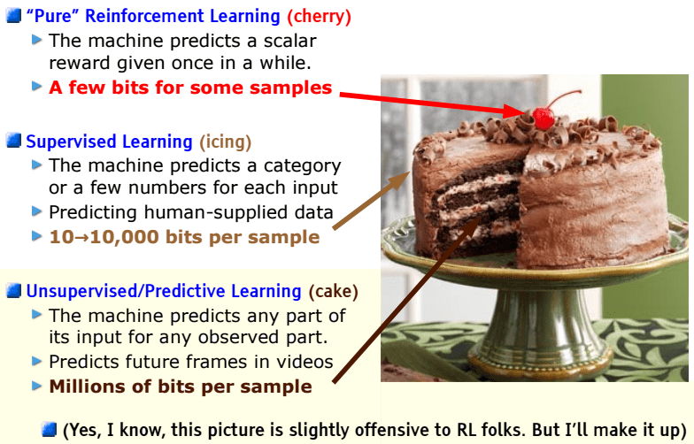

<!-- step -->

--> With agents, RL may be more than just the cherry in compute, but it's still the shape of the training loops!

---

<!-- rows: 60/40 -->
## RLHF vs RLVR: How reward changes everything

<!-- row-columns: 50/50 -->

**RLHF** -- subjective scoring:

> *Explain opportunity cost in economics.*
>
> Scoring requires judging clarity, accuracy, completeness -- all learned preferences with no definitive answer.

|||

**RLVR** -- verifiable scoring:

> *What is the sum of all primes < 20?*
>
> `extracted_answer == 77` → Reward = 1
>
> *Write `fib(n)` returning the nth Fibonacci number.*
>
> `assert fib(10) == 55` → All tests pass → Reward = 1

===

The post-training methods are the same (i.e. same algorithms), but a new set of intuitions for building models.

<!-- step -->

**RLVR opened the door to reasoning models.** Now RL training uses mixed rewards, rubrics, and a variety of tools to train useful models. The clean distinction here is pedagogical, but in practice rare.

---

## The RLVR feedback loop

<!-- cite-right: lambert2024t -->
<!-- img-align: center -->


---

<!-- columns: 50/50 -->
## Recall: RL training vs inference-time scaling

<!-- cite-right: openai2024o1 -->


|||


---

## Recall: What thinking tokens look like

<!-- cite-right: guo2025deepseek -->

**Standard model** answers directly:

> *What is the sum of all prime numbers less than 20?*
>
> The primes less than 20 are 2, 3, 5, 7, 11, 13, 17, 19. Their sum is **77**.

**Reasoning model** generates `<think>` tokens before answering:

> `<think>` I need to find all primes less than 20. Starting from 2: 2 is prime. 3 is prime. 4 = 2×2, not prime. 5 is prime... Let me add them up: 2+3=5, 5+5=10, 10+7=17, 17+11=28, 28+13=41, 41+17=58, 58+19=77. `</think>`
>
> The answer is $\boxed{77}$.
>
> **Verification**: `extracted_answer == 77` → Reward = 1

For harder problems, thinking can be **thousands of tokens**.

---

## Key terms for this lecture

<!-- columns: 50/50 -->

**Evaluation metrics**:

- **pass@1**: Accuracy on a single sample per problem
- **pass@K**: Generate $K$ completions, report whether *any* is correct -- measures coverage

If $n$ attempts contain $c$ correct answers:

$$
\widehat{\mathrm{pass@}k}=1-\frac{\binom{n-c}{k}}{\binom{n}{k}}
$$

|||

**Algorithm / architecture terms**:

- **DAPO**: Dynamic Advantage Policy Optimization -- a relaxed-clipping variant of GRPO [@yu2025dapo]. Key early RLVR paper
- **CISPO**: Clipped Importance Sampling PO -- clips importance sampling (IS) weights rather than per-token ratios, from MiniMax-M1 [@minimax2025minimax_m1]

---


<!-- layout: section-break -->

## The reasoning model cambrian explosion

---

<!-- valign: center -->
## The reasoning model cambrian explosion

<!-- img-align: center -->

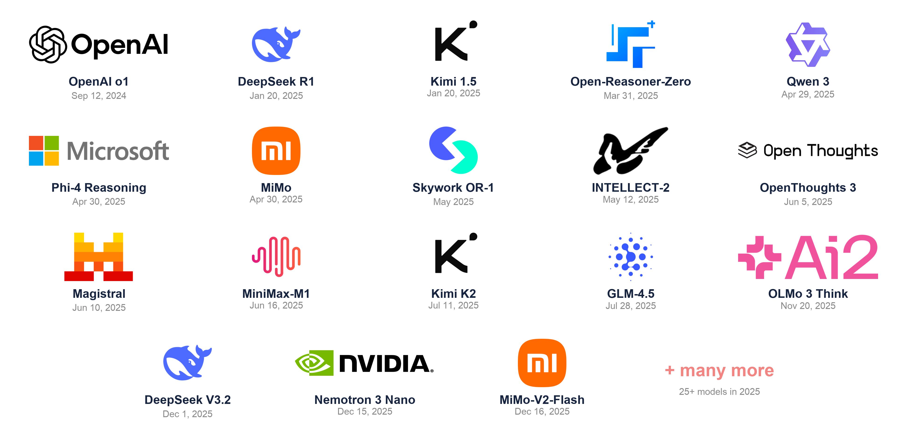

---

## The research that came before

The key ideas behind RLVR aren't new -- they were explored before o1/R1 made them mainstream (and effective):

<!-- animate: bullets -->

- **STaR** [@zelikman2022star] (and **Quiet-STaR** [@Zelikman2024QuietSTaRLM]): self-taught reasoning with ground-truth rewards (2022-2024). Sample CoTs with different rationales, keep correct answers, train.
- **TRICE** [@hoffman2023training]: MCMC-inspired optimization for reasoning traces (more complex algorithm).
- **VinePPO** [@VinePPO]: PPO with binary math rewards on GSM8K/MATH via many rollouts & Monte Carlo estimation.
- **Tulu 3** [@lambert2024t]: PPO for math correctness while maintaining broad capabilities.

<!-- step -->

The models that followed these scaled up the methods, in a simpler approach, and shifted the focus of post-training.

---

## Why does RL work now?

<!-- animate: bullets -->

- **Stability is much more tractable**: Still a first-class research problem (entropy collapse, long-horizon credit), but tooling and recipes are mature enough for widespread adoption
- **Base models are good enough**: Multiple sources suggest RL reasoning training only became viable with models from ~2024 onwards -- a capability floor was needed
- **Verifiable domains provide clean signal**: Math and code give unambiguous rewards, avoiding the reward hacking problems of RLHF

---

## This lecture

1. The seminal models
2. What we learned about them
3. What recent history teaches us

---

<!-- rows: 39/61 -->
## DeepSeek R1 (Jan. 20, 2025): The catalyst

<!-- cite-right: guo2025deepseek -->

A surprisingly fast o1 replication.

**R1-Zero**: Pure RL on a base model. No SFT warm-start. Showed that large-scale RL *alone* induces chain-of-thought reasoning.

**The full R1 recipe**: Cold-start SFT → large-scale RL → distillation of smaller models.

===


---

<!-- columns: 45/55 -->
## Kimi 1.5 (Jan. 20, 2025): Scaling the curriculum

<!-- cite-right: team2025kimi -->

Kimi 1.5 landed in the same January wave as R1 and emphasized **RL scale plus curriculum**.

- PPO/GRPO-style RL on Chinese and English reasoning data
- Difficulty scheduling and online filtering to keep gradients useful
- Progressive length extension to reduce overthinking while enabling long CoT
- Detailed technical report, but **no open-weight k1.5 release**

|||

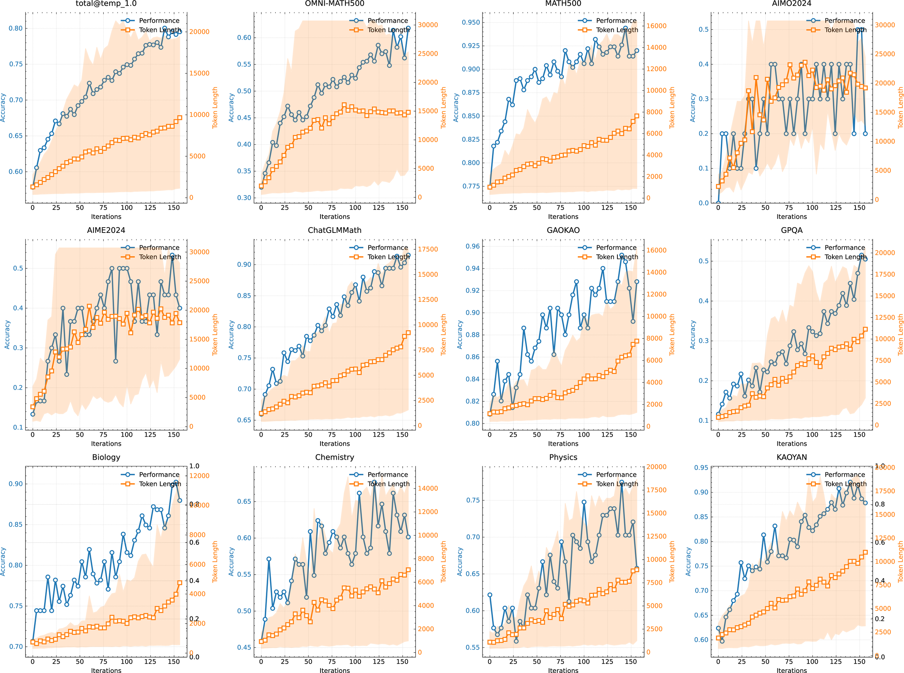

---

<!-- rows: 43/57 -->
## Open-Reasoner-Zero (Feb. 18, 2025): The minimalist replication

<!-- cite-right: hu2025openreasonerzero -->

First public dataset and code for an r1-style, base model RL run.

- Fully open: **training code, curated RL data, and model weights**
- Vanilla PPO with GAE ($\lambda=1, \gamma=1$) and simple rule-based rewards
- No KL penalty
- Mar. 31 expansion: easier scripts and 129k curated problems

===

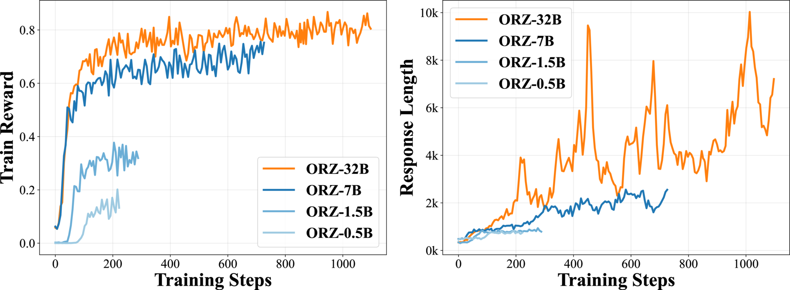

---

<!-- columns: 45/55 -->
## Qwen 3 (Apr. 29, 2025): Hybrid reasoners

<!-- cite-right: yang2025qwen3 -->

New open weight standard (RIP Llama 4).

- Toggleable thinking: `/think` and `/no_think` modes (most labs found this to be quite the training headache)
- Thinking budget length controls
- Large-model recipe mirrors the R1-style multi-stage pipeline
- Lightweight models use strong-to-weak distillation: off-policy outputs, then on-policy teacher-logit matching

Llama-Nemotron [@bercovich2025llamanemotron] is another toggleable open-weights reasoner with released post-training data and training codebases, but a different recipe.

|||

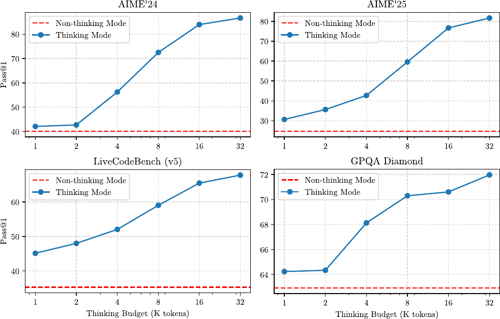

---

<!-- columns: 45/55 -->
## MiMo (Apr. 30, 2025): End-to-end reasoning pipeline

<!-- cite-right: xia2025mimo -->

Xiaomi reports the **entire pipeline** from pretraining through post-training.

Tweaks to a training recipe for reasoning:
- Three-stage data mixing during pretraining (25T tokens)
- Multi-Token Prediction (MTP) during pretraining
- Multi-domain RL to prevent over-optimization on a single task type

One of the only open-weight reasoning models to release clear intermediate checkpoints within post-training!

|||

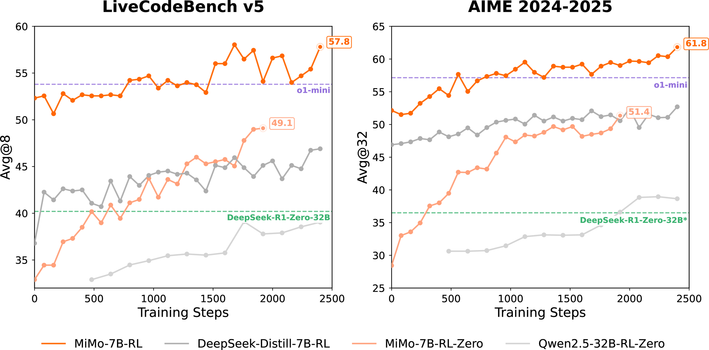

---

<!-- columns: 40/60 -->
## OpenThoughts 3 (Jun. 5, 2025): SFT data recipes still matter

<!-- cite-right: guha2025openthoughts -->

The foundational, open reasoning data (still quite strong)!

- 1.2M public examples across math, code, and science
- QwQ-32B traces, over 1,000 controlled data-pipeline experiments
- OpenThinker3-7B reaches strong reasoning performance with SFT only

The community needs more investment in strong, open reasoning traces (and understanding what makes a good teacher).

|||

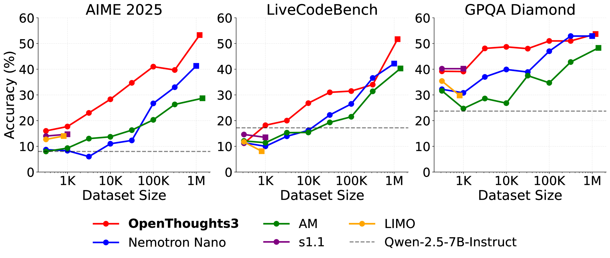

---

<!-- columns: 40/60 -->
## MiniMax-M1 (Jun. 16, 2025): A fun RL paper!

<!-- cite-right: minimax2025minimax_m1 -->

MiniMax M1's paper really held the test of time. On top of the very popular models:

1. CISPO clips importance-sampling weights instead of dropping high-update tokens. This sort of algorithm has been lasting.
2. Introduced the now famous FP32 LM head inference-training mismatch plot.

|||

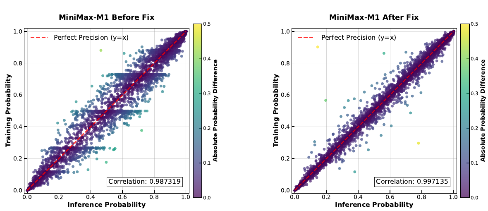

---

<!-- columns: 40/60 -->
## GLM-4.5 (Jul. 28, 2025): Reasoning broadens into agentic work

<!-- cite-right: zeng2025glm45 -->

GLM-4.5 report was one of the early ones to focus on agentic behaviors. Otherwise, it represented "yet another" very strong, open Chinese model through the summer wave.

- 355B total parameters, 32B active
- Thinking and direct-response modes
- Expert-model iteration plus RL for agent, reasoning, and general chat skills

|||

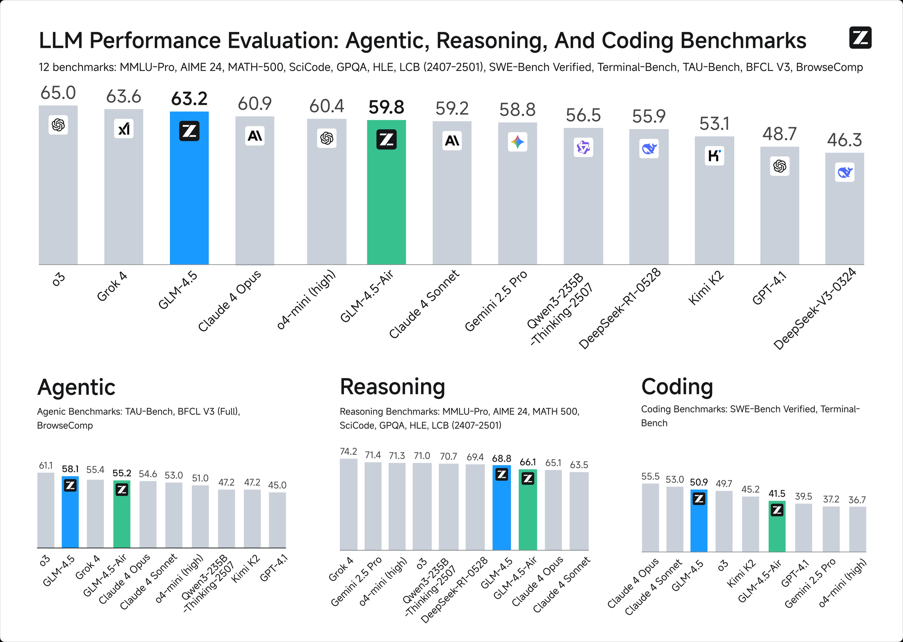

---

<!-- columns: 40/60 -->
## Olmo 3 Think (Nov. 20, 2025): The fully open reasoning model

<!-- cite-right: teamolmo2025olmo3 -->

The most comprehensive open documentation of a reasoning model lifecycle.

Releases: stages, checkpoints, data, infrastructure, hyperparameters.

Interesting DPO findings and more fun stuff. See [this talk](https://www.youtube.com/watch?v=uaZ3yRdYg8A) for more.


|||


---

<!-- columns: 45/55 -->
## DeepSeek V3.2 (Dec. 1, 2025): Reasoning becomes agentic

<!-- cite-right: deepseekai2025v32 -->

DeepSeek V3.2 pushes the R1 recipe into **tool-use and agent environments**.

- Open-weight MoE successor to V3.2-Exp
- V3.2 integrates thinking directly into tool use, no longer distinct reasoning models
- Speciale variant targets maximum reasoning performance

|||

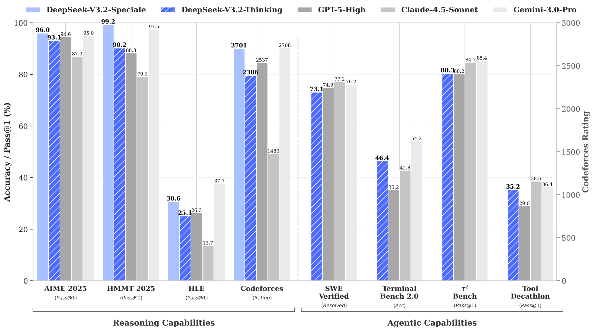

---

<!-- rows: 43/57 -->
## Nemotron 3 Nano (Dec. 15, 2025): Efficient agentic reasoning

<!-- cite-right: nvidia2025nemotron3nano -->

Another very open (and American) model, which led into stronger American open-weight models in 2026.

- 31.6B total parameters, roughly 3.2B active per forward pass
- Hybrid Mamba-Transformer MoE architecture
- Post-trained with SFT, multi-environment RLVR, and RLHF

===

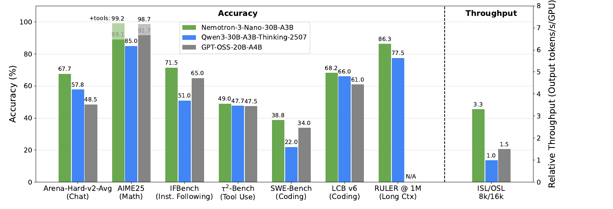

---

<!-- columns: 45/55 -->
## MiMo-V2-Flash (Dec. 16, 2025): Distilling many teachers into one

<!-- cite-right: mimo2025flash -->

The notable contribution is in post-training: **Multi-Teacher On-Policy Distillation (MOPD)**.

- Train a specialist teacher per domain (math, code, search, reasoning), then distill them into a single student
- The student learns from **dense, token-level rewards**, not just sequence-level outcome rewards -- more sample-efficient, and it matches its strongest teacher in every domain
- Underlying model is a 309B/15B MoE built for fast rollouts, but the recipe is the story here

|||

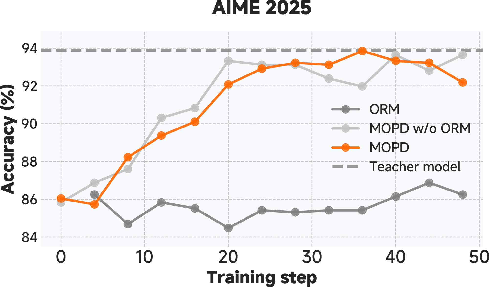

---

<!-- columns: 50/50 -->
## Recent American open models

[**NVIDIA Nemotron 3 Super**](https://research.nvidia.com/labs/nemotron/Nemotron-3-Super/) (Mar. 10, 2026)

- 120B/12B MoE; LatentMoE, MTP, native NVFP4 pretraining
- Fully open: checkpoints, training data, and recipes

|||

[**Arcee Trinity-Large-Thinking**](https://www.arcee.ai/blog/trinity-large-thinking) (Apr. 1, 2026)

- Frontier reasoning model tuned for long-horizon, multi-turn tool use
- Apache 2.0 weights; SFT + RL pipeline


---

## Recent Chinese open models

- [**Kimi K2.5**](https://www.kimi.com/blog/kimi-k2-5) (Jan. 27, 2026) → [**K2.6**](https://www.kimi.com/blog/kimi-k2-6) (Apr. 20, 2026): native multimodality and agent swarms, then stronger long-horizon coding
- [**GLM-5**](https://z.ai/blog/glm-5) (Feb. 12, 2026) → [**GLM-5.1**](https://docs.z.ai/guides/llm/glm-5.1) (Apr. 7, 2026): agentic engineering, then longer and more stable autonomous runs
- [**DeepSeek V4 Preview**](https://api-docs.deepseek.com/news/news260424) (Apr. 24, 2026): open Pro and Flash models, dual reasoning modes, efficient architecture innovations, and 1M-token context

The frontier moved fast -- from "reasoning model" to **long-horizon, tool-using agent substrate**.

---

## What the landscape tells us

<!-- animate: bullets -->

1. RL basics were quickly replicated in open-source codebases and data
2. The shift to agentic models followed very quickly from math/code reasoning tasks. Models like Olmo 3 (which I built and know was a bit late) stand out even more here
3. Substantial innovation at the model layer to make long-context inference more efficient, especially from Chinese labs
4. Lots of lasting fundamentals (FP32 LM head, CISPO style losses, etc.) emerged very quickly but took meaningful tinkering to converge

---

<!-- layout: section-break -->

## Common implementation patterns

---

## Recipe decisions (1/4)

<!-- animate: bullets -->

1. **Offline difficulty filtering** -- pre-sample $N$ completions/prompt, keep prompts at ~20-80% pass rate (where the gradient lives). *Seed-Thinking 1.5 [@seed2025seed], Open-Reasoner-Zero [@hu2025openreasonerzero], Phi-4 Reasoning [@abdin2025phi4], INTELLECT-2 [@primeintellectteam2025intellect2reasoningmodeltrained], MiMo [@xia2025mimo], Skywork OR-1 [@he2025skyworkor1]*
2. **Online filtering and curriculum** -- skip prompts now too easy/hard; save harder problems for later. *Kimi 1.5 [@team2025kimi], Magistral [@mistral2025magistral], Llama-Nemotron [@bercovich2025llamanemotron], INTELLECT-2 [@primeintellectteam2025intellect2reasoningmodeltrained], MiMo [@xia2025mimo]*
3. **Zero-gradient filtering + active sampling** -- drop groups where all $G$ completions pass or fail (advantage 0), then refill the batch. *OLMo 3 [@teamolmo2025olmo3]*
4. **Remove the KL penalty** -- verifiable rewards resist over-optimization, so set $\beta=0$ and explore past the reference. *Magistral [@mistral2025magistral], Open-Reasoner-Zero [@hu2025openreasonerzero], Skywork OR-1 [@he2025skyworkor1]*
5. **Relaxed / asymmetric clipping** -- widen the upper clip bound to keep exploratory updates (DAPO [@yu2025dapo]). *Magistral [@mistral2025magistral], INTELLECT-2 [@primeintellectteam2025intellect2reasoningmodeltrained]*

---

## Recipe decisions (2/4)

<!-- animate: bullets -->

6. **CISPO** -- clip importance-sampling weights instead of masking high-update tokens (MiniMax-M1 [@minimax2025minimax_m1]).
7. **Loss normalization** -- batch-level cuts difficulty bias (Magistral [@mistral2025magistral], MiMo [@xia2025mimo]); token-level cuts length bias (Dr. GRPO [@liu2025understanding]).
8. **Format rewards** -- reward valid `<think>` blocks and extractable answers; usability, not correctness. *DeepSeek R1 [@guo2025deepseek], Open-Reasoner-Zero [@hu2025openreasonerzero], Magistral [@mistral2025magistral], Skywork OR-1 [@he2025skyworkor1]*
9. **Language consistency rewards** -- penalize language switching inside a trace. *DeepSeek R1 [@guo2025deepseek], Magistral [@mistral2025magistral]*
10. **Length control** -- progressive length extension (Kimi 1.5 [@team2025kimi]); small length penalty (INTELLECT-2 [@primeintellectteam2025intellect2reasoningmodeltrained]); overlong filtering for throughput.

---

<!-- columns: 55/45 -->
## Recipe decisions (3/4)

<!-- cite-right: teamolmo2025olmo3 -->

<!-- animate: bullets -->

11. **Inference is the bottleneck** -- long, variable completions; OLMo 3 learner GPUs idle ~**75%**, **5-14x** more inference than training compute.
12. **Off-policy / async updates** -- actors generate continuously, the learner consumes; rollouts go slightly stale but throughput jumps. *Seed-Thinking 1.5 [@seed2025seed], INTELLECT-2 [@primeintellectteam2025intellect2reasoningmodeltrained]* -- deep dive: OLMo 3 [slides](https://docs.google.com/presentation/d/17Evr5AqnwjtSZ4H5vpnoEvGmI9fRBO19SN2dGHg7tPE/edit), [recording](https://www.youtube.com/watch?v=uaZ3yRdYg8A)
13. **Test-time scaling** -- majority voting (DeepSeek R1 [@guo2025deepseek], Phi-4 [@abdin2025phi4]); selector model (DeepSeek-GRM [@liu2025inference]); the pass@K vs pass@1 gap shows the headroom.

|||


---

## Recipe decisions (4/4)

<!-- animate: bullets -->

14. **Finding -- text-only RL boosts multimodal** -- text reasoning RL *after* multimodal training improves vision tasks. *MiMo-VL, Magistral [@mistral2025magistral]*
15. **Finding -- midtraining sets the RL ceiling** -- the math/code share in pretraining bounds what RL can reach. *MiMo [@xia2025mimo]*

---

<!-- layout: section-break -->

## Looking ahead

---

## Open questions

- Is RL training **discovering** new capabilities, or **eliciting** what pretraining already learned?
- How far can reasoning training go without better pretraining data?
- Will agentic RL (tool use + reasoning) require fundamentally different recipes?
- Can we systematically study the scaling properties of RL for reasoning? [@khatri2025art]

---

## RL training libraries

- [**slime**](https://github.com/THUDM/slime) -- SGLang-native post-training framework for RL scaling; used for the GLM model line
- [**SkyRL**](https://github.com/NovaSky-AI/SkyRL) -- modular full-stack RL library for LLMs, with async and multi-turn agent workflows
- [**veRL**](https://github.com/volcengine/verl) -- flexible, production-oriented RL training library from the HybridFlow work
- [**OpenRLHF**](https://github.com/OpenRLHF/OpenRLHF) -- Ray-based RLHF and RLVR training framework
- [**TRL**](https://github.com/huggingface/trl) -- Hugging Face post-training library with accessible trainer APIs
- [**Open Instruct**](https://github.com/allenai/open-instruct) -- Ai2's open post-training recipes and research code

---

## Course outline

1. Introduction & Training Overview -- Chapters 1-3
2. IFT, Reward Models, Rejection Sampling -- Chapters 4, 5, 9
3. RL Theory -- Chapter 6 (Part 1)
4. RL Implementation & Practice -- Chapter 6 (Part 2)
5. **Reasoning -- Chapter 7**
6. Direct Alignment Algorithms -- Chapter 8
7. ...

---

<!-- rows: 85/15 -->
## Thank you

Questions and discussion welcome.

**Nathan Lambert**

rlhfbook.com | interconnects.ai

===

<div class="text-xs" style="text-align: center; opacity: 0.5;">
Built with <a href="https://github.com/natolambert/colloquium">colloquium</a>
</div>
