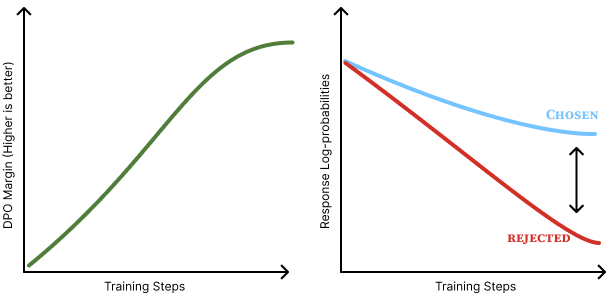
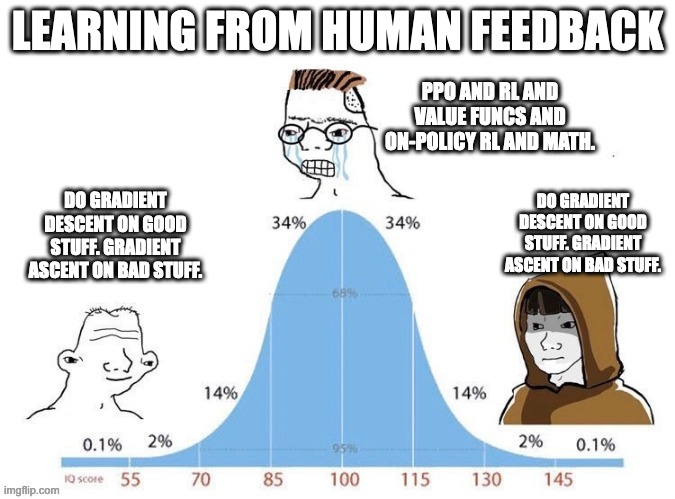

<!-- Source note: build with `make teach`, which copies assets/ into the output. A single-file `colloquium build -o ...` does NOT copy assets/, so the meme + displacement images 404 in that standalone build. -->
<!-- Reveal convention: each derivation topic is a run of duplicate slides with identical title + equations; one comment bullet is appended per slide so the layout never recenters. -->

<!-- layout: title-sidebar -->
<!-- valign: bottom -->

# Lecture 6: Direct Preference Optimization

<div class="colloquium-title-eyebrow">rlhfbook.com</div>

<div class="colloquium-title-meta">
<p class="colloquium-title-name">Nathan Lambert</p>
</div>

<p class="colloquium-title-note">Course on RLHF and post-training. Chapter 8 — deriving DPO from the RLHF objective</p>

---

<!-- columns: 50/50 -->
## What we are doing today

We will **derive Direct Preference Optimization (DPO) from scratch**, then look at how it is used in practice.

The promise of DPO:

- No separate reward model
- No reinforcement learning loop
- Just a single, directly-differentiable loss on preference pairs

|||

The plan, in four steps:

1. Solve the RLHF objective for its **optimal policy**
2. Invert that to write the **reward in terms of the policy**
3. Plug it into the **Bradley-Terry** preference model
4. Read off the **DPO loss** and its **gradient**

*Rafailov et al., 2023 — "Your Language Model is Secretly a Reward Model"* [@rafailov2024direct].

---

<!-- columns: 48/52 -->
## Where DPO sits in the pipeline

Classic RLHF is three moving parts:

1. Collect human preference pairs
2. Train a reward model $r_\phi(x,y)$
3. Optimize the policy against $r_\phi$ with RL (e.g. PPO), under a KL penalty

|||

DPO collapses steps 2 and 3 into **one supervised-style loss**.

The key realization we will prove:

> The optimal RLHF policy and the reward model are two views of the *same* object. If we know one, we know the other in closed form.

So we can train the policy *directly* on preferences.

---

<!-- layout: section-break -->
<!-- align: center -->

## Deriving the optimal policy

---

<!-- valign: top -->
<!-- title: center -->
## Solve the KL-constrained objective

$$
\begin{aligned}
& \max_{\pi}\ \mathbb{E}_{x\sim\mathcal{D},\,y\sim\pi}\big[\,r(x,y)\,\big] - \beta\,\mathcal{D}_{\text{KL}}\big(\pi \,\|\, \pi_{\text{ref}}\big) \\[6pt]
\Longleftrightarrow\ & \max_{\pi}\ \mathbb{E}\Big[\, r(x,y) - \beta\log\tfrac{\pi(y\mid x)}{\pi_{\text{ref}}(y\mid x)} \,\Big] \\[6pt]
\Longleftrightarrow\ & \min_{\pi}\ \mathbb{E}\Big[\, \log\tfrac{\pi(y\mid x)}{\pi_{\text{ref}}(y\mid x)} - \tfrac{1}{\beta} r(x,y) \,\Big]
\end{aligned}
$$

- Start from the RLHF objective: maximize reward minus a $\beta$-weighted KL leash to $\pi_{\text{ref}}$.

---

<!-- valign: top -->
<!-- title: center -->
## Solve the KL-constrained objective

$$
\begin{aligned}
& \max_{\pi}\ \mathbb{E}_{x\sim\mathcal{D},\,y\sim\pi}\big[\,r(x,y)\,\big] - \beta\,\mathcal{D}_{\text{KL}}\big(\pi \,\|\, \pi_{\text{ref}}\big) \\[6pt]
\Longleftrightarrow\ & \max_{\pi}\ \mathbb{E}\Big[\, r(x,y) - \beta\log\tfrac{\pi(y\mid x)}{\pi_{\text{ref}}(y\mid x)} \,\Big] \\[6pt]
\Longleftrightarrow\ & \min_{\pi}\ \mathbb{E}\Big[\, \log\tfrac{\pi(y\mid x)}{\pi_{\text{ref}}(y\mid x)} - \tfrac{1}{\beta} r(x,y) \,\Big]
\end{aligned}
$$

- Start from the RLHF objective: maximize reward minus a $\beta$-weighted KL leash to $\pi_{\text{ref}}$.
- Rewrite the KL as $\mathbb{E}_{y\sim\pi}\big[\log\tfrac{\pi}{\pi_{\text{ref}}}\big]$ — now everything is a single expectation.

---

<!-- valign: top -->
<!-- title: center -->
## Solve the KL-constrained objective

$$
\begin{aligned}
& \max_{\pi}\ \mathbb{E}_{x\sim\mathcal{D},\,y\sim\pi}\big[\,r(x,y)\,\big] - \beta\,\mathcal{D}_{\text{KL}}\big(\pi \,\|\, \pi_{\text{ref}}\big) \\[6pt]
\Longleftrightarrow\ & \max_{\pi}\ \mathbb{E}\Big[\, r(x,y) - \beta\log\tfrac{\pi(y\mid x)}{\pi_{\text{ref}}(y\mid x)} \,\Big] \\[6pt]
\Longleftrightarrow\ & \min_{\pi}\ \mathbb{E}\Big[\, \log\tfrac{\pi(y\mid x)}{\pi_{\text{ref}}(y\mid x)} - \tfrac{1}{\beta} r(x,y) \,\Big]
\end{aligned}
$$

- Start from the RLHF objective: maximize reward minus a $\beta$-weighted KL leash to $\pi_{\text{ref}}$.
- Rewrite the KL as $\mathbb{E}_{y\sim\pi}\big[\log\tfrac{\pi}{\pi_{\text{ref}}}\big]$ — now everything is a single expectation.
- Negate (so $\max\to\min$) and divide by $\beta$. The bracket is now **almost a log-ratio of two distributions**.

---

<!-- valign: top -->
<!-- title: center -->
## Introduce the partition function $Z(x)$

$$
Z(x) = \sum_{y} \pi_{\text{ref}}(y\mid x)\,\exp\!\big(\tfrac{1}{\beta} r(x,y)\big)
$$

$$
\log\tfrac{\pi(y\mid x)}{\pi_{\text{ref}}(y\mid x)} - \tfrac{1}{\beta} r(x,y)
= \log\frac{\pi(y\mid x)}{\tfrac{1}{Z(x)}\,\pi_{\text{ref}}(y\mid x)\,\exp\!\big(\tfrac{1}{\beta} r(x,y)\big)} - \log Z(x)
$$

- $Z(x)$ is the normalizer that turns $\pi_{\text{ref}}\,e^{r/\beta}$ into a real distribution (it ignores $\pi$).

---

<!-- valign: top -->
<!-- title: center -->
## Introduce the partition function $Z(x)$

$$
Z(x) = \sum_{y} \pi_{\text{ref}}(y\mid x)\,\exp\!\big(\tfrac{1}{\beta} r(x,y)\big)
$$

$$
\log\tfrac{\pi(y\mid x)}{\pi_{\text{ref}}(y\mid x)} - \tfrac{1}{\beta} r(x,y)
= \log\frac{\pi(y\mid x)}{\tfrac{1}{Z(x)}\,\pi_{\text{ref}}(y\mid x)\,\exp\!\big(\tfrac{1}{\beta} r(x,y)\big)} - \log Z(x)
$$

- $Z(x)$ is the normalizer that turns $\pi_{\text{ref}}\,e^{r/\beta}$ into a real distribution (it ignores $\pi$).
- Add $0 = \log Z(x) - \log Z(x)$ inside the bracket and fold $\tfrac{1}{\beta} r = \log e^{r/\beta}$ into the ratio.

---

<!-- valign: top -->
<!-- title: center -->
## Introduce the partition function $Z(x)$

$$
Z(x) = \sum_{y} \pi_{\text{ref}}(y\mid x)\,\exp\!\big(\tfrac{1}{\beta} r(x,y)\big)
$$

$$
\log\tfrac{\pi(y\mid x)}{\pi_{\text{ref}}(y\mid x)} - \tfrac{1}{\beta} r(x,y)
= \log\frac{\pi(y\mid x)}{\tfrac{1}{Z(x)}\,\pi_{\text{ref}}(y\mid x)\,\exp\!\big(\tfrac{1}{\beta} r(x,y)\big)} - \log Z(x)
$$

- $Z(x)$ is the normalizer that turns $\pi_{\text{ref}}\,e^{r/\beta}$ into a real distribution (it ignores $\pi$).
- Add $0 = \log Z(x) - \log Z(x)$ inside the bracket and fold $\tfrac{1}{\beta} r = \log e^{r/\beta}$ into the ratio.
- The denominator is now a **valid distribution** $q(y\mid x) = \tfrac{1}{Z(x)}\pi_{\text{ref}}\,e^{r/\beta}$ — exactly what we need next.

---

<!-- valign: top -->
<!-- title: center -->
## Gibbs' inequality gives the optimal policy

$$
\min_{\pi}\ \mathbb{E}_{x\sim\mathcal{D}}\Big[\, \mathcal{D}_{\text{KL}}\big(\pi(y\mid x)\,\|\,q(y\mid x)\big) - \log Z(x) \,\Big]
$$

$$
\boxed{\ \ \pi^{*}(y\mid x) = \frac{1}{Z(x)}\,\pi_{\text{ref}}(y\mid x)\,\exp\!\big(\tfrac{1}{\beta} r(x,y)\big)\ \ }
$$

- The objective is now a KL divergence plus a term that does not depend on $\pi$.

---

<!-- valign: top -->
<!-- title: center -->
## Gibbs' inequality gives the optimal policy

$$
\min_{\pi}\ \mathbb{E}_{x\sim\mathcal{D}}\Big[\, \mathcal{D}_{\text{KL}}\big(\pi(y\mid x)\,\|\,q(y\mid x)\big) - \log Z(x) \,\Big]
$$

$$
\boxed{\ \ \pi^{*}(y\mid x) = \frac{1}{Z(x)}\,\pi_{\text{ref}}(y\mid x)\,\exp\!\big(\tfrac{1}{\beta} r(x,y)\big)\ \ }
$$

- The objective is now a KL divergence plus a term that does not depend on $\pi$.
- A KL is $\ge 0$ and equals $0$ **only when the two distributions match** (Gibbs) — so set $\pi = q$.

---

<!-- valign: top -->
<!-- title: center -->
## Gibbs' inequality gives the optimal policy

$$
\min_{\pi}\ \mathbb{E}_{x\sim\mathcal{D}}\Big[\, \mathcal{D}_{\text{KL}}\big(\pi(y\mid x)\,\|\,q(y\mid x)\big) - \log Z(x) \,\Big]
$$

$$
\boxed{\ \ \pi^{*}(y\mid x) = \frac{1}{Z(x)}\,\pi_{\text{ref}}(y\mid x)\,\exp\!\big(\tfrac{1}{\beta} r(x,y)\big)\ \ }
$$

- The objective is now a KL divergence plus a term that does not depend on $\pi$.
- A KL is $\ge 0$ and equals $0$ **only when the two distributions match** (Gibbs) — so set $\pi = q$.
- Exact, but $Z(x)$ sums over *all possible responses* — intractable. We remove it next.

---

<!-- layout: section-break -->
<!-- align: center -->

## Recovering the reward from the policy

---

<!-- valign: top -->
<!-- title: center -->
## Invert $\pi^{*}$ for the implicit reward

$$
\begin{aligned}
\log \pi^{*}(y\mid x) &= -\log Z(x) + \log \pi_{\text{ref}}(y\mid x) + \tfrac{1}{\beta} r^{*}(x,y) \\[6pt]
\tfrac{1}{\beta} r^{*}(x,y) &= \log \pi^{*}(y\mid x) - \log \pi_{\text{ref}}(y\mid x) + \log Z(x) \\[6pt]
r^{*}(x,y) &= \beta \log \tfrac{\pi^{*}(y\mid x)}{\pi_{\text{ref}}(y\mid x)} + \beta \log Z(x)
\end{aligned}
$$

- Take $\log$ of $\pi^{*}$ and split the product into a sum of logs.

---

<!-- valign: top -->
<!-- title: center -->
## Invert $\pi^{*}$ for the implicit reward

$$
\begin{aligned}
\log \pi^{*}(y\mid x) &= -\log Z(x) + \log \pi_{\text{ref}}(y\mid x) + \tfrac{1}{\beta} r^{*}(x,y) \\[6pt]
\tfrac{1}{\beta} r^{*}(x,y) &= \log \pi^{*}(y\mid x) - \log \pi_{\text{ref}}(y\mid x) + \log Z(x) \\[6pt]
r^{*}(x,y) &= \beta \log \tfrac{\pi^{*}(y\mid x)}{\pi_{\text{ref}}(y\mid x)} + \beta \log Z(x)
\end{aligned}
$$

- Take $\log$ of $\pi^{*}$ and split the product into a sum of logs.
- Rearrange and multiply by $\beta$ to isolate the reward.

---

<!-- valign: top -->
<!-- title: center -->
## Invert $\pi^{*}$ for the implicit reward

$$
\begin{aligned}
\log \pi^{*}(y\mid x) &= -\log Z(x) + \log \pi_{\text{ref}}(y\mid x) + \tfrac{1}{\beta} r^{*}(x,y) \\[6pt]
\tfrac{1}{\beta} r^{*}(x,y) &= \log \pi^{*}(y\mid x) - \log \pi_{\text{ref}}(y\mid x) + \log Z(x) \\[6pt]
r^{*}(x,y) &= \beta \log \tfrac{\pi^{*}(y\mid x)}{\pi_{\text{ref}}(y\mid x)} + \beta \log Z(x)
\end{aligned}
$$

- Take $\log$ of $\pi^{*}$ and split the product into a sum of logs.
- Rearrange and multiply by $\beta$ to isolate the reward.
- The reward is a **$\beta$-scaled log-ratio** plus a prompt-only constant — *your language model is secretly a reward model.*

---

<!-- layout: section-break -->
<!-- align: center -->

## Connecting to preferences: Bradley-Terry

---

<!-- valign: top -->
<!-- title: center -->
## Substitute into Bradley-Terry; $Z(x)$ cancels

$$
p^{*}(y_1 \succ y_2 \mid x) = \frac{\exp\!\big(\beta \log \tfrac{\pi^{*}(y_1\mid x)}{\pi_{\text{ref}}(y_1\mid x)} + \beta \log Z(x)\big)}{\exp\!\big(\beta \log \tfrac{\pi^{*}(y_1\mid x)}{\pi_{\text{ref}}(y_1\mid x)} + \beta \log Z(x)\big) + \exp\!\big(\beta \log \tfrac{\pi^{*}(y_2\mid x)}{\pi_{\text{ref}}(y_2\mid x)} + \beta \log Z(x)\big)}
$$

$$
= \frac{\exp\!\big(\beta \log \tfrac{\pi^{*}(y_1\mid x)}{\pi_{\text{ref}}(y_1\mid x)}\big)}{\exp\!\big(\beta \log \tfrac{\pi^{*}(y_1\mid x)}{\pi_{\text{ref}}(y_1\mid x)}\big) + \exp\!\big(\beta \log \tfrac{\pi^{*}(y_2\mid x)}{\pi_{\text{ref}}(y_2\mid x)}\big)}
$$

- Bradley-Terry models the preferred response as a softmax over the two rewards.

---

<!-- valign: top -->
<!-- title: center -->
## Substitute into Bradley-Terry; $Z(x)$ cancels

$$
p^{*}(y_1 \succ y_2 \mid x) = \frac{\exp\!\big(\beta \log \tfrac{\pi^{*}(y_1\mid x)}{\pi_{\text{ref}}(y_1\mid x)} + \beta \log Z(x)\big)}{\exp\!\big(\beta \log \tfrac{\pi^{*}(y_1\mid x)}{\pi_{\text{ref}}(y_1\mid x)} + \beta \log Z(x)\big) + \exp\!\big(\beta \log \tfrac{\pi^{*}(y_2\mid x)}{\pi_{\text{ref}}(y_2\mid x)} + \beta \log Z(x)\big)}
$$

$$
= \frac{\exp\!\big(\beta \log \tfrac{\pi^{*}(y_1\mid x)}{\pi_{\text{ref}}(y_1\mid x)}\big)}{\exp\!\big(\beta \log \tfrac{\pi^{*}(y_1\mid x)}{\pi_{\text{ref}}(y_1\mid x)}\big) + \exp\!\big(\beta \log \tfrac{\pi^{*}(y_2\mid x)}{\pi_{\text{ref}}(y_2\mid x)}\big)}
$$

- Bradley-Terry models the preferred response as a softmax over the two rewards.
- Substitute the implicit reward — every term picks up the same factor $e^{\beta\log Z(x)} = Z(x)^{\beta}$.

---

<!-- valign: top -->
<!-- title: center -->
## Substitute into Bradley-Terry; $Z(x)$ cancels

$$
p^{*}(y_1 \succ y_2 \mid x) = \frac{\exp\!\big(\beta \log \tfrac{\pi^{*}(y_1\mid x)}{\pi_{\text{ref}}(y_1\mid x)} + \beta \log Z(x)\big)}{\exp\!\big(\beta \log \tfrac{\pi^{*}(y_1\mid x)}{\pi_{\text{ref}}(y_1\mid x)} + \beta \log Z(x)\big) + \exp\!\big(\beta \log \tfrac{\pi^{*}(y_2\mid x)}{\pi_{\text{ref}}(y_2\mid x)} + \beta \log Z(x)\big)}
$$

$$
= \frac{\exp\!\big(\beta \log \tfrac{\pi^{*}(y_1\mid x)}{\pi_{\text{ref}}(y_1\mid x)}\big)}{\exp\!\big(\beta \log \tfrac{\pi^{*}(y_1\mid x)}{\pi_{\text{ref}}(y_1\mid x)}\big) + \exp\!\big(\beta \log \tfrac{\pi^{*}(y_2\mid x)}{\pi_{\text{ref}}(y_2\mid x)}\big)}
$$

- Bradley-Terry models the preferred response as a softmax over the two rewards.
- Substitute the implicit reward — every term picks up the same factor $e^{\beta\log Z(x)} = Z(x)^{\beta}$.
- That shared factor cancels top and bottom: the **intractable $Z(x)$ disappears**, leaving only policy ratios.

---

<!-- valign: top -->
<!-- title: center -->
## From the ratio to a sigmoid

$$
\begin{aligned}
p^{*}(y_1 \succ y_2 \mid x)
&= \frac{1}{1 + \exp\!\big(\beta \log \tfrac{\pi^{*}(y_2\mid x)}{\pi_{\text{ref}}(y_2\mid x)} - \beta \log \tfrac{\pi^{*}(y_1\mid x)}{\pi_{\text{ref}}(y_1\mid x)}\big)} \\[8pt]
&= \sigma\!\Big(\beta \log \tfrac{\pi^{*}(y_1\mid x)}{\pi_{\text{ref}}(y_1\mid x)} - \beta \log \tfrac{\pi^{*}(y_2\mid x)}{\pi_{\text{ref}}(y_2\mid x)}\Big)
\end{aligned}
$$

- Divide numerator and denominator by the first exponential.

---

<!-- valign: top -->
<!-- title: center -->
## From the ratio to a sigmoid

$$
\begin{aligned}
p^{*}(y_1 \succ y_2 \mid x)
&= \frac{1}{1 + \exp\!\big(\beta \log \tfrac{\pi^{*}(y_2\mid x)}{\pi_{\text{ref}}(y_2\mid x)} - \beta \log \tfrac{\pi^{*}(y_1\mid x)}{\pi_{\text{ref}}(y_1\mid x)}\big)} \\[8pt]
&= \sigma\!\Big(\beta \log \tfrac{\pi^{*}(y_1\mid x)}{\pi_{\text{ref}}(y_1\mid x)} - \beta \log \tfrac{\pi^{*}(y_2\mid x)}{\pi_{\text{ref}}(y_2\mid x)}\Big)
\end{aligned}
$$

- Divide numerator and denominator by the first exponential.
- Apply $\sigma(z) = \tfrac{1}{1+e^{-z}}$: a **sigmoid of the difference of two log-ratios**.

---

<!-- valign: top -->
<!-- title: center -->
## From the ratio to a sigmoid

$$
\begin{aligned}
p^{*}(y_1 \succ y_2 \mid x)
&= \frac{1}{1 + \exp\!\big(\beta \log \tfrac{\pi^{*}(y_2\mid x)}{\pi_{\text{ref}}(y_2\mid x)} - \beta \log \tfrac{\pi^{*}(y_1\mid x)}{\pi_{\text{ref}}(y_1\mid x)}\big)} \\[8pt]
&= \sigma\!\Big(\beta \log \tfrac{\pi^{*}(y_1\mid x)}{\pi_{\text{ref}}(y_1\mid x)} - \beta \log \tfrac{\pi^{*}(y_2\mid x)}{\pi_{\text{ref}}(y_2\mid x)}\Big)
\end{aligned}
$$

- Divide numerator and denominator by the first exponential.
- Apply $\sigma(z) = \tfrac{1}{1+e^{-z}}$: a **sigmoid of the difference of two log-ratios**.
- This is the Bradley-Terry likelihood, with the **policy standing in for the reward model**.

---

<!-- layout: section-break -->
<!-- align: center -->

## The DPO loss and gradient

---

<!-- valign: top -->
<!-- title: center -->
## The DPO loss

$$
\mathcal{L}_{\text{DPO}}(\pi_\theta;\pi_{\text{ref}}) = -\,\mathbb{E}_{(x,y_c,y_r)\sim\mathcal{D}}\Big[\log \sigma\big(\underbrace{\beta \log \tfrac{\pi_\theta(y_c\mid x)}{\pi_{\text{ref}}(y_c\mid x)}}_{\text{chosen shift}} - \underbrace{\beta \log \tfrac{\pi_\theta(y_r\mid x)}{\pi_{\text{ref}}(y_r\mid x)}}_{\text{rejected shift}}\big)\Big]
$$

- Maximize the likelihood that the chosen response wins → minimize this NLL, with the trainable $\pi_\theta$ in place of $\pi^{*}$.

---

<!-- valign: top -->
<!-- title: center -->
## The DPO loss

$$
\mathcal{L}_{\text{DPO}}(\pi_\theta;\pi_{\text{ref}}) = -\,\mathbb{E}_{(x,y_c,y_r)\sim\mathcal{D}}\Big[\log \sigma\big(\underbrace{\beta \log \tfrac{\pi_\theta(y_c\mid x)}{\pi_{\text{ref}}(y_c\mid x)}}_{\text{chosen shift}} - \underbrace{\beta \log \tfrac{\pi_\theta(y_r\mid x)}{\pi_{\text{ref}}(y_r\mid x)}}_{\text{rejected shift}}\big)\Big]
$$

- Maximize the likelihood that the chosen response wins → minimize this NLL, with the trainable $\pi_\theta$ in place of $\pi^{*}$.
- Each term measures how much $\pi_\theta$ moved a response's probability **relative to the reference**.

---

<!-- valign: top -->
<!-- title: center -->
## The DPO loss

$$
\mathcal{L}_{\text{DPO}}(\pi_\theta;\pi_{\text{ref}}) = -\,\mathbb{E}_{(x,y_c,y_r)\sim\mathcal{D}}\Big[\log \sigma\big(\underbrace{\beta \log \tfrac{\pi_\theta(y_c\mid x)}{\pi_{\text{ref}}(y_c\mid x)}}_{\text{chosen shift}} - \underbrace{\beta \log \tfrac{\pi_\theta(y_r\mid x)}{\pi_{\text{ref}}(y_r\mid x)}}_{\text{rejected shift}}\big)\Big]
$$

- Maximize the likelihood that the chosen response wins → minimize this NLL, with the trainable $\pi_\theta$ in place of $\pi^{*}$.
- Each term measures how much $\pi_\theta$ moved a response's probability **relative to the reference**.
- Loss drops as the chosen shift beats the rejected; directly differentiable — **no reward model, no sampling, no RL loop.**

---

<!-- valign: top -->
<!-- title: center -->
## The gradient, and what it does

$$
\nabla_\theta \mathcal{L}_{\text{DPO}} = -\,\beta\, \mathbb{E}_{(x,y_c,y_r)\sim\mathcal{D}}\Big[\, w \cdot \big(\nabla_\theta \log \pi_\theta(y_c\mid x) - \nabla_\theta \log \pi_\theta(y_r\mid x)\big)\,\Big]
$$

$$
w = \sigma\!\big(\hat r_r - \hat r_c\big), \qquad \hat r_y = \beta \log \tfrac{\pi_\theta(y\mid x)}{\pi_{\text{ref}}(y\mid x)}
$$

- **Weight $w \in (0,1)$** is larger when the model is *more wrong* — when it ranks the rejected response above the chosen.

---

<!-- valign: top -->
<!-- title: center -->
## The gradient, and what it does

$$
\nabla_\theta \mathcal{L}_{\text{DPO}} = -\,\beta\, \mathbb{E}_{(x,y_c,y_r)\sim\mathcal{D}}\Big[\, w \cdot \big(\nabla_\theta \log \pi_\theta(y_c\mid x) - \nabla_\theta \log \pi_\theta(y_r\mid x)\big)\,\Big]
$$

$$
w = \sigma\!\big(\hat r_r - \hat r_c\big), \qquad \hat r_y = \beta \log \tfrac{\pi_\theta(y\mid x)}{\pi_{\text{ref}}(y\mid x)}
$$

- **Weight $w \in (0,1)$** is larger when the model is *more wrong* — when it ranks the rejected response above the chosen.
- **The bracket** raises the likelihood of $y_c$ and lowers that of $y_r$.

---

<!-- valign: top -->
<!-- title: center -->
## The gradient, and what it does

$$
\nabla_\theta \mathcal{L}_{\text{DPO}} = -\,\beta\, \mathbb{E}_{(x,y_c,y_r)\sim\mathcal{D}}\Big[\, w \cdot \big(\nabla_\theta \log \pi_\theta(y_c\mid x) - \nabla_\theta \log \pi_\theta(y_r\mid x)\big)\,\Big]
$$

$$
w = \sigma\!\big(\hat r_r - \hat r_c\big), \qquad \hat r_y = \beta \log \tfrac{\pi_\theta(y\mid x)}{\pi_{\text{ref}}(y\mid x)}
$$

- **Weight $w \in (0,1)$** is larger when the model is *more wrong* — when it ranks the rejected response above the chosen.
- **The bracket** raises the likelihood of $y_c$ and lowers that of $y_r$.
- **$\beta$** scales the step, trading correct ordering against drift from $\pi_{\text{ref}}$.

---

<!-- rows: 55/45 -->
<!-- title: center -->
## Recap: the whole derivation on one slide

$$
\begin{aligned}
\textbf{Objective} \;&:\; \max_{\pi}\, \mathbb{E}\big[r(x,y)\big] - \beta\, \mathcal{D}_{\text{KL}}(\pi \,\|\, \pi_{\text{ref}}) \\[4pt]
\Rightarrow\ \textbf{Optimal policy} \;&:\; \pi^{*}(y\mid x) = \tfrac{1}{Z(x)}\,\pi_{\text{ref}}(y\mid x)\exp\!\big(\tfrac{1}{\beta} r(x,y)\big) \\[4pt]
\Rightarrow\ \textbf{Implicit reward} \;&:\; r^{*}(x,y) = \beta \log \tfrac{\pi^{*}(y\mid x)}{\pi_{\text{ref}}(y\mid x)} + \beta \log Z(x) \\[4pt]
\Rightarrow\ \textbf{Bradley-Terry} \;&:\; p^{*}(y_1 \succ y_2) = \sigma\!\big(r^{*}(x,y_1) - r^{*}(x,y_2)\big)\ \ (Z \text{ cancels}) \\[4pt]
\Rightarrow\ \textbf{DPO loss} \;&:\; -\log \sigma\!\big(\beta \log \tfrac{\pi_{\theta}(y_c)}{\pi_{\text{ref}}(y_c)} - \beta \log \tfrac{\pi_{\theta}(y_r)}{\pi_{\text{ref}}(y_r)}\big)
\end{aligned}
$$

===

The reward model never had to be built — it was hiding inside the policy the whole time.

---

<!-- layout: section-break -->
<!-- align: center -->

## Weaknesses, variants, and practice

---

<!-- columns: 55/45 -->
## A subtle failure: the chosen probability can fall

The DPO loss only cares about the **margin** between the chosen and rejected log-ratios — not their absolute values.

So the model can lower the loss by pushing the *rejected* probability down **faster** than the chosen, even while the **chosen probability also falls**.

|||



- Called **preference displacement** [@razin2024unintentional] [@ren2024learning]; posited to push probability toward unaddressed, off-distribution behaviors.
- A reason practitioners add an SFT term on the chosen response, or use fixes like Cal-DPO [@xiao2024cal] / AlphaPO [@gupta2025alphapo].

---

## The $\beta$ parameter and the static KL

$\beta$ sets the strength of the KL constraint relative to reward maximization:

- **Large $\beta$** → policy stays close to $\pi_{\text{ref}}$; it barely moves.
- **Small $\beta$** → policy is free to deviate; it can **over-optimize**.

Crucially, DPO's KL is **static**: it steps directly to the *optimal* solution implied by the dataset and the chosen $\beta$. Online RL instead takes steps based on freshly sampled batches.

---

<!-- columns: 50/50 -->
## A zoo of direct alignment algorithms

Each variant tweaks the loss to fix a limitation — usually a one-line change.

- **IPO** [@azar2024general] — softens the preference probability away from Bradley-Terry to curb overfitting.
- **cDPO** [@rafailov2024direct] **/ ODPO** [@amini2024direct] — assume label noise / require a margin offset, so not all pairs count equally.
- **ORPO** [@hong2024reference] — adds an odds-ratio pull toward the chosen response and **drops the reference model**.
- **SimPO** [@meng2025simpo] — length-normalizes the reward, also reference-free.

|||

**SimPO loss**

$$
\mathcal{L}_{\text{SimPO}} = -\mathbb{E}\!\left[\log \sigma\!\left(\tfrac{\beta}{|y_w|}\log \pi_\theta(y_w\mid x) - \tfrac{\beta}{|y_l|}\log \pi_\theta(y_l\mid x) - \gamma\right)\right]
$$

- $\tfrac{1}{|y|}$ normalizes by length; $\gamma$ is a target margin; no $\pi_{\text{ref}}$.
- The algorithm matters **far less** than the base model and the data.

---

## Implementation is genuinely simple

No generation during training, no separate reward model — the heart of the loss is a few lines:

```python
# log-prob gaps for policy and frozen reference
pi_logratios  = policy_chosen_logps - policy_rejected_logps
ref_logratios = reference_chosen_logps - reference_rejected_logps

# positive when policy shifts mass toward the chosen completion
logits = pi_logratios - ref_logratios
losses = -F.logsigmoid(beta * logits)
```

**Tip:** $\pi_{\text{ref}}$ is frozen, so precompute and cache its log-probs to cut peak memory ~50%. Reference code: `code/direct_alignment/`.

---

## DAAs work with synthetic preference data

Direct alignment needs *feedback*, not necessarily *human* feedback — AI feedback works just as well.

- Most modern DPO uses preferences labeled by a strong model. **UltraFeedback** [@cui2023ultrafeedback] was the first prominent *open* synthetic preference dataset and helped kickstart the DPO era; Tülu 3 [@lambert2024t], SmolLM 3 [@bakouch2025smollm3], and Olmo 3 [@teamolmo2025olmo3] followed with larger synthetic-feedback recipes.
- **On-policy data** (some completions from the model you are tuning) helps the contrastive loss optimize the right token space.
- **Delta Learning** [@geng2025the]: later work argues the *gap* between chosen and rejected matters more than which models produced them (e.g. Qwen3-32B chosen vs Qwen3-0.6B rejected).

Watch for judge biases — frontier labelers favor longer, self-similar outputs.

---

<!-- columns: 50/50 -->
## DPO vs. RL: offline vs. online

**DPO and other DAAs are offline**

- Train on a fixed dataset collected ahead of time.
- Simpler, more stable, fast to iterate on data.
- Limited by the **coverage** of that dataset — a slightly lower performance ceiling.

|||

**PPO / policy gradient is online**

- Generate fresh completions during training, score with a reward model.
- Can explore new regions → often higher peak performance [@ivison2024unpacking] [@xu2024dpo] [@tajwar2024preference].
- More compute, more moving parts (four models in memory).

**Middle ground:** *online / iterative DPO* regenerates responses and relabels during training.

---

<!-- columns: 50/50 -->
## Takeaways

- DPO is **not** "just supervised fine-tuning on chosen responses." It optimizes the *same* KL-constrained RLHF objective — exactly, in closed form.
- The optimal policy and the reward model are **two views of one object**; the log-ratio $\beta \log \frac{\pi_\theta}{\pi_{\text{ref}}}$ *is* the implicit reward.
- The intractable partition function $Z(x)$ cancels because preferences are **pairwise**.

|||

**Why people care**

- One loss, one model, no sampling loop — far simpler to implement than PPO.
- $\beta$ is often easier to tune than in online RL, but the best value depends on the model and the data.
- Because data is offline, DPO solves for the policy implied by *that* dataset and *that* $\beta$ — a core difference from online policy-gradient methods.


