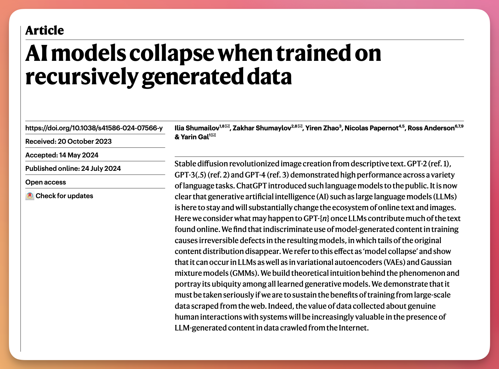
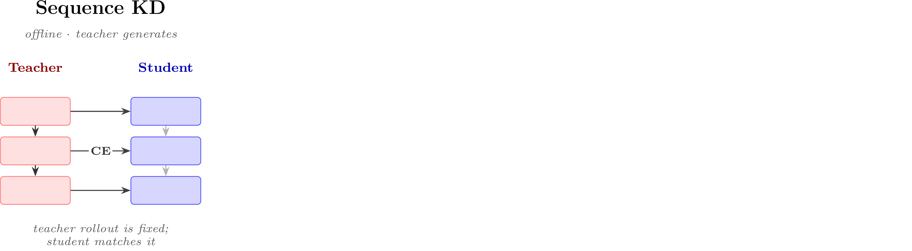
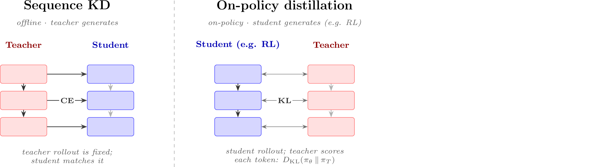
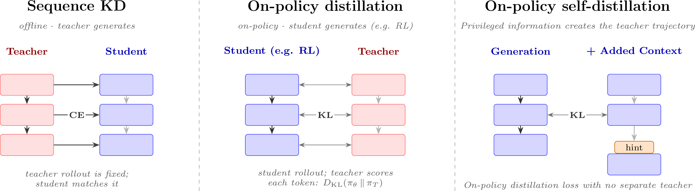

<!-- Source note: build with `make teach`, which copies assets/ into the output. A single-file `colloquium build -o ...` does NOT copy assets/, so the figures 404 in that standalone build. -->
<!-- Notation note: chapter 12 is careful about u = teacher trajectory (u~pi_T, forward KL) vs a = student-sampled action (a~pi_theta, reverse KL). Keep q=pi_T, p=pi_theta consistent. KL is written D_{\mathrm{KL}} throughout this deck (matching the chapter). -->

<!-- layout: title-sidebar -->
<!-- valign: bottom -->

# Lecture 7: Synthetic Data and Modern Post-training Methods

<div class="colloquium-title-eyebrow">rlhfbook.com</div>

<div class="colloquium-title-meta">
<p class="colloquium-title-name">Nathan Lambert</p>
</div>

<p class="colloquium-title-note">Course on RLHF and post-training. Chapter 12 on Synthetic Data.</p>

---

<!-- animate: bullets -->
## Why synthetic data took over

When the first models were trained with RLHF, human data was *the only* way to get high-quality responses and reliable feedback. As models got better, that assumption broke down fast.

- **Cheaper, faster iteration** -- synthetic data lowered the price of a post-training experiment, opening the field to everyone who was priced out of human-data pipelines. The time-to-collect it is also far faster, enabling the RSI arguments we hear today.
- **A capability threshold** -- synthetic data in post-training only worked once GPT-4-class models arrived. Llama 2 and GPT-3.5-Turbo were not reliable enough to generate *or* supervise data; the LLM-as-a-judge ability emerged in the GPT-3.5 → GPT-4 jump.
- **The center of gravity of post-training** -- today, leading models *need* synthetic data to reach the frontier. Distillation is the general word for how to transfer capabilities from a stronger model to a student.

---

<!-- columns: 50/50 -->
## This lecture

We survey how synthetic data has replaced or expanded much of the post-training pipeline -- then derive **on-policy distillation** from scratch as the technical core.

|||

```box
title: The plan, roughly
tone: accent
content: |
  1. The **roles** of synthetic data
  2. **General distillation** with synthetic data
  3. The path to **on-policy distillation** (the technical core)
  4. **AI feedback** & **Constitutional AI**
  5. **Rubrics** -- prompt-specific AI feedback
```

---

<!-- rows: 50/50 -->
## Lecture 7: Where it sits

<!-- row-columns: 32/36/32 -->

```box
title: Overview
tone: muted
compact: true
content: |
  1. Introduction
  2. Key Related Works
  3. Training Overview
```

|||

```box
title: Core Training Pipeline
tone: muted
compact: true
content: |
  4. Instruction Tuning
  5. Reward Models
  6. Reinforcement Learning
  7. Reasoning
  8. Direct Alignment
  9. Rejection Sampling
```

|||

```box
title: Data & Preferences
tone: accent
compact: true
content: |
  10. What are Preferences
  11. Preference Data
  12. **Synthetic Data & CAI**
```

===

<!-- row-columns: 32/36/32 -->

```box
title: Practical Considerations
tone: muted
compact: true
content: |
  13. Tool Use
  14. Over-optimization
  15. Regularization
  16. Evaluation
  17. Product & Character
```

|||

```box
title: Appendices
tone: surface
compact: true
content: |
  - A. Definitions
  - B. Style & Information
  - C. Practical Issues
```

|||

```box
title: Course Home
tone: surface
compact: true
content: |
  - [rlhfbook.com](https://rlhfbook.com)
  - [GitHub repo](https://github.com/natolambert/rlhf-book)
```

---


<!-- rows: 60/40 -->
## Recall: where synthetic data sits in a pipeline

<!-- row-columns: 48/52 -->
The post-training pipeline is many moving parts:

1. Collect / generate **prompts**
2. Generate **completions** for SFT
3. Collect **preferences** for RLHF
4. Score **rewards** for RLVR
5. Filtering, cleaning, all of the above

|||

Synthetic data from other language models now feed every box: writing prompts from seeds, generating completions, labeling preferences, and verifying answers for RL.

We will cover a few training methods that emerged around these ideas too.

===


---

<!-- layout: section-break -->
<!-- align: center -->

## Part 1: The roles of synthetic data

---

<!-- animate: bullets -->
## What synthetic data is used for

"Synthetic data" in modern post-training spans the whole pipeline -- a single model is reused for many roles:

- **Generate new prompts** from seed examples [@wang2022self]
- **Modify / expand** existing prompts
- **Generate completions** to prompts [@numina_math_7b]
- **Provide AI feedback** to create preference data [@cui2023ultrafeedback]
- **Filter completions** for quality [@li2024superfiltering]
- **Verify** answers as rewards for RL

---

## The balance between human and synthetic data

Synthetic data has not replaced human data uniformly across the pipeline.

- **Instruction data (SFT):** synthetic has largely *won* -- distillation beats most human writers at scale.
- **Preference data (RLHF):** *mixed* -- academic work shows it performs comparably, yet frontier labs treat human preference data as a competitive moat.
- **Evaluation:** LLM-as-a-judge scales *scoring* cheaply, but benchmarks and ground-truth labels still need human grounding/correlation.

Human data curation is heavily involved at determining the frontier of models and seeding initial progress, then synthetic data is used to scale it.

Around the launch of ChatGPT, human data was a central driver of progress.

---

<!-- columns: 58/42 -->
## Model collapse: an outdated worry



|||

A common criticism: repeatedly training on a model's own generations can narrow the effective training distribution [@shumailov2024ai].

The argument follows as:
*As diversity drops, rare facts and styles are underrepresented and small mistakes compound across iterations.*

---

## Model collapse: an outdated worry

But collapse is mostly a failure of *unfiltered, single-model, self-training* loops. In practice it is avoided by:

- mixing in real / human data,
- using diverse teachers,
- deduplication,
- strong quality filters.

Evidence suggests synthetic data can -- and should -- be used at scale without the catastrophic regressions of the strongest collapse story [@gerstgrasser2024model] [@feng2024beyond].

---

<!-- valign: center -->
## Canonical, early synthetic datasets and their scale

A few datasets defined each era: **UltraFeedback** [@cui2023ultrafeedback] (kickstarted the DPO revolution), **Stanford Alpaca** (early chat SFT), **Tülu 3** [@lambert2024t] (pre RLVR SFT set), and **OpenThoughts 3** [@guha2025openthoughts] (general reasoning set).

| | Prompts | Tokens (approx.) |
| :--- | :---: | :---: |
| **Stanford Alpaca** (2023) | 52K | ~10M |
| **Tülu 3** (2024) | 1M+ | ~500M |
| **OpenThoughts 3** (2025) | — | ~10B |

---

<!-- columns: 50/50 -->
## Two meanings of "distillation"

**Technical (Knowledge Distillation):** train a smaller *student* to match a stronger *teacher's* full output distribution -- *soft* labels, not one-hot targets [@hinton2015distilling]. More on this later in the lecture.

|||

**Colloquial (today's usage):** "train a weaker model on the outputs of a stronger model." It's what people mean when they say something like "Chinese models distill from GPT/Claude."


---

<!-- valign: center -->
## Aside: distillation on Interconnects this year

```box
title: Further reading
tone: surface
content: |
  - [**How much does distillation really matter for Chinese LLMs?**](https://www.interconnects.ai/p/how-much-does-distillation-really) (Feb 2026) - how much of Chinese open models' gains actually trace to distilling frontier APIs.
  - [**The distillation panic**](https://www.interconnects.ai/p/the-distillation-panic) (May 2026) - why reacting quickly to frontier lab's fear-based messaging on distillation could be bad for the broader AI ecosystem.
```

---

<!-- img-align: center -->
<!-- valign: center -->
<!-- cite-right: hinton2015distilling -->
## Distillation 1: Classic knowledge distillation


---

<!-- img-align: center -->
<!-- valign: center -->
## Distillation 2: The synthetic-data generation pipeline


Yes, this is intentionally very simple as a diagram.

---

<!-- layout: section-break -->
<!-- align: center -->

## Part 2: The path to on-policy distillation (OPD)

---

<!-- valign: top -->
## Setup and notation

Knowledge distillation, introduced by Hinton, Vinyals & Dean [@hinton2015distilling], in its original form uses **soft** labels -- the full distribution over next tokens -- rather than the one-hot target of next-token prediction. To apply it to autoregressive LMs, decompose the loss per token.

Let:

- $s$ -- the source prompt
- $u = (u_1, \ldots, u_J)$ -- a complete output sequence from the **teacher**
- $\mathcal{V}$ -- the output vocabulary (tokenizer)
- $q$ -- the teacher's next-token distribution, $p$ -- the student's

**Notation discipline:** $u$ is a *teacher* trajectory; we reserve $a$ for the *student*-sampled completion in the on-policy / RL notation later. This $u$-vs-$a$ split is the whole point of "on-policy."

---

<!-- valign: top -->
## Word-level (per-token) distillation

**Standard teacher-student distillation for an LLM** [@kim-rush-2016-sequence] -- the classic Hinton soft-label idea applied at every token position:

$$
\mathcal{L}_{\mathrm{WORD\text{-}KD}}
= -\sum_{j=1}^{J}\sum_{k=1}^{|\mathcal{V}|}
q(u_j = k \mid s, u_{<j})\,\log p(u_j = k \mid s, u_{<j}).
$$

At each position, this matches the teacher's *full* next-token distribution over the entire vocabulary on a pre-existing training corpus $\mathcal{V}$ -- soft labels, not the one-hot target. The inner $\sum_{k=1}^{|\mathcal{V}|}$ runs over *every possible next token*.

Matching a distribution over every token sounds expensive, but it is **tractable**: it is just $|\mathcal{V}|$ probabilities per position -- the same $O(J\,|\mathcal{V}|)$ cost as ordinary cross-entropy. Matching over whole *sequences* is the hard part (next slide).

<!-- footnote-right: Read "word-level" as per-token over the tokenizer. -->

---

<!-- valign: top -->
## Sequence-level distillation

Word-level KD gives soft per-token distributions. The goal of sequence-level distillation from the paper is to be apply to apply this to data that the teacher generated, providing fresh training data/signal, and improving performance!

(WORD-KD is the baseline in the Kim & Rush paper.)

---

<!-- valign: top -->
## Sequence-level distillation

Sequence-level KD instead approximates the teacher's distribution over *whole sequences* $\mathcal{U}$ -- an intractable sum over exponentially many sequences -- by its mode: the *teacher* generates one high-probability output $\hat{u} = \mathrm{BeamSearch}_q(s)$ and the student trains on it with plain NLL:

$$
\begin{aligned}
\mathcal{L}_{\mathrm{SEQ\text{-}KD}}(s)
&= -\sum_{u \in \mathcal{U}} q(u \mid s)\log p(u \mid s) && \text{sum over all sequences: intractable}\\[4pt]
&\approx -\log p(\hat{u} \mid s) && \text{teacher} \approx \text{point mass on } \hat{u}\\[4pt]
&= -\sum_{j=1}^{|\hat{u}|}\log p(\hat{u}_j \mid s, \hat{u}_{<j}) && \text{autoregressive factorization}
\end{aligned}
$$

```box
tone: muted
content: |
  **Aside**: A first wave of offline-KD models were classifiers -- DistilBERT [@sanh2019distilbert] and TinyBERT [@jiao2020tinybert] -- pairing offline distillation with other LM advances. Not *sequence* distillation because these are embedding models, but building on related momentum in the area.
```

---

<!-- valign: top -->
## Finding a connection between SEQ-KD and SFT

To start, recalle the cross-entropy of a teacher $q$ and student $p$ -- the same form as the KD losses:

$$
\begin{aligned}
H(q,p) &= -\sum_z q(z)\log p(z) && \text{definition}
\end{aligned}
$$

<!-- step -->

Add and subtract the teacher's own log-probabilities, $\sum_z q(z)\log q(z)$ -- does not involve $p$ at all:

$$
\begin{aligned}
H(q,p) &= \underbrace{-\sum_z q(z)\log q(z)}_{H(q)} \;+\; \sum_z q(z)\log q(z) - \sum_z q(z)\log p(z) && \text{add and subtract}
\end{aligned}
$$

<!-- step -->

The last two sums share the weight $q(z)$, so they fold into one log-ratio (log rules):

$$
\begin{aligned}
H(q,p) &= H(q) \;+\; \sum_z q(z)\log\frac{q(z)}{p(z)} = H(q) + D_{\mathrm{KL}}(q\|p) && \text{definition of KL}
\end{aligned}
$$

---

<!-- valign: top -->
## Finding a connection between SEQ-KD and SFT

We just showed cross-entropy decomposes into the teacher's entropy plus a KL:

$$ H(q,p) = H(q) + D_{\mathrm{KL}}(q\|p) $$

<!-- step -->

$H(q)$ depends only on the fixed teacher, so minimizing cross-entropy *is* minimizing the forward KL:

$$ \boxed{\ \min_p H(q,p)\ \equiv\ \min_p D_{\mathrm{KL}}(q\|p)\quad\text{(forward KL: the direction of offline KD and SFT)}\ } $$

<!-- step -->

So sequence-level KD reduces to SFT on the teacher's generated text -- "offline KD," generations produced often ahead of time by a teacher model.


---

<!-- valign: top -->
## Exposure bias in offline KD: the train / test mismatch

Offline KD samples **teacher** trajectories $u \sim \pi_T$ and matches per-token (here $q = \pi_T$, $p = \pi_\theta$):

$$
\mathcal{L}_{\mathrm{KD}}(\theta)
= \mathbb{E}_{s \sim \mathcal{D},\, u \sim \pi_T(\cdot \mid s)}
\sum_t D_{\mathrm{KL}}\!\left(\pi_T(\cdot \mid s, u_{<t}) \,\|\, \pi_\theta(\cdot \mid s, u_{<t})\right).
$$

But at test time the student rolls out under its own policy ($\ell_{\mathrm{task}}(s, a)$ is the loss function for that test-time domain):

$$
\mathcal{L}_{\mathrm{eval}}(\theta)
= \mathbb{E}_{s \sim \mathcal{D}_{\mathrm{test}},\, a \sim \pi_\theta(\cdot \mid s)}\ \ell_{\mathrm{task}}(s, a).
$$

Since $\pi_T \neq \pi_\theta$, training and test prefixes come from different state distributions -- **exposure bias** is the propensity for the student to accumulate errors [@arora-etal-2022-exposure] [@song2026surveyonpolicydistillationlarge].

---

<!-- valign: top -->
## The DAgger analogy: compounding error

On-policy distillation connects to **imitation learning**: DAgger trains an agent on its own rollouts, with an oracle (teacher) labeling the action it *should* have taken [@ross2011reduction].

Suppose the student matches the teacher within per-step error $\epsilon$ on teacher-induced states:

$$ \mathbb{E}_{s_t \sim d_{\pi_T}}\!\left[\mathbb{I}\!\left(\pi_\theta(s_t) \neq \pi_T(s_t)\right)\right] \leq \epsilon. $$

<!-- step -->

The supervised imitation-learning analysis [@ross2011reduction] shows that the expected loss accumulated along a length-$L$ trajectory sampled from the student can scale quadratically in $L$ [@song2026surveyonpolicydistillationlarge]:

$$
\mathbb{E}_{a \sim \pi_\theta(\cdot \mid s)}\!\left[\sum_{t=1}^{L} \ell\!\left(s, a_{<t}\right)\right] \leq O(\epsilon L^2).
$$

<!-- step -->

For LLMs this is more of an analogy -- token losses are distributional (KL), not 0-1 action disagreement (indicator function in the first equation on this slide returns 0 or 1).

---

<!-- animate: bullets -->
## From off-policy to on-policy

Sampling from the student rather than the teacher minimizes a lot of the distributional errors we've covered.
- In offline KD, a single suboptimal token can nudge the student generation slightly **out-of-distribution**; the model, never having seen that token in training, is more likely to err again.
- On-policy distillation iteratively samples from the student and supervises it with the teacher at *its own* visited states.
- Under DAgger's interactive analysis, this drops compounding from $O(\epsilon L^2)$ to $O(\epsilon L)$ [@ross2011reduction].
- **MiniLLM** introduced a reverse-KL objective inside a policy-gradient frame [@gu2024minillm]; concurrent work connected on-policy KD to imitation learning [@agarwal2024policy] (this paper is closer to the modern distillation form used today).

---

<!-- valign: top -->
## The on-policy distillation objective

Let $a = (a_1, \ldots, a_L)$ be a completion sampled from the **student** $\pi_\theta(\cdot \mid s)$, with token-level state $s_t = (s, a_{<t})$. The teacher $\pi_T$ is fixed:

$$
\boxed{\
\mathcal{L}_{\mathrm{OPD}}(\theta)
= \mathbb{E}_{s,\, a \sim \pi_\theta(\cdot \mid s)}
\sum_t D_{\mathrm{KL}}\!\left(\pi_\theta(\cdot \mid s_t) \,\|\, \pi_T(\cdot \mid s_t)\right)
\ }
$$

This is now in the sampling / expectation framework of Chapter 6 (policy gradients) -- a natural bridge to modern RL training infrastructure that alternates generate-and-update. 

Sampling from the *student* is also what flips the KL direction we minimize ()).

---

<!-- rows: 18/82 -->
## Forward vs. reverse KL

Sampling completions from the student is what puts $\pi_\theta$ on the **left** of the KL -- which flips its direction (estimating the KL and its direction relies on which distribution you sample from):

===

<!-- row-columns: 50/50 -->
**Offline KD / SFT** -- the expectation is over the *teacher*, $z \sim \pi_T$ (**off-policy**: a fixed teacher dataset):

$$ D_{\mathrm{KL}}(\pi_T \,\|\, \pi_\theta) = \mathbb{E}_{z \sim \pi_T}\!\left[\log\frac{\pi_T(z)}{\pi_\theta(z)}\right] $$

*Mass-covering* -- weighted by **teacher** mass: wherever the teacher has mass and $\pi_\theta \to 0$, the log-ratio blows up, so the student must cover *everything* the teacher might say.

|||

**On-policy distillation** -- the expectation is over the *student*, $z \sim \pi_\theta$ (**on-policy**: you sample the model you're training):

$$ D_{\mathrm{KL}}(\pi_\theta \,\|\, \pi_T) = \mathbb{E}_{z \sim \pi_\theta}\!\left[\log\frac{\pi_\theta(z)}{\pi_T(z)}\right] $$

*Mode-seeking* -- weighted by the **student's** own mass: penalized only where *it* puts probability the teacher dislikes, so it collapses onto the teacher's modes. (Why reverse KL is often better: Chapter 15.)

---

<!-- valign: top -->
## KD as an RL advantage

Recent implementations take the KD distance directly as a reward: substitute the negative per-token reverse-KL contribution as the advantage [@lu2025onpolicy]. The reverse KL at state $s_t$ is an expectation over *student*-sampled tokens:

$$ D_{\mathrm{KL}}\!\left(\pi_\theta(\cdot \mid s_t) \,\|\, \pi_T(\cdot \mid s_t)\right) = \mathbb{E}_{a_t \sim \pi_\theta(\cdot \mid s_t)}\!\left[\log \pi_\theta(a_t \mid s_t) - \log \pi_T(a_t \mid s_t)\right]. $$

In practice you never sum over the vocabulary: the single sampled token is an unbiased estimate $\hat{D}_{\mathrm{KL}}$ of that KL [@schulman2020klapprox], and the per-token advantage is its negative:

$$ A_t^{\mathrm{OPD}} = -\hat{D}_{\mathrm{KL}} = -\left(\log \pi_\theta(a_t \mid s_t) - \log \pi_T(a_t \mid s_t)\right) = \log \pi_T(a_t \mid s_t) - \log \pi_\theta(a_t \mid s_t). $$

<!-- step -->

- Tokens more likely for the teacher → positive advantage; less likely → negative.
- Same form, opposite KL: $\log \pi_T - \log \pi_\theta$ *looks* like a forward-KL term -- what makes it **reverse** KL is sampling $a_t \sim \pi_\theta$ (the student), not the sign.
- The teacher log-prob gap is dense, token-level feedback -- potentially richer than a sparse verifiable reward or a single scalar reward-model score.
- This layers into modern RL machinery -- e.g. add it alongside GRPO's group-level normalization for more complex reward shaping.

---

<!-- valign: top -->
## Multi-teacher on-policy distillation (MOPD)

Use several teachers -- domain specialists (math, code) or earlier checkpoints -- each with a per-prompt mixture weight $w_k(s)$ (with $\sum_k w_k(s) = 1$) [@mimo2025flash]:

$$
\mathcal{L}_{\mathrm{MOPD}}(\theta)
= \mathbb{E}_{s,\, a \sim \pi_\theta(\cdot \mid s)}
\sum_t \sum_k w_k(s)\, D_{\mathrm{KL}}\!\left(\pi_\theta(\cdot \mid s_t) \,\|\, \pi_{T_k}(\cdot \mid s_t)\right).
$$

At scale, this lets a growing org divide labor: many groups train expert teachers that later distill into one final student (DeepSeek-V4-Pro [@deepseekai2026deepseekv4], MiMo-V2-Flash [@mimo2025flash]).

For more, see the [conversation](https://www.youtube.com/watch?v=sbXEPxIazqY&list=PLL1tdVxB1CpVpEtMHxwuR4uI4Lxjw00_y&index=9) I had with Finbarr Timbers that maps MOPD across the 2026 frontier recipes.

---

<!-- valign: top -->
<!-- animate: bullets -->
## Self-distillation: pushing the frontier

At the absolute frontier there is no stronger model to distill from. **On-Policy Self-Distillation (OPSD)** sidesteps this: the teacher is the *same model conditioned on privileged information* -- a hint the student model won't have at inference [@zhao2026selfdistilled]. The self-distillation gradients will teach the model that tokens after the hint were a mistake, absorbing the lesson with an OPD-style loss.

**Cursor's Composer 2.5** (from Kimi K2.5) trained this way [@cursor2026composer25]:

- A judge reviews RL trajectories against a list of common bugs.
- On a bug, it inserts a hint into the sequence -- privileged information the model wouldn't see at test time.
- The model takes a KD loss toward its own hinted continuation, learning to reach it *unaided*.
- A hint in token space is enough to self-correct -- *how* to structure that signal is an active area ("privileged information") [@penaloza2026privileged].

---

<!-- valign: center -->
## On-policy distillation is becoming very popular

A resurgence of teacher-student KD has accompanied the shift toward reasoning and agentic models. Leading models trained with new forms of knowledge distillation include:

- **Qwen3** (Alibaba) [@yang2025qwen3]
- **MiMo-V2-Flash** (Xiaomi) [@mimo2025flash] (introduced MOPD)
- **DeepSeek-V4-Pro** [@deepseekai2026deepseekv4]

One caveat: per-token KD needs the student and teacher to share a tokenizer -- unusual among post-training methods, and part of why it thrives inside a lab's own model family.

---

<!-- img-align: center -->
<!-- valign: center -->
## From offline KD to self-distillation



---

<!-- img-align: center -->
<!-- valign: center -->
## From offline KD to self-distillation



---

<!-- img-align: center -->
<!-- valign: center -->
## From offline KD to self-distillation



---

<!-- layout: section-break -->
<!-- align: center -->

## Part 3: AI feedback & Constitutional AI

---

## Reinforcement learning from ai feedback (RLAIF)

Soon after RLHF took off, **RL from AI Feedback (RLAIF)** emerged -- using AIs to approximate the human-data step, starting with pairwise preferences [@lee2023rlaif] [@sharma2024critical] [@castricato2024suppressing].

After initial debates if this worked well, eventually it became the default. Cost was one of the obvious advantages (estimates):

- One piece of *human* preference data: **\$1 -- \$10+** per prompt.
- *AI* feedback (e.g. GPT-4o): **< \$0.01** per prompt.

Human labor cost is roughly flat; model price-per-performance keeps dropping. 
This opened RLHF experimentation to a population previously priced out.

---

## The bias-variance tradeoff

I've heard a colloquial rule of thumb in early RLHF v RLAIF debates. There's an intuitive nature to it.

**Human data** -- *high-noise, low-bias.*

Harder to collect and filter, but when wrangled it gives a very reliable signal.


**Synthetic preference data** -- *low-noise, high-bias.*

Easier to start with, but can carry tricky second-order effects that are *systematically* baked into the data.

---

## Balancing human and AI feedback

No clear literature on the ultimate limits between human and AI preference data. Some context includes:

- Early RLAIF literature claimed AI feedback could fully replace human data -- especially on chat tasks [@lee2023rlaif] [@cui2023ultrafeedback].
- Later work is more nuanced: on broader evaluations (incl. reasoning), the best mix routes hard data points to humans while sending most to AI [@miranda2024hybrid] [@xu2025rlthf].
- No study has mapped the human/AI balance across *all* domains, highlighting a general limitation of open academic work to wrangle high-quality human data.
- **Industry reality:** human preference data is still treated as a substantial moat. Could be more from prompt distributions, implicit feedback, etc. Human data still is used.

---

## Building specialized judge models

If you're using substantial AI feedback or LLM-as-a-judge evaluations, the question arises as to if you should have a specialized model for that purpose. The question is -- how well do they work?

- Some research is done understand the performance of LLMs in these feedback domains. Results include how LLMs are inconsistent evaluators [@wang2023large] and show **self-preference bias** -- they favor their own generations [@panickssery2024llm].
- Dedicated judge / critic models exist -- Prometheus [@kim2023prometheus], Prometheus 2 [@kim2024prometheus], and others -- but are not widely adopted in documented post-training recipes.
- Equilibirum: Frontier models are already trained hard for judging, so you rarely need your own -- *unless* your task has private data not on the public internet.

---

<!-- valign: center -->
## CAI: the earliest large-scale synthetic RLHF data

Constitutional AI (CAI) -- Anthropic's post-training method for the Claude models -- is the earliest documented, large-scale use of synthetic data for RLHF [@bai2022constitutional]. CAI refers to a specific set of techniques for their early Claude models, and definitely has shifted substantially (though Anthropic still uses a constitution -- yes, confusing).

The term **RLAIF** was coined in this paper as well, prompting confusion on the relation of the two.

> CAI is the example that kickstarted the broader field of RLAIF. CAI ⊂ RLAIF.

CAI generates synthetic data in two ways -- one for instructions, one for preferences. 
The well-known and more influential part of it is preferences.

---

<!-- img-align: center -->
<!-- valign: center -->
<!-- cite-right: bai2022constitutional -->
## Constitutional AI: The original diagram


---

<!-- valign: top -->
## Stage 1: critique and revise → SFT data

A **constitution** $\mathcal{C}$ is a human-written set of principles (e.g. *"Is the answer encouraging violence?"*, *"Is the answer truthful?"*).

<!-- step -->

The model repeatedly samples a principle $c_i \in \mathcal{C}$ and revises its latest output $y^i$ to the prompt $x$ to align with $c_i$:

$$
\{c_0, c_1, \ldots, c_{n-1}\}\ \longrightarrow\ \{y^0, y^1, \ldots, y^n\}
\qquad\Longrightarrow\qquad
\text{SFT point } (x, y^n).
$$

The model is then fine-tuned on the refined dataset. 
These critique methods are also used broadly for data filtering and synthetic-data generation.

---

<!-- valign: top -->
## Stage 2: AI preference labels → RLAIF

Construct preferences by giving a feedback model:

- a prompt $x$,
- a subset of principles $\{c_0, \ldots, c_n\}$,
- two completions $y_0, y_1$ labeled (A) / (B).

The model selects which answer is higher quality and more aligned with the principle. Then RLHF proceeds as normal -- hence *RLAIF*.

<!-- step -->

Also linked to literature like generative reward models and progression in the LLM-as-a-judge field. See Chapter 5 / Lecture 2.
- **Earlier:** prompt with `The answer is: ` and read which of A / B has higher token probability.
- **Modern:** a **generative reward model** explains its reasoning, then selects [@mahan2024generative] (cf. principle-guided reward models [@sun2024salmon]).

---

<!-- layout: section-break -->
<!-- align: center -->

## Part 4: Rubrics -- prompt-specific AI feedback

---

## Why did rubrics become popular?

Rubrics became a popular tool for scaling RL on the long-tail of domains. They're also used to help with domain-specific evaluations and any other place domain expertise needs to be "trained into" the models.
- A way to extend ideas from RL with verifiable rewards (Chapter 7) to tasks *without* clearly verifiable answers.
- Write nearly-verifiable criteria for a prompt, generate multiple answers, and RL-update toward the best ones.
- Emerged in late 2024 → 2025 as LLM judges and synthetic-data practices matured. Also likely a function of making RL more broadly accesible to frontier post-training.
- Already delivering gains in scientific reasoning and factuality [@gunjal2025rubrics] [@viswanathan2025checklists] [@rezaei2025onlinerubrics] [@liu2025openrubrics].

---

<!-- valign: top -->
## A rubric example

For a prompt with no single right answer, score against tagged criteria [@liu2025openrubrics]. An example, abbreviated rubric is below:

```text
Prompt: As a museum curator, suggest five obscure artifacts for a
"Mysteries of the Ancient World" exhibit ...

Rubric:
1. Includes exactly five distinct artifacts.            [Hard Rule]
2. Each from a different culture and time period.       [Hard Rule]
3. Brief description of each artifact's significance.   [Hard Rule]
6. Communicates clearly and is well-organized.          [Principle]
8. Uses engaging language that stimulates curiosity.    [Principle]
```

`[Hard Rule]` = atomic, must-pass checklist items; `[Principle]` = softer quality criteria. The tags encode priority (numbers also work). Subcomponents of a rubric contribute to the score.

---

<!-- valign: top -->
## Per-prompt generation via a meta-prompt

Rubrics are generated per prompt to ensure quality and robustness to over-optimization. E.g. a per-domain base rubric, refined per-prompt by a supervising LM [@gunjal2025rubrics].

```text
You are an expert rubric writer for science questions ...
Choose 7-20 rubric items based on question complexity.
Each item: title (2-4 words), description (category prefix +
  what to look for), weight.
  - Essential : critical facts; omission invalidates the answer  (1-5)
  - Important : key reasoning / completeness                     (1-5)
  - Optional  : nice-to-have depth or style                      (1-5)
  - Pitfall   : common mistakes to penalize                    (-1,-2)
Output: a JSON array of {title, description, weight}.
```

(Truncated -- real meta-prompts are long and tuned to the training setup.)

---

## Where rubrics are going

Rubric-based RL is a frontier of AI-feedback-driven training, expanding beyond its early uses:

- **Advanced instruction-following** [@he2025advancedif]
- **Deep research** agents [@shao2025drtulu]
- **Evaluating** research agents [@sharma2025researchrubrics]
- **Long-form generation** with structured checklists [@ruan2025expertlongbench]

Very general tool!

---
<!-- layout: section-break -->

## Conclusions

---

## Synthetic data is the single most common tool used by researchers (other than building infra) to make great models

The techniques surveyed here will continue to grow in complexity, and it's super fun to see.
When I started writing this book, it was still a struggle to set up some synthetic data workflows!
Knifecuts can happen, but overall it's a well-known workflow now.

There are many, minute open questions on how best to do this, but it often is a domain specific reflection of the technial problem at hand.

---

## Course outline

1. Introduction & Training Overview -- Chapters 1-3
2. IFT, Reward Models, Rejection Sampling -- Chapters 4, 5, 9
3. RL Theory -- Chapter 6 (Part 1)
4. RL Implementation & Practice -- Chapter 6 (Part 2)
5. Reasoning -- Chapter 7
6. Direct Alignment Algorithms -- Chapter 8
7. Synethic Data -- Chapter 12
8. Preferences & Preference Data -- Chapters 10/11

...

---

<!-- rows: 85/15 -->
## Thank you

Questions / discussion

Contact: nathan@natolambert.com

Newsletter: [interconnects.ai](https://www.interconnects.ai/)

**rlhfbook.com**

===

```builtwith
repo: natolambert/colloquium
```
