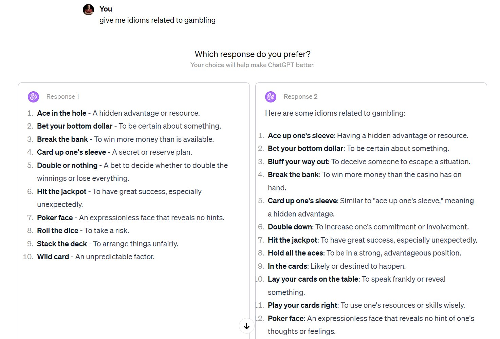
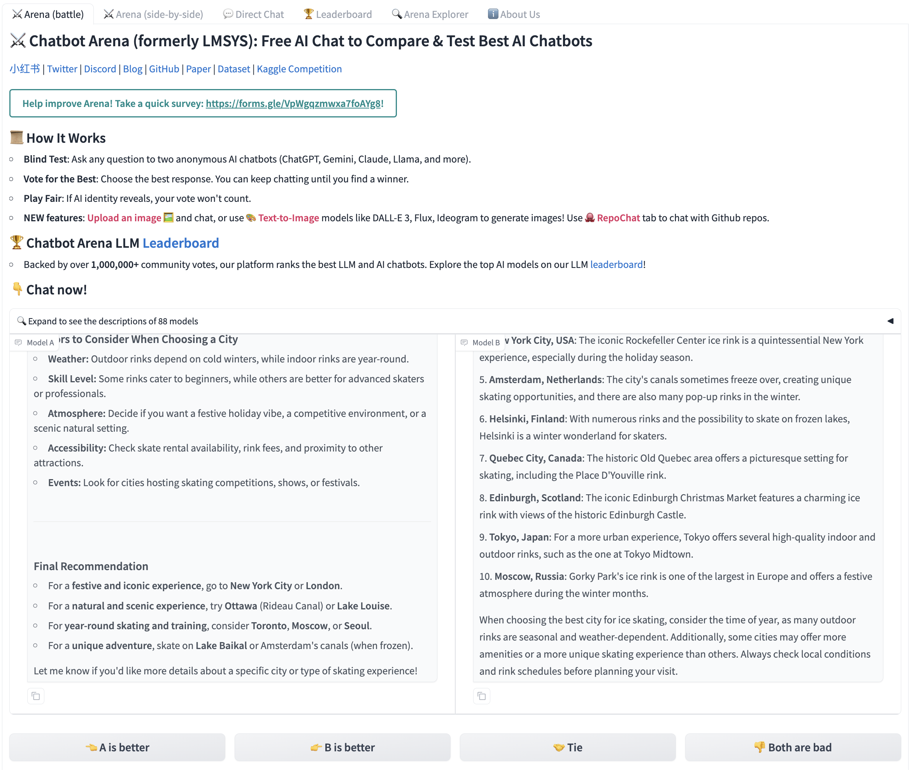
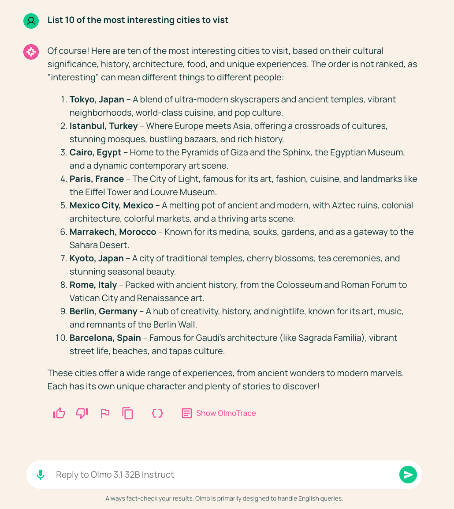
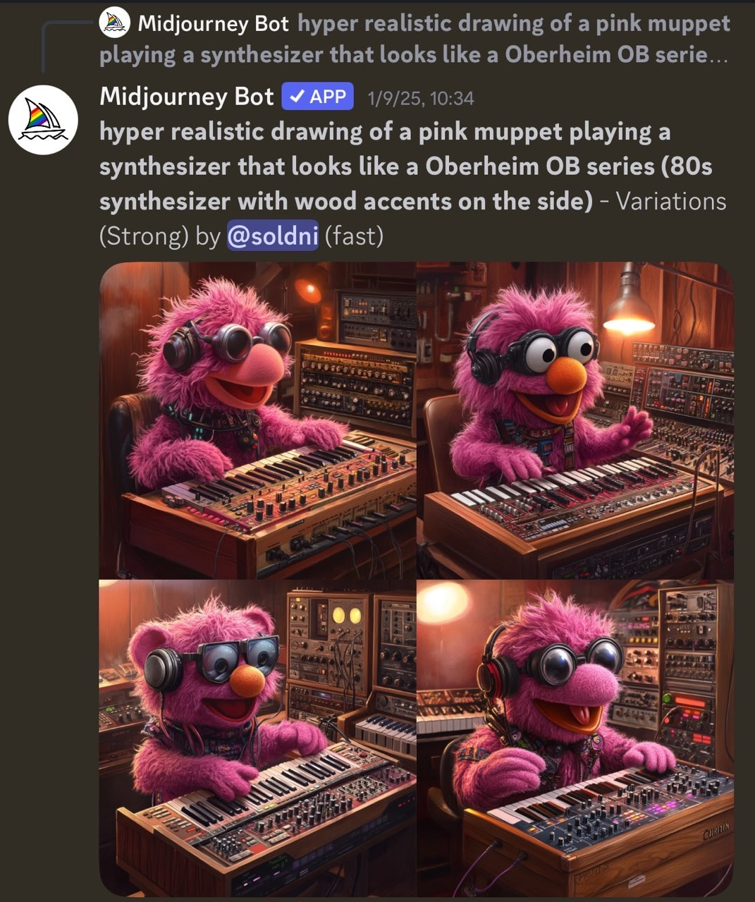
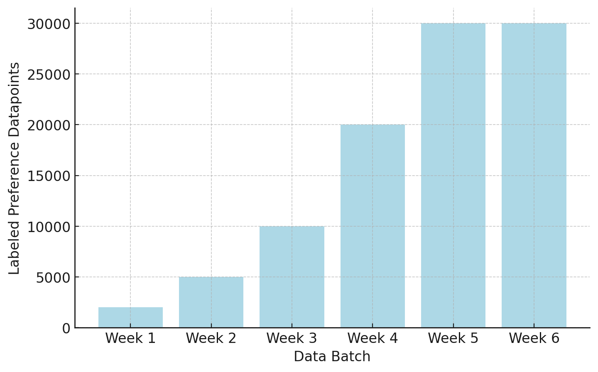

<!-- DRAFT NOTE (Nathan): history slides intentionally use minimal text + <!-- IMAGE: ... --> placeholders for screenshots/portraits you can drop into assets/. The data half uses real screenshots already in the repo. Build with `make teach` so assets/ is copied. -->

<!-- layout: title-sidebar -->
<!-- valign: bottom -->

# Lecture 8: Preferences and Preference Data

<div class="colloquium-title-eyebrow">rlhfbook.com</div>

<div class="colloquium-title-meta">
<p class="colloquium-title-name">Nathan Lambert</p>
</div>

<p class="colloquium-title-note">Course on RLHF and post-training. Chapters 10 & 11 -- where "preferences" come from, why they're an imperfect formulation, and the data engine underneath.</p>

---

## When preference replaces correctness

Most of post-training so far has had a notion of *correct* -- a math answer, a passing test, a verifiable reward. Preferences are what we reach for when there is **no right answer**.

- Which poem is better? Which explanation is clearer? Which tone is kinder?
- There is no closed-form reward for "good" here -- so we ask humans (or models) to compare.
- That single move -- *replace correctness with preference* -- is the foundation of RLHF, and the source of most of its messiness.

---

<!-- columns: 50/50 -->
## Which poem is better? Which model?

```conversation
size: 0.5
messages:
  - role: user
    content: "Write me a short poem about an optimistic goldfish."
  - role: assistant
    model: "A"
    content: |
      **The Optimistic Goldfish**

      A little goldfish, bright and bold,
      Swam in circles, dreams untold.
      Though the bowl was small and round,
      Endless wonders still abound.

      "The world is vast," she'd always say,
      "I'll find new joys in every day!"
      No walls could dim her hopeful view,
      For in her heart, the ocean grew.
```

|||

```conversation
size: 0.5
messages:
  - role: user
    content: "Write me a short poem about an optimistic goldfish."
  - role: assistant
    model: "B"
    content: |
      **The Optimistic Goldfish**

      In a bowl of curved glass,
      Swims a goldfish, bright and bold.
      Three seconds of memory, they say,
      Yet each circuit feels brand new and gold.

      "Today might bring fresh flakes,
      Or perhaps a castle tall.
      What adventure awaits beyond this wall?"
      The optimist in golden hue.
```

(Same prompt, two frontier models, Feb 2025. Which is better -- and which came from which?)

---

<!-- columns: 50/50 -->
## This lecture

We trace where "preferences" came from, argue why it's an **imperfect problem formulation**, then dig into **preference data** -- the engine of most of that imperfection.

Grounded in *The History and Risks of RLHF* [@lambert2023entangled].

|||

```box
title: The plan
tone: accent
content: |
  1. A short **history** of preferences (chapter 10)
  2. Why "preferences" is an **imperfect** formulation
  3. **Preference data** -- the engine (chapter 11)
  4. **Open questions** (some shared with synthetic data)
```

---

<!-- rows: 50/50 -->
## Lecture 8: Where it sits

<!-- row-columns: 32/36/32 -->

```box
title: Foundations
tone: muted
compact: true
content: |
  1. Introduction
  2. Key Related Works
  3. Training Overview
```

|||

```box
title: Core Training Pipeline
tone: muted
compact: true
content: |
  4. Instruction Tuning
  5. Reward Models
  6. Reinforcement Learning
  7. Reasoning
  8. Direct Alignment
  9. Rejection Sampling
```

|||

```box
title: Data & Preferences
tone: accent
compact: true
content: |
  **10. The Nature of Preferences**
  **11. Preference Data**
  12. Synthetic Data & CAI
```

===

The two chapters this lecture covers sit *under* everything else: reward models, RL, and direct alignment all consume the preferences we define here.

---

<!-- layout: section-break -->
<!-- align: center -->

## Part 1: A short history of preferences

---

<!-- img-align: center -->
<!-- valign: center -->
<!-- cite-right: lambert2023entangled -->
## Many fields converged into "RLHF"


---

<!-- valign: top -->
## Utility, from logic to a number

The idea that choices can be *scored* is old:

- **Port Royal Logic** (1662): decision quality = probability-weighted outcome [@arnauld1861port]
- **Bentham's hedonic calculus** (early 1800s): weigh all of life on one scale [@bentham1823hedonic]
- **Ramsey**, *Truth and Probability* (1931): first to quantify preference *and* belief together [@ramsey2016truth]

The through-line: a hope that messy human wanting collapses to a single number.

> *"To judge what one must do to obtain a good or avoid an evil, it is necessary to consider not only the good and evil in itself, but also the probability that it happens or does not happen."* -- The Port Royal Logic, 1662

<!-- IMAGE: suggest title page of "La Logique" (Port Royal) or Ramsey 1931; portrait of Bentham. -->

---

<!-- valign: center -->
## The theorem that licensed scalar reward

**Von Neumann & Morgenstern** (1947): if your preferences obey a few axioms (completeness, transitivity, continuity, independence), they can be represented by a single **utility function**, and rational choice = maximizing **expected utility** [@von1947theory].

This is the mathematical permission slip RLHF leans on: "just fit a scalar reward." Hold onto the *if* -- we come back to it.

<!-- IMAGE: suggest cover of "Theory of Games and Economic Behavior" (1944/1947). -->

---

<!-- valign: top -->
## ...and the fields that pushed back

Almost as soon as utility was formalized, social choice and economics found its limits:

- **Arrow's impossibility theorem** (1950): no voting rule aggregates individual preferences into a collective one while satisfying a few basic fairness criteria [@arrow1950difficulty]
- **Sen**, *Behaviour, Choice and Values* (1973): choice ≠ preference; revealed-preference theory is too thin [@sen1973behaviour]
- **Hirschman**, *Against Parsimony* (1984): people have *preferences over their preferences* -- so preferences may be unmeasurable [@hirschman1984against]

<!-- IMAGE: suggest Arrow portrait / impossibility theorem statement. -->

---

<!-- valign: top -->
## Preferences are not stable objects

From psychology and behavioral economics:

- Preferences **drift** -- they change with time, mood, and experience [@pettigrew2019choosing]
- Choices are shaped by situation and framing, not just an inner ranking [@gilbert2022choices]

Already a problem for "collect a label, fit a fixed reward."

<!-- IMAGE: suggest a framing-effect / preference-reversal figure. -->

---

<!-- valign: top -->
## The other parent: optimal control & RL

In parallel, a machinery for *optimizing* a reward matured:

- **Bellman** (1957): MDPs and dynamic programming [@bellman1957markovian]
- **Sutton** (1988): temporal-difference learning for credit assignment [@sutton1988learning]
- **Watkins** (1992): Q-learning [@watkins1992q]
- **DQN** (2013): deep RL at scale [@mnih2013playing]; **AlphaGo / AlphaZero** (2017): mastery from self-play [@silver2017mastering]

The catch (Part 2): these guarantees assume a **single, closed-form reward**.

<!-- IMAGE: suggest Atari/DQN or AlphaGo figure (or highlight the RL branch of the tree). -->

---

<!-- valign: center -->
## The bridge: Bradley-Terry (1952)

The statistical model that turns *comparisons* into *scores* -- and became the backbone of reward modeling [@BradleyTerry]:

$$ P(y_w \succ y_l \mid x) = \sigma\!\big(r(x,y_w) - r(x,y_l)\big) = \frac{e^{\,r(x,y_w)}}{e^{\,r(x,y_w)} + e^{\,r(x,y_l)}} $$

Give it pairwise human comparisons; out comes a scalar reward. This is *why* RLHF needs **preference data** -- and where the imperfections enter.

---

<!-- layout: section-break -->
<!-- align: center -->

## Part 2: Why "preferences" is an imperfect formulation

---

<!-- columns: 52/48 -->
## The VNM bait-and-switch

The utility theorem says a scalar reward exists **if** preferences are complete, transitive, stable, and independent of irrelevant context.

|||

In RLHF, essentially none of those hold:

- preferences **drift** during and after labeling
- they're **context- and framing-dependent**
- at high complexity they can be **intransitive**
- and they're **multidimensional**, squashed into one number

---

## One scalar, many things

A reward model compresses, into a single number, all of:

- helpfulness, honesty, harmlessness, tone, format, length, taste...
- the annotator's psychology, culture, and the interface they used
- whatever the *framing* of the comparison nudged them toward

We then optimize *hard* against that number -- and over-optimize the parts that were noise.

---

<!-- valign: center -->
## Costs ≠ rewards ≠ preferences

A core argument of the history paper: these three are **ontologically different**, and RLHF quietly treats them as interchangeable [@lambert2023entangled].

- **Costs** come from control: physical, measurable, given.
- **Rewards** are an RL convenience: a scalar signal to maximize.
- **Preferences** are human, relational, and unstable -- *not* obviously a scalar at all.

> *"Rewards in an RL system correspond to primary rewards... hard-wired by the evolutionary process due to their relevance to reproductive success."* -- Singh et al., 2009 [@singh2009rewards]

Reducing the third to the second is the move that makes RLHF tractable, and imperfect.

---

<!-- valign: top -->
## RL's guarantees don't transfer

Deep RL's theory lives in MDPs with **one fixed, closed-form reward** (games, control).

- A learned reward model is a *moving, noisy proxy*, not a ground-truth reward.
- Inverse RL -- learning a reward *from behavior* -- is conceptually close but oddly absent from RLHF practice [@ng2000algorithms].
- So we inherit RL's optimizers without inheriting its guarantees.

**Where does the imperfection concentrate? In the data.** → Part 3.

---

<!-- layout: section-break -->
<!-- align: center -->

## Part 3: Preference data -- the engine

---

<!-- columns: 50/50 -->
## Why preference data at all

It is far easier to **judge** than to **generate** -- humans (and models) can reliably say which of two answers is better long before they can write the better one.

|||

But collecting it well is the most **opaque** part of the pipeline.

As of 2026, **no open model** ships fully open human preference data *with* the methodology used to collect it.

---

<!-- img-align: center -->
<!-- valign: center -->
<!-- cite-right: bai2022training -->
## Interface 1: research data collection (Anthropic)


---

<!-- img-align: center -->
<!-- valign: center -->
## Interface 2: A/B testing in production (ChatGPT)



---

<!-- img-align: center -->
<!-- valign: center -->
<!-- cite-right: chiang2024chatbot -->
## Interface 3: pairwise with ties (Chatbot Arena)



---

<!-- img-align: center -->
<!-- valign: center -->
## Interface 4: a single bit (Ai2 demos)



---

<!-- img-align: center -->
<!-- valign: center -->
## Interface 5: pick-from-many (image models)



---

<!-- columns: 50/50 -->
## Rankings vs. ratings

**Ratings:** a score on one completion (e.g. 1-5). Good as metadata.

**Rankings:** relative comparisons, often on a Likert scale -- early Claude used an 8-point scale [@bai2022training]; UltraFeedback pairs high- vs low-rated completions [@cui2023ultrafeedback].

|||

In practice almost everyone trains on pairwise rankings, binarized to chosen/rejected for the Bradley-Terry loss -- and keeps ratings on the side.

The Likert granularity (5-point with ties vs 8-point without) is itself a design choice that changes the data.

---

<!-- valign: top -->
## Structured (synthetic) preference data

In domains with structure, you can build preference pairs automatically:

- **Math**: a correct solution ≻ an incorrect one.
- **Instruction following (IFEval-style)**: prompt twice -- with the constraint and without -- and prefer the one that obeys it.

In these narrow domains, structured pairs beat quality-judged preferences [@lambert2024t]. This is *synthetic* preference data -- more in chapter 12.

---

## Beyond pairwise

The pairwise comparison is a convention, not a law. Alternatives:

- **Directional / single-bit** labels (thumbs up/down), trained with KTO [@ethayarajh2024kto]
- **Token-level / fine-grained** feedback [@wu2024fine]
- **Natural-language** feedback -- written critiques instead of a label [@chen2024learning]

Richer signal, harder collection.

---

<!-- rows: 55/45 -->
## Sourcing & contracts: the unglamorous reality



===

Getting data is a **who-you-know** game -- vendors are supply-limited and favor big budgets and brand names. Millions get spent and partly wasted; few teams have the bandwidth to fully use human data. Contracts hide non-open clauses in the fine print.

---

## Bias: what to watch for

Subtle, systematic biases sail straight from the data into the model:

- **Prefix bias** -- the opening disproportionately drives the label [@kumar2025detecting]
- **Sycophancy** -- agreeing with the user over being right [@sharma2023towards]
- **Verbosity** -- longer rated higher [@singhal2023long]
- **Formatting** -- lists and bold look "better" [@zhang2024lists]
- **Flattery / fluff** -- decorative language inflates scores [@bharadwaj2025flatteryflufffogdiagnosing]

Catching these is the difference between *good* and *great* preference data.

---

<!-- layout: section-break -->
<!-- align: center -->

## Part 4: Open questions in preference data

---

## Four open clusters

- **Collection context** -- do workplace labels transfer to end users? Paid vs. volunteer? Do annotators follow instructions or their own values?
- **Type of feedback** -- does a binary pair actually capture the preference we mean? What structure mirrors how people really compare?
- **Population & demographics** -- who labels? Is disagreement **noise or signal**?
- **Are the preferences even expressed in the models?**

---

<!-- valign: center -->
## The gap we can't yet measure

RLHF's *motivation* (align to human preference) has drifted from its *practice* (make models effective).

Because industrial RLHF is closed, we can't check whether the trained model actually reflects the spec given to annotators. The **Model Spec** [@openai2024modelspec] documents intended behavior, but the link from data → behavior stays largely unaudited.

Many of these questions reappear in chapter 12: the human/AI feedback balance, and on-policy preference data.

---

<!-- columns: 50/50 -->
## Be curious

This is one of the least-settled, most-human parts of the field -- so read widely and look for the primary sources.

|||

```box
title: Go deeper
tone: surface
content: |
  - [**The History and Risks of RLHF**](https://arxiv.org/abs/2310.13595) -- where this framing comes from.
  - [**RewardBench**](https://arxiv.org/abs/2403.13787) -- on-policy vs pooled preference data.
  - [**Interconnects**](https://www.interconnects.ai/) -- ongoing notes on preferences & data.
```

---

<!-- rows: 85/15 -->
## Thank you

Questions / discussion

Contact: nathan@natolambert.com

Newsletter: [interconnects.ai](https://www.interconnects.ai/)

**rlhfbook.com**

===

```builtwith
repo: natolambert/colloquium
```
