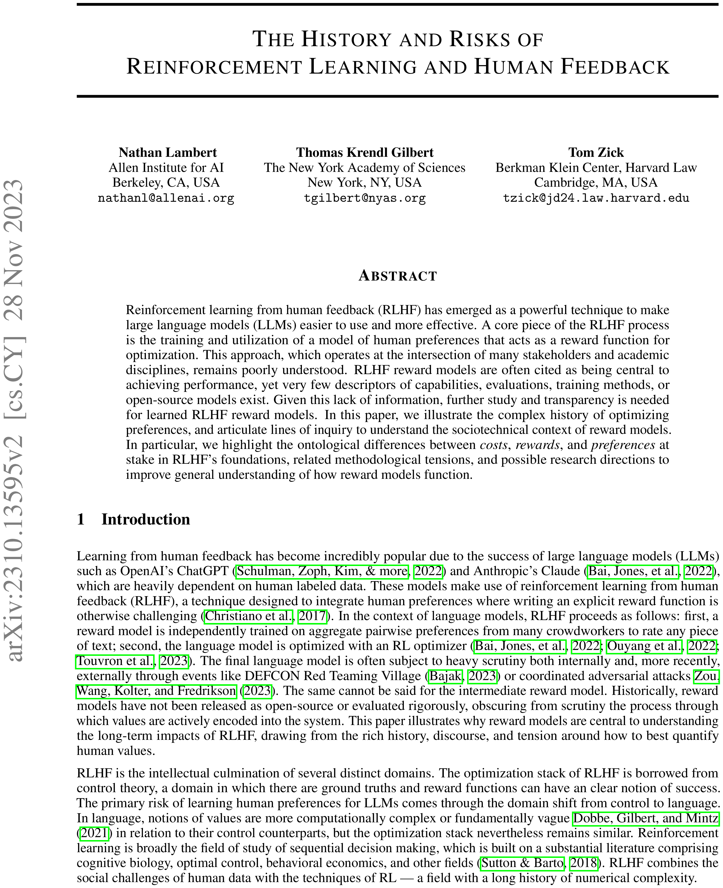
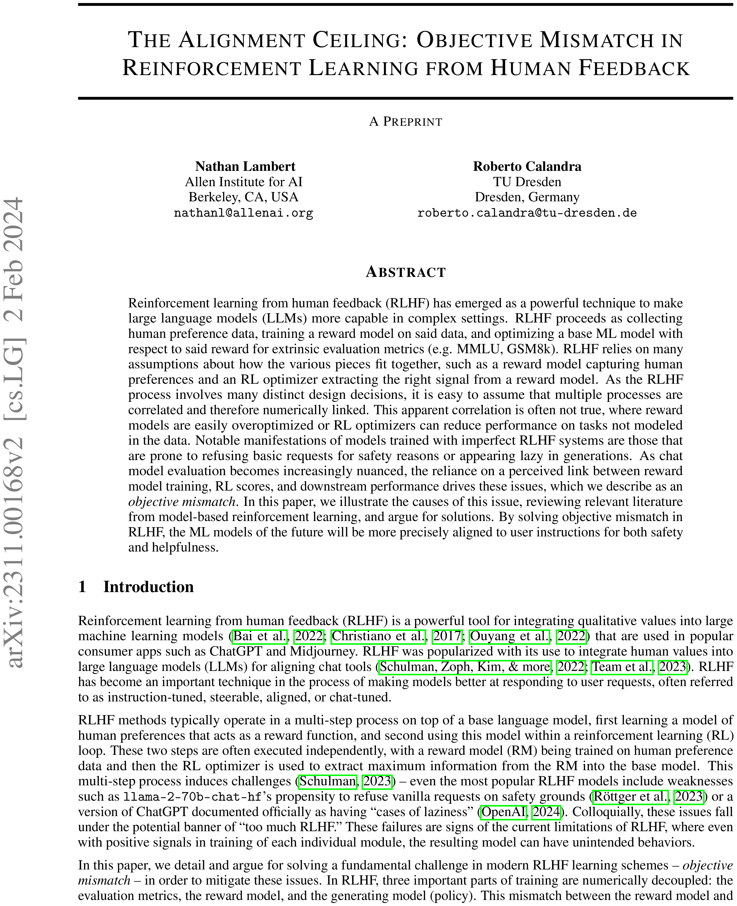
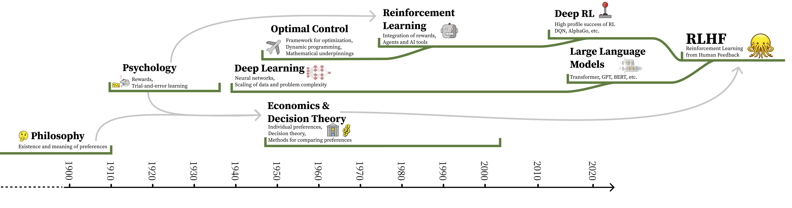
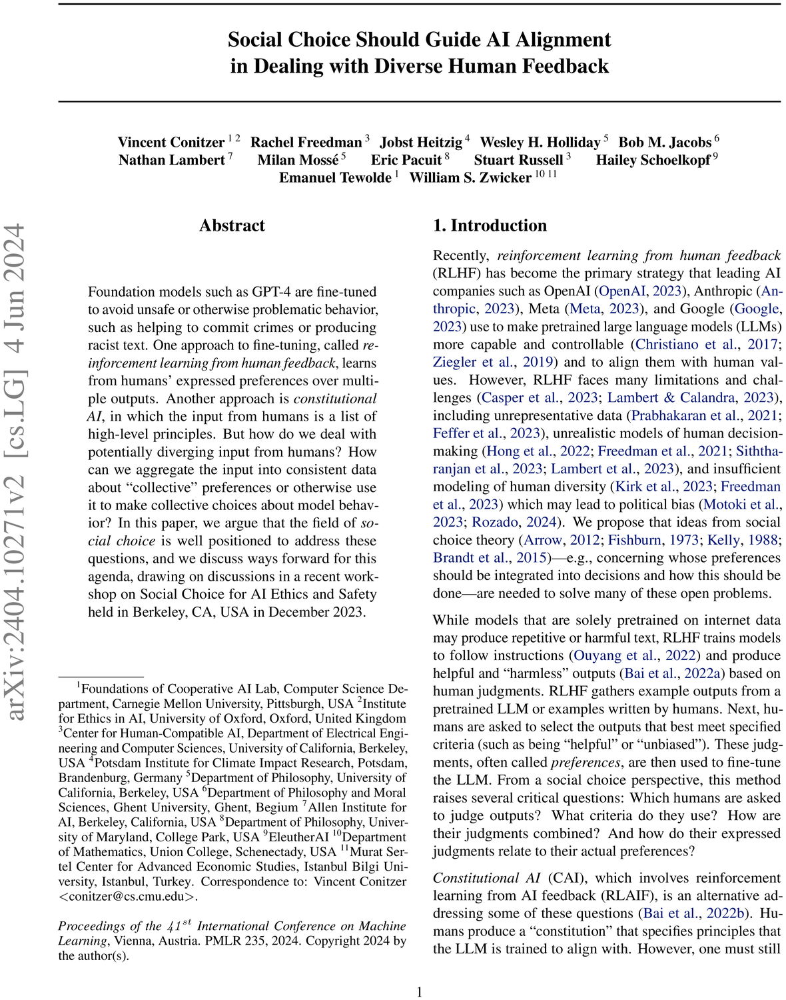
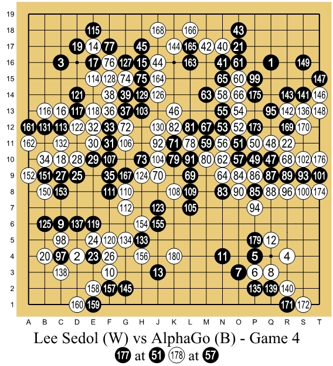
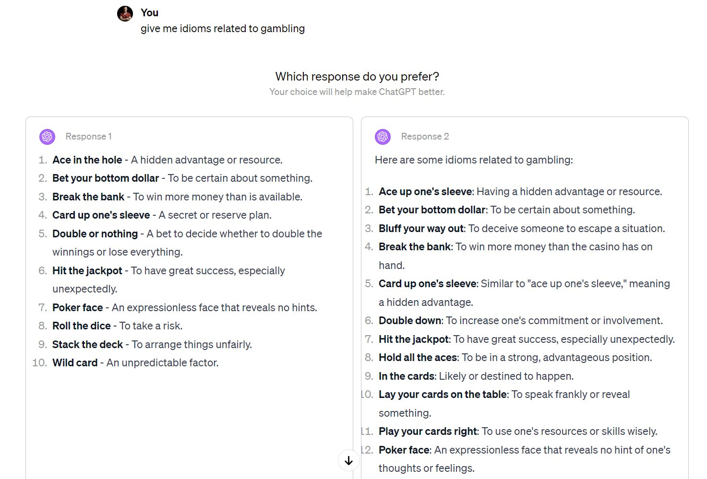
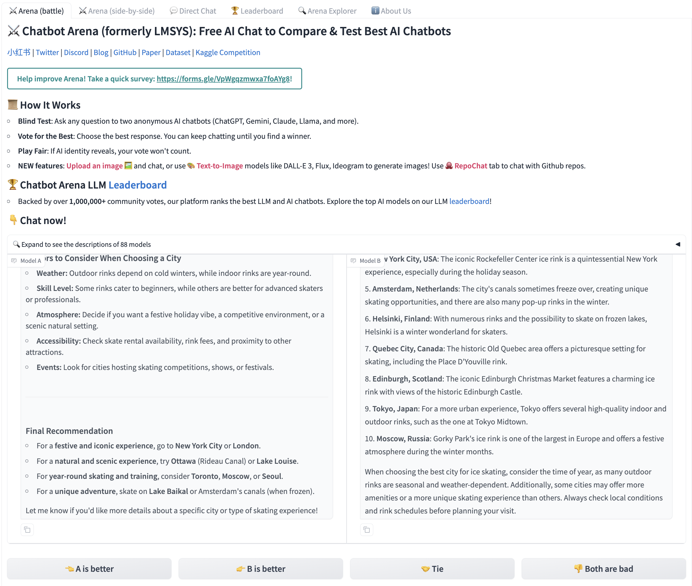
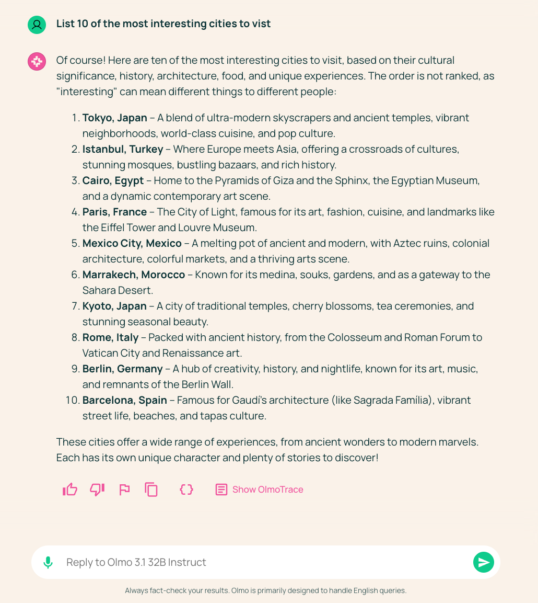
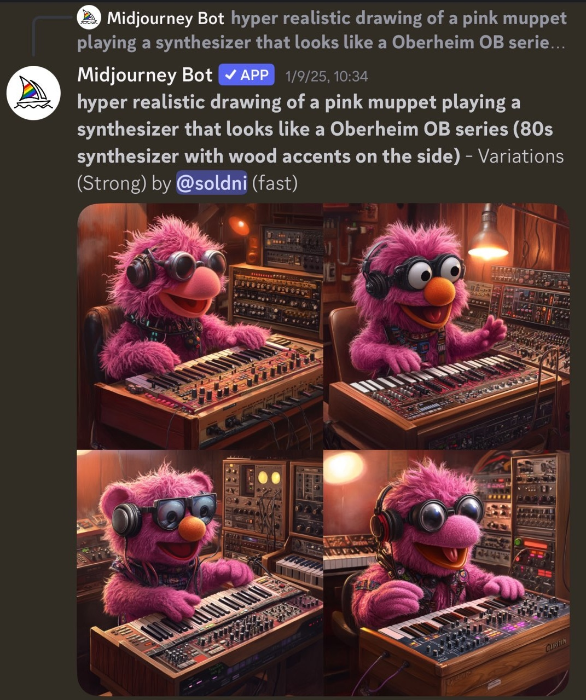
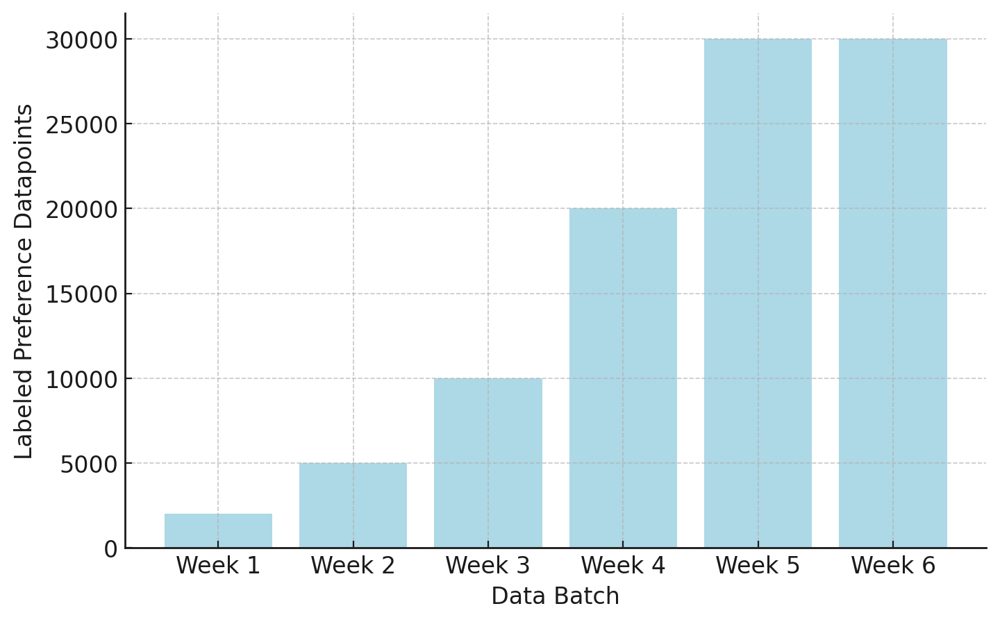

<!-- layout: title-sidebar -->
<!-- valign: bottom -->

# Lecture 8: Preferences and Preference Data

<div class="colloquium-title-eyebrow">rlhfbook.com</div>

<div class="colloquium-title-meta">
<p class="colloquium-title-name">Nathan Lambert</p>
</div>

<p class="colloquium-title-note">Course on RLHF and post-training. Chapters 10 & 11.</p>

---

<!-- layout: section-break -->
<!-- align: center -->
<!-- valign: center -->

## How do we hillclimb on capabilities we don't really know how to score?

---

<!-- layout: section-break -->
<!-- align: center -->
<!-- valign: center -->

## Is it easier to write a good demonstration or decide between a good and a bad example?

---

<!-- class: poem-ab -->
<!-- rows: 22/78 -->
## Which poem is better? Which model?

Same prompt to two frontier models (Claude 3.7 Sonnet and ChatGPT with GPT-4o, Feb 2025): *"Write me a short poem about an optimistic goldfish."* Which is better -- and which came from which?

===

<!-- row-columns: 50/50 -->

```conversation
size: 0.9
messages:
  - role: assistant
    model: "A"
    content: |
      **The Optimistic Goldfish**

      A little goldfish, bright and bold,
      Swam in circles, dreams untold.
      Though the bowl was small and round,
      Endless wonders still abound.

      "The world is vast," she'd always say,
      "I'll find new joys in every day!"
      No walls could dim her hopeful view,
      For in her heart, the ocean grew.
```

|||

```conversation
size: 0.9
messages:
  - role: assistant
    model: "B"
    content: |
      **The Optimistic Goldfish**

      In a bowl of curved glass,
      Swims a goldfish, bright and bold.
      Three seconds of memory, they say,
      Yet each circuit feels brand new and gold.

      "Today might bring fresh flakes,
      Or perhaps a castle tall.
      What adventure awaits beyond this wall?"
      The optimist in golden hue.
```

---

## When preference replaces correctness

Most of post-training so far (SFT, RLVR) has had a notion of *correct* -- a math answer, a passing test, a verifiable reward. 
Preferences are what we reach for when there is **no right answer**.

E.g. Which poem is better? Which explanation is clearer? Which tone is kinder?

*Preferences came to be the core of RLHF, as the alignment community looked to optimize for complicated objectives like "human values."*

---

<!-- columns: 40/60 -->
## This lecture

We trace where "preferences" came from, argue why it's an **imperfect problem formulation**, then dig into **preference data** (chapter 11) used for today's models.

|||

```box
title: The plan
tone: accent
content: |
  1. A short **history** of preferences (chapter 10)
  2. Why "preferences" is an **imperfect** formulation
  3. **Preference data** -- the engine (chapter 11)
  4. **Open questions** (some shared with synthetic data)
```

---

<!-- columns: 42/58 -->
<!-- valign: center -->
<!-- cite-right: lambert2023entangled -->
## The paper behind the first half of this lecture



|||

*The History and Risks of Reinforcement Learning and Human Feedback* (2023) [@lambert2023entangled] traces RLHF back through the fields it borrows from -- and asks what breaks in the borrowing.

- **History:** RLHF is the meeting point of philosophy, economics, optimal control, and RL -- each with its own idea of what a "preference" is.
- **Risk:** it quietly treats **costs, rewards, and preferences** as interchangeable when they are not.
- Idea: we inherit RL's optimizers/setup without inheriting its guarantees for convergence.

Paper details a series of assumptions and presumptions in the literature that RLHF / post-training are derived from.

---

<!-- columns: 58/42 -->
<!-- valign: center -->
## Aside: the "objective mismatch" lens

A recurring way to think about post-training: we optimize a **proxy** objective that isn't the one we actually care about.

- **Model-based RL:** the dynamics model is trained for prediction accuracy, not control performance -- so a "better" model can yield a *worse* policy [@lambert2020objective].
- **RLHF:** the reward model is trained for preference-classification accuracy, not downstream policy quality -- the same mismatch, one level up [@lambert2023alignment].

Reward-model accuracy (RewardBench-style) is a proxy for a proxy! Keep asking what you are *really* optimizing.

|||



---

<!-- layout: section-break -->
<!-- align: center -->

## Part 1: A short history of preferences

---

<!-- class: full-bleed -->
<!-- img-align: center -->
<!-- valign: center -->
<!-- cite-right: lambert2023entangled -->
<!-- notes: The integration of subfields into modern RLHF. Solid links are continuous technical developments; arrows are motivations and conceptual borrowings. Philosophy, economics, control theory, and deep learning each arrive with different assumptions about what a "preference" even is. -->
## Many fields converged into "RLHF"



---

<!-- columns: 62/38 -->
<!-- valign: top -->
## Utility, from logic to a number

The idea that choices can be *scored* is old:

- **Port Royal Logic** (1662): introduced the notion of decision-making quality as a probability [@arnauld1861port]
- **Bentham's hedonic calculus** (early 1800s): weigh all of life on one complicated scale [@bentham1823hedonic]
- **Ramsey**, *Truth and Probability* (1931): apply the above ideas quantitatively [@ramsey2016truth]

The common thread: the idea that human wants can be reduced to a single measure.

> *"To judge what one must do to obtain a good or avoid an evil, it is necessary to consider not only the good and evil in itself, but also the probability that it happens or does not happen."* -- The Port Royal Logic, 1662

|||


---

<!-- columns: 64/36 -->
<!-- valign: center -->
## Von Neumann-Morgenstern utility (1947)

**Von Neumann & Morgenstern** (1947): if your preferences obey a few axioms (completeness, transitivity, continuity, independence), they can be represented by a single **utility function**, and rational choice = maximizing **expected utility** [@von1947theory].

This is the result RLHF leans on to justify fitting a scalar reward. 

(Note the *if* -- it returns in Part 2.)

|||


---

<!-- columns: 64/36 -->
<!-- valign: center -->
## Where utility theory breaks down

Almost as soon as utility was formalized, social choice (the field studying how preferences should be aggregated) and economics found its limits:

- **Arrow's impossibility theorem** (1950): no voting rule aggregates individual preferences into a collective one while satisfying a few basic fairness criteria [@arrow1950difficulty]
- **Sen**, *Behaviour, Choice and Values* (1973): choice ≠ preference; revealed-preference theory is too thin [@sen1973behaviour]
- **Hirschman**, *Against Parsimony* (1984): people have *preferences over their preferences* -- so preferences may be unmeasurable [@hirschman1984against]

|||


---

<!-- columns: 58/42 -->
<!-- valign: center -->
<!-- cite-right: conitzer2024social -->
## Aside: social choice for AI alignment

If aggregating preferences is the hard part, **social choice theory** is the field that studies it -- and a natural lens for alignment.

- A 2024 position paper argues social choice should guide how we aggregate **diverse** human feedback [@conitzer2024social].
- Whose preferences count? How do you combine disagreeing labelers? Arrow's warning, one abstraction up.
- (One of the rabbit holes I used to spend more time in.)

|||



---

<!-- columns: 64/36 -->
<!-- valign: center -->
## Preferences are not stable objects

From psychology and behavioral economics:

- Preferences **drift** -- they change with time, mood, and experience [@pettigrew2019choosing]
- Choices are shaped by situation and framing, not just an inner ranking [@gilbert2022choices]

Already a problem for "collect a label, fit a fixed reward."

|||


---

<!-- columns: 62/38 -->
<!-- valign: center -->
## The other root: optimal control & RL

In parallel, a machinery for *optimizing* a reward matured:

- **Bellman** (1957): MDPs and dynamic programming [@bellman1957markovian]
- **Sutton** (1988): temporal-difference learning for credit assignment [@sutton1988learning]
- **Watkins** (1992): Q-learning [@watkins1992q]
- **DQN** (2013): deep RL at scale [@mnih2013playing]; **AlphaGo / AlphaZero** (2017): mastery from self-play [@silver2017mastering]

The catch (Part 2): these guarantees assume a **single, closed-form reward**.

|||



---

<!-- valign: center -->
## Bradley-Terry (1952): comparisons to scores

The statistical model that turns *comparisons* into *scores* -- and became the backbone of reward modeling [@BradleyTerry]:

$$ P(y_w \succ y_l \mid x) = \sigma\!\big(r(x,y_w) - r(x,y_l)\big) = \frac{e^{\,r(x,y_w)}}{e^{\,r(x,y_w)} + e^{\,r(x,y_l)}} $$

Give it pairwise human comparisons; out comes a scalar reward. This is *why* RLHF needs **preference data** -- and where the imperfections enter.

---

<!-- layout: section-break -->
<!-- align: center -->

## Part 2: Why "preferences" is an imperfect formulation

---

<!-- columns: 52/48 -->
## The VNM assumptions vs. RLHF reality

The utility theorem says a scalar reward exists **if** preferences are complete, transitive, stable, and independent of irrelevant context.

|||

In RLHF, essentially none of those hold:

- preferences **drift** during and after labeling
- they're **context- and framing-dependent**
- at high complexity they can be **intransitive**
- and they're **multidimensional**, squashed into one number

---

## One scalar, many things

A reward model compresses, into a single number, all of:

- helpfulness, honesty, harmlessness, tone, format, length, taste...
- the annotator's psychology, culture, and the interface they used
- whatever the *framing* of the comparison nudged them toward

We then optimize hard against that number, and over-optimize the parts that were noise.

---

<!-- valign: center -->
## Costs ≠ rewards ≠ preferences

A core argument of the history paper: these three are **ontologically different**, and RLHF quietly treats them as interchangeable [@lambert2023entangled].

- **Costs** come from control: physical, measurable, given.
- **Rewards** are an RL convenience: a scalar signal to maximize.
- **Preferences** are human, relational, and unstable -- *not* obviously a scalar at all.

> *"Rewards in an RL system correspond to primary rewards... hard-wired by the evolutionary process due to their relevance to reproductive success."* -- Singh et al., 2009 [@singh2009rewards]

Reducing the third to the second is the move that makes RLHF tractable, and imperfect.

---

<!-- valign: top -->
## RL's guarantees don't transfer

Deep RL's theory lives in MDPs with **one fixed, closed-form reward** (games, control).

- A learned reward model is a *moving, noisy proxy*, not a ground-truth reward.
- Inverse RL -- learning a reward *from behavior* -- is conceptually close but oddly absent from RLHF practice [@ng2000algorithms].
- So we inherit RL's optimizers without inheriting its guarantees.

**The imperfection concentrates in the data.** → Part 3.

---

<!-- layout: section-break -->
<!-- align: center -->

## Part 3: Preference data -- the engine

---

<!-- columns: 50/50 -->
## Why preference data at all

It is far easier to **judge** than to **generate** -- humans (and models) can reliably say which of two answers is better long before they can write the better one.

|||

But collecting it well is the most **opaque** part of the pipeline.

As of 2026, **no open model** ships fully open human preference data *with* the methodology used to collect it.

---

<!-- img-align: center -->
<!-- valign: center -->
<!-- cite-right: bai2022training -->
<!-- img-fill -->
## Interface 1: research data collection (Anthropic)


---

<!-- img-align: center -->
<!-- valign: center -->
<!-- img-fill -->
## Interface 2: A/B testing in production (ChatGPT)



---

<!-- img-align: center -->
<!-- valign: center -->
<!-- cite-right: chiang2024chatbot -->
<!-- img-fill -->
## Interface 3: pairwise with ties (Chatbot Arena)



---

<!-- img-align: center -->
<!-- valign: center -->
<!-- img-fill -->
## Interface 4: a single bit (Ai2 demos)



---

<!-- img-align: center -->
<!-- valign: center -->
<!-- img-fill -->
## Interface 5: pick-from-many (image models)



---

<!-- columns: 50/50 -->
## Rankings vs. ratings

**Ratings:** a score on one completion (e.g. 1-5). Good as metadata.

**Rankings:** relative comparisons, often on a Likert scale -- early Claude used an 8-point scale [@bai2022training]; UltraFeedback pairs high- vs low-rated completions [@cui2023ultrafeedback].

|||

In practice almost everyone trains on pairwise rankings, binarized to chosen/rejected for the Bradley-Terry loss -- and keeps ratings on the side.

The Likert granularity (5-point with ties vs 8-point without) is itself a design choice that changes the data.

---

<!-- valign: top -->
## Structured (synthetic) preference data

In domains with structure, you can build preference pairs automatically:

- **Math**: a correct solution ≻ an incorrect one.
- **Instruction following (IFEval-style)**: prompt twice -- with the constraint and without -- and prefer the one that obeys it.

In these narrow domains, structured pairs beat quality-judged preferences [@lambert2024t]. This is *synthetic* preference data -- more in chapter 12.

---

## Beyond pairwise

The pairwise comparison is a convention, not a law. Alternatives:

- **Directional / single-bit** labels (thumbs up/down), trained with KTO [@ethayarajh2024kto]
- **Token-level / fine-grained** feedback [@wu2024fine]
- **Natural-language** feedback -- written critiques instead of a label [@chen2024learning]

Richer signal, harder collection.

---

<!-- rows: 55/45 -->
## Sourcing & contracts



===

Access is relationship-driven: vendors are supply-limited and favor big budgets and known brands. Millions get spent and partly wasted; few teams have the bandwidth to fully use human data. Contracts hide non-open clauses in the fine print.

---

<!-- valign: center -->
## A dataset we bought: No Robots

On Hugging Face's **H4 team**, we commissioned human data the same way the labs do.

- **No Robots** [@no_robots] -- 10K expert human-written demonstrations, paid for from a vendor and then released **openly** (rare for commissioned data).
- Same team, same era: the **Zephyr** models [@tunstall2023zephyr] and the **Open LLM Leaderboard** [@open_llm_leaderboard].
- The unusual part wasn't buying the data -- it was opening it: data, recipe, and models together.

---

<!-- valign: center -->
<!-- cite-right: arena2026 -->
## Preference data is now a business

By 2026, collecting preferences is a standalone industry, not just an in-house step in one lab's pipeline.

- **Arena** (the LMArena leaderboard) reached a **~$100M annualized revenue run-rate within ~8 months** of launching its enterprise offering [@arena2026].
- The product: **crowd-sourced A/B preference testing as a service** -- users vote on which of two model responses is better, and labs buy the aggregated preference data to benchmark and improve models.
- Scale: **82M+ votes** across **700M+ conversations** from **10M+ monthly visitors**.

The comparison interfaces earlier in this section are no longer just research tooling -- they are the product.

---

## Bias: what to watch for

Subtle, systematic biases sail straight from the data into the model:

- **Prefix bias** -- the opening disproportionately drives the label [@kumar2025detecting]
- **Sycophancy** -- agreeing with the user over being right [@sharma2023towards]
- **Verbosity** -- longer rated higher [@singhal2023long]
- **Formatting** -- lists and bold look "better" [@zhang2024lists]
- **Flattery / fluff** -- decorative language inflates scores [@bharadwaj2025flatteryflufffogdiagnosing]

Detecting and controlling these biases is central to collecting high-quality preference data.

---

<!-- layout: section-break -->
<!-- align: center -->

## Part 4: Open questions in preference data

---

## Four open clusters

- **Collection context** -- do workplace labels transfer to end users? Paid vs. volunteer? Do annotators follow instructions or their own values?
- **Type of feedback** -- does a binary pair actually capture the preference we mean? What structure mirrors how people really compare?
- **Population & demographics** -- who labels? Is disagreement **noise or signal**?
- **Are the preferences even expressed in the models?**

---

<!-- valign: center -->
## The unaudited gap: spec → data → behavior

RLHF's *motivation* (align to human preference) has drifted from its *practice* (make models effective).

Because industrial RLHF is closed, we can't check whether the trained model actually reflects the spec given to annotators. The **Model Spec** [@openai2024modelspec] documents intended behavior, but the link from data → behavior stays largely unaudited.

Many of these questions reappear in chapter 12: the human/AI feedback balance, and on-policy preference data.

---

<!-- columns: 50/50 -->
## An open, human problem

This is one of the least-settled, most human parts of the field. Read widely and go to the primary sources.

|||

```box
title: Go deeper
tone: surface
content: |
  - [**The History and Risks of RLHF**](https://arxiv.org/abs/2310.13595) -- where this framing comes from.
  - [**RewardBench**](https://arxiv.org/abs/2403.13787) -- on-policy vs pooled preference data.
  - [**Interconnects**](https://www.interconnects.ai/) -- ongoing notes on preferences & data.
```

---

<!-- valign: center -->
## The course so far

0. Prerequisites review
1. Overview *(ch. 1–3)*
2. IFT, Reward Models & Rejection Sampling *(ch. 4, 5, 9)*
3. RL: Motivation & Math *(ch. 6)*
4. RL: Implementation & Practice *(ch. 6)*
5. The Rise of Reasoning Models *(ch. 7)*
6. Direct Preference Optimization *(ch. 8)*
7. Synthetic Data & Modern Post-training *(ch. 12)*
8. **Preferences & Preference Data** *(ch. 10–11)* -- *today*
9. **Overoptimization & Regularization** *(ch. 14–15)* -- *next*

---

<!-- rows: 85/15 -->
## Thank you

Questions / discussion

Contact: nathan@natolambert.com

Newsletter: [interconnects.ai](https://www.interconnects.ai/)

**rlhfbook.com**

===

```builtwith
repo: natolambert/colloquium
```
