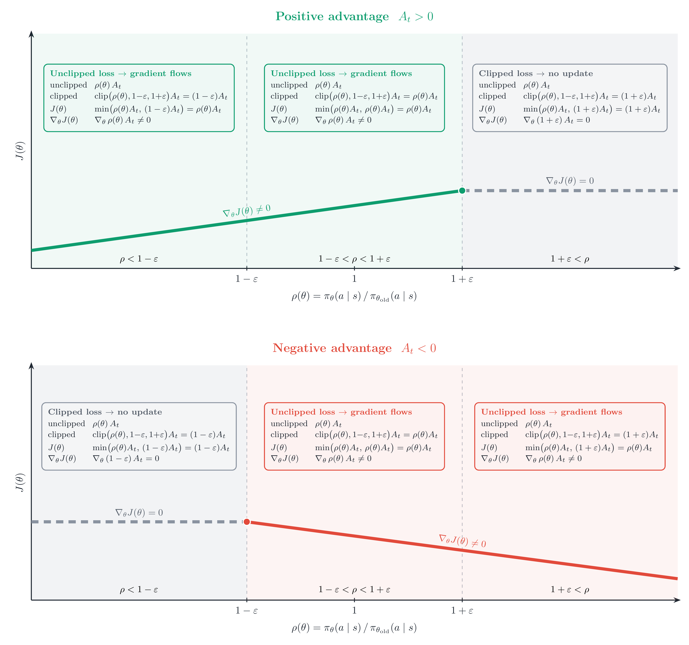

<!-- layout: title-banner -->

# Q&A 2: Advanced derivation fixes, resources to go further, and notation gotchas

<div class="colloquium-title-eyebrow">rlhfbook.com/course</div>
<div class="colloquium-title-rule"></div>

<div class="colloquium-title-meta">
<p class="colloquium-title-name">Nathan Lambert</p>
</div>

<p class="colloquium-title-note">Corrections and reader questions from the GitHub, Discord, and YouTube comments. Lectures 5-7-ish.</p>

---

<!-- layout: section-break -->
<!-- title: center -->

## Math corrections!

---

## Correction: the KD-as-RL-advantage slide (Lecture 7)

---

## Correction: the KD-as-RL-advantage slide (Lecture 7)

A sharp-eyed viewer flagged the "KD as an RL advantage" slide:

> The slide is missing a $\pi_\theta(a_t \mid s_t)$ multiplier for $A_t^{\mathrm{OPD}}$ (since it's for a single token, else it would be the expectation). Also, the negative reverse-KL on the top line looks like the forward-KL on the second line, which can be confusing.

<!-- step -->

What the slide showed:

$$ A_t^{\mathrm{OPD}} = -D_{\mathrm{KL}}\!\left(\pi_\theta(\cdot \mid s_t) \,\|\, \pi_T(\cdot \mid s_t)\right) \;{\color{red}\boxed{\color{red}=}}\; -\left(\log \pi_\theta(a_t \mid s_t) - \log \pi_T(a_t \mid s_t)\right) $$
$$ A_t^{\mathrm{OPD}} = \log \pi_T(a_t \mid s_t) - \log \pi_\theta(a_t \mid s_t) $$

<!-- footnote-right: Source: viewer feedback on [Lecture 7](https://www.youtube.com/watch?v=6nyJ8y8ghsE&list=PLL1tdVxB1CpVpEtMHxwuR4uI4Lxjw00_y&index=11) -->

---

## Correction: the KD-as-RL-advantage slide (Lecture 7)

The reverse KL at state $s_t$ is an expectation over *student*-sampled tokens:

$$ D_{\mathrm{KL}}\!\left(\pi_\theta(\cdot \mid s_t) \,\|\, \pi_T(\cdot \mid s_t)\right) = \mathbb{E}_{a_t \sim \pi_\theta(\cdot \mid s_t)}\!\left[\log \pi_\theta(a_t \mid s_t) - \log \pi_T(a_t \mid s_t)\right] $$

You never sum over the vocabulary: the single sampled token is an **unbiased estimate** $\hat{D}_{\mathrm{KL}}$ of that KL, and the advantage is its negative:

$$ A_t^{\mathrm{OPD}} = -\hat{D}_{\mathrm{KL}} = -\left(\log \pi_\theta(a_t \mid s_t) - \log \pi_T(a_t \mid s_t)\right) = \log \pi_T(a_t \mid s_t) - \log \pi_\theta(a_t \mid s_t) $$

- The old slide wrote a hard "$=$" to the full $D_{\mathrm{KL}}$; it's an *estimate*, equal only in expectation.
- Same form, opposite KL: $\log \pi_T - \log \pi_\theta$ *looks* like forward KL -- it's **reverse** because we sample $a_t \sim \pi_\theta$ (the student).
- Fixed slide + details: [Lecture 7 deck](https://rlhfbook.com/teach/course/lec7-chap12-synthetic-data/) · [PR #459](https://github.com/natolambert/rlhf-book/pull/459).

<!-- footnote-right: Sources: [@lu2025onpolicy], [@schulman2020klapprox] -->


---

## Correction: KL divergence is not a "distance" (Lecture 0)

---

## Correction: KL divergence is not a "distance" (Lecture 0)

I called the KL divergence a "distance" a few times. A viewer rightly pushed back:

> KL is **asymmetric** ($D_{\mathrm{KL}}(P\|Q)\neq D_{\mathrm{KL}}(Q\|P)$) and **violates the triangle inequality** — so it is not a metric.

<!-- step -->

Fair — and I battled my editors on this too. 
In post-training teams "KL distance" is common **colloquial** shorthand as "how much has the model changed," but technically it is a **divergence**. 

For reference, some information theory:

$$ D_{\mathrm{KL}}(P\|Q) = H(P,Q) - H(P) \ge 0 $$

- $H(P)$ = the minimum expected code length for data from $P$; $H(P,Q)$ = the cost of encoding it with a code built for $Q$.
- No code beats the one matched to the true $P$, so $H(P,Q)\ge H(P)$ — hence KL $\ge 0$. It measures **extra coding cost**, not a symmetric distance.

<!-- footnote-right: Source: viewer feedback on Lecture 0 -->

---

<!-- valign: center -->
## Reading: how to *estimate* KL in practice

In RL we rarely compute the exact KL — we estimate it from sampled tokens. John Schulman's note on the $k_1 / k_2 / k_3$ estimators (which is low-variance, which stays positive) is essential lore for anyone touching a KL penalty:

<div class="colloquium-spacer-md"></div>

### → [joschu.net/blog/kl-approx.html](http://joschu.net/blog/kl-approx.html)

<div class="colloquium-spacer-md"></div>

---

## Correction: the Bradley-Terry loss derivation (Lecture 2 / Ch 5)

---

## What the slide showed: the full derivation

The reward model maximizes the Bradley-Terry preference probability, then manipulates it into the loss (all for a single example $(x, y_c, y_r)$):

<div class="text-sm">

$$
\begin{aligned}
\theta^*
&= \arg\max_\theta \; P(y_c > y_r \mid x)
&& \text{the (wrong) setup: maximize per-example probability} \\[4pt]
&= \arg\max_\theta \; \frac{\exp(r_\theta(y_c \mid x))}{\exp(r_\theta(y_c \mid x)) + \exp(r_\theta(y_r \mid x))}
&& \text{Bradley-Terry form} \\[4pt]
&= \arg\max_\theta \; \frac{1}{1 + \exp\!\left(r_\theta(y_r \mid x) - r_\theta(y_c \mid x)\right)}
&& \text{divide through by } \exp(r_\theta(y_c \mid x)) \\[4pt]
&= \arg\max_\theta \; \sigma\!\left(r_\theta(y_c \mid x) - r_\theta(y_r \mid x)\right)
&& \text{recognize } \sigma(z) = \tfrac{1}{1+e^{-z}} \\[4pt]
&= \arg\max_\theta \; \log \sigma(\Delta)
&& \log \text{ is monotonic},\;\; \Delta = r_\theta(y_c \mid x) - r_\theta(y_r \mid x) \\[4pt]
\Rightarrow\quad \mathcal{L}(\theta) &= -\log \sigma(\Delta)
&& \text{flip sign: maximization} \to \text{loss}
\end{aligned}
$$

</div>

Clean per-example — but training is over a **dataset**. Where does the average go?

---

## Correction: the Bradley-Terry loss derivation (Lecture 2 / Ch 5)

A reader noted the reward-model derivation maximizes the per-example preference *probability*, then converts straight to the $-\log\sigma$ loss (writing $\Delta = r_\theta(y_c \mid x) - r_\theta(y_r \mid x)$):

$$ \theta^* = \arg\max_\theta P(y_c > y_r \mid x) = \dots = \arg\max_\theta \sigma(\Delta) = \arg\min_\theta -\log\sigma(\Delta) $$

<!-- step -->

That last step is only valid **pointwise**. Training is over the dataset, and $\mathbb{E}[P] \neq \mathbb{E}[\log P]$ -- so you take the $\log$ *before* averaging. The honest version is maximum likelihood:

$$ \theta^* = \arg\max_\theta \mathbb{E}_{(x, y_c, y_r) \sim D}\!\left[\log \sigma(\Delta)\right] = \arg\min_\theta \mathbb{E}\!\left[-\log\sigma(\Delta)\right] $$

- Fixed in the book + slides: [PR #465](https://github.com/natolambert/rlhf-book/pull/465).

<!-- footnote-right: Source: [issue #461](https://github.com/natolambert/rlhf-book/issues/461) (chrisnota) -->

---

<!-- layout: section-break -->
<!-- title: center -->

## More learning resources

---

## "Can we get programming & math assignments?"

---

## "Can we get programming & math assignments?"

Yes — **five chapters** end with a *Suggested Experiments* section: runnable code in the companion [`code/`](https://github.com/natolambert/rlhf-book/tree/main/code) library, each with knobs to vary and a question to answer.

- [Ch 4 · Instruction tuning](https://rlhfbook.com/c/04-instruction-tuning.html#suggested-experiments) — SFT an OLMo-2-1B base model; watch the base→assistant transition.
- [Ch 5 · Reward models](https://rlhfbook.com/c/05-reward-models.html#suggested-experiments) — train a Bradley-Terry RM on UltraFeedback; watch the reward margin.
- [Ch 6 · Policy gradients](https://rlhfbook.com/c/06-policy-gradients.html#suggested-experiments) — GRPO on a `reasoning-gym` task with Qwen3-1.7B.
- [Ch 8 · Direct alignment](https://rlhfbook.com/c/08-direct-alignment.html#suggested-experiments) — DPO / IPO on preferences (offline — the easiest start).
- [Ch 9 · Rejection sampling](https://rlhfbook.com/c/09-rejection-sampling.html#suggested-experiments) — a full GSM8K generate → score → finetune → eval pipeline.

Start with **Ch 8 (DPO)** or **Ch 4 (SFT)** — both run offline, no reward-model server or rollout loop. For "did I get the math," the lecture derivations (DPO in Lecture 6; policy gradients in Lectures 3–4) are the worked problem sets.

**I'm happy to see more PRs on GitHub discussing how to improve this!**

<!-- footnote-right: Source: viewer question on Lecture 0 -->

---

<!-- valign: center -->
## Another resource

An interactive way to *see* what each post-training stage does — read the same prompt answered by instruction-tuned and RLHF'd model variants, side by side.

<div class="colloquium-spacer-md"></div>

### → [rlhfbook.com/library](https://rlhfbook.com/library)

<div class="colloquium-spacer-md"></div>

Pick a prompt, compare completions across stages, and watch the base → assistant → aligned transition in real outputs. *(Let's open it.)*

---

<!-- layout: section-break -->
<!-- title: center -->

## RL algorithms & notation

---

## Notation gotchas in Chapter 6

A careful reader ([issue #464](https://github.com/natolambert/rlhf-book/issues/464), chrisnota) caught **three** notation inconsistencies in the policy-gradient chapter. 

1. **Reward indexing** 
2. **Scalar placement** — is the advantage *inside* the gradient or outside?
3. **Trajectory expectation** — what we sample from to get the loss.

<!-- footnote-right: Source: [issue #464](https://github.com/natolambert/rlhf-book/issues/464) (chrisnota) -->

---

## Gotcha 1: Reward indexing drifted mid-chapter

The chapter opens in **Sutton & Barto** indexing — the reward after $(S_t, A_t)$ is $R_{t+1}$ — but later equations silently switch to **zero-indexed** $r_t$:

$$
\underbrace{R(\tau) = \sum_{t=0}^{T} \gamma^t R_{t+1}}_{\text{Eq. 24-25: } R_{t+1}\text{, capital}}
\qquad\longrightarrow\qquad
\underbrace{\sum_{t=0}^{\infty} r_t \;,\;\; r_t + \gamma V(s_{t+1}) - V(s_t)}_{\text{Eq. 31, 41: } r_t\text{, zero-indexed}}
$$

<!-- step -->

**Fix:** pick one. The section is framed in Schulman's notation (rewards from zero), and the rest of the chapter uses lowercase $r_t$ — so Eq. 24-25 should match: **lowercase $r_t$, indexed from zero** throughout.

<!-- footnote-right: Source: [issue #464](https://github.com/natolambert/rlhf-book/issues/464) (chrisnota) -->

---

## Gotcha 2: Advantage-weighted policy gradient ordering

Which part is inside the derivative? This is ambiguous — it reads like $A$ might depend on $\theta$:

$$ {\color{red}\boxed{\color{red}\nabla_\theta \log \pi_\theta(a_t \mid s_t)\, A^{\pi_\theta}(s_t, a_t)}} $$

<!-- step -->

**Fix:** move the scalar advantage to the front. Now it's unambiguous that $\nabla_\theta$ acts only on $\log \pi_\theta$, and $A$ is just a weight:

$$ A^{\pi_\theta}(s_t, a_t)\, \nabla_\theta \log \pi_\theta(a_t \mid s_t) $$

The advantage is a detached scalar — it scales the score-function gradient, it is not differentiated.

<!-- footnote-right: Source: [issue #464 comment](https://github.com/natolambert/rlhf-book/issues/464#issuecomment-4810765949) (chrisnota) -->

---

## Gotcha 3: Where do we get RL samples?

The chapter bounces between two expectation subscripts, and one is under-specified:

$$
\underbrace{\mathbb{E}_{\tau}\!\left[\cdots\right]}_{\text{under-specified: source of } \tau \text{ unclear}}
\qquad
\underbrace{\mathbb{E}_{\tau \sim \pi_\theta}\!\left[\cdots\right]}_{\text{imprecise: } \pi_\theta \text{ isn't a trajectory distribution}}
$$

<!-- step -->

**Fix:** the trajectory distribution is $p_\theta(\tau)$ — induced by the initial state, the policy, *and* the environment dynamics — which the chapter already defines in Eq. 33:

$$ \mathbb{E}_{\tau \sim p_\theta(\cdot)}\!\left[\cdots\right], \qquad p_\theta(\tau) = d_0(s_0)\prod_t \pi_\theta(a_t \mid s_t)\, P(s_{t+1} \mid s_t, a_t) $$

$\pi_\theta$ alone is a per-step action distribution; only $p_\theta$ is a distribution over whole trajectories.

<!-- footnote-right: Source: [issue #464](https://github.com/natolambert/rlhf-book/issues/464) (chrisnota) -->

---

## Why switch between $\nabla_\theta J(\theta)$ and $J(\theta)$ across algorithms?

---

<!-- valign: center -->
## Why switch between $\nabla_\theta J(\theta)$ and $J(\theta)$ across algorithms?

REINFORCE is written as a **gradient**; PPO as an **objective** (Chapter 6, Eq. 71 vs 72). Why?

<div class="colloquium-spacer-md"></div>

$$
\begin{aligned}
\nabla_\theta J(\theta) &= \mathbb{E}\!\left[\,\nabla_\theta \log \pi_\theta(a \mid s)\, A\,\right]
&& \text{\small REINFORCE — a \textbf{gradient}} \\[10pt]
J(\theta) &= \mathbb{E}_t\!\left[\min\!\left(\rho_t A_t,\ \mathrm{clip}(\rho_t, 1-\epsilon, 1+\epsilon)\, A_t\right)\right]
&& \text{\small PPO — an \textbf{objective}}
\end{aligned}
$$

<div class="colloquium-spacer-md"></div>

Same idea, two forms — so why write them differently?

<!-- footnote-right: Source: @awais on Discord (Chapter 6) -->

---


## Why not just write PPO's gradient?

The clipped surrogate:

$$ J^{\mathrm{CLIP}}(\theta) = \mathbb{E}_t\!\left[\min\!\left(\rho_t A_t,\ \mathrm{clip}(\rho_t,\, 1-\epsilon,\, 1+\epsilon)\,A_t\right)\right] $$

<!-- step -->

The gradient *does* exist -- but $\min$ and clip make it **piecewise**: it equals $\rho_t A_t\, \nabla_\theta \log \pi_\theta(a_t \mid s_t)$ in the active region and goes to **zero** once $\rho_t$ leaves the trust region on the penalized side.

$$ \nabla_\theta J^{\mathrm{CLIP}} = \mathbb{E}_t\!\left[\mathbb{1}[\text{active branch}]\;\rho_t A_t\, \nabla_\theta \log \pi_\theta(a_t \mid s_t)\right] $$

- Not "no closed form" -- it's closed-form *per piece*, with non-differentiable kinks at the switch points.
- Writing it as one expression needs indicator functions for every branch; stating the objective hides that and lets autodiff pick the branch.

<!-- step -->
**In code both are one scalar loss** you call `.backward()` on -- so the distinction is mostly pedagogical.
<!-- footnote-right: Source: reader follow-up (Chapter 6) -->

---

<!-- class: figure-fill no-figure-captions -->
<!-- padding: compact -->



<!-- footnote-right: New figure added to Chapter 6 ([PR #462](https://github.com/natolambert/rlhf-book/pull/462), zafstojano) -->

---

## What comes next?

1. Introduction & Training Overview -- Chapters 1-3
2. IFT, Reward Models, Rejection Sampling -- Chapters 4, 5, 9
3. RL Theory -- Chapter 6 (Part 1)
4. RL Implementation & Practice -- Chapter 6 (Part 2)
5. Reasoning -- Chapter 7
6. Direct Alignment Algorithms -- Chapter 8
7. Synthetic Data -- Chapter 12
8. **Preferences & Preference Data -- Chapters 10/11**
9. ... shorter lectures on the advanced topics!

---

<!-- rows: 85/15 -->
## Thanks for watching

Questions, comments, and future Q&A prompts:

- Course: [rlhfbook.com/course](https://rlhfbook.com/course)
- Discord: [discord.gg/yz5AwK4gBR](https://discord.gg/yz5AwK4gBR)
- GitHub: [github.com/natolambert/rlhf-book](https://github.com/natolambert/rlhf-book)
- Newsletter: [interconnects.ai](https://www.interconnects.ai/)
- Contact: nathan@natolambert.com

===

```builtwith
repo: natolambert/colloquium
```
