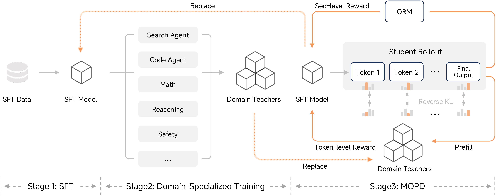
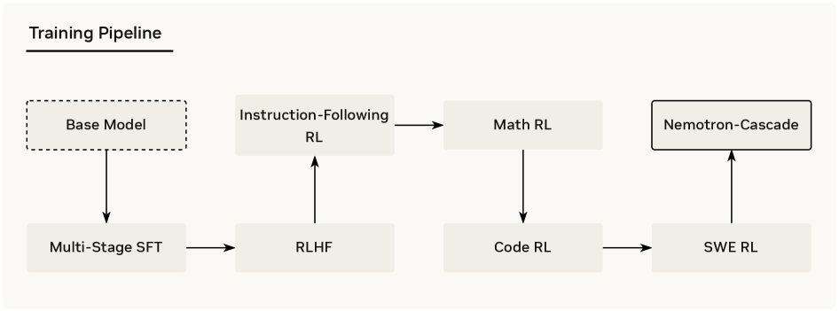
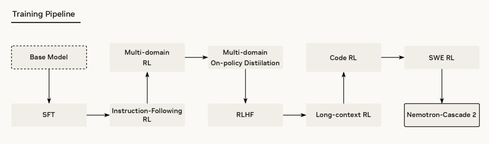

<!-- layout: title-banner -->

# Q&A 3: Post-Training Recipe Evolution and Advice

<div class="colloquium-title-eyebrow">rlhfbook.com/course</div>
<div class="colloquium-title-rule"></div>

<div class="colloquium-title-meta">
<p class="colloquium-title-name">Nathan Lambert</p>
</div>

<p class="colloquium-title-note">Corrections and questions from the GitHub, Discord, and YouTube comments through Lecture 11.</p>

---

## Q1: "Should capabilities be trained separately, then merged?"

A viewer asks:

> Hi Nathan, thanks for another great video on post-training! At @24:21, this got me thinking (and I might be misunderstanding): if each capability is sort of its own "mode," would it make sense to post-train stage by stage — coding → math → agentic tool use → etc. — learning one mode at a time? My guess is this intuition is wrong somewhere, since it seems like people don't really do this and still put a lot of care into the data mixture. Would love to understand what I'm missing here.

---

## Q1: "Should capabilities be trained separately, then merged?"

A viewer asks -- should post-training be sequential rather than a strong mix.

**In industry post-training has a shocking number of stages and sequencing.** It is usually not just per-capability in a line, rather with forking & merging, with some sequence too.

The emerging version trains **specialist teachers in parallel**, then consolidates them into one student with multi-teacher on-policy distillation (MOPD). See [Conversation 1 (w/ Finbarr Timbers)](https://www.youtube.com/watch?v=sbXEPxIazqY&list=PLL1tdVxB1CpVpEtMHxwuR4uI4Lxjw00_y&index=9).

<!-- footnote-right: Source: [@mcmc6052 on YouTube (Lecture 10)](https://www.youtube.com/watch?v=IwpYxANrpUs&lc=UgwCZ6w8z4aPayBK3pB4AaABAg) -->

---

## MOPD example (covered more in Conversation 1 / Lecture 7)




<!-- footnote-right: Sources: [MiMo-V2-Flash](https://arxiv.org/abs/2601.02780), [MOPD](https://arxiv.org/abs/2606.30406) -->

---

## Cascade RL: A sequential recipe



A [fun paper](https://arxiv.org/abs/2512.13607)! Integrated a bit into Nemotron, but not accepted as state-of-the-art.

<!-- footnote-right: Source: [@nvidia2025nemotroncascade] -->

---

## Cascade RL 2: A sequential recipe + on-pol distillation



Read: [Nemotron-Cascade 2 on arXiv](https://arxiv.org/abs/2603.19220).

<!-- footnote-right: Source: [@nvidia2026nemotroncascade2] -->

---

## Q2: "Why does RLVR often omit the KL penalty?"

A follow-up from the Lecture 10 comments:

> And on a related note, it seems like for RLVR the default is to drop the KL term entirely. My understanding is that this is because in RLVR the reward is verifiable ground truth, so we don't run into the over-optimization problem you get in RLHF, where a learned reward model is only a proxy (and arguably a proxy of a proxy, since the preference data itself approximates what we actually care about). Is that the right way to think about it?


<!-- step -->

Overall yes. We even found during Tülu 3 that in RLVR the models are very good at selectively updating behaviors -- e.g. learning math without OOD degradation.

<!-- footnote-right: Source: [@mcmc6052 follow-up on YouTube (Lecture 10)](https://www.youtube.com/watch?v=IwpYxANrpUs&lc=UgwCZ6w8z4aPayBK3pB4AaABAg.AZq-x8qDJuuAZq0_-kE-33) -->

---

<!-- columns: 50/50 -->
## Some more $\beta$ choices

### Dropped it

- Open-Reasoner-Zero [@hu2025openreasonerzero], Magistral [@mistral2025magistral], and Skywork OR-1 [@he2025skyworkor1] ran RLVR at $\beta = 0$ (Lecture 5's list).
- DAPO removed it explicitly so long reasoning chains can explore [@yu2025dapo].
- GLM-5 (2026): "we remove the KL regularization term to accelerate RL improvement" ([report, §3.2](https://arxiv.org/abs/2602.15763)).

|||

### Kept (a version of) it

- DeepSeek-R1's GRPO objective ships with a $\beta\, D_{\mathrm{KL}}$ term to the reference model [@guo2025deepseek].
- [Kimi K3's report](https://github.com/MoonshotAI/Kimi-K3/blob/main/k3_tech_report.pdf) never mentions KL in its RL objective — the frontier default is quiet omission.

---

## Q3: "How does the ~1M SFT prompt budget scale with model size?"

From the Lecture 2 comments:

> You mention some pocket rules for prompt budgets, e.g. ~1M prompts for SFT. In your experience, how does this number scale with the size of the model being post-trained?

<!-- step -->

Mostly, bigger models tend to need less data (e.g. [Tülu 3 405B](https://allenai.org/blog/tulu-3-405B)). They're more sample efficient at RL (in terms of steps, not total GPU hours) and need less SFT data (or much of SFT data doesn't help them). I'd read this as bigger models need fewer tokens/capability, which fits scaling laws.

This has confounders today, as midtraining and SFT are almost indistinguishable in some ways. They both seed the reasoning behaviors in the models.

<!-- footnote-right: Source: [@secmt on YouTube (Lecture 2)](https://www.youtube.com/watch?v=4gIwiSPmQkU&lc=Ugy_HdDeTwJzC87rsOZ4AaABAg); budgets from [@lambert2024t] -->

---

## Q4: "RL is basically just SFT with a regularization term?"

A great question from the Lecture 3 comments:

<div class="text-sm">

> Hi Nathan. i have a question about some recent papers about RL vs. SFT for LLMs. So the conventional belief is that RL is good for hardcore reasoning tasks whereas SFT is good for getting the structure and formatting, which is basically why we had 2-3 phases in post-training for so long so we believe they do different things. But there are always new papers popping up saying RL is basically just SFT with some regularized term, and if you do their regularized version of SFT, you can get the same result and then they give you a bunch of plots and graphs in their paper demonstrating that to you. How believable/generalizable is this? I can't imagine it generalizes to big models; otherwise, DeepSeek and GLM would already be doing it....

</div>

<!-- step -->

On the premise: I'd say it's less "SFT for formatting, RL for reasoning" and more that **SFT is the foundation** (and very compute efficient these days), then **RL is how the model learns a lot more from there** — on harder problems, and adapting to the harnesses it'll be used in at deployment.

Both are impossible to get around right now. Still, **great models can be made with mostly SFT** as the field moves so fast. Any good data work will get you far.

<!-- footnote-right: Source: [@entropic4439 on YouTube (Lecture 3)](https://www.youtube.com/watch?v=K_Sj_-1BUMM&lc=UgzCuTOWvBCSKV5lPGB4AaABAg) -->

---

## The similarities in all the loss functions are very real

Yes — the two updates share their core term, and on curated targets SFT is the "all-positive" special case (same can be shown for DPO). That shared algebra is what drives iw-SFT [@qin2025supervised], DFT [@wu2025generalization], and the unified-view papers [@lv2025unified].

A huge difference: **negative gradients**. RL pushes below-baseline samples *down* — it learns from its own mistakes, which SFT structurally cannot do. + the power of on-policy learning to regularize and nudge a model.

For the math see [Lecture 10](https://www.youtube.com/watch?v=IwpYxANrpUs&list=PLL1tdVxB1CpVpEtMHxwuR4uI4Lxjw00_y&index=15).

<!-- footnote-right: Sources: [@qin2025supervised], [@wu2025generalization], [@lv2025unified] -->

---

## Q5: "When should in-house traces be trained into the weights vs. handled with ICL?"

From the Lecture 7 comments:

> When should in-house traces be learned into the weights rather than handled with in-context learning?

<!-- step -->

Mostly it comes down to cost, how much inference you're doing, and what the improvements are worth monetarily.
Build evaluations to see where you're at, but assume any meaningful training effort is at least millions or tens of millions.

<!-- footnote-right: Source: [@Decocoa on YouTube (Lecture 7)](https://www.youtube.com/watch?v=6nyJ8y8ghsE&lc=Ugy8yP4TjQX4_cHJx3N4AaABAg) -->

---

## Q6: "Can continued pretraining on a distillation-only dataset make a model worse?"

From the Lecture 7 comments.

<!-- step -->

Distillation data as a category doesn't make it good or bad. It depends on the teacher model, the student model, the filtering, the generation procedure etc. I'm sure people have made both failed models and SOTA models with continued pretraining on synthetic data.

<!-- footnote-right: Source: [@sankalpsingh7150 on YouTube (Lecture 7)](https://www.youtube.com/watch?v=6nyJ8y8ghsE&lc=UgwSW_GQ1R0OnIYaQGF4AaABAg) -->

---


<!-- rows: 85/15 -->
## Thanks for watching

Questions, comments, and future Q&A prompts:

- Course: [rlhfbook.com/course](https://rlhfbook.com/course)
- Discord: [discord.gg/yz5AwK4gBR](https://discord.gg/yz5AwK4gBR)
- GitHub: [github.com/natolambert/rlhf-book](https://github.com/natolambert/rlhf-book)
- Newsletter: [interconnects.ai](https://www.interconnects.ai/)
- Contact: nathan@natolambert.com

===

```builtwith
repo: natolambert/colloquium
```
