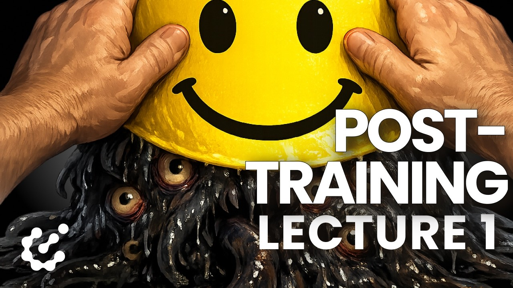
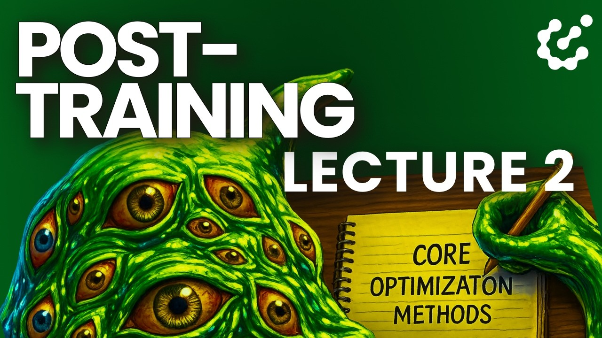
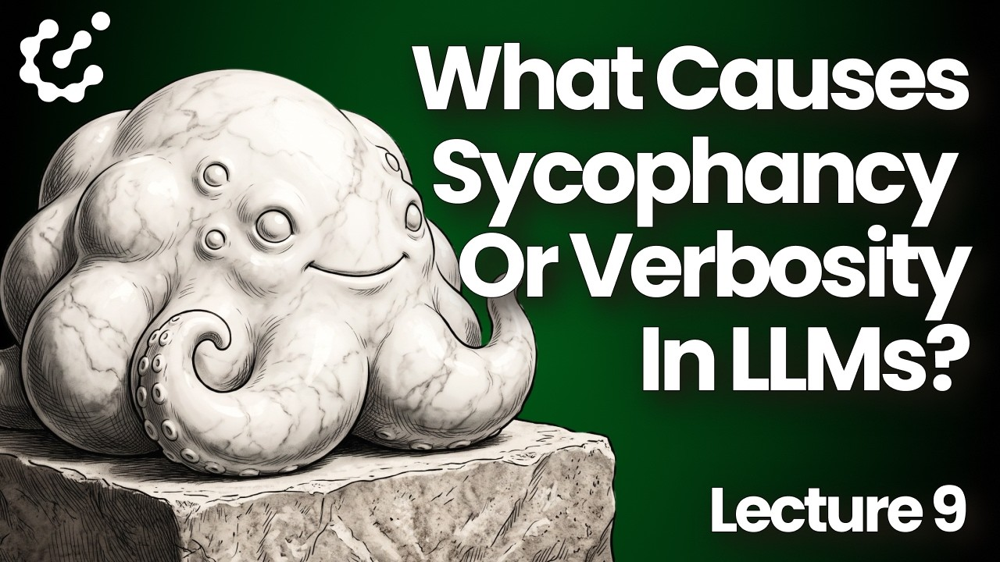
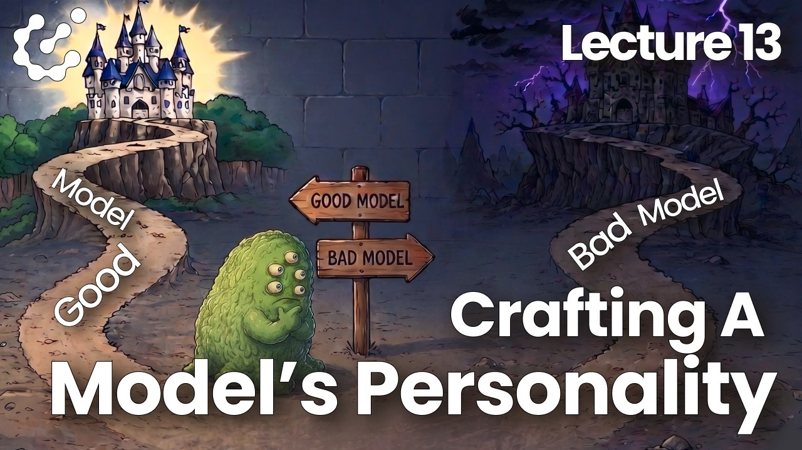
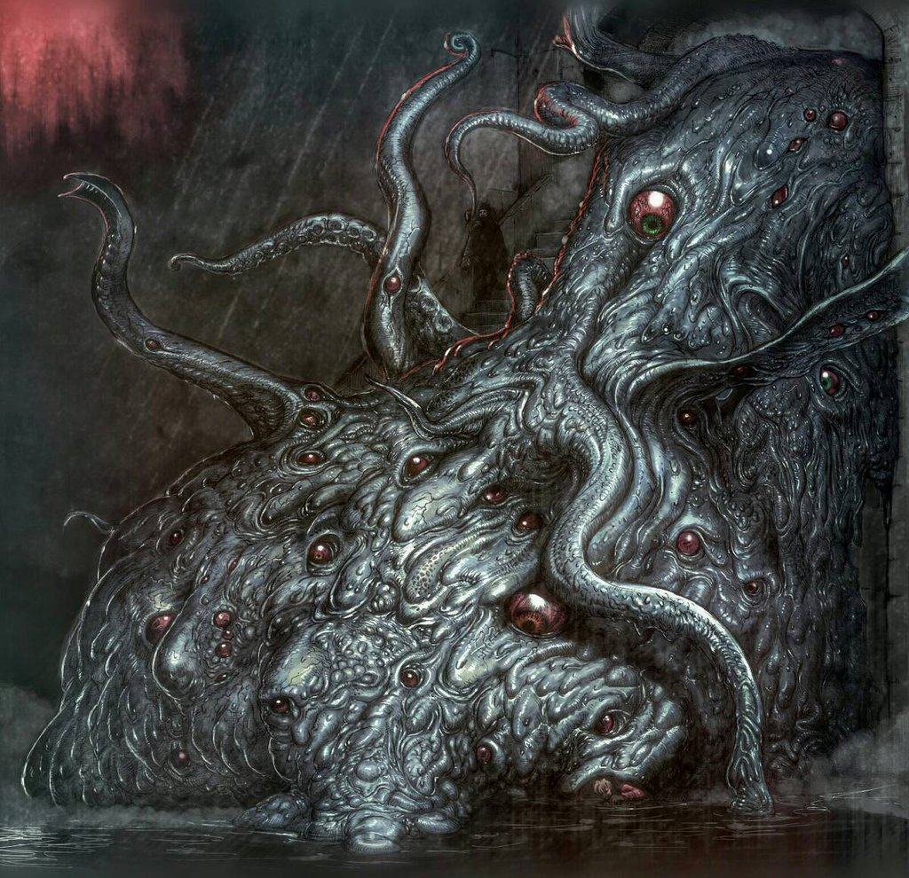
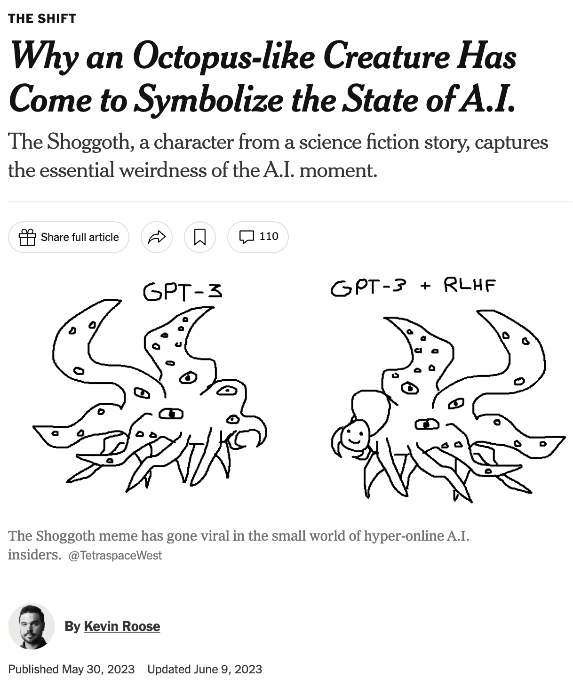
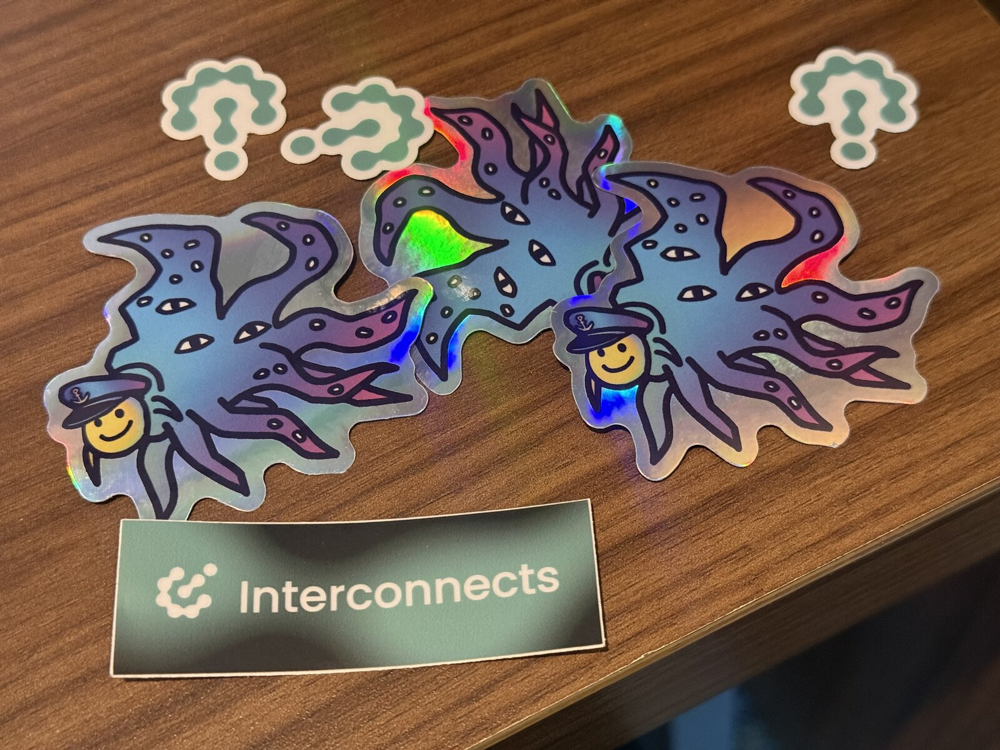

<!-- layout: title-sidebar -->
<!-- valign: bottom -->

# What's With the Shoggoths? <span class="title-subtitle">Course Bonus Video 1: Post-training necessary lore.</span>

<div class="colloquium-title-eyebrow">rlhfbook.com</div>

<div class="colloquium-title-meta">
<p class="colloquium-title-name">Nathan Lambert</p>
</div>

<p class="colloquium-title-note">Post-training course. </p>

---

<!-- rows: 50/50 -->

## WTF is this anyways?

<!-- row-columns: 50/50 -->


|||



===

<!-- row-columns: 50/50 -->


|||



---

<!-- columns: 60/40 -->
## 1931: A monster from Antarctica

Shoggoths come from H.P. Lovecraft's *At the Mountains of Madness* (written 1931, published in *Astounding Stories*, 1936) [@lovecraft1936mountains]:

> "It was a terrible, indescribable thing vaster than any subway train—a shapeless congeries of protoplasmic bubbles, faintly self-luminous, and with myriads of temporary eyes forming and un-forming as pustules of greenish light all over the tunnel-filling front that bore down upon us, crushing the frantic penguins and slithering over the glistening floor that it and its kind had swept so evilly free of all litter."

Shoggoths were created and bred as biological servants, but gradually developed minds of their own and rebelled against their creators.

|||



---

## September 2022: Simulators, before the meme

Janus's [*Simulators*](https://www.lesswrong.com/posts/vJFdjigzmcXMhNTsx/simulators) (LessWrong) argued that a base LLM is best understood as none of the agent / oracle / genie framings from earlier alignment writing. They argued:

- A base model is a **simulator** of its training distribution.
- The characters that appear in its outputs are **simulacra** -- generated by the model, but not identical to it.
- No single character in the outputs is "the model's identity."

(summary by Claude, ChatGPT said it was okay)

---

<!-- img-align: center -->
## December 2022: the meme is born

One month after ChatGPT launched, [@TetraspaceWest drew two shoggoths](https://twitter.com/TetraspaceWest/status/1608966939929636864): base **GPT-3** as the raw creature, and **GPT-3 + RLHF** as the same creature holding up a tiny smiley-face mask on one tentacle ([meme history](https://knowyourmeme.com/memes/shoggoth-with-smiley-face-artificial-intelligence)).


---

<!-- columns: 55/45 -->
## February 2023: the meme becomes a training diagram

[@anthrupad's rendition](https://x.com/anthrupad/status/1622349563922362368) (Feb 5, 2023, right) adds labels for each training stage: the creature is **unsupervised learning (pretraining)**, the small human face is **supervised fine-tuning**, and the smiley on a stick is **RLHF, "cherry on top"**.

Now it's recurring!

- [Helen Toner's thread](https://twitter.com/hlntnr/status/1632030583462285312) (March 2023) used it to explain the training stack to a policy audience.
- [Chip Huyen's RLHF explainer](https://huyenchip.com/2023/05/02/rlhf.html) (May 2023) put it in a widely-read engineering reference.

|||

](assets/shoggoth-meme-mask.jpeg)

---

<!-- columns: 60/40 -->
## Spring 2023: the meme goes mainstream

- **February 2023**: Elon Musk [tweets](https://web.archive.org/web/20230223004549/https://twitter.com/elonmusk/status/1628491148124884992) a version -- roughly 72k likes before he deletes it.
- **February 2023**: [Bing/Sydney](https://www.nytimes.com/2023/02/16/technology/bing-chatbot-microsoft-chatgpt.html) makes model personality a national story.
- **May 2023**: Kevin Roose profiles the meme in the New York Times -- ["Why an Octopus-like Creature Has Come to Symbolize the State of A.I."](https://www.nytimes.com/2023/05/30/technology/shoggoth-meme-ai.html) [@roose2023shoggoth].

|||

[](https://www.nytimes.com/2023/05/30/technology/shoggoth-meme-ai.html)

---

<!-- columns: 58/42 -->
## "Can I please speak to the shoggoth?"

A second branch of the lore: moments where the assistant persona slips read as *glimpsing what's underneath*.

e.g. [SolidGoldMagikarp](https://www.lesswrong.com/posts/aPeJE8bSo6rAFoLqg/solidgoldmagikarp-plus-prompt-generation) (Rumbelow & Watkins, LessWrong, Feb 2023): glitch tokens that produce bizarre, off-persona behavior.

|||


---

<!-- columns: 40/60 -->
## The shoggoth lives on

In many ways, the meme is stronger than ever. It's less about RLHF, but about how we understand so little about these models. Especially the latest scaling RL is brewing strong things.

|||




---

<!-- rows: 85/15 -->
## Thank you

Read more: [Reckoning with the Shoggoth of AI](https://www.interconnects.ai/p/the-shoggoth-rlhf) (Nov. 2023)

Contact: nathan@natolambert.com

Newsletter: [interconnects.ai](https://www.interconnects.ai/)

**rlhfbook.com**

===

```builtwith
repo: natolambert/colloquium
```

---

<!-- after: references -->

## January 2023: Scott Alexander turns it into an ontology

[*Janus' Simulators*](https://www.astralcodexten.com/p/janus-simulators) (Astral Codex Ten, Jan 26, 2023) has section headers "The Maskless Shoggoth On The Left" and "The Masked Shoggoth On The Right." On what RLHF does to a simulator:

> "If you punish it for simulating bad characters, it will start simulating good characters. Now it only ever simulates one character, the HHH Assistant."

<!-- step -->

The chain this sets up: base model → simulator of many characters → post-training selects **one default character**, the helpful, honest, and harmless (HHH) Assistant.

This is the version of the meme closest to how this course describes post-training.

---

<!-- after: references -->

## March 2023: masks all the way down?

Robert_AIZI, on LessWrong: [*Why do we assume there is a "real" shoggoth behind the LLM? Why not masks all the way down?*](https://www.lesswrong.com/posts/bYzkipnDqzMgBaLr8/why-do-we-assume-there-is-a-real-shoggoth-behind-the-llm-why)

> "Do we actually have evidence there is a 'real identity' in the LLM, or could it just be a pile of masks?"

The comments became part of the lore:

- **RogerDearnaley**: "I always assumed the shoggoth *was* masks all the way down: that's why it has all those eyes."
- **Gwern**: masks don't compute -- something beneath the masks has to be doing the acting, and jailbreaks often work by swapping one persona for another.

The technical question underneath the meme: does post-training conceal a stable underlying agent, select among latent personas, or construct a default persona in a system with no singular self?
