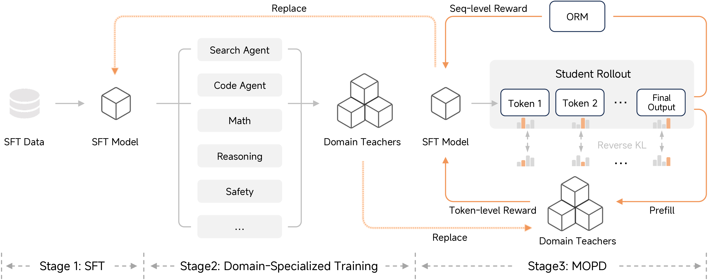
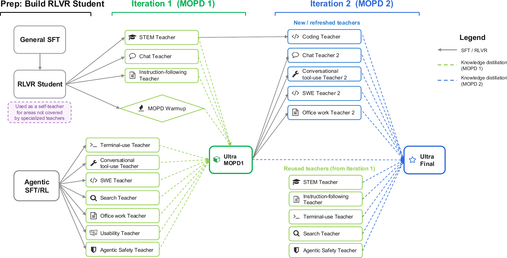
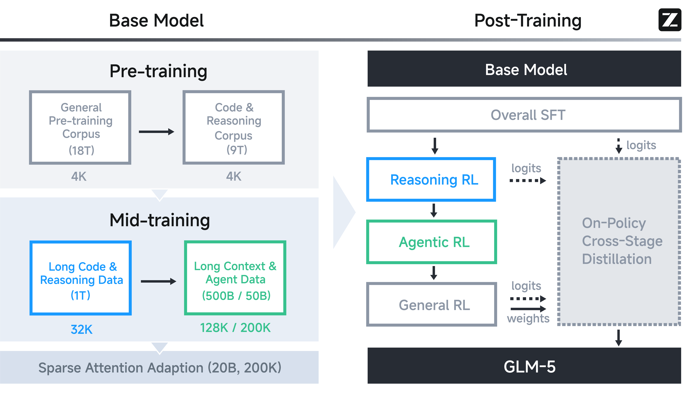
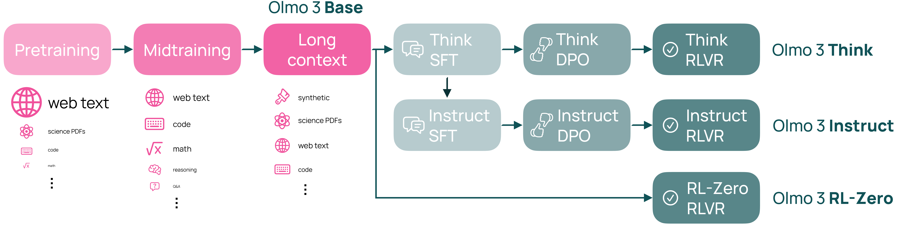

<!-- layout: title-banner -->

# Post-training recipes over time

A conversation · rlhfbook.com

Nathan Lambert × Finbarr Timbers

June 2026

From the classic 3-step RLHF recipe to the 2026 frontier — and the rise of multi-teacher on-policy distillation (MOPD).

---

## Where we're going

<!-- columns: 52/48 -->

The shape of a post-training recipe has changed more in the last year than in the prior three.

- **2022–2023:** one pipeline — SFT → reward model → RL.
- **2024:** open recipes formalize SFT → DPO → RL with verifiable rewards.
- **2025:** reasoning RL (R1) makes large-scale RL the centerpiece.
- **2026:** recipes fragment into *many specialist models* that are merged back into one.

|||

**The throughline we want to trace today:**

- How many *stages* a recipe has, and why.
- Where the *signal* comes from: humans → reward models → verifiers → other models.
- The 2026 move from **weight merging / mixed RL** to **distillation-based consolidation**.
- What's genuinely new vs. renamed.

<!-- footnote-right: A guided tour, newest-first — click any source live. -->

---

## The new thing: MOPD

<!-- columns: 50/50 -->

**Multi-teacher On-Policy Distillation** is the pattern showing up across the 2026 frontier.

1. Train **N domain-specialist teachers** (each: SFT, then RL on math / code / agentic / IF).
2. Train **one student** by sampling *its own* trajectories.
3. On each rollout, minimize **reverse-KL** to the *relevant* teacher's output distribution, token by token.

|||

**Why it matters:**

- Consolidates many expert weights into one model via **logits-level alignment** — not weight averaging, not one big mixed-RL run.
- The student stays **on-policy**, so it learns to route: math expert for math, code expert for code.
- Sidesteps the capability loss of weight-merging and the instability of multi-domain RL.

<!-- footnote-right: Lineage: MiMo Flash v2 introduced it → DeepSeek V4 & Nemotron 3 Ultra scale it to >10 teachers. -->

---

## Why MOPD, why now?

- **RL got expensive and conflict-prone.** Mixing math, code, and agentic RL in one run trades capabilities off against each other.
- **Specialists are cheap to make.** SFT-then-RL on a single domain is well understood and parallelizable.
- **On-policy distillation matured.** Reverse-KL on student rollouts gives stable, faithful transfer (Gu et al. 2024).
- **The result:** a recipe that looks less like one pipeline and more like *train a team, then teach one model to be the team.*

The rest of the talk: who does this, who doesn't, and what they did instead.

<!-- footnote-right: Source: [DeepSeek V4 §5.1](https://huggingface.co/deepseek-ai/DeepSeek-V4-Pro), [MiMo-V2-Flash](https://arxiv.org/abs/2601.02780) -->

---

<!-- layout: section-break -->
<!-- title: center -->

## The 2026 frontier

---

## MiMo Flash v2 — where MOPD started

<!-- rows: 64/36 -->

===

**Stages:** Stage 1 SFT → Stage 2 train ~6 domain-specialist teachers → Stage 3 MOPD into a single student.

**Novel:** First clean articulation of **multi-teacher on-policy distillation** as the consolidation step — replaces a single monolithic RL stage with distill-from-specialists.

<!-- footnote-right: Source: [MiMo-V2-Flash report (arXiv:2601.02780)](https://arxiv.org/abs/2601.02780) -->

---

## DeepSeek V4 — MOPD at scale

<!-- columns: 52/48 -->

(No public recipe diagram — text from the technical report.)

**Stages:**

1. Per-domain experts (math, code, agent, instruction following): **SFT → GRPO RL** with domain reward models.
2. Consolidate all experts into one model via **multi-teacher on-policy distillation**.

|||

**Novel:**

- RL for consolidation is **"entirely replaced by OPD"** — the merge *is* the distillation.
- **Full-vocabulary** reverse-KL (keeps complete logit distribution) for faithful transfer.
- **>10 teachers**; FP8/FP4-aware infra to make full-vocab OPD feasible at scale.

<!-- footnote-right: Source: [DeepSeek V4 technical report](https://huggingface.co/deepseek-ai/DeepSeek-V4-Pro) · [model card](https://fe-static.deepseek.com/chat/transparency/deepseek-V4-model-card-EN.pdf) -->

---

## Nemotron 3 Ultra — two rounds, many teachers

<!-- columns: 58/42 -->

|||

**Stages:** SFT → **multi-teacher on-policy distillation**, run over **two iterations**, with **>10 teachers** spanning reasoning, code, math, and agentic domains.

**Novel:** The largest teacher pool to date plus a **second MOPD round** — distill, then re-distill from refreshed teachers (Fig. 10).

<!-- footnote-right: Source: [NVIDIA Nemotron 3 Ultra technical report](https://research.nvidia.com/labs/nemotron/files/NVIDIA-Nemotron-3-Ultra-Technical-Report.pdf) -->

---

## MAI-Thinking-1 — the counter-example

<!-- rows: 56/44 -->

===

**Stages:** mid-trained base → **3 specialist RL "climbs"** (e.g. STEM) → **trace-distillation SFT** to consolidate the climbs → a final RL climb → MAI-Thinking-1.

**Novel — deliberately *not* MOPD:** built "from scratch on clean enterprise data, **without distillation from third-party models**." Teachers are *its own* specialists; consolidation is **SFT on traces**, not on-policy reverse-KL. RL is tuned for **sustained log-linear climbs over thousands of steps**.

<!-- footnote-right: Source: [Microsoft AI — MAI-Thinking-1](https://microsoft.ai/news/introducing-mai-thinking-1/) -->

---

## Kimi K2.5 — agentic, multimodal

<!-- columns: 56/44 -->

|||

**Stages:** pretraining → **zero-vision SFT** → **joint text–vision RL** across coding, vision, reasoning, agentic tasks.

**Novel:** **Agent Swarm** — self-directed *parallel* agent orchestration for data generation and inference (up to **4.5× lower latency** vs. single-agent). Recipe is organized around **agentic + multimodal** RL rather than distillation.

<!-- footnote-right: Source: [Kimi K2.5 technical report](https://github.com/MoonshotAI/Kimi-K2.5/blob/master/tech_report.pdf) · [blog](https://www.kimi.com/blog/kimi-k2-5.html) -->

---

## GLM-5 — staged RL by capability

<!-- columns: 58/42 -->

|||

**Stages:** Base → SFT → **Reasoning RL** → **Agentic RL** → **General RL**.

**Novel:** RL is split into **sequential capability stages**, with **on-policy cross-stage distillation** carrying earlier capabilities forward so later RL doesn't erase them — a different answer to the same "don't let domains fight" problem MOPD solves.

<!-- footnote-right: Source: [GLM-5 technical report (arXiv:2602.15763)](https://arxiv.org/abs/2602.15763) -->

---

<!-- layout: section-break -->
<!-- title: center -->

## The roots

---

## InstructGPT — the canonical 3 steps

<!-- columns: 58/42 -->

|||

**Stages:** SFT on human demonstrations → train a **reward model** on human comparisons → **PPO** against the reward model.

**Novel:** The recipe everything else descends from — aligned GPT-3 with human feedback and defined "SFT → RM → RL" as *the* post-training pipeline.

<!-- footnote-right: Source: [InstructGPT (arXiv:2203.02155)](https://arxiv.org/abs/2203.02155) -->

---

## Llama 2 — multi-stage RLHF

<!-- columns: 60/40 -->

|||

**Stages:** pretrain → SFT → **iterative RLHF**: rounds of **rejection sampling** then **PPO**.

**Novel:** **Two** reward models — separate **helpfulness** and **safety** — plus multiple RLHF iterations and rejection sampling before PPO. Showed RLHF scaling as a repeated loop, not a single pass.

<!-- footnote-right: Source: [Llama 2 (arXiv:2307.09288)](https://arxiv.org/abs/2307.09288) -->

---

## Llama 3 — rejection sampling + DPO, in rounds

<!-- rows: 62/38 -->

===

<!-- row-columns: 50/50 -->

**Stages:** each round — train a **reward model** → **K generations per prompt** → **rejection sampling** → **SFT** (on filtered + per-capability data) → **DPO**. Best models from prior rounds seed the next round's generations.

|||

**Novel:** dropped Llama 2's **PPO** for a simpler **rejection-sampling + DPO** loop run over **6 rounds**; the reward model is used only to *filter* samples, not for online RL — a deliberately offline, iterative recipe.

<!-- footnote-right: Source: [Llama 3 (arXiv:2407.21783)](https://arxiv.org/abs/2407.21783) -->

---

## DeepSeek R1 — RL as the centerpiece

<!-- rows: 62/38 -->

===

<!-- row-columns: 50/50 -->

**Stages:** **R1-Zero** = pure RL (GRPO) on the base, *no SFT*. **R1** = cold-start SFT → reasoning RL → rejection-sampling SFT → final RL → distill into small dense models.

|||

**Novel:** large-scale **RL with verifiable rewards** as the primary driver; reasoning *emerges from RL before SFT* (R1-Zero); the open recipe that mainstreamed o1-style reasoning.

<!-- footnote-right: Source: [DeepSeek R1 (arXiv:2501.12948)](https://arxiv.org/abs/2501.12948) · [Interconnects: R1 recipe for o1](https://www.interconnects.ai/p/deepseek-r1-recipe-for-o1) -->

---

## Tülu 3 — the open recipe

<!-- rows: 62/38 -->

===

**Stages:** curate prompts → **SFT** → **DPO** → **RLVR** (RL with verifiable rewards), with a decontaminated eval suite.

**Novel:** A **fully open** post-training recipe — data, code, and weights — that formalized **SFT → DPO → RL** and introduced **RLVR** at scale for general models.

<!-- footnote-right: Source: [Tülu 3 (arXiv:2411.15124)](https://arxiv.org/abs/2411.15124) -->

---

## OLMo 3 — open end-to-end, one flow, three outputs

<!-- rows: 60/40 -->

===

<!-- row-columns: 50/50 -->

**Stages:** shared **base** (pretraining → midtraining → long context), then three post-training branches: **Think** and **Instruct** each run **SFT → DPO → RLVR**, plus an **RL-Zero** branch (RLVR straight off base).

|||

**Novel:** a **fully open model flow** — data, code, and weights — that forks one base into multiple products and exposes every sub-stage's recipe; **RL-Zero** ships the R1-Zero-style "RL with no SFT" path as a first-class branch.

<!-- footnote-right: Source: [OLMo 3 (arXiv:2512.13961)](https://arxiv.org/abs/2512.13961) -->

---

<!-- layout: section-break -->
<!-- title: center -->

## So, where are we going?

---

## Open questions for the conversation

- Is **MOPD** the new default, or a phase on the way to something simpler?
- **Distill-to-consolidate** vs. **staged RL** (GLM-5) vs. **bespoke climbs** (MAI) — which wins, and on what axis?
- Does "train a team, teach one model to be the team" **scale past >10 teachers**?
- What's the role of **open recipes** (Tülu / OLMo) when frontier labs converge on the same private pattern?
- Where does the **signal** go next: verifiers, other models, environments?

<!-- footnote-right: Thanks — rlhfbook.com -->
